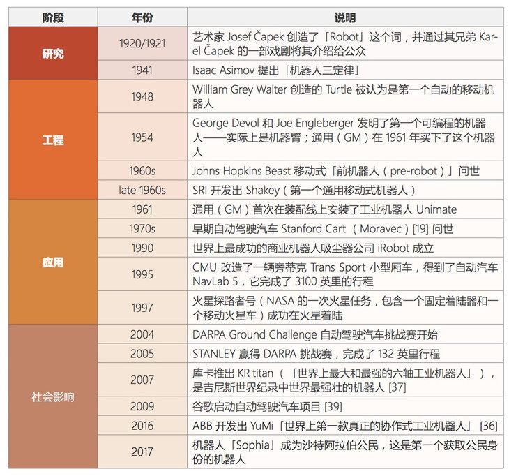
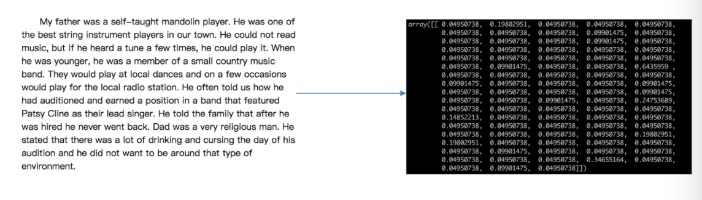
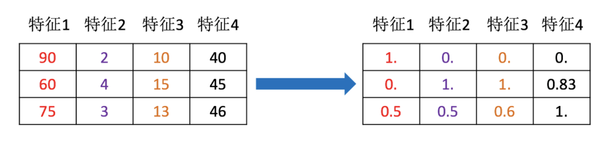
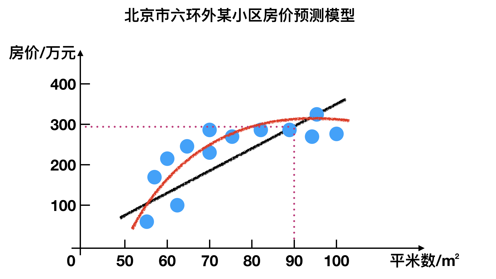
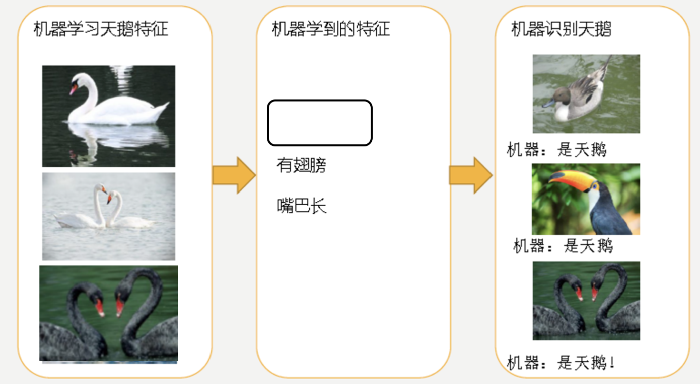
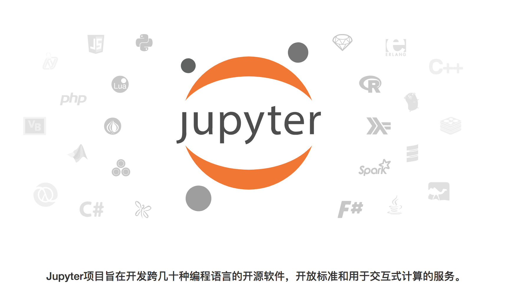
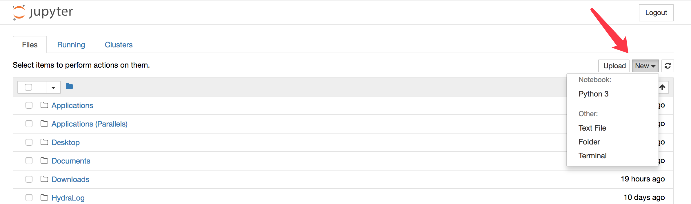
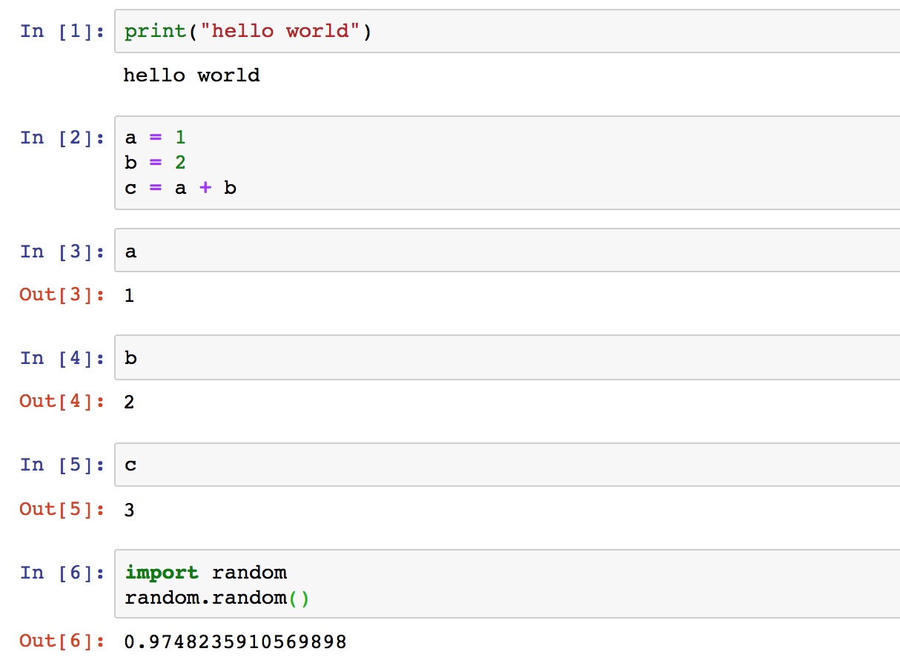

#### 第一单元  人工智能概述

## **一、昨日知识点回顾**

```python
1.无
```

------

## **二、考核目标**

```
1.机器学习介绍概念
2.人工智能概念介绍
3.掌握环境的安装使用
4.掌握通义千问注册流程
```

------

## **三、本单元知识详讲**

### 1.1人工智能概述

#### 1.1.1人工智能应用场景


#### 1.1.2 人工智能小案例

案例一：


参考链接：https://quickdraw.withgoogle.com

案例二：


参考链接：https://pjreddie.com/darknet/yolo/

案例三：


查看更多：https://deepdreamgenerator.com/

#### 1.1.3 人工智能发展必备三要素：

- **数据**
- **算法**
- 计算力
  - CPU,GPU,TPU


- 计算力之CPU、GPU对比：
  - CPU主要适合I\O密集型的任务
  - GPU主要适合计算密集型任务

- **提问：什么类型的程序适合在GPU上运行？**

（1）**计算密集型的程序。**

所谓计算密集型(Compute-intensive)的程序，就是其大部分运行时间花在了寄存器运算上，寄存器的速度和处理器的速度相当，从寄存器读写数据几乎没有延时。可以做一下对比，读内存的延迟大概是几百个时钟周期；读硬盘的速度就不说了，即便是SSD, 也实在是太慢了。　　

（2）**易于并行的程序。**

GPU其实是一种SIMD(Single Instruction Multiple Data)架构， 他有成百上千个核，每一个核在同一时间最好能做同样的事情。

CPU和GPU的区别：

http://www.sohu.com/a/201309334_468740

Google TPU 介绍：

https://www.yundongfang.com/Yun167796.html

#### 1.1.4 人工智能、机器学习和深度学习


- 人工智能和机器学习，深度学习的关系
  - **机器学习是人工智能的一个实现途径**
  - **深度学习是机器学习的一个方法（神经网络）发展而来**

#### 1.1.5 小结

- 人工智能应用场景【了解】
  - 网络安全、电子商务、计算模拟、社交网络 … ...
- 人工智能必备三要素【知道】
  - 数据、算法、计算力
- 人工智能和机器学习，深度学习的关系【知道】
  - 机器学习是人工智能的一个实现途径
  - 深度学习是机器学习的一个方法发展而来


### 1.2 人工智能发展历程

####  1.2.1人工智能的起源

图灵测试

测试者与被测试者（一个人和一台机器）隔开的情况下，通过一些装置（如键盘）向被测试者随意提问。

多次测试（一般为**5min**之内），如果有超过**30%**的测试者不能确定被测试者是人还是机器，那么这台机器就通过了测试，并被认为具有**人类智能**。


达特茅斯会议

1956年8月，在美国汉诺斯小镇宁静的达特茅斯学院中，

- 约翰·麦卡锡（John McCarthy）
- 马文·闵斯基（Marvin Minsky，人工智能与认知学专家）
- 克劳德·香农（Claude Shannon，信息论的创始人）
- 艾伦·纽厄尔（Allen Newell，计算机科学家）
- 赫伯特·西蒙（Herbert Simon，诺贝尔经济学奖得主

等科学家正聚在一起，讨论着一个完全不食人间烟火的主题：

**用机器来模仿人类学习以及其他方面的智能。**

会议足足开了两个月的时间，虽然大家没有达成普遍的共识，但是却为会议讨论的内容起了一个名字：

 **人工智能**

**因此，1956年也就成为了人工智能元年。**

#### 1.2.2 发展历程

人工智能充满未知的探索道路曲折起伏。如何描述人工智能自1956年以来60余年的发展历程，学术界可谓仁者见仁、智者见智。我们将人工智能的发展历程划分为以下6个阶段：、

- 第一是起步发展期：1956年—20世纪60年代初。
  - 人工智能概念提出后，相继取得了一批令人瞩目的研究成果，如机器定理证明、跳棋程序等，掀起人工智能发展的第一个高潮。

- 第二是反思发展期：20世纪60年代—70年代初。
  - 人工智能发展初期的突破性进展大大提升了人们对人工智能的期望，人们开始尝试更具挑战性的任务，并提出了一些不切实际的研发目标。然而，接二连三的失败和预期目标的落空（例如，无法用机器证明两个连续函数之和还是连续函数、机器翻译闹出笑话等），使人工智能的发展走入低谷。

- 第三是应用发展期：20世纪70年代初—80年代中。
  - 20世纪70年代出现的专家系统模拟人类专家的知识和经验解决特定领域的问题，实现了人工智能从理论研究走向实际应用、从一般推理策略探讨转向运用专门知识的重大突破。专家系统在医疗、化学、地质等领域取得成功，推动人工智能走入应用发展的新高潮。

- 第四是低迷发展期：20世纪80年代中—90年代中。
  - 随着人工智能的应用规模不断扩大，专家系统存在的应用领域狭窄、缺乏常识性知识、知识获取困难、推理方法单一、缺乏分布式功能、难以与现有数据库兼容等问题逐渐暴露出来。

- 第五是稳步发展期：20世纪90年代中—2010年。
  - 由于网络技术特别是互联网技术的发展，加速了人工智能的创新研究，促使人工智能技术进一步走向实用化。1997年国际商业机器公司（简称IBM）深蓝超级计算机战胜了国际象棋世界冠军卡斯帕罗夫，2008年IBM提出“智慧地球”的概念。以上都是这一时期的标志性事件。

- **第六是蓬勃发展期：2011年至今。**
  - 随着大数据、云计算、互联网、物联网等信息技术的发展，泛在感知数据和图形处理器等计算平台推动以深度神经网络为代表的人工智能技术飞速发展，大幅跨越了科学与应用之间的“技术鸿沟”，诸如图像分类、语音识别、知识问答、人机对弈、无人驾驶等人工智能技术实现了从“不能用、不好用”到“可以用”的技术突破，迎来爆发式增长的新高潮。


#### 1.2.3 小结

- 人工智能的起源【了解】
  - 图灵测试
  - 达特茅斯会议
- 人工智能的发展经历了六个阶段【了解】
  - 起步发展期
  - 反思发展期
  - 应用发展期
  - 低迷发展期
  - 稳步发展期
  - 蓬勃发展期


### 1.3 人工智能主要分支

####  1.3.1 主要分支介绍

通讯、感知与行动是现代人工智能的三个关键能力，在这里我们将根据这些能力/应用对这三个技术领域进行介绍：

- **计算机视觉(CV)、**
- 自然语言处理(NLP)
  - 在 NLP 领域中，将覆盖文本挖掘/分类、机器翻译和语音识别。
- **机器人**

分支一：计算机视觉

**计算机视觉(CV)是指机器感知环境的能力**。这一技术类别中的经典任务有图像形成、图像处理、图像提取和图像的三维推理。**物体检测和人脸识别是其比较成功的研究领域。**

**当前阶段：**

计算机视觉现已有很多应用，这表明了这类技术的成就，也让我们将其归入到应用阶段。随着深度学习的发展，机器甚至能在特定的案例中实现超越人类的表现。但是，**这项技术离社会影响阶段还有一定距离，那要等到机器能在所有场景中都达到人类的同等水平才行(感知其环境的所有相关方面)。**

思考：在人脸识别过程中，会出现提示让用户摇头、眨眼等操作或者让随机读出一段数字？

**发展历史：**


分支二：语音识别

**语音识别是指识别语音(说出的语言)并将其转换成对应文本的技术**。相反的任务(文本转语音/TTS)也是这一领域内一个类似的研究主题。

**当前阶段：**

语音识别已经处于应用阶段很长时间了。最近几年，随着大数据和深度学习技术的发展，语音识别进展颇丰，现在已经非常接近社会影响阶段了。

语音识别领域仍然面临着**声纹识别**和**「鸡尾酒会效应」**等一些特殊情况的难题。

现代语音识别系统严重依赖于云，**在离线时可能就无法取得理想的工作效果。**

**发展历史：**

- 百度语音识别：
  - 距离小于1米，中文字准率97%+
  - 支持耳语、长语音、中英文混合及方言


分支三：**文本挖掘/分类**

**这里的文本挖掘主要是指文本分类，该技术可用于理解、组织和分类结构化或非结构化文本文档。**其涵盖的主要任务有句法分析、情绪分析和垃圾信息检测。

情绪分析：商品评价内容分析

**当前阶段：**

我们将这项技术归类到应用阶段，因为现在有很多应用都已经集成了基于文本挖掘的情绪分析或垃圾信息检测技术。文本挖掘技术也在智能投顾的开发中有所应用，并且提升了用户体验。

**文本挖掘和分类领域的一个瓶颈出现在歧义和有偏差的数据上。**

**发展历史：**


分支四：机器翻译

**机器翻译(MT)是利用机器的力量自动将一种自然语言(源语言)的文本翻译成另一种语言(目标语言)。**

**当前阶段：**

机器翻译是一个见证了大量发展历程的应用领域。该领域最近由于神经机器翻译而取得了非常显著的进展，但仍然没有全面达到专业译者的水平；但是，我们相信在大数据、云计算和深度学习技术的帮助下，机器翻译很快就将进入社会影响阶段。

在某些情况下，**俚语和行话等内容的翻译会比较困难**(受限词表问题)。

**专业领域的机器翻译(比如医疗领域)表现通常不好**。

发展历史：


分支五：机器人

**机器人学(Robotics)研究的是机器人的设计、制造、运作和应用，以及控制它们的计算机系统、传感反馈和信息处理。**

**机器人可以分成两大类:固定机器人和移动机器人。**固定机器人通常被用于工业生产(比如用于装配线)。常见的移动机器人应用有货运机器人、空中机器人和自动载具。机器人需要不同部件和系统的协作才能实现最优的作业。其中在硬件上包含传感器、反应器和控制器；另外还有能够实现感知能力的软件，比如定位、地图测绘和目标识别。

**当前阶段：**

自上世纪「Robot」一词诞生以来，人们已经为工业制造业设计了很多机器人。工业机器人是增长最快的应用领域，它们在 20 世纪 80 年代将这一领域带入了应用阶段。在安川电机、Fanuc、ABB、库卡等公司的努力下，我们认为进入 21 世纪之后，机器人领域就已经进入了社会影响阶段，此时各种工业机器人已经主宰了装配生产线。此外，软体机器人在很多领域也有广泛的应用，比如在医疗行业协助手术或在金融行业自动执行承销过程。

但是，法律法规和「**机器人威胁论**」可能会妨碍机器人领域的发展。还有**设计和制造机器人需要相对较高的投资**。

**发展历史**：



总的来说，人工智能领域的研究前沿正逐渐从搜索、知识和推理领域转向机器学习、深度学习、计算机视觉和机器人领域。

大多数早期技术至少已经处于应用阶段了，而且其中一些已经显现出了社会影响力。一些新开发的技术可能仍处于工程甚至研究阶段，但是我们可以看到不同阶段之间转移的速度变得越来越快。

#### 1.3.2 小结

- 人工智能主要分支【了解】
  - 计算机视觉
  - 语音识别
  - 文本挖掘/分类
  - 机器翻译
  - 机器人


### 1.4 机器学习工作流程

------

#### 1 .4.1什么是机器学习

机器学习是从**数据**中**自动分析获得模型**，并利用**模型**对未知数据进行预测。


#### 1.4.2 机器学习工作流程


- 机器学习工作流程总结

  - **1.获取数据**

  - **2.数据基本处理**

  - **3.特征工程**

  - **4.机器学习(模型训练)**

  - 5.模型评估

    ```
    - 结果达到要求，上线服务
    - 没有达到要求，重新上面步骤
    ```

获取到的数据集介绍


房屋价格影响因素大概：1、面积大小、2、地理位置、3、房屋整体户型4、面积等。

预测房屋价格结果可能出现小数，如：101.1万等。

下面是电影类型预测，这中情况下就不能出现小数，最终得出是什么类型的电影。


归类：没有错与对，只是对数据进行归类


**数据简介**

- 在数据集中一般：

  - 一行数据我们称为一个**样本**
  - 一列数据我们成为一个**特征**
  - 有些数据有**目标值（标签值）**，有些数据没有目标值（如上三个表中，房屋价格就是对应的目标值，电影类型就是这个数据集的目标值，而人物归类就没有目标值）

- **数据类型构成：**

  - 数据类型一：特征值+目标值（目标值是连续的和离散的）
  - 数据类型二：只有特征值，没有目标值（聚类算法）

- **数据分割：**

  - 机器学习一般的数据集会划分为两个部分：

    ```
    - 训练数据：用于训练，**构建模型**
    - 测试数据：在模型检验时使用，用于**评估模型是否有效**
    比如：学习过程中有练习题帮助训练，考试监测学习结果。
    ```

  - 划分比例：

    ```
    - 训练集：70% 80% 75%
    - 测试集：30% 20% 25%
    ```

数据基本处理

 即对数据进行缺失值、去除异常值等处理

比如：在人物信息统计过程中，有个别人把年龄填写成1000岁，或者不填写性别等

#### 1.4.3 特征工程

什么是特征工程

特征工程(Feature Engineering)是使用**专业背景知识和技巧处理数据**，**使得特征能在机器学习算法上发挥更好的作用的过程**。

- 意义：会直接影响机器学习的效果

为什么需要特征工程

> 机器学习领域的大神Andrew Ng(吴恩达)老师说“Coming up with features is difficult, time-consuming, requires expert knowledge. “Applied machine learning” is basically feature engineering. ”
>
> 注：业界广泛流传：数据和特征决定了机器学习的上限，而模型和算法只是逼近这个上限而已。

特征工程包含内容

- 特征提取
- 特征预处理
- 特征降维

特征工程类别介绍

- 特征提取
  - 将任意数据（如文本或图像）转换为可用于机器学习的数字特征



- 特征预处理
  - 通过**一些转换函数**将特征数据**转换成更加适合算法模型**的特征数据过程




- 特征降维
  - 指在某些限定条件下，**降低随机变量(特征)个数**，得到**一组“不相关”主变量**的过程


#### 1.4.4 小结

- 机器学习定义【掌握】

  - 机器学习是从**数据**中**自动分析获得模型**，并利用**模型**对未知数据进行预测

- 机器学习工作流程总结【掌握】

  - **1.获取数据**

  - **2.数据基本处理**

  - **3.特征工程**

  - **4.机器学习(模型训练)**

  - 5.模型评估

    ```
    - 结果达到要求，上线服务
    - 没有达到要求，重新上面步骤
    ```

- 获取到的数据集介绍【掌握】

  - 数据集中一行数据一般称为一个样本，一列数据一般称为一个特征。

  - 数据集的构成：

    ```
    - 由特征值+目标值（部分数据集没有）构成
    ```

  - 为了模型的训练和测试，把数据集分为：

    ```
    - 训练数据（70%-80%）和测试数据（20%-30%）
    ```

- 特征工程包含内容【了解】

  - 特征提取
  - 特征预处理
  - 特征降维

### 1.5 机器学习算法分类

------

根据**数据集组成不同**，可以把机器学习算法分为：

- 监督学习
- 无监督学习
- 半监督学习
- 强化学习

#### 1.5.1 监督学习

- 定义：

  - 输入数据是由输入特征值和目标值所组成。

    ```
    - 函数的输出可以是一个连续的值(称为回归），
    - 或是输出是有限个离散值（称作分类）。
    ```

回归问题

例如：预测房价，根据样本集拟合出一条连续曲线。



分类问题

例如：根据肿瘤特征判断良性还是恶性，得到的是结果是“良性”或者“恶性”，是离散的。


#### 1.5.2 无监督学习

- 定义：

  - 输入数据是由输入特征值组成，没有目标值
    - 输入数据没有被标记，也没有确定的结果。样本数据类别未知；
    - 需要根据样本间的相似性对样本集进行类别划分。

  举例：

   

- **有监督，无监督算法对比：**

  

#### 1.5.3 半监督学习

- 定义：

  - 训练集同时包含有标记样本数据和未标记样本数据。

- 扩展：

  无标注数据集是指在数据集中没有提供明确标注或标签的数据集。这意味着数据集中的每个样本都缺少明确的分类或标签信息。例如，在自然语言处理领域，无标注数据集可能是大量的文本数据，但是这些文本数据没有被标记为不同的语言、主题、情感等类别。

  相比之下，有标注数据集是已经被人工或自动标记或标注了不同类别或标签的数据集。例如，在图像分类问题中，有标注数据集可能是一个包含数万张图像的数据集，每个图像都被标记为它所属的类别（例如"猫"或"狗"）。

举例：

- **监督学习训练方式：**

  

首先获取大量未标记的数据，然后让专家进行预测，得到大量的标记过的数据，通过标记过的数据进行预测和训练模型，就可以获取一个监督学习的训练模型。


- **半监督学习训练方式**


首先从大量数据中获取少量数据，让专家进行标记过获得少量得数据，通过对少量得数据进行训练获得一个初步得模型，然后在使用大量未标记过得数据进行模型的得出

#### 1.5.4 强化学习

- 定义：
  - 实质是make decisions 问题，即自动进行决策，并且可以做连续决策。

举例：

小孩想要走路，但在这之前，他需要先站起来，站起来之后还要保持平衡，接下来还要先迈出一条腿，是左腿还是右腿，迈出一步后还要迈出下一步。

小孩就是 **agent**，他试图通过采取**行动**（即行走）来操纵**环境**（行走的表面），并且从**一个状态转变到另一个状态**（即他走的每一步），当他完成任务的子任务（即走了几步）时，孩子得到**奖励**（给巧克力吃），并且当他不能走路时，就不会给巧克力。

主要包含五个元素：agent, action, reward, environment, observation；


强化学习的目标就是**获得最多的累计奖励**。

监督学习和强化学习的对比

|          | **监督学习**                                                 | **强化学习**                                                 |
| -------- | ------------------------------------------------------------ | ------------------------------------------------------------ |
| 反馈映射 | 输出的是之间的关系，可以告诉算法什么样的输入对应着什么样的输出。 | 输出的是给机器的反馈 reward function，即用来判断这个行为是好是坏。 |
| 反馈时间 | 做了比较坏的选择会**立刻反馈给算法**。                       | 结果**反馈有延时**，有时候可能需要走了很多步以后才知道以前的某一步的选择是好还是坏。 |
| 输入特征 | 输入是**独立同分布**的。                                     | 面对的输入总是在变化，每当算法做出一个行为，它影响下一次决策的输入。 |

拓展概念：什么是**独立同分布**：

拓展阅读：Alphago进化史 漫画告诉你Zero为什么这么牛：

http://sports.sina.com.cn/chess/weiqi/2017-10-21/doc-ifymyyxw4023875.shtml

#### 1.5.5 小结

|                                               |         **In**         |  **Out**   |      **目的**      |       **案例**       |
| :-------------------------------------------- | :--------------------: | :--------: | :----------------: | :------------------: |
| **监督学习** **(supervised learning)**        |         有标签         |   有反馈   |      预测结果      |  猫狗分类 房价预测   |
| **无监督学习** **(unsupervised learning)**    |         无标签         |   无反馈   |    发现潜在结构    | “物以类聚，人以群分” |
| **半监督学习** **(Semi-Supervised Learning)** | 部分有标签，部分无标签 |   有反馈   | 降低数据标记的难度 |                      |
| **强化学习** **(reinforcement learning)**     |   决策流程及激励系统   | 一系列行动 |   长期利益最大化   |        学下棋        |


### 1.6 模型评估

------

模型评估是模型开发过程不可或缺的一部分。它有助于发现表达数据的最佳模型和所选模型将来工作的性能如何。

按照**数据集的目标值不同**，可以把模型评估分为**分类模型评估和回归模型评估。**

#### 1.6.1 分类模型评估


图中的绿色线，为什么这么划分，其他方式划分是否也可以？？

用哪种方式进行划分都可以，最终要考虑的是划分后的效果如何？

如何评估绿色的线或者其他的线划分的好与坏呢？那就需要使用到分类模型评估中的指标来进行评估。

- 准确率
  - 预测正确的数占样本总数的比例。
- 其他评价指标：精确率、召回率、F1-score、AUC指标等

#### 1.6.2 回归模型评估


通过预测，可以获得红色曲线和黑色直线，那到底哪个可以更好的说明当前的模型呢？

**均方根误差（Root Mean Squared Error，RMSE）**

- RMSE是一个衡量回归模型误差率的常用公式。 不过，它仅能比较误差是相同单位的模型。

  

> a 为真实值；p 为预测值

举例：

```
假设上面的房价预测，只有五个样本，对应的
真实值为：100,120,125,230,400
预测值为：105,119,120,230,410
```


------

其他评价指标：

- 相对平方误差（Relative Squared Error，RSE）、
- 平均绝对误差（Mean Absolute Error，MAE)、
- 相对绝对误差（Relative Absolute Error，RAE)


分类模型评估和回归模型评估，评估完以后有什么表现呢？就是拟合问题。

#### 1.6.3 拟合

模型评估用于评价训练好的的模型的表现效果，其表现效果大致可以分为两类：过拟合、欠拟合。

在训练过程中，你可能会遇到如下问题：

**训练数据训练的很好啊，误差也不大，为什么在测试集上面有问题呢？**

当算法在某个数据集当中出现这种情况，可能就出现了拟合问题。

 欠拟合



因为机器学习到的天鹅特征太少了，导致区分标准太粗糙，不能准确识别出天鹅。

**欠拟合（under-fitting）**：**模型学习的太过粗糙**，连**训练集中的样本数据特征关系都没有学出来**。

过拟合


机器已经基本能区别天鹅和其他动物了。然后，很不巧已有的天鹅图片全是白天鹅的，于是机器经过学习后，会认为天鹅的羽毛都是白的，以后看到羽毛是黑的天鹅就会认为那不是天鹅。

**过拟合**（over-fitting）：所建的机器学习模型或者是深度学习模型在训练样本中**表现得过于优越**，导致在**测试数据集中表现不佳**。

- 上问题解答：
  - 训练数据训练的很好啊，误差也不大，为什么在测试集上面有问题呢？

### 1.8 深度学习简介

------

#### 1.8.1 深度学习 —— 神经网络简介

深度学习（Deep Learning）（也称为深度结构学习【Deep Structured Learning】、层次学习【Hierarchical Learning】或者是深度机器学习【Deep Machine Learning】）是一类算法集合，是机器学习的一个分支。


深度学习方法近年来，在会话识别、图像识别和对象侦测等领域表现出了惊人的准确性。

但是，“深度学习”这个词语很古老，它在1986年由Dechter在机器学习领域提出，然后在2000年有Aizenberg等人引入到人工神经网络中。而现在，由于Alex Krizhevsky在2012年使用卷积网络结构赢得了ImageNet比赛之后受到大家的瞩目。

卷积网络之父：Yann LeCun


- 深度学习演示
  - [链接:http://playground.tensorflow.org](http://playground.tensorflow.org)


#### 1.8.2 深度学习各层负责内容

神经网络各层负责内容：

**1层：负责识别颜色及简单纹理**


**2层：一些神经元可以识别更加细化的纹理，布纹，刻纹，叶纹等**


**3层：一些神经元负责感受黑夜里的黄色烛光，高光，萤火，鸡蛋黄色等。**


**4层：一些神经元识别萌狗的脸，宠物形貌，圆柱体事物，七星瓢虫等的存在。**


**5层：一些神经元负责识别花，黑眼圈动物，鸟，键盘，原型屋顶等。**


### 1.9 库的安装

#### 1.9.1 安装需要的库

通过自己搭建虚拟环境安装机器学习阶段环境

整个机器学习基础阶段会用到Matplotlib、Numpy、Pandas、Jupyter等库

### 1.10 Jupyter Notebook使用

#### 1.10.1 Jupyter Notebook介绍

Jupyter项目是一个非盈利的开源项目，源于2014年的ipython项目，因为它逐渐发展为支持跨所有编程语言的交互式数据科学和科学计算

- Jupyter Notebook，原名IPython Notbook，是IPython的加强网页版，一个开源Web应用程序
- 名字源自Julia、Python 和 R（数据科学的三种开源语言）
- 是一款程序员和科学工作者的**编程/文档/笔记/展示**软件
- **.ipynb**文件格式是用于计算型叙述的**JSON文档格式**的正式规范



#### 1.10.2 为什么使用Jupyter Notebook?

- 传统软件开发：工程／目标明确
  - 需求分析，设计架构，开发模块，测试
- 数据挖掘：艺术／目标不明确
  - 目的是具体的洞察目标，而不是机械的完成任务
  - 通过执行代码来理解问题
  - 迭代式地改进代码来改进解决方法

实时运行的代码、叙事性的文本和可视化被整合在一起，方便使用代码和数据来讲述故事

**对比Jupyter Notebook和Pycharm**

- 画图


- 数据展示

  

  - 总结：Jupyter Notebook 相比 Pycharm 在画图和数据展示方面更有优势。

#### 1.10.3 Jupyter Notebook的使用

 界面启动、创建文件

- #### 3.1.1 界面启动

环境搭建好后，本机输入jupyter notebook命令，会自动弹出浏览器窗口打开Jupyter Notebook

```

# 输入命令
jupyter notebook
```

本地notebook的默认URL为：http://localhost:8888

想让notebook打开指定目录，只要进入此目录后执行命令即可


- #### 3.1.2 新建notebook文档

  - notebook的文档格式是`.ipynb`



- #### 3.1.3 内容界面操作

  **标题栏：**点击标题（如Untitled）修改文档名

  **编辑栏：**



3.2 cell操作

- 什么是cell？
  - **cell**：一对In Out会话被视作一个代码单元，称为cell
  - cell行号前的 * ，表示代码正在运行

Jupyter支持两种模式：

- 编辑模式（Enter）
  - 命令模式下`回车Enter`或`鼠标双击`cell进入编辑模式
  - 可以**操作cell内文本**或代码，剪切／复制／粘贴移动等操作
- 命令模式（Esc）
  - 按`Esc`退出编辑，进入命令模式
  - 可以**操作cell单元本身**进行剪切／复制／粘贴／移动等操作

3.2.1 鼠标操作


3.2.2 快捷键操作

- 两种模式通用快捷键
  - **`Shift+Enter`，执行本单元代码，并跳转到下一单元**
  - **`Ctrl+Enter`，执行本单元代码，留在本单元**
- **命令模式**：按ESC进入
  - `Y`，cell切换到Code模式
  - `M`，cell切换到Markdown模式
  - `A`，在当前cell的上面添加cell
  - `B`，在当前cell的下面添加cell
- 其他(了解)
  - `双击D`：删除当前cell
  - `Z`，回退
  - `L`，为当前cell加上行号 <!--
  - `Ctrl+Shift+P`，对话框输入命令直接运行
  - 快速跳转到首个cell，`Crtl+Home`
  - 快速跳转到最后一个cell，`Crtl+End` -->
- **编辑模式**：按Enter进入
  - 补全代码：变量、方法后跟`Tab键`
  - 为一行或多行代码添加/取消注释：`Ctrl+/`（Mac:CMD+/）
- 其他(了解)：
  - 多光标操作：`Ctrl键点击鼠标`（Mac:CMD+点击鼠标）
  - 回退：`Ctrl+Z`（Mac:CMD+Z）
  - 重做：`Ctrl+Y`（Mac:CMD+Y)

3.3 markdown演示

掌握标题和缩进即可


### 1.11大语言模型

#### 1.11.1 大模型介绍

大语言模型（Large Language Model，缩写LLM），也称大型语言模型，是一种人工智能模型，旨在理解和生成人类语言。

通常，大语言模型（LLM）指包含数百亿（或更多）参数的语言模型，这些模型在大量的文本数据上进行训练，例如国外的有GPT-3、GPT-4、PaLM、Galactica和LLaMA等，国内的有ChatGLM、文心一言、通义千问、讯飞星火等。

#### 1.11.2 大模型的发展历程


萌芽期（1950-2005）：以 CNN 为代表的传统神经网络模型阶段

· 1956 年，从计算机专家约翰·麦卡锡提出“人工智能”概念开始，AI 发展由最开始基于小规模专家知识逐步发展为基于机器学习。

· 1980 年，卷积神经网络的雏形 CNN 诞生。

· 1998 年，现代卷积神经网络的基本结构 LeNet-5 诞生，机器学习方法由早期基于浅层机器学习的模型，变为了基于深度学习的模型,为自然语言生成、计算机视觉等领域的深入研究奠定了基础，对后续深度学习框架的迭代及大模型发展具有开创性的意义。

探索沉淀期（2006-2019）：以 Transformer 为代表的全新神经网络模型阶段

· 2013 年，自然语言处理模型 Word2Vec 诞生，首次提出将单词转换为向量的“词向量模型”，以便计算机更好地理解和处理文本数据。

· 2014 年，被誉为 21 世纪最强大算法模型之一的 GAN（对抗式生成网络）诞生，标志着深度学习进入了生成模型研究的新阶段。

· 2017 年，Google 颠覆性地提出了基于自注意力机制的神经网络结构——Transformer 架构，奠定了大模型预训练算法架构的基础。

· 2018 年，OpenAI 和 Google 分别发布了 GPT-1 与 BERT 大模型，意味着预训练大模型成为自然语言处理领域的主流。在探索期，以 Transformer 为代表的全新神经网络架构，奠定了大模型的算法架构基础，使大模型技术的性能得到了显著提升。

迅猛发展期（2020-至今）：以 GPT 为代表的预训练大模型阶段

· 2020 年，OpenAI 公司推出了GPT-3，模型参数规模达到了 1750 亿，成为当时最大的语言模型，并且在零样本学习任务上实现了巨大性能提升。随后，更多策略如基于人类反馈的强化学习（RHLF）、代码预训练、指令微调等开始出现, 被用于进一步提高推理能力和任务泛化。

· 2022 年 11 月，搭载了GPT3.5的 ChatGPT横空出世，凭借逼真的自然语言交互与多场景内容生成能力，迅速引爆互联网。

· 2023 年 3 月，最新发布的超大规模多模态预训练大模型——GPT-4，具备了多模态理解与多类型内容生成能力。在迅猛发展期，大数据、大算力和大算法完美结合，大幅提升了大模型的预训练和生成能力以及多模态多场景应用能力。如 ChatGPT 的巨大成功,就是在微软Azure强大的算力以及 wiki 等海量数据支持下，在 Transformer 架构基础上，坚持 GPT 模型及人类反馈的强化学习（RLHF）进行精调的策略下取得的。


#### 1.11.2 大模型的分类

**按内容分类**

· 语言大模型（NLP）：是指在自然语言处理（Natural Language Processing，NLP）领域中的一类大模型，通常用于处理文本数据和理解自然语言。这类大模型的主要特点是它们在大规模语料库上进行了训练，以学习自然语言的各种语法、语义和语境规则。例如：GPT 系列（OpenAI）、Bard（Google）、文心一言（百度）。

· 视觉大模型（CV）：是指在计算机视觉（Computer Vision，CV）领域中使用的大模型，通常用于图像处理和分析。这类模型通过在大规模图像数据上进行训练，可以实现各种视觉任务，如图像分类、目标检测、图像分割、姿态估计、人脸识别等。例如：VIT 系列（Google）、文心UFO、华为盘古 CV、INTERN（商汤）。

· 多模态大模型：是指能够处理多种不同类型数据的大模型，例如文本、图像、音频等多模态数据。这类模型结合了 NLP 和 CV 的能力，以实现对多模态信息的综合理解和分析，从而能够更全面地理解和处理复杂的数据。例如：DingoDB 多模向量数据库（九章云极 DataCanvas）、DALL-E(OpenAI)、悟空画画（华为）、midjourney。

**按应用分类**

· 通用大模型 L0：是指可以在多个领域和任务上通用的大模型。它们利用大算力、使用海量的开放数据与具有巨量参数的深度学习算法，在大规模无标注数据上进行训练，以寻找特征并发现规律，进而形成可“举一反三”的强大泛化能力，可在不进行微调或少量微调的情况下完成多场景任务，相当于 AI 完成了“通识教育”。

· 行业大模型 L1：是指那些针对特定行业或领域的大模型。它们通常使用行业相关的数据进行预训练或微调，以提高在该领域的性能和准确度，相当于 AI 成为“行业专家”。

· 垂直大模型 L2：是指那些针对特定任务或场景的大模型。它们通常使用任务相关的数据进行预训练或微调，以提高在该任务上的性能和效果。

常用的大模型有：

通义千问

~~~
Qwen-7B是阿里云研发的通义千问大模型系列中的一个重要成员，它是一个具有70亿参数规模的语言模型。以下是关于Qwen-7B参数的详细介绍：

1. 参数规模
参数数量：Qwen-7B拥有70亿（7B）参数，这使得它在处理自然语言任务时具有强大的能力。
2. 架构与技术特点
基于Transformer架构：Qwen-7B采用了类似于LLaMA等模型的Transformer架构，这种架构在处理自然语言任务时表现出色。
优化与改进：Qwen-7B在标准Transformer的基础上进行了多项优化和改进，如使用非连接嵌入、旋转位置嵌入、RMSNorm代替LayerNorm等，以提升模型的性能和效率。
3. 预训练与性能
预训练数据：Qwen-7B在超过2.2万亿个标记（token）的自建大规模预训练数据集上进行了训练，这些数据集涵盖了文本、代码等多种数据类型，广泛覆盖通用领域和专业领域。
模型性能：Qwen-7B在多个评测数据集上展现出了出色的表现，包括自然语言理解与生成、数学运算解题、代码生成等领域。相较于同规模的开源模型，Qwen-7B在多个基准测试上通常表现更好，甚至在某些情况下超越了更大规模的语言模型。
4. 特定功能与特性
多语言支持：Qwen-7B采用了一个包含151,851个标记的词汇表，这使得它在分词效率方面具有优势，并且更加友好地支持其他语言。用户可以轻松在Qwen-7B基础上训练特定语言的7B语言模型。
长上下文支持：Qwen-7B及其衍生模型均支持长达8K的上下文长度（就是8000多个中文字符），这为用户提供了更大的输入空间，有助于模型在处理复杂对话或长文本时保持连贯性和准确性。
插件调用与优化：Qwen-7B-Chat在插件调用方面做出了特定优化，使得模型能够有效调用插件并升级为Agent。这一特性使得用户可以开发基于Qwen-7B的LangChain、Agent甚至Code Interpreter等应用。
5. 部署与应用
部署环境：为了保证Qwen-7B的稳定运行，通常需要较大的内存和存储空间。例如，在部署Qwen-7B-Chat时，可能需要至少64 GiB的内存和100 GiB的数据盘空间。
应用场景：Qwen-7B可以应用于多种自然语言处理任务中，包括但不限于聊天机器人、问答系统、文本生成等。通过微调和优化，Qwen-7B还可以适应特定领域或任务的需求。
~~~

chatGPT

~~~
ChatGPT是一款由OpenAI公司开发的人工智能技术驱动的自然语言处理工具，全称为“Chat Generative Pre-trained Transformer”。以下是关于ChatGPT的详细介绍：

一、技术背景
模型架构：ChatGPT基于GPT（Generative Pre-trained Transformer）模型架构，特别是GPT-3.5或GPT-4架构（具体版本可能随时间更新）。GPT系列模型是OpenAI在自然语言处理（NLP）领域的重要研究成果，通过深度学习技术理解和生成人类语言。
神经网络：ChatGPT使用了Transformer神经网络架构，这是一种用于处理序列数据的模型，特别擅长处理文本数据。
二、功能特点
对话生成：ChatGPT可以与用户进行自然、流畅的对话，提供实时的智能问答功能。这种能力在客户服务、智能助手和聊天机器人等领域具有很高的价值。
文本生成：除了对话，ChatGPT还具备强大的文本生成能力，可以根据给定的主题、关键词或开头，自动生成结构合理、内容丰富的文章、新闻、广告等。
编程帮助：ChatGPT可以理解和生成编程语言，为程序员提供实时的编程帮助，如解答代码问题、提供代码示例、帮助检查和调试程序。
语言翻译：支持多语言处理，能够实现多语言之间的实时翻译，为跨语言交流提供便利。
教育辅导：可以作为在线教育辅导工具，帮助学生解答学术问题，提供定制化的学习建议和资料。
创意写作：帮助用户进行故事创作、诗歌写作等，激发灵感、拓展思路。
数据分析与摘要：从大量数据和文本中提取关键信息，生成简洁明了的摘要，在商业分析、学术研究等领域具有应用价值。
三、训练方式
预训练：ChatGPT在大量无标签的文本数据上进行预训练，学习语言结构、语法和语义等知识。
强化学习：OpenAI采用了“从人类反馈中强化学习”（Reinforcement Learning from Human Feedback, RLHF）的训练方式，对ChatGPT进行微调，以提高其生成内容的准确性和质量。
~~~


https://chat.openai.com/

ChatGLM

https://chatglm.cn/main/alltoolsdetail

~~~
ChatGLM是一种由清华技术成果转化的公司智谱AI研发的支持中英双语的对话机器人。
ChatGLM3-6B 是 ChatGLM 系列最新一代的开源模型，在保留了前两代模型对话流畅、部署门槛低等众多优秀特性的基础上，ChatGLM3-6B 引入了如下特性：

更强大的基础模型： ChatGLM3-6B 的基础模型 ChatGLM3-6B-Base 采用了更多样的训练数据、更充分的训练步数和更合理的训练策略。在语义、数学、推理、代码、知识等不同角度的数据集上测评显示，ChatGLM3-6B-Base 具有在 10B 以下的预训练模型中最强的性能。
更完整的功能支持： ChatGLM3-6B 采用了全新设计的 Prompt 格式，除正常的多轮对话外。同时原生支持工具调用（Function Call）、代码执行（Code Interpreter）和 Agent 任务等复杂场景。
更全面的开源序列： 除了对话模型 ChatGLM3-6B 外，还开源了基础模型 ChatGLM-6B-Base、长文本对话模型 ChatGLM3-6B-32K。以上所有权重对学术研究完全开放，在填写问卷进行登记后亦允许免费商业使用。
~~~

Kimi

https://kimi.moonshot.cn/

~~~
Kimi模型是由月之暗面科技有限公司（Moonshot AI）推出的一款基于深度学习和自然语言处理技术的人工智能模型。以下是对Kimi模型的详细介绍：

一、技术背景与特点
技术基础：Kimi模型采用了深度学习技术，特别是神经网络，来模拟人类大脑的工作原理，实现智能决策和学习能力。
超长上下文学习：Kimi模型通过优化网络结构和工程设计，实现了高达200万字的无损上下文输入，远超GPT-4等模型。这种能力使得Kimi在处理长文本和复杂对话时，能够保持连贯性和一致性。
多模态对齐：Kimi模型支持多模态信息的处理，包括文本、语音、视觉等。通过将不同模态的信息映射到统一的语义空间，Kimi实现了跨模态的理解和交互，提高了应答的多样性和准确性。
个性化调优：Kimi模型支持针对不同应用场景和角色设定的个性化调优。在基础模型之上进行微调，以匹配用户偏好和特定场景的需求。
二、功能与应用
强大的数据处理和分析能力：Kimi能够快速理解和回应用户的问题，为用户提供及时、准确的信息支持。
广泛的知识覆盖：Kimi拥有广泛的知识库，能够提供包括科技、文化、历史、教育等多个领域的信息，满足用户多样化的知识需求。
便捷的文件处理：用户可以将不同格式的文件发送给Kimi，如TXT、PDF、Word文档、PPT幻灯片、Excel电子表格等，Kimi能够阅读这些文件内容并提供相关的回答，极大地方便了用户的资料整理和信息查询。
智能搜索功能：Kimi具备访问互联网的能力，可以安全地获取网络上的信息，并根据用户的问题生成更直接、更准确的答案。
三、用户交互体验
友好的用户交互界面：Kimi设计了友好的用户交互界面，使得用户可以轻松地与其进行交流，无需复杂的操作。
高效使用建议：为了提高用户的使用效率，Kimi提供了一些高效使用的小技巧，如明确具体的问题、使用关键词、分步提问等。
~~~


文心一言

https://yiyan.baidu.com/

~~~
文心一言（英文名：ERNIE Bot）是百度基于文心大模型技术推出的生成式对话产品，被外界誉为“中国版ChatGPT”。它作为百度全新一代知识增强大语言模型，是文心大模型家族的新成员，能够与人对话互动，回答问题，协助创作，高效便捷地帮助人们获取信息、知识和灵感。以下是文心一言的详细介绍：

一、技术背景
文心大模型技术：文心一言基于百度在人工智能领域深耕多年的文心大模型ERNIE技术，具备跨模态、跨语言的深度语义理解与生成能力。
飞桨深度学习平台：文心一言依托于百度的飞桨深度学习平台，持续从海量数据和大规模知识中融合学习，具备知识增强、检索增强和对话增强的技术特色。
二、发展历程
内测与发布：百度于2023年2月官宣文心一言将在三月份完成内测，面向公众开放。3月16日，百度在北京总部召开新闻发布会，正式发布文心一言。
云服务上线：文心一言云服务于3月27日上线，之后逐步向全社会全面开放。
版本迭代：文心一言不断进行技术升级，提升模型性能和推理效率，以满足不同场景下的应用需求。
三、功能特点
生成式对话：文心一言能够与用户进行自然语言对话，理解用户意图并生成相应的回复。
知识增强：通过融合海量数据和大规模知识，文心一言能够提供更准确、更丰富的信息支持。
多模态生成：除了文本生成外，文心一言还具备文生图等多模态生成能力，满足用户多样化的创作需求。
写作辅助：文心一言可以自动分析用户的文本内容，给出智能化的写作建议和纠错提示，帮助用户提高写作效率和质量。
四、应用场景
智能客服：在客服领域，文心一言可以代替人工客服与用户进行对话，解决用户问题，提高服务效率。
内容创作：在文学创作、商业文案创作等领域，文心一言可以辅助用户生成高质量的内容。
智能搜索：文心一言与百度搜索等应用结合，可以为用户提供更智能、更个性化的搜索体验。
行业赋能：在金融、能源、媒体、政务等千行百业中，文心一言可以助力企业实现智能化变革，提升生产力和创新能力。
~~~

### 1. 应用场景

#### 通义千问（Qwen）

- **应用场景**：通义千问是由阿里云开发的语言模型，旨在为企业和个人用户提供高质量的对话和文本生成服务。它可以应用于客服、智能助手、内容创作等多种场景。
- **优势**：通义千问强调安全性、合规性和可控性，特别适合企业级应用。
- 基于我们目前的资源（2张H100，或者8张4090）,首先考虑模型大小，qwen-7b模型文件大概为15G，然后使用我们自己的测试集测试，测试的结果是qwen-7b效果最好。

#### ChatGLM

- **应用场景**：ChatGLM 是由智谱AI研发的一种基于GLM（Generative Pre-trained Model）架构的对话模型，可以用于生成高质量的对话响应。
- **优势**：ChatGLM 强调中文语言的理解和生成能力，在中文语境下表现优异。

#### Llama 3

- **应用场景**：Llama 3 是Meta公司最新发布的开源语言模型系列之一，设计用于多种自然语言处理任务，如对话、问答、摘要生成等。
- **优势**：Llama 3 着重于模型的灵活性和可扩展性，支持多种语言，并且由于其开源特性，开发者可以根据需要对其进行定制。

### 2. 底层实现

#### 通义千问（Qwen）

- **底层实现**：Qwen 基于Transformer架构，经过大规模的预训练和微调，以适应各种下游任务。它采用了先进的序列建模技术，支持多种自然语言处理任务。
- **特点**：Qwen 在设计时注重模型的安全性和可控性，能够更好地适应企业级应用的需求。

#### ChatGLM

- **底层实现**：ChatGLM 也是基于Transformer架构，但在某些方面进行了优化，如使用了Gated Linear Units（GLU）等技术来增强模型的表现力。
- **特点**：ChatGLM 在中文语言处理方面表现突出，能够更好地理解和生成中文文本。

#### Llama 3

- **底层实现**：Llama 3 同样基于Transformer架构，并且采用了先进的训练技术和算法优化，以提高模型的效率和效果。
- **特点**：Llama 3 支持多语言处理，并且提供了丰富的工具和资源供开发者使用，方便进行二次开发。

### 3. 上下文长度限制

#### 通义千问（Qwen）

- **上下文长度限制**：Qwen 支持较长的上下文长度，这使得它在处理需要理解背景信息的任务时表现良好。
- **具体数值**：虽然具体的上下文长度限制没有公开透露，但根据阿里云的描述，Qwen 能够处理复杂的对话和长文本生成任务。

#### ChatGLM

- **上下文长度限制**：ChatGLM 的上下文长度限制相对较短，这可能影响其在需要长时间记忆的任务中的表现。
- **具体数值**：尽管没有明确公布，但从一些用户的反馈来看，ChatGLM 在处理长对话时可能会出现上下文丢失的问题。

#### Llama 3

- **上下文长度限制**：Llama 3 支持相对较大的上下文长度，这有助于其在需要理解长文本或历史对话的任务中表现出色。
- **具体数值**：Meta公司并未公布具体的上下文长度限制，但根据开源社区的经验分享，Llama 3 能够处理较长的上下文。

### 总结

- **应用场景**：通义千问更适合企业级应用，注重安全性和可控性；ChatGLM 在中文语言处理方面表现突出；Llama 3 则支持多语言处理，灵活性较高。

- **底层实现**：三个模型均基于Transformer架构，但在具体实现上有各自的优化和特色。

- **上下文长度限制**：通义千问和Llama 3 支持较长的上下文，而ChatGLM在这方面可能稍逊一筹。

  

### 1.12 通义千问API使用

通义千问是由阿里云自主研发的大语言模型，用于理解和分析用户输入的自然语言，在不同领域和任务为用户提供服务和帮助。您可以通过提供尽可能清晰详细的指令，来获取符合您预期的结果。

#### 1.12.1使用步骤流程

  (1)去阿里云创建API-KEY

  (2)创建一个TongyiQianwenAPI类

（3）定义两个方法 __init__和ask_question方法

（4）实例化类TongyiQianwenAPI调用ask_question方法

（5）输入问题查看响应结果

2.打开链接https://dashscope.console.aliyun.com/apiKey


3.打开 https://dashscope.console.aliyun.com/model


点击通义千问下的快速开始

#### 1.12.3安装sdk

~~~
pip install dashscope
~~~

4.通过环境变量配置API-KEY

linux

当您使用Linux系统（如Ubuntu、CentOS等）中的命令行添加DashScope的API-KEY为环境变量时，可以选择在当前会话添加临时性环境变量，或对当前用户添加永久性环境变量。

- ### **添加临时性环境变量**

  如果您仅想在当前会话中添加并使用临时性环境变量，您可以运行以下命令：

   

  ```bash
  # 用您的 DashScope API-KEY 代替 YOUR_DASHSCOPE_API_KEY
  export DASHSCOPE_API_KEY=""
  ```

  您可以在当前会话运行以下命令检查环境变量是否生效：

   

  ```bash
  echo $DASHSCOPE_API_KEY
  ```

- ### **对当前用户添加永久性环境变量**

  如果您想对当前用户添加永久性环境变量，使得在该用户的新会话中也可以使用该环境变量，您可以把以下命令语句复制并添加到~/.bashrc文件中：

   

  ```bash
  # 用您的 DashScope API-KEY 代替 YOUR_DASHSCOPE_API_KEY
  export DASHSCOPE_API_KEY="sk-e7646bb1ca104d1dbb0f1560d848e75e"
  ```

  或直接运行以下命令将上述命令语句添加到~/.bashrc中：

   

  ```bash
  # 用您的 DashScope API-KEY 代替 YOUR_DASHSCOPE_API_KEY
  echo "export DASHSCOPE_API_KEY='sk-e7646bb1ca104d1dbb0f1560d848e75e'" >> ~/.bashrc
  ```

  添加完成后，您可以运行以下命令使得环境变量生效：

   

  ```bash
  source ~/.bashrc
  ```

  您可以新建立一个会话，运行以下命令检查环境变量是否生效：

   

  ```bash
  echo $DASHSCOPE_API_KEY
  ```

mac

当您使用macOS系统中的命令行添加DashScope的API-KEY为环境变量时，可以选择在当前会话添加临时性环境变量，或对当前用户添加永久性环境变量。

- ### 添加临时性环境变量

  如果您仅想在当前会话中添加并使用临时性环境变量，您可以运行以下命令：

   

  ```bash
  # 用您的 DashScope API-KEY 代替 YOUR_DASHSCOPE_API_KEY
  export DASHSCOPE_API_KEY="sk-e7646bb1ca104d1dbb0f1560d848e75e"
  ```

  您可以在当前会话运行以下命令检查环境变量是否生效：

   

  ```bash
  echo $DASHSCOPE_API_KEY
  ```

- ### 对当前用户添加永久性环境变量

  如果您想对当前用户添加永久性环境变量，使得在该用户的新会话中也可以使用该环境变量，您可以根据您使用的Shell类型把以下命令复制并添加到~/.zshrc或~/.bash_profile文件中。

   

  ```bash
  # 用您的 DashScope API-KEY 代替 YOUR_DASHSCOPE_API_KEY
  export DASHSCOPE_API_KEY="sk-e7646bb1ca104d1dbb0f1560d848e75e"
  ```

  或直接运行以下命令将上述命令语句添加到~/.zshrc或~/.bash_profile中：

   

  ```bash
  # 用您的 DashScope API-KEY 代替 YOUR_DASHSCOPE_API_KEY
  ## 如果您的Shell类型是Zsh，运行以下命令
  echo "export DASHSCOPE_API_KEY='sk-e7646bb1ca104d1dbb0f1560d848e75e'" >> ~/.zshrc
  
  ## 如果您的Shell类型是Bash，运行以下命令
  echo "export DASHSCOPE_API_KEY='sk-e7646bb1ca104d1dbb0f1560d848e75e'" >> ~/.bash_profile
  ```

  添加完成后，您可以根据您使用的Shell类型运行以下命令使得环境变量生效：

   

  ```bash
  # 如果您的Shell类型是Zsh，运行以下命令
  source ~/.zshrc
  
  # 如果您的Shell类型是Bash，运行以下命令
  source ~/.bash_profile
  ```

  您可以新建立一个会话，运行以下命令检查环境变量是否生效：

   

  ```bash
  echo $DASHSCOPE_API_KEY
  ```

windows

当您使用CMD中的命令行添加DashScope的API-KEY为环境变量时，可以选择在当前会话添加临时性环境变量，或对当前用户添加永久性环境变量。

- ### 添加临时性环境变量

  如果您仅想在当前会话中添加并使用临时性环境变量，您可以运行以下命令：

   

  ```bash
  # 用您的 DashScope API-KEY 代替 YOUR_DASHSCOPE_API_KEY
  set DASHSCOPE_API_KEY="YOUR_DASHSCOPE_API_KEY"
  ```

  您可以在当前会话运行以下命令检查环境变量是否生效：

   

  ```bash
  echo %DASHSCOPE_API_KEY%
  ```

- ### 对当前用户添加永久性环境变量

  当您在CMD中需要为当前用户添加永久性环境变量时，您可以运行以下命令：

   

  ```bash
  # 用您的 DashScope API-KEY 代替 YOUR_DASHSCOPE_API_KEY
  setx DASHSCOPE_API_KEY "YOUR_DASHSCOPE_API_KEY"
  ```

  您可以新建立一个会话，运行以下命令检查环境变量是否生效：

   

  ```bash
  echo %DASHSCOPE_API_KEY%
  ```

#### 1.12.4.通过messages调用

~~~python
from http import HTTPStatus
import dashscope


def call_with_messages():
    messages = [{'role': 'system', 'content': 'You are a helpful assistant.'},
                {'role': 'user', 'content': '请介绍一下通义千问'}]

    response = dashscope.Generation.call(
        dashscope.Generation.Models.qwen_turbo,
        messages=messages,
        result_format='message',  # 将返回结果格式设置为 message
    )
    if response.status_code == HTTPStatus.OK:
        print(response)
    else:
        print('Request id: %s, Status code: %s, error code: %s, error message: %s' % (
            response.request_id, response.status_code,
            response.code, response.message
        ))


if __name__ == '__main__':
    call_with_messages()
~~~

输出结果


#### 1.12.5通过prompt调用

您可以通过prompt方式来调用通义千问大模型。通过prompt方式调用时，输入与输出的数据格式比messages方式简单，更适合单轮问答等简单场景；在更复杂的场景中推荐您通过messages方式调用。

~~~>python
from http import HTTPStatus
import dashscope


def call_with_prompt():
    response = dashscope.Generation.call(
        model=dashscope.Generation.Models.qwen_turbo,
        prompt='请介绍一下通义千问'
    )
    # 如果调用成功，则打印模型的输出
    if response.status_code == HTTPStatus.OK:
        print(response)
    # 如果调用失败，则打印出错误码与失败信息
    else:
        print(response.code)  
        print(response.message) 

if __name__ == '__main__':
    call_with_prompt()
~~~


## **四、本单元知识总结**

```python
1.人工智能的发展历史
2.目前常用的大模型的类型
3.jupyter notebook的安装使用
4.通义千问的注册及调用

```

