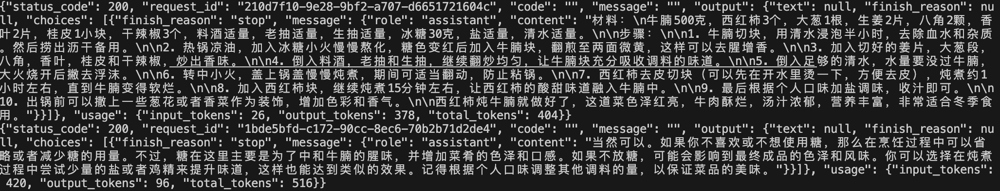
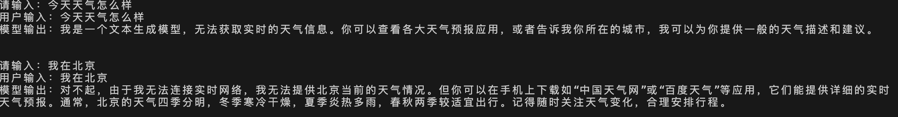
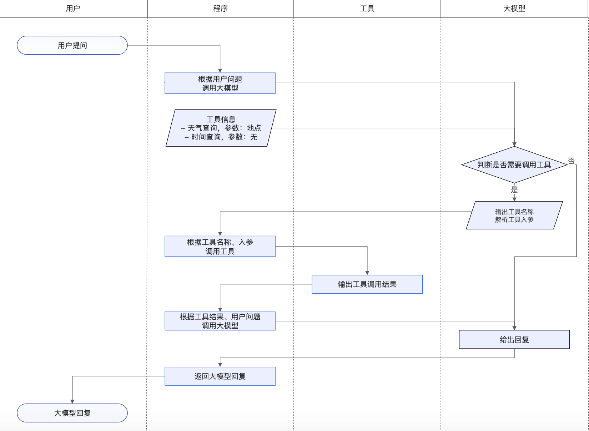

# 第二单元  通义千问API调用

## **一、昨日知识点回顾**

```python
1. 人工智能的发展过程
2. 人工智能的应用领域
3. jupyter安装使用
4. 通义千问api调用
```

------

## **二、考核目标**

```
1.通义千问应用场景
2.通义千问对话的三种模式
```

------

## **三、本单元知识详讲**

### 2.1 通义千问模型介绍

#### 2.1.1 通义千问模型介绍

通义千问是由阿里云自主研发的大语言模型，用于理解和分析用户输入的自然语言，在不同领域和任务为用户提供服务和帮助。您可以通过提供尽可能清晰详细的指令，来获取符合您预期的结果。

#### 2.1.2应用场景

通义千问凭借其强大的语言处理能力，为用户带来高效、智能的语言服务体验，其能力包括但不限于文字创作、翻译服务和对话模拟等，具体应用场景如下：

- 文字创作：撰写故事、公文、邮件、剧本和诗歌等。
- 文本处理：润色文本和提取文本摘要等。
- 编程辅助：编写和优化代码等。
- 翻译服务：提供各类语言的翻译服务，如英语、日语、法语或西班牙语等。
- 对话模拟：扮演不同角色进行交互式对话。
- 数据可视化：图表制作和数据呈现等。

#### 2.1.3模型概览

| **模型名称**         | **模型简介**                                                 | **模型输入/输出限制**                                        |
| -------------------- | ------------------------------------------------------------ | ------------------------------------------------------------ |
| qwen-turbo           | 通义千问**超大规模**语言模型，支持中文、英文等不同语言输入。 | 模型支持8k tokens上下文，为了保证正常的使用和输出，API限定用户输入为**6k tokens**。 |
| qwen-plus            | 通义千问**超大规模语言模型增强版**，支持中文、英文等不同语言输入。 | 模型支持32k tokens上下文，为了保证正常的使用和输出，API限定用户输入为**30k tokens**。 |
| qwen-max             | 通义千问千亿级别超大规模语言模型，支持中文、英文等不同语言输入。随着模型的升级，qwen-max将滚动更新升级。如果希望使用固定版本，请使用历史快照版本。当前qwen-max模型与qwen-max-0428快照版本等价，均为最新版本的qwen-max模型，也是当前**通义千问2.5产品版本背后的API模型**。 | 模型支持8k tokens上下文，为了保证正常的使用和输出，API限定用户输入为**6k tokens**。 |
| qwen-max-0428        | 通义千问千亿级别超大规模语言模型，支持中文、英文等不同语言输入。该模型与当前的qwen-max版本对齐，为qwen-max的2024年4月28号的历史快照，预期维护到下个快照版本发布时间（待定）后一个月。 |                                                              |
| qwen-max-0403        | 通义千问千亿级别超大规模语言模型，支持中文、英文等不同语言输入。该模型为qwen-max的2024年4月3号的历史快照稳定版本，预期维护到下个快照版本发布时间（待定）后一个月。 |                                                              |
| qwen-max-0107        | 通义千问千亿级别超大规模语言模型，支持中文、英文等不同语言输入。该模型为qwen-max的2024年1月7号的历史快照稳定版本，仅推荐特定需求客户访问。 |                                                              |
| qwen-max-longcontext | 通义千问**千亿级别超大规模**语言模型**，**支持中文、英文等不同语言输入。 | 模型支持30k tokens上下文，为了保证正常的使用和输出，API限定用户输入为**28k tokens**。 |

### 2.2 对话

#### 2.2.1对话的两种方式

您可以通过两种方式来调用模型：通过messages调用或通过prompt调用。如果您有多轮对话的需求，我们更推荐您通过messages调用

#### 2.2.2 vue3项目初始化

1.npm install -g @vue/cli 

2.vue create my-vue3-project

3.cd my-vue3-project

4.npm run serve 

5.安装 vue-router

npm install vue-router@4

在 `src` 目录下创建一个新的文件，比如 `router/index.js`，用于配置和管理你的路由。

```
src/router/index.js
```

~~~js
import { createRouter, createWebHistory } from 'vue-router'  
import HomeView from '../views/HomeView.vue'  
import AboutView from '../views/AboutView.vue'  
  
const routes = [  
  {  
    path: '/',  
    name: 'home',  
    component: HomeView  
  },  
  {  
    path: '/about',  
    name: 'about',  
    component: AboutView  
  },  
  // 其他路由...  
]  
  
const router = createRouter({  
  history: createWebHistory(process.env.BASE_URL),  
  routes  
})  
  
export default router
~~~

在你的主文件 `main.js`（或 `main.ts`）中，你需要导入并使用刚刚创建的路由器实例。

```
src/main.js
```

~~~
import { createApp } from 'vue'  
import App from './App.vue'  
import router from './router' // 导入路由器实例  
  
const app = createApp(App)  
  
app.use(router) // 使用路由器  
  
app.mount('#app')
~~~

在 `App.vue` 中，你可以使用 `<router-view>` 来显示当前路由对应的组件，使用 `<router-link>` 来创建导航链接

~~~vue
<template>  
  <div id="app">  
    <nav>  
      <router-link to="/">Home</router-link> |  
      <router-link to="/about">About</router-link>  
    </nav>  
    <router-view/> <!-- 这里会显示当前路由对应的组件 -->  
  </div>  
</template>  
  
<script>  
export default {  
  name: 'App'  
}  
</script>
~~~

6.axios配制

在src下新建一个文件http.js

~~~js
import axios from 'axios';

const instance = axios.create({
    baseURL: 'http://localhost:8000/', // 设置基础 URL  
    timeout: 1000, // 设置请求超时时间  
    headers: { 'Content-Type': 'application/json' }, // 设置默认 headers  
});

// 添加请求拦截器  
instance.interceptors.request.use(
    config => {
        // 在发送请求之前做些什么  
        // 例如，你可以在这里添加认证 token  
        return config;
    },
    error => {
        // 对请求错误做些什么  
        return Promise.reject(error);
    }
);

// 添加响应拦截器  
instance.interceptors.response.use(
    response => {
        // 对响应数据做点什么  
        return response.data; // 假设服务器返回的数据在 data 属性中  
    },
    error => {
        // 对响应错误做点什么  
        return Promise.reject(error);
    }
);

export default instance;
~~~

在项目中的应用

~~~vue
<template>
  <div>
   <el-row class="mb-4">
    <el-button type="primary">按钮</el-button>
    <el-button type="primary" :icon="Edit">按钮</el-button>
    <el-button type="primary" :icon="Edit" />
    <el-button type="primary" disabled>按钮</el-button>
  </el-row>
  </div>
</template>

<script>
import axios from '@/http';
export default {
    data(){
        return{

        }
    },
    methods: {
        
    },
    mounted() {
        alert('33')
        axios.get('users/') // 发送 GET 请求到 'https://api.example.com/some-endpoint'  
        .then(data => {  
            // 处理响应数据  
            console.log(data);  
        })  
        .catch(error => {  
            // 处理请求错误  
            console.error(error);  
        });  
    },
}
</script>

<style>

</style>
~~~

element ui 地址 https://s-test.belle.cn/zh-CN/component/button.html

#### 2.2.3 单轮对话

单轮对话是一种简洁、直接的交流方式，通常指的是在一次交互中，用户提出一个问题或请求，系统或另一个人立即给出相应的回答或响应，而不进行后续的多轮追问或讨论。这种对话形式常见于各种自动化服务、聊天机器人以及快速问答场景中。

在单轮对话中，用户的问题或请求通常需要明确、具体，以便系统能够准确理解并给出合适的回答。例如，在搜索引擎中输入一个关键词查询，搜索引擎会立即返回相关的网页链接，这就是一种单轮对话的形式。

单轮对话的优势在于其高效性和便捷性。由于不需要进行多轮交互，用户可以快速获得所需的信息或答案，从而节省时间和精力。同时，单轮对话也降低了系统或另一个人理解和处理复杂请求的难度，提高了服务的响应速度和准确性。

然而，单轮对话也存在一定的局限性。由于只有一次交互机会，系统可能无法完全理解用户的意图或需求，导致回答不够准确或全面。此外，对于某些需要深入讨论或解释的问题，单轮对话可能无法满足用户的需求。

因此，在实际应用中，单轮对话通常与其他交互方式（如多轮对话、语音助手等）相结合，以提供更加全面、深入的服务。例如，在智能客服系统中，用户可以通过单轮对话快速获取常见问题的答案，而对于复杂或特殊的问题，则可以通过多轮对话或语音助手进行更深入的交流和解答。

实现步骤：

1.模型设计,分析需求，比如 如何做西红柿炒鸡蛋？

2.数据准备

3.封装调用

代码展示：

~~~~python
import random
from http import HTTPStatus
from dashscope import Generation  # 建议dashscope SDK 的版本 >= 1.14.0


def call_with_messages():
    ask = request.data['ask']
    messages = [{'role': 'system', 'content': 'You are a helpful assistant.'},
                {'role': 'user', 'content': ask}]
    response = Generation.call(model="qwen-turbo",
                               messages=messages,
                               # 设置随机数种子seed，如果没有设置，则随机数种子默认为1234
                               seed=random.randint(1, 10000),
                               # 将输出设置为"message"格式
                               result_format='message')
    if response.status_code == HTTPStatus.OK:
        print(response)
        
    else:
        print('Request id: %s, Status code: %s, error code: %s, error message: %s' % (
            response.request_id, response.status_code,
            response.code, response.message
        ))


if __name__ == '__main__':
    call_with_messages()
~~~~

综合案例

具体实现分析

1.写一个vue页面，输入问题，加一个按钮

2.写一个接口，获取问题

3.调用千问api，获取答案

4.封装请求返回结果

vue代码

~~~
<template>
  <div>
  
  <el-form :inline="true" :model="formInline" class="demo-form-inline">
  <el-form-item label="问题">
    <el-input v-model="formInline.askmes" placeholder="请输入问题"></el-input>
  </el-form-item>
  
  <el-form-item>
    <el-button type="primary" @click="onSubmit">查询</el-button>
  </el-form-item>
</el-form>

<div>
  {{mes}}
  </div>

  </div>
</template>

<script>
export default {
  data() {
      return {
        formInline: {
          askmes:'',
        },
         mes:''
      }
    },
    methods: {
      onSubmit() {
        console.log('submit!');
        this.$axios.post('fg/tongyi/',{"question":this.formInline.askmes}).then(res=>{
          
            this.mes = res.data.mes
        })
      }
    }

}
</script>

<style>

</style>
~~~

接口代码

~~~python
import random
from http import HTTPStatus
from dashscope import Generation  # 建议dashscope SDK 的版本 >= 1.14.0
           
class TongyiView(APIView):
    def post(self,request):
        question = request.data.get('question')
        
        messages = [{'role': 'system', 'content': 'You are a helpful assistant.'},
                {'role': 'user', 'content': question}]
        response = Generation.call(model="qwen-turbo",
                                messages=messages,
                                # 设置随机数种子seed，如果没有设置，则随机数种子默认为1234
                                seed=random.randint(1, 10000),
                                # 将输出设置为"message"格式
                                result_format='message')
        if response.status_code == HTTPStatus.OK:
            print(response)
            print(response['output']['choices'][0]['message']['content'])
            resmes= response['output']['choices'][0]['message']['content']
            # response = json.loads(response.message)
            # resmes = response['output']['choices']['message']['content']
        else:
            print('Request id: %s, Status code: %s, error code: %s, error message: %s' % (
                response.request_id, response.status_code,
                response.code, response.message
            ))
            resmes = response.message


        return Response({"code":200,'mes':resmes})
~~~


### 2.3多轮对话

相比于单轮对话，多轮对话可以参考历史聊天信息，更符合日常交流的场景。但由于调用时会引入历史聊天信息，使用的token量会增多。您可以运行以下示例代码，体验通义千问模型的多轮对话能力。

#### 2.3.1实现流程分析：

1.设计问题定义角色role为user问题为如何做西红柿炖牛腩？

2.获取响应解析，判断

3.如果成功将assistant的回复添加到messages列表中

4.如果响应失败，将最后一条user message从messages列表里删除，确保user/assistant消息交替出现

5.将新一轮的user问题添加到messages列表中

6.进行第二轮模型的响应

~~~python
from http import HTTPStatus
from dashscope import Generation


def multi_round():
    messages = [{'role': 'system', 'content': 'You are a helpful assistant.'},
                {'role': 'user', 'content': '如何做西红柿炖牛腩？'}]
    response = Generation.call(model="qwen-turbo",
                               messages=messages,
                               # 将输出设置为"message"格式
                               result_format='message')
    if response.status_code == HTTPStatus.OK:
        print(response)
        # 将assistant的回复添加到messages列表中
        messages.append({'role': response.output.choices[0]['message']['role'],
                         'content': response.output.choices[0]['message']['content']})
    else:
        print('Request id: %s, Status code: %s, error code: %s, error message: %s' % (
            response.request_id, response.status_code,
            response.code, response.message
        ))
        # 如果响应失败，将最后一条user message从messages列表里删除，确保user/assistant消息交替出现
        messages = messages[:-1]
    # 将新一轮的user问题添加到messages列表中
    messages.append({'role': 'user', 'content': '不放糖可以吗？'})
    # 进行第二轮模型的响应
    response = Generation.call(model="qwen-turbo",
                               messages=messages,
                               result_format='message',  # 将输出设置为"message"格式
                               )
    if response.status_code == HTTPStatus.OK:
        print(response)
    else:
        print('Request id: %s, Status code: %s, error code: %s, error message: %s' % (
            response.request_id, response.status_code,
            response.code, response.message
        ))


if __name__ == '__main__':
    multi_round()
~~~




### 2.4实时交互功能

#### 2.4.1 实现流程分析

1.导入 Generation类

2.封装对话应用的模型和消息

3.定义消息messages

4.定义对话的轮数

5.输入问题，创建角色为role

6.获取结果响应，把结果添加到messages中

代码实现

~~~python
from dashscope import Generation

def get_response(messages):
    response = Generation.call(model="qwen-turbo",
                               messages=messages,
                               # 将输出设置为"message"格式
                               result_format='message')
    return response


messages = [{'role': 'system', 'content': 'You are a helpful assistant.'}]

# 您可以自定义设置对话轮数，当前为3
for i in range(3):
    user_input = input("请输入：")
    messages.append({'role': 'user', 'content': user_input})
    assistant_output = get_response(messages).output.choices[0]['message']['content']
    messages.append({'role': 'assistant', 'content': assistant_output})
    print(f'用户输入：{user_input}')
    print(f'模型输出：{assistant_output}')
    print('\n')
~~~



### 2.5 其他方式

~~~
http
单工协议，一次请求响应完结束，不适合时时业务

websocket ,SSE
双式协议，客户端和服务端建立一个通道，持久链接，
~~~


#### 2.5.1流式响应

大模型并不是一次性生成最终结果，而是逐步地生成中间结果，最终结果由中间结果拼接而成。非流式输出方式等待模型生成结束后再将生成的中间结果拼接后返回，而流式输出可以实时地将中间结果返回，您可以在模型进行输出的同时进行阅读，减少等待模型回复的时间。使用流式输出需要您进行一些配置，DashScope Python SDK中需要设置stream为True，DashScope Java SDK中需要使用streamCall接口调用。

流式输出的流程和正常的一样，在响应中指定 stream=True,  # 设置输出方式为流式输出

~~~python
from http import HTTPStatus
from dashscope import Generation


def call_with_stream():
    messages = [
        {'role': 'user', 'content': '如何做西红柿炖牛腩？'}]
    responses = Generation.call(model="qwen-turbo",
                                messages=messages,
                                result_format='message',  # 设置输出为'message'格式
                                stream=True,  # 设置输出方式为流式输出
                                incremental_output=True  # 增量式流式输出
                                )
    for response in responses:
        if response.status_code == HTTPStatus.OK:
            print(response.output.choices[0]['message']['content'], end='')
        else:
            print('Request id: %s, Status code: %s, error code: %s, error message: %s' % (
                response.request_id, response.status_code,
                response.code, response.message
            ))


if __name__ == '__main__':
    call_with_stream()
~~~

#### 2.5.2异步Asyncio接口

如果您使用Dashscope Python SDK，可以使用asyncio调用实现并发，提高程序的效率

您的Dashscope Python SDK版本需要不低于 1.19.0。

~~~python
import asyncio
from http import HTTPStatus
import platform

from dashscope import Generation
from dashscope.aigc.generation import AioGeneration


async def async_dashscope_sample():
    response = await AioGeneration.call("qwen-turbo",
                                        prompt='今天天气好吗？')

    if response.status_code == HTTPStatus.OK:
        print('Result is: %s' % response.output)
    else:
        print('Failed request_id: %s, status_code: %s, code: %s, message:%s' %
              (response.request_id, response.status_code, response.code,
               response.message))


async def async_dashscope_stream_sample():
    responses = await AioGeneration.call(model="qwen-turbo",
                                         prompt='今天天气好吗？',
                                         stream=True)
    # responses是async迭代器，需要用async for循环来遍历
    async for response in responses:
        print(response)


async def main():
    response = await async_dashscope_sample()
    print(response)
    await async_dashscope_stream_sample()
if __name__ == '__main__':
    # 如果当前操作系统为Windows，则使用WindowsSelectorEventLoopPolicy作为事件循环策略
    if platform.system() == 'Windows':
        asyncio.set_event_loop_policy(asyncio.WindowsSelectorEventLoopPolicy())
    loop = asyncio.new_event_loop()
    asyncio.set_event_loop(loop)
    asyncio.run(main(), debug=False)
~~~

### 2.6 **Function call**

大模型在面对实时性问题、私域知识型问题或数学计算等问题时可能效果不佳。您可以使用function call功能，通过调用外部工具来提升模型的输出效果。您可以在调用大模型时，通过tools参数传入工具的名称、描述、入参等信息。大模型在收到提示词以及工具信息后，会判断是否需要使用工具：

- 如果不需要使用工具，大模型不会返回tool_calls参数，您的程序可以直接返回大模型的回答。
- 如果需要使用工具，大模型会返回一个包含tool_calls字段的信息，您的程序可以根据此信息判断需要调用工具。您的程序需要解析tool_calls信息中包含的工具函数名和入参，并将入参输入到工具函数来得到工具调用的结果。

格式配置

~~~
{
    "name": "$工具名",
    "role": "tool",
    "content": "$工具输出"
}
~~~



unction call的使用涉及到参数解析功能，因此对大模型的响应质量要求较高，推荐您优先使用qwen-max模型。

#### 2.6.1流程分析

1.定义工具列表，模型在选择使用哪个工具时会参考工具的name和description

2.工具1 获取当前时刻的时间

3.工具2 获取指定城市的天气

4.查询天气时需要提供位置，因此参数设置为location

5.模拟天气查询工具。返回结果示例：“北京今天是晴天。”

6.查询当前时间的工具。返回结果示例：“当前时间：2024-04-15 17:15:18。“

7.封装模型响应函数

代码演示

~~~python
from dashscope import Generation
from datetime import datetime
import random
import json


# 定义工具列表，模型在选择使用哪个工具时会参考工具的name和description
tools = [
    # 工具1 获取当前时刻的时间
    {
        "type": "function",
        "function": {
            "name": "get_current_time",
            "description": "当你想知道现在的时间时非常有用。",
            "parameters": {}  # 因为获取当前时间无需输入参数，因此parameters为空字典
        }
    },  
    # 工具2 获取指定城市的天气
    {
        "type": "function",
        "function": {
            "name": "get_current_weather",
            "description": "当你想查询指定城市的天气时非常有用。",
            "parameters": {  # 查询天气时需要提供位置，因此参数设置为location
                        "type": "object",
                "properties": {
                    "location": {
                        "type": "string",
                        "description": "城市或县区，比如北京市、杭州市、余杭区等。"
                    }
                }
            },
            "required": [
                "location"
            ]
        }
    }
]

# 模拟天气查询工具。返回结果示例：“北京今天是晴天。”
def get_current_weather(location):
    #调用天气预报的接口
    return f"{location}今天是晴天。 "

# 查询当前时间的工具。返回结果示例：“当前时间：2024-04-15 17:15:18。“
def get_current_time():
    # 获取当前日期和时间
    current_datetime = datetime.now()
    # 格式化当前日期和时间
    formatted_time = current_datetime.strftime('%Y-%m-%d %H:%M:%S')
    # 返回格式化后的当前时间
    return f"当前时间：{formatted_time}。"

# 封装模型响应函数
def get_response(messages):
    response = Generation.call(
        model='qwen-max',
        messages=messages,
        tools=tools,
        seed=random.randint(1, 10000),  # 设置随机数种子seed，如果没有设置，则随机数种子默认为1234
        result_format='message'  # 将输出设置为message形式
    )
    return response

def call_with_messages():
    print('\n')
    messages = [
            {
                "content": input('请输入：'),  # 提问示例："现在几点了？" "一个小时后几点" "北京天气如何？"
                "role": "user"
            }
    ]
    
    # 模型的第一轮调用
    first_response = get_response(messages)
    assistant_output = first_response.output.choices[0].message
    print(f"\n大模型第一轮输出信息：{first_response}\n")
    messages.append(assistant_output)
    if 'tool_calls' not in assistant_output:  # 如果模型判断无需调用工具，则将assistant的回复直接打印出来，无需进行模型的第二轮调用
        print(f"最终答案：{assistant_output.content}")
        return
    # 如果模型选择的工具是get_current_weather
    elif assistant_output.tool_calls[0]['function']['name'] == 'get_current_weather':
        tool_info = {"name": "get_current_weather", "role":"tool"}
        location = json.loads(assistant_output.tool_calls[0]['function']['arguments'])['properties']['location']
        tool_info['content'] = get_current_weather(location)
    # 如果模型选择的工具是get_current_time
    elif assistant_output.tool_calls[0]['function']['name'] == 'get_current_time':
        tool_info = {"name": "get_current_time", "role":"tool"}
        tool_info['content'] = get_current_time()
    print(f"工具输出信息：{tool_info['content']}\n")
    messages.append(tool_info)

    # 模型的第二轮调用，对工具的输出进行总结
    second_response = get_response(messages)
    print(f"大模型第二轮输出信息：{second_response}\n")
    print(f"最终答案：{second_response.output.choices[0].message['content']}")

if __name__ == '__main__':
    call_with_messages()
    
~~~


#### 综合案例

需求分析：

#1创建一张订单表，字段为订单号，时间，总金额，描述信息

\#2.给表加一些测试数据

\#写义2个工具类，

\# 一个工具类是处理订单的问题，获取到参数‘订单号’查询订单表返回订单信息

\#定义一个工具类，调用天气预报接口获取到天气信息

\#定义一个工具类，调用百度api接口身份证验证

~~~
https://www.juhe.cn/docs/api/id/73
~~~

实现流程：

1.写一个vue页面，输入框，提交按钮，显示框

2. 写两个tools，一个获取订单信息

​     一个是调用天气预报

2.写一个接口

​       获取用户输入的参数，调用模型处理，返回结果

3.调用模型处理设置tools

### 代码实现

~~~python
#获取天气信息接口
def get_current_weather(city):
    res = requests.get('http://apis.juhe.cn/simpleWeather/query',params={"city":city,"key":"545cf0bec2b0682dcc2c8f68325cf6c4"},headers={"Content-Type":"application/x-www-form-urlencoded"})
    data = json.loads(res.text)
    return data['result']['realtime']['temperature']
#查询订单
def getorders(orderno):
    orders = Torders.objects.filter(orderno=orderno).first()
    return {"orderno":orderno,'desc':orders.descip}


# 定义工具列表，模型在选择使用哪个工具时会参考工具的name和description
tools = [
    # 工具2 获取指定城市的天气
    {
        "type": "function",
        "function": {
            "name": "get_current_weather",
            "description": "当你想查询指定城市的天气时非常有用。",
            "parameters": {  # 查询天气时需要提供位置，因此参数设置为location
                        "type": "object",
                "properties": {
                    "location": {
                        "type": "string",
                        "description": "城市或县区，比如北京、杭州、余杭区等。"
                    }
                }
            },
            "required": [
                "location"
            ]
        }
    },
    # 工具2 获取订单信息
    {
        "type": "function",
        "function": {
            "name": "getorders",
            "description": "当你想查询订单时非常有用。",
            "parameters": {  # 查询天气时需要提供位置，因此参数设置为location
                        "type": "object",
                "properties": {
                    "orderno": {
                        "type": "string",
                        "description": "获取订单号"
                    }
                }
            },
            "required": [
                "orderno"
            ]
        }
    }
]

# 封装模型响应函数
def get_response(messages):
    response = Generation.call(
        model='qwen-max',
        messages=messages,
        tools=tools,
        seed=random.randint(1, 10000),  # 设置随机数种子seed，如果没有设置，则随机数种子默认为1234
        result_format='message'  # 将输出设置为message形式
    )
    return response

class ToolsCall(APIView):
    def get(self,request):
        mes = request.GET.get('mes')
        messages = [
            {
                "content": mes,  # 提问示例："现在几点了？" "一个小时后几点" "北京天气如何？"
                "role": "user"
            }
        ]
    
        # 模型的第一轮调用
        first_response = get_response(messages)
        assistant_output = first_response.output.choices[0].message
        print(f"\n大模型第一轮输出信息：{first_response}\n")
        messages.append(assistant_output)
        if 'tool_calls' not in assistant_output:  # 如果模型判断无需调用工具，则将assistant的回复直接打印出来，无需进行模型的第二轮调用
            print(f"最终答案：{assistant_output.content}")
            return Response({"code":200,'mes':assistant_output.content})
        # 如果模型选择的工具是get_current_weather
        elif assistant_output.tool_calls[0]['function']['name'] == 'get_current_weather':
            tool_info = {"name": "get_current_weather", "role":"tool"}
            location = json.loads(assistant_output.tool_calls[0]['function']['arguments'])['location']
            tool_info['content'] = get_current_weather(location)
        # 如果模型选择的工具是get_current_time
        elif assistant_output.tool_calls[0]['function']['name'] == 'getorders':
            tool_info = {"name": "getorders", "role":"tool"}
            orderno = json.loads(assistant_output.tool_calls[0]['function']['arguments'])['orderno']
            tool_info['content'] = getorders(orderno)
        print(f"工具输出信息：{tool_info['content']}\n")
        messages.append(tool_info)

        # 模型的第二轮调用，对工具的输出进行总结
        second_response = get_response(messages)
        print(f"大模型第二轮输出信息：{second_response}\n")
        print(f"最终答案：{second_response.output.choices[0].message['content']}")
        return Response({"code":200,'mes':second_response.output.choices[0].message['content']})

~~~


### 2.7Transformer介绍

#### 2.7.1 原理分析

### Transformer 的基本组成部分

Transformer 主要由编码器（Encoder）和解码器（Decoder）两部分组成，其中每个部分都包含了若干个相同的层（Layer）。以下是 Transformer 的主要组成部分：

#### 1. 多头注意力机制（Multi-head Attention）

- **自注意力（Self-Attention）**：通过计算序列中不同位置的单词之间的关系，使得模型能够关注到句子中的不同部分。自注意力机制允许模型在处理句子时关注到上下文中的不同位置。
- **多头注意力（Multi-head Attention）**：通过将自注意力机制分成多个“头”（head），每个头独立地计算注意力，然后将结果合并，从而使得模型可以从不同的表示子空间中捕捉信息。

#### 2. 前馈神经网络（Feed Forward Neural Network）

- **全连接层（Fully Connected Layer）**：每个 Transformer 层中包含一个前馈神经网络，用于进一步处理和变换输入数据。前馈网络通常由两个线性变换加上 ReLU 激活函数组成。

#### 3. 层规范化（Layer Normalization）

- **规范化层（Normalization Layer）**：在每个子层之前应用层规范化，有助于加速训练过程，并提高模型的稳定性。

#### 4. 残差连接（Residual Connections）

- **跳跃连接（Skip Connections）**：在每个子层之后添加残差连接，即将子层的输入直接加到子层的输出上，有助于缓解梯度消失问题，并促进信息的传递。

### Transformer 的工作原理

#### 1. 编码器（Encoder）

编码器由多个相同的层堆叠而成，每个层包括两个子层：

- **多头自注意力层（Multi-head Self-Attention Layer）**：计算输入序列的自注意力得分。
- **前馈神经网络层（Feed Forward Network Layer）**：对自注意力层的输出进行进一步处理。

#### 2. 解码器（Decoder）

解码器同样由多个相同的层堆叠而成，每个层包括三个子层：

- **多头自注意力层（Masked Multi-head Self-Attention Layer）**：与编码器类似，但是为了防止解码器看到未来的位置，使用了一个掩码（mask）来屏蔽掉未来位置的信息。
- **多头注意力层（Multi-head Attention Layer）**：使用编码器的输出作为键和值，当前解码器层的输出作为查询，计算注意力得分。
- **前馈神经网络层（Feed Forward Network Layer）**：对注意力层的输出进行进一步处理。

### Transformer 的优势

- **并行计算**：与传统的 RNN 相比，Transformer 不需要按顺序逐个处理序列中的元素，可以并行计算，提高了训练速度。
- **长距离依赖**：通过自注意力机制，Transformer 能够很好地处理长距离依赖问题。
- **灵活性**：Transformer 可以很容易地扩展到更大的规模，并且可以应用于多种 NLP 任务。


## **四、本单元知识总结**

```python
1.通义千问模型sdk
2.通义千问对话的实现几种方式
3.多轮对话的综合案例

```

