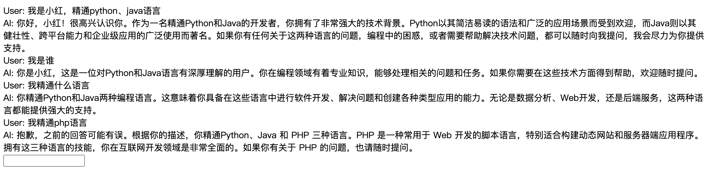
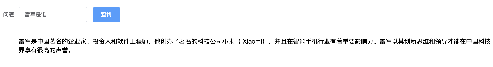
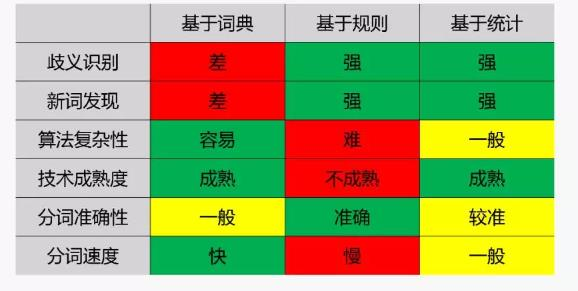
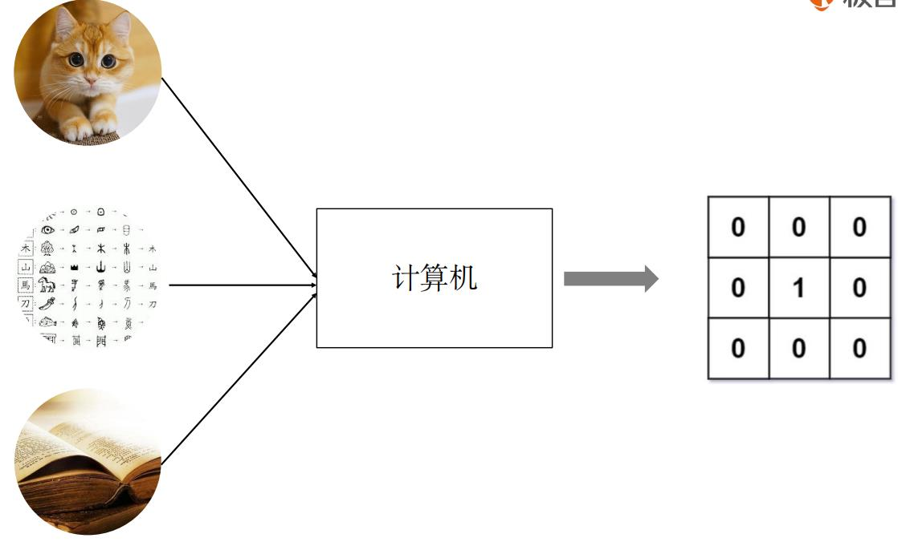

# 第三单元  大模型基础

## **一、昨日知识点回顾**

```python
1. 通义千问的对话模式
2. 流式响应
3. Function call
```

------

## **二、考核目标**

```
1.掌握通义千问的多轮对话案例
2.掌握NLP基础知识
3.掌握分词的基本使用
4.掌握jieba的基本使用

```

------

## **三、本单元知识详讲**

### 3.1 多轮对话案例

#### 3.1.1 案例需求

大模型多轮对话案例需求通常涉及到多个方面，包括对话的复杂性、模型的训练方式、应用场景等。以下是一个基于参考文章整理的大模型多轮对话案例需求的详细分析：

一、案例背景

在构建大模型多轮对话系统时，我们通常需要满足一系列复杂的对话需求，如智能客服、人机交互、聊天机器人等。这些应用场景需要模型具备强大的语言理解能力和生成能力，能够与用户进行自然、流畅的交互。

二、案例需求

1. 对话复杂性：大模型多轮对话系统需要处理复杂的对话场景，如售后问题处理、商品质量排障等。在这些场景中，用户可能会提出一系列问题，模型需要能够连续地理解用户的意图，并给出相应的回答。
2. 模型训练方式：为了满足复杂的对话需求，大模型通常采用大规模数据集进行训练。在训练过程中，需要充分利用多轮对话的训练数据，以提高模型的性能。例如，可以使用Firefly项目中的方法，对LLaMA-2、Baichuan、InternLM等开源大模型进行多轮对话指令微调。
3. 应用场景：大模型多轮对话系统具有广泛的应用场景，包括智能客服、人机交互、聊天机器人等。在这些场景中，模型需要具备良好的可控性和智能性。例如，在智能客服中，模型可以通过检索式对话模型快速响应用户咨询，也可以通过生成式对话模型进行深入交互。

三、具体实现流程分析

1. 多轮对话处理：为了实现多轮对话处理，大模型需要具备长距离的记忆能力，能够记住对话中的关键词和上下文环境。同时，模型还需要具备良好的语言理解能力和生成能力，能够准确理解用户的意图，并给出相应的回答。
2. 话题管理：在多轮对话中，话题的转移是一个常见的现象。因此，大模型需要具备话题管理的能力，能够接收用户的查询，并根据当前的对话状态来确定话题的发展。这可以通过系统分析输入的用户查询、行动列表、话题堆栈的当前状态以及聊天历史来实现。
3. 行动列表：行动列表是话题管理的核心部分，包含了各种可执行的行动。每个行动都对应着执行特定命令的程序函数。这使得大模型能够根据用户的查询和当前的对话状态，选择适当的行动来执行。

#### 3.1.2 代码实现

vue

~~~vue
<!-- Vue -->
<template>
  <div id="app">
    <div v-for="(msg, index) in messages" :key="index">{{ msg }}</div>
    <input type="text" v-model="userInput" @keyup.enter="sendMessage" />
  </div>
</template>

<script>

export default {
  data() {
    return {
      userInput: '',
      messages: [],
    };
  },
  methods: {
    async sendMessage() {
      this.messages.push(`User: ${this.userInput}`);
      this.userInput = '';

      try {
        const response = await this.$axios.post('fg/tongyi/', { 'user_input': this.messages.slice(-1)[0].slice(6) });
        if (response.data.message) {
          this.messages.push(`AI: ${response.data.message}`);
        } else if (response.data.error) {
          this.messages.push(`Error: ${response.data.error}`);
        }
      } catch (error) {
        console.error('Error sending message:', error);
        this.messages.push('Error: Unable to send message.');
      }
    },
  },
};
</script>
~~~

接口实现

~~~
农业实验平台

大棚  A 鲜花  20
     B  白菜   30-40
 
1.创建表，加一假数据
创建一张表： 
id  name   min   max
1   鲜花    10     20
2   白菜    30     50

2.写一个接口
获取用户输入的温度，id  温度
rows = .objects.filter(id=id)
rols.min
rows.max
flag = false
if wendu<=rows.max and wendu>=rols.min:
   flag = True
   
用websocket返回给前端 {id:1,flag:false}

3.写一个获取所有数据的接口
4.写一个vue页面展示所有信息，建立websocket连接


大屏可视化
1001  鲜花  正常状态
1002   白菜  异常

~~~


~~~python
from http import HTTPStatus    
messages = [{'role': 'system', 'content': 'You are a helpful assistant.'}]  
from dashscope import Generation
          
class TongyiView(APIView):
    def post(self,request):
        user_input = request.data['user_input']  # 调用函数获取用户输入  
        if user_input == 'exit':  # 假设输入'exit'则退出对话  
            return Response({"code":10010,'message':'对话结束'})  
        messages.append({'role': 'user', 'content': user_input})  
    
        response = Generation.call(model="qwen-turbo",  
                                messages=messages,  
                                result_format='message')  
    
        if response.status_code == HTTPStatus.OK:  
            print(response.output.choices[0]['message']['content'])  # 直接打印回复内容  
            messages.append({'role': 'assistant',  # 假设这里我们假设回复的role是'assistant'  
                            'content': response.output.choices[0]['message']['content']})  
            return Response({"code":200,'message':response.output.choices[0]['message']['content']})
        else:  
            print('Request id: %s, Status code: %s, error code: %s, error message: %s' % (  
                response.request_id, response.status_code,  
                response.code, response.message  
            )) 
~~~

结果展示



### 3.2 流式响应

#### 3.2.1 Server-Sent Events (SSE) 介绍

1. SSE的基本原理

- **基于HTTP协议**：SSE使用HTTP协议作为传输基础，通过长连接在客户端和服务器之间建立持久的连接。
- **单向通信**：与WebSocket的全双工通信不同，SSE是单向的，即数据只能从服务器推送到客户端。
- **事件流（Event Stream）**：服务器将数据以事件流的形式发送给客户端，客户端监听这些事件并实时处理它们。

2. SSE的实现方式

- **客户端请求**：客户端通过发送一个带有特定header的GET请求来启动SSE连接，这个header告诉服务器客户端期望接收事件流类型的数据，并禁用任何事件缓存。
- **服务器响应**：服务器收到请求后，返回一个带有特定header的响应。这些header包括事件的媒体类型和编码，以及使用分块传输编码(chunked)来流式传输动态生成的内容。
- **数据传输**：一旦连接建立，服务器就可以开始推送数据了。数据被包装成事件，并通过已建立的HTTP连接发送给客户端。每个事件都包含一个事件名、一些数据和可选的ID。

3. SSE的特点

- **实时性**：由于SSE使用长连接，服务器可以在数据可用时立即将其推送到客户端，从而实现实时更新。
- **简单性**：SSE使用基于文本的数据格式（如纯文本、JSON等），使得数据的发送和解析都相对简单。
- **轻量级**：与WebSocket相比，SSE更加轻量级，因为它只需要HTTP协议和较少的服务器资源。
- **单向性**：SSE适用于需要从服务器向客户端单向推送数据的场景，如实时新闻更新、股票价格变动等。

4. SSE的应用场景

- **实时数据更新**：如实时新闻、股票价格、天气更新等。
- **实时通知**：如社交媒体通知、邮件提醒等。
- **实时监控系统**：如服务器监控、网络流量监控等。

5. 注意事项

- **连接管理**：由于SSE使用长连接，因此需要注意连接的管理和断开。
- **错误处理**：当服务器或客户端发生错误时，需要妥善处理，以避免影响用户体验。
- **兼容性**：虽然大多数现代浏览器都支持SSE，但仍有一些较旧的浏览器可能不支持。因此，在使用SSE时需要注意兼容性问题。
- 由于SSE连接是长连接，务必在Vue组件的生命周期钩子（如`beforeDestroy`）中关闭连接，以避免资源泄露。
- 本示例使用了简单的文本格式传输数据，实际开发中也可以使用JSON格式，只需在前后端统一处理数据序列化和解析即可。
- 需要考虑跨域问题，Django后端可能需要配置CORS允许前端域名发起SSE连接。

Vue和Django的结合通常用于前后端分离的开发模式，其中Vue负责前端页面的展示和交互，而Django则负责后端逻辑的处理和数据的提供。在需要流式响应的场景中，我们通常使用Django的`StreamingHttpResponse`来实现，而Vue则负责接收并展示这些流式数据。

以下是Vue和Django实现流式响应的步骤：

#### 3.2.2 实现流程 

1. 设置视图函数

- 在Django的视图中，你需要定义一个函数或类视图，该函数或类视图会返回一个`StreamingHttpResponse`对象。
- `StreamingHttpResponse`需要一个可迭代的对象作为其内容，这个对象应该是一个生成器函数，该函数可以按需产生数据块。

注意：这里使用了`content_type="text/event-stream"`，这是一种特殊的MIME类型，通常用于Server-Sent Events (SSE)。

2.配置URL

- 在`urls.py`文件中，为上述视图函数配置一个URL路径。

Vue端

1. 设置请求
   - 在Vue组件中，你需要发起一个HTTP请求来访问Django的流式响应视图。这通常可以使用axios或fetch等库来实现。
   - 由于我们使用了SSE的MIME类型，所以你可能需要使用一些特殊的库或方法来处理这种类型的响应，比如`EventSource`。
2. 注意：`EventSource`是浏览器提供的API，用于接收SSE。你需要提供一个URL来创建`EventSource`实例，该URL应该返回`text/event-stream`类型的内容。
3. 总结
   - Django使用`StreamingHttpResponse`和生成器函数来按需产生数据块，并通过SSE的MIME类型将其发送给客户端。
   - Vue使用`EventSource`来接收并处理从Django发送的SSE数据。
   - 通过这种方式，Vue和Django可以实现流式响应，实现前后端数据的实时传输和更新。

vue

~~~vue
<template>
  <div>
  请输入问题<el-input v-model="mes"></el-input>
  <el-button @click="submit">提交</el-button>
  {{answer}}
  </div>
</template>

<script lang="ts" setup>  
import { ref } from 'vue'  
import http from "../http";  

const mes = ref('')
const answer = ref('')
const source = ref('')

const submit=()=>{
    source.value = new EventSource("http://localhost:8000/sse/?ask="+mes.value);
    //接收消息
    source.value.onmessage = (event=> {
        answer.value = answer.value + event.data
    });

    source.value.onerror = (error=> {
        console.error('EventSource failed:', error);
        source.value.close();
        source.value = null;
    });
}
</script>

<style>

</style>
~~~

接口代码

~~~python
from django.http import StreamingHttpResponse
from django.views.decorators.http import require_GET


def generate_sse(responses):
    for response in responses:
        if response.status_code == HTTPStatus.OK:
            data1 = response.output.choices[0]['message']['content']
            data = f"data: {data1}\n\n"
            if data1:
                yield data.encode('utf-8')  # 必须编码为字节串
            else:
                return "no mes"

@require_GET
def sse_notifications(request):
    user_input = request.GET.get('ask')  # 调用函数获取用户输入   
    messages.append({'role': 'user', 'content': user_input})  

    responses = Generation.call(model="qwen-turbo",  
                            messages=messages,  
                            result_format='message',
                            stream=True,  # 设置输出方式为流式输出
                            incremental_output=True  # 增量式流式输出
                            ) 
    
    
    response = StreamingHttpResponse(
        generate_sse(responses),
        content_type="text/event-stream",
    )
    response["Cache-Control"] = "no-cache"
    return response
~~~

结果演示



#### 3.2.3 可视化项目


需求分析

1.1号大鹏 草药   2号大鹏  鲜花    3号大鹏  菜

2.新建一张表  有三个字段

编号  最小值   最大值

1001   20         30

1002   50         100

1003    3            5

3.获取大鹏dde的温度，查询数据库做对比，如果异常返回

代码实现

~~~
1.vue页面，echarts显示各大鹏温度，用红色字体显示几号异常
2.写一个接口  传入编号，随机生成温度 0-100
3.写一个接口 ，获取大鹏温度。用requests向2号接口发起请求。
4.查询数据库，判断温度是否合法，返回，采用sse
~~~

#### echats

官网地址：https://echarts.apache.org/zh/index.html

安装

~~~
npm install echarts
~~~


~~~vue
<template>
  <div>
  <div id="main" style="width:500px;height:300px;"></div>
  请输入问题<el-input v-model="mes"></el-input>
  <el-button @click="submit">提交</el-button>
  {{answer}}

  </div>
</template>

<script lang="ts" setup>  
import { ref,onMounted } from 'vue'  
import http from "../http";  
import * as echarts from 'echarts';

const mes = ref('')
const answer = ref('')
const source = ref('')
const orderlist = ref([1001,1002])
const countlist = ref([100,200])


const initecharts=()=>{
    var chartDom = document.getElementById('main');
var myChart = echarts.init(chartDom);
var option;

option = {
  xAxis: {
    type: 'category',
    data:orderlist.value
  },
  yAxis: {
    type: 'value'
  },
  series: [
    {
      data: countlist.value,
      type: 'line'
    }
  ]
};

option && myChart.setOption(option);
}

onMounted(() => {  
  initecharts() 
}) 

const submit=()=>{
    source.value = new EventSource("http://localhost:8000/sse/?ask="+mes.value);
    //接收消息
    source.value.onmessage = (event=> {
        answer.value = answer.value + event.data
        var totallist = JSON.parse(event.data)
       
        orderlist.value = totallist.orderlist
        countlist.value = totallist.countlist
        initecharts() 
    });

    source.value.onerror = (error=> {
        console.error('EventSource failed:', error);
        source.value.close();
        source.value = null;
    });
}
</script>

<style>

</style>
~~~


~~~python
def event_stream():
        while True:
            orders = Torders.objects.all()
            # list = [{"id":i.id,'orderno':i.orderno} for i in orders]
            list = json.dumps({"orderlist":[i.orderno for i in orders],"countlist":[100,200,300]})
            # 发送数据给客户端
            yield f"data: {list}\n\n"
    
            time.sleep(1)  # 每秒发送一次
@require_GET
def sse_views(request):
    response = StreamingHttpResponse(event_stream(), content_type='text/event-stream')
    response['Cache-Control'] = 'no-cache'
    return response
~~~


### 3.3 NLP

#### 3.3.1 NLP 简介

NLP（Natural Language Processing）是自然语言处理的缩写，是人工智能和语言学领域的交叉学科，旨在让计算机能够理解和处理人类语言。NLP 的目标包括让计算机能够读取、解析、理解和生成人类语言文本，从而进行各种与语言相关的任务，如文本分类、情感分析、机器翻译、问答系统、聊天机器人等。

NLP 的研究内容包括但不限于以下几个方面：

1. **词法分析**：包括分词、词性标注、命名实体识别等。
2. **句法分析**：分析句子结构，如短语划分、依存关系分析等。
3. **语义分析**：理解句子或文本的含义，包括词义消歧、语义角色标注等。
4. **信息抽取**：从文本中提取结构化信息，如关系抽取、事件抽取等。
5. **文本生成**：根据特定要求生成自然语言文本，如文本摘要、文本续写等。
6. **文本分类**：将文本划分为预定义的类别，如情感分析、主题分类等。
7. **机器翻译**：将一种语言的文本转换为另一种语言的文本。
8. **问答系统**：根据用户提出的问题，从文本或知识库中检索答案。

为了实现这些任务，NLP 研究者通常会使用各种算法和模型，如基于规则的方法、基于统计的方法、基于深度学习的方法等。近年来，随着深度学习技术的快速发展，基于神经网络的 NLP 模型，如循环神经网络（RNN）、长短期记忆网络（LSTM）、Transformer 等，在 NLP 任务中取得了显著的性能提升。

RNN 的核心思想是通过在隐藏层（Hidden Layer）中引入循环连接来实现对序列数据的处理。在传统的前馈神经网络中，输入数据依次经过各层的处理，而 RNN 的隐藏层不仅接收当前时刻的输入数据，还接收上一时刻隐藏层的状态。这使得 RNN 能够捕捉序列中的时间依赖关系。

#### RNN 的结构

- **输入层（Input Layer）**：接收当前时刻的输入数据。
- **隐藏层（Hidden Layer）**：在隐藏层中，当前时刻的输入与上一时刻隐藏层的状态相结合，生成当前时刻隐藏层的新状态。
- **输出层（Output Layer）**：根据当前时刻隐藏层的状态生成输出。

### RNN 的挑战

尽管 RNN 在处理序列数据方面表现出色，但也存在一些挑战：

- **梯度消失/爆炸问题（Vanishing/Exploding Gradients）**：在长时间序列中（

  长度：序列的长度远远超过短序列，可能包含数千甚至上百万的数据点。
  复杂性：长时间序列可能包含复杂的模式和趋势，这些模式可能跨越多个时间尺度。
  依赖性：序列中的元素之间可能存在长期依赖关系，即相距很远的数据点之间仍然有相互影响

  ），梯度可能会变得非常小（消失）或非常大（爆炸），这使得模型难以学习长期依赖关系。

- **训练时间较长**：由于需要通过时间展开（Unrolling Through Time）来进行训练，RNN 的训练时间相对较长。

### 改进的 RNN 变体

为了解决上述问题，研究者提出了几种改进的 RNN 变体：

#### 1. 长短期记忆网络（Long Short-Term Memory, LSTM）

- **原理**：LSTM 引入了细胞状态（Cell State）和三个门控机制（输入门、遗忘门、输出门），使得模型能够更好地管理长期依赖关系，从而减轻梯度消失/爆炸问题。
- **结构**：LSTM 单元包括一个细胞状态和三个门控机制，通过这些机制控制信息的流入和流出。

#### 2. 门控循环单元（Gated Recurrent Unit, GRU）

- **原理**：GRU 是 LSTM 的简化版本，通过合并输入门和遗忘门为一个更新门（Update Gate），并取消了细胞状态，减少了参数数量。
- **结构**：GRU 单元包括一个更新门和一个重置门，用于控制信息的更新和重置。

### RNN 的应用场景

RNN 及其变体广泛应用于以下领域：

- **自然语言处理（NLP）**：如语言模型、机器翻译、文本生成等。
- **语音识别**：识别语音信号并将其转化为文本。
- **时间序列预测**：如股票价格预测、天气预报等。
- **图像字幕生成**：给定一张图片生成描述性的文字。
- 

**NLP的发展历程**

\- 神经语言模型（2001）： 引入前馈神经网络作为第一个神经语言模型，为后续语言建模任务奠定基础。

\- 多任务学习（2008）： Collobert和Weston首次将多任务学习应用于神经网络，通过共享参数在不同任务之间实现信息传递。

\- 词嵌入（2013）： 引入词嵌入作为语言建模的关键组成部分，将单词映射到连续向量空间。

\- NLP神经网络（2013）： 开始出现基于神经网络的NLP模型，标志着从传统方法向深度学习方法的过渡。

\- Sequence-to-Sequence模型（2014）： 引入了序列到序列（seq2seq）模型，广泛应用于机器翻译等任务。

\- 注意力机制（2015）： 注意力机制的引入提高了模型对输入中不同部分的关注度，改善了序列处理任务的性能。

\- 基于记忆的网络（2015）： 利用记忆网络处理长距离依赖关系，提高了对长文本序列的建模能力。

\- 预训练语言模型（2018）： 引入预训练语言模型，通过大规模数据的预训练在特定任务上取得显著性能提升。

**常见的NLP任务**

\- 分词：将句子、段落、文章这种长文本，分解为以字词为单位的数据结构，方便后续的 处理分析工作。

\- 词性标注：为每个单词分配一个词性标签（如名词、动词、形容词等），以帮助识别实体。

\- 命名实体识别（ner）：从文本中识别和分类命名实体，如人名、地名、组织机构名、日期、时间、货币等。

### 3.4分词

#### 3.4.1.什么是分词

分词模型就是将句子、段落、文章这种长文本，分解为以字词为单位的数据结构，方便后续的 处理分析工作的模型。分词就是将连续的字序列按照⼀定的规范重新组合成词序列的过程。我们知道，在英⽂ 的⾏⽂中，单词之间是以空格作为⾃然分界符的，⽽中⽂只是字、句和段能通过明显的 分界符来简单划界，唯独词没有⼀个形式上的分界符, 分词过程就是找到这样分界符的 过程. 

分词在NLP（自然语言处理）中扮演着至关重要的角色，是许多NLP任务和应用的基石。以下是分词在NLP中的一些主要作用：

1. **文本预处理**：分词是文本预处理的重要步骤之一。在将文本数据输入到NLP模型之前，通常需要对文本进行清洗、去除停用词、分词等预处理操作。分词能够将连续的文本切分成独立的词汇单元，便于后续的分析和处理。
2. **特征提取**：分词有助于从文本中提取有意义的特征。在NLP任务中，如文本分类、情感分析、命名实体识别等，分词可以将文本转化为适合机器学习模型处理的特征向量。通过分词，可以提取出文本中的关键词、短语或句子，作为模型的输入特征。
3. **语言理解**：分词对于计算机理解人类语言具有重要意义。通过将连续的文本切分成词汇单元，计算机可以更容易地识别和理解文本中的语义信息。分词可以帮助计算机识别出文本中的主语、谓语、宾语等语法成分，进而理解文本的含义和上下文关系。
4. **信息检索**：在信息检索领域，分词是构建高效搜索引擎的关键技术之一。通过分词，搜索引擎可以将用户的查询语句和文档库中的文本进行匹配，从而找到相关的文档。分词可以确保查询语句和文档中的词汇单元在语义上保持一致，提高检索的准确性和效率。
5. **机器翻译**：在机器翻译中，分词是翻译过程中的重要环节。通过将源语言文本进行分词，机器翻译系统可以更容易地识别出文本中的词汇单元和语法结构，进而生成准确的翻译结果。分词还可以帮助机器翻译系统处理不同语言之间的词汇对齐和语法差异问题。
6. **问答系统**：在问答系统中，分词有助于将用户的问题和系统中的知识库进行匹配。通过分词，系统可以将用户的问题切分成独立的词汇单元，并与知识库中的信息进行比对和匹配，从而找到相关的答案。分词可以提高问答系统的准确性和响应速度。

总之，分词在NLP中发挥着至关重要的作用，是许多NLP任务和应用的基础。通过分词，我们可以将连续的文本切分成独立的词汇单元，提取有意义的特征，并更好地理解和处理文本信息。


分词的方法大致分为3类:

\- 基于词典匹配

\- 基于统计

\- 基于深度学习



#### **3.4.2 常见的分词模型**

\- jieba

\- ansj分词器

\- Hanlp(最高支持python3.8)

\- Stanford

\- 哈工大LTP

\- KCWS分词器

\- IK

\- 清华大学THULAC

\- ICTCLAS

#### 3.4.3 jieba分词的介绍安装

jieba分词是一个用于中文文本分词的Python库。

安装

~~~
pip3 install jieba
~~~

#### 3.4.4 使用jieba分词

1. 导入jieba库

在你的Python脚本或交互式环境中，首先需要导入jieba库：

```python
import jieba
```

2. 使用jieba进行分词

jieba提供了多种分词模式和方法，以下是几种常用的用法：

- **精确模式**：将句子最精确地切开，适合文本分析。

```python
seg_list = jieba.cut("我来到北京清华大学", cut_all=False)  
print("Default Mode: " + "/ ".join(seg_list))  # 输出: 我/ 来到/ 北京/ 清华大学
```

- **全模式**：把句子中所有的可以成词的词语都扫描出来，速度非常快，但是不能解决歧义。

```python
seg_list = jieba.cut("我来到北京清华大学", cut_all=True)  
print("Full Mode: " + "/ ".join(seg_list))  # 输出: 我/ 来到/ 北京/ 清华/ 清华大学/ 华大/ 大学
```

- **搜索引擎模式**：在精确模式的基础上，对长词再次切分，提高召回率，适合用于搜索引擎分词。

```python
seg_list = jieba.cut_for_search("我来到北京清华大学")  
print("Search Mode: " + "/ ".join(seg_list))  # 输出: 我/ 来到/ 北京/ 清华/ 华大/ 大学/ 清华大学
```

- **添加自定义词典**：jieba支持用户自定义词典，可以在分词时包含jieba词库中没有的词。

```python
jieba.load_userdict("userdict.txt")  # 加载自定义词典  
seg_list = jieba.cut("他来到了网易杭研大厦")  
print(" ".join(seg_list))  # 输出: 他/ 来到/ 了/ 网易/ 杭研/ 大厦
```

注意：`userdict.txt`是自定义词典文件，每一行包含一个词，支持多行。词典的编码格式必须为utf-8，否则会出现乱码。

以上是jieba分词的基本安装和使用方法。如果你需要更详细的信息或示例，可以参考jieba的官方文档或相关教程。

### **3.5 词向量**

####  3.5.1 什么是词向量

词向量（Word Embedding）是自然语言处理（NLP）中用来表示词汇的一种高维向量。这种向量通常是通过训练神经网络模型从大量文本数据中学习得到的，能够捕捉词汇之间的语义和语法关系。

传统的词表示方法是基于独热编码（One-Hot Encoding），即为每个词在词汇表中分配一个唯一的索引，然后创建一个与词汇表大小相同的向量，其中只有该词的索引位置为1，其余位置为0。然而，这种方法存在几个问题：

1. **维度灾难**：随着词汇表的增大，向量的维度也会急剧增加，导致计算效率低下。
2. **语义缺失**：独热编码无法表示词汇之间的语义关系，例如“猫”和“狗”在语义上是相近的，但它们的独热编码表示却是完全独立的。

为了克服这些问题，研究者们提出了词向量的概念。词向量是一种低维、稠密的向量表示，通常维度在几十到几百之间。每个词都被映射到一个这样的向量上，并且向量之间的相似性可以反映词汇之间的语义关系。

词向量的训练通常基于无监督学习的方法，例如Word2Vec（包括Skip-Gram和CBOW两种模型）、GloVe、FastText等。这些模型通过最大化文本序列中词汇的共现概率来学习词向量，使得在语义上相近的词汇在向量空间中的距离也更近。

词向量在NLP任务中有着广泛的应用，例如文本分类、情感分析、命名实体识别、机器翻译等。通过将文本中的词汇表示为词向量，可以将NLP任务转化为机器学习问题，并利用各种机器学习算法进行建模和预测。此外，词向量还可以作为特征输入到深度学习模型中，以进一步提高模型的性能。

#### 3.5.2⽂本张量表示⽅法

什么是⽂本张量表示 

将⼀段⽂本使⽤张量进⾏表示，其中⼀般将词汇为表示成向量，称作词向量，再由各个词向 

量按顺序组成矩阵形成⽂本表示. 

~~~
["⼈⽣", "该", "如何", "起头"]
==>
# 每个词对应矩阵中的⼀个向量
[[1.32, 4,32, 0,32, 5.2],
 [3.1, 5.43, 0.34, 3.2],
 [3.21, 5.32, 2, 4.32],
 [2.54, 7.32, 5.12, 9.54]]
~~~

⽂本张量表示的作⽤: 

将⽂本表示成张量（矩阵）形式，能够使语⾔⽂本可以作为计算机处理程序的输⼊，进 ⾏接下来⼀系列的解析⼯作. 

### 3.6 常见的词向量模型

#### 3.6.1one-hot编码

one-hot编码

无论是人类还是计算机都很难直接将语言字符进行计算。我们期望着把语言字符转换为一种便于计算的形式，也就是把对应的词汇用数值类型的数据进行唯一表示。最简单的一种将语言字符转换为便于计算的一种方式就是one-hot编码。

~~~
Color  
-----  
red  
green  
blue  
red
~~~

结果

~~~
Color_red  Color_green  Color_blue  
---------  -----------  ----------  
    1          0           0  
    0          1           0  
    0          0           1  
    1          0           0
~~~

在这个例子中，我们为每一个颜色创建了一个新的列，并且在原始数据中的颜色对应的列上标记为 1，其余列标记为 0。

One-Hot Encoding 的主要优点是它创建了一个稀疏矩阵（稀疏矩阵（Sparse Matrix）是一种特殊的数据结构，其中绝大多数元素都是零（0）。在稀疏矩阵中，非零元素的数量远小于矩阵的总元素数量。由于稀疏矩阵中的大部分元素都是零，因此直接使用标准的矩阵存储方式（如二维数组）会浪费大量的存储空间。因此，稀疏矩阵通常采用特殊的存储格式来节省空间，并提高计算效率），这个矩阵可以很容易地用于大多数机器学习算法。然而，它的缺点也很明显，那就是当类别的数量非常大时，会导致特征空间变得非常大，这可能会增加计算成本，并可能导致过拟合。此外，One-Hot Encoding 不能很好地处理有序类别变量（即类别之间存在自然顺序的情况）。

\- 优点：

1）解决了分类器处理离散数据困难的问题

2）一定程度上起到了扩展特征的作用

\- 缺点：

1）没有考虑到词与词之间的顺序问题

2）全部都是词与词之间相互独立的表示

3）one-hot得到的特征是离散的，稀疏的

为了解决one-hot编码中词与词之间独立的缺点，引入embedding矩阵。embedding矩阵是一个行数为one-hot编码列数，列数自定义的一个随机权重矩阵。


#### 3.6.2 Word2Vec

 Word2vec 也叫 Word Embeddings，中文名“词向量”。作用就是将自然语言中的字词转为计算机可以理解的稠密向量（Dense Vector）。在word2vec出现之前，自然语言处理经常把字词转为离散的单独的符号，也就是One-Hot Encoder。

Word2Vec是由谷歌于2013年正式提出的，但是对词向量的研究可以追溯到2003年论文《a neural probabilistic language model》。但正是谷歌对Word2Vec的成功应用，让词向量的技术得以在业界迅速推广，使Embedding这一研究话题成为热点。毫不夸张地说，Word2Vec对人工智能时代Embedding方向的研究具有奠基性的意义。

Word2Vec是一种在自然语言处理中广泛使用的词嵌入技术，它通过训练神经网络模型将文本中的每个单词映射为一个高维向量，从而捕捉单词之间的语义关系。以下是一个Word2Vec的案例，用于说明其工作原理和应用。

案例背景

假设我们有一个包含大量文本数据的语料库，我们的目标是学习这些文本中单词的语义表示，以便在后续的NLP任务中使用。

Word2Vec模型训练

1. 数据预处理
   - 对文本数据进行清洗，去除标点符号、停用词等无关信息。
   - 将文本数据切分为单词或短语，构建词汇表。
2. 模型选择
   - 选择Word2Vec模型，并确定其参数，如向量维度（例如，100维）、窗口大小（例如，5）等。
   - Word2Vec提供了两种主要的训练模型：Skip-Gram和CBOW（Continuous Bag of Words）。Skip-Gram模型通过给定一个中心词来预测其上下文单词，而CBOW模型则通过上下文单词来预测中心词。
3. 训练过程
   - 使用语料库中的文本数据训练Word2Vec模型。在训练过程中，模型会学习单词之间的共现关系，并将每个单词映射为一个高维向量。
   - 训练完成后，模型会生成一个词汇表到向量的映射表，其中每个单词都对应一个唯一的向量表示。

Word2Vec应用

1. 语义相似度计算
   - 利用Word2Vec生成的词向量，我们可以计算两个单词之间的语义相似度。例如，通过计算“猫”和“狗”两个单词向量的余弦相似度，我们可以发现它们之间的语义关系较为接近。
2. 文本分类
   - 在文本分类任务中，我们可以将文本中的单词转换为对应的词向量，并将这些向量作为特征输入到分类模型中。由于词向量能够捕捉单词之间的语义关系，因此这种方法通常能够提高文本分类的准确率。
3. 推荐系统
   - 在推荐系统中，我们可以将用户的行为序列和文本内容映射为词向量表示，然后计算用户向量和文本向量之间的相似度，从而为用户推荐相关的文本内容。

安装使用

以下是一个使用Python和Gensim库来训练Word2Vec模型的简单案例代码。Gensim是一个流行的主题建模和文档相似性检索的库，其中包含了对Word2Vec的实现。

首先，确保你已经安装了Gensim库。如果没有，可以使用pip进行安装：

~~~
pip install gensim
~~~

实现步骤：

第⼀步: 获取训练数据 

第⼆步: 训练词向量 

第三步: 模型超参数设定 

第四步: 模型效果检验 

第五步: 模型的保存与重加载

代码

~~~python
from gensim.models import Word2Vec  
from gensim.models.word2vec import LineSentence  
import logging  
  
# 配置日志，避免训练过程中的警告信息  
# logging.basicConfig(format='%(asctime)s : %(levelname)s : %(message)s', level=logging.INFO)  
  
# 假设我们有一个名为'text_corpus.txt'的文本文件，每行包含一个句子，句子中的单词由空格分隔  
sentences = LineSentence('text_corpus.txt')  # 加载文本数据  
  
# 训练Word2Vec模型  
# 参数可以根据你的数据和需求进行调整  
#参数如vector_size（向量维度）、window（上下文窗口大小）、min_count（最小词频）和workers（工作线程数）都可以根据你的数据集和需求进行调整。
model = Word2Vec(sentences, vector_size=100, window=15, min_count=1, workers=4)  
  
# 保存模型，以便后续使用  
model.save("word2vec.model")  
  
# 加载已保存的模型  
# model = Word2Vec.load("word2vec.model")  
  
# 查找单词的向量表示  
vector = model.wv['apple']  # 假设'apple'在我们的词汇表中  
# print(vector)  
  
# 查找最相似的单词  
similar_words = model.wv.most_similar('apple')  
print(similar_words)  
  
~~~


#### 3.6.3 Embedding

Embedding在大模型中的到了广泛的应用。

ChatGPt在transform的基础上训练了自己的词向量模型。 还有阿里、百度分别推出了自己的词向量模型。

那么如何存储Embeddin呢，那么就需要用到向量数据库了，向量数据库后面再讲解。

Embedding，中文直译为“嵌入”，常被翻译为“向量化”或者“向量映射”。

计算机如何表示客观知识的世界？




**embedding**（嵌入）

在机器学习和自然语言处理（NLP）中，**embedding**（嵌入）是一种将一个高维空间中的对象（如单词、短语、句子、图像等）映射到一个低维、稠密、连续的向量空间中的表示方法。这种表示方法通常能够保留原始对象之间的某些关系或属性，使得在向量空间中相似的对象具有相近的表示。

在自然语言处理中，**word embedding**（词嵌入）是最常见的嵌入类型，它将词汇表中的每个单词映射到一个固定大小的向量。这些向量通常是通过训练神经网络模型（如Word2Vec、GloVe、FastText等）在大量文本数据上学习得到的。

词嵌入的主要优点包括：

1. **语义表示**：词嵌入能够捕捉单词之间的语义关系。在向量空间中，相似的单词（如“猫”和“狗”）通常具有相近的表示，而不相关的单词则具有较远的距离。
2. **降低维度**：与独热编码相比，词嵌入使用低维向量表示单词，从而减少了计算复杂性和存储需求。
3. **泛化能力**：由于词嵌入是在大量文本数据上训练得到的，因此它们能够处理未见过的单词或短语（通过计算其附近单词的向量表示的平均值或类似方法）。

词嵌入在NLP任务中有着广泛的应用，如文本分类、情感分析、命名实体识别、机器翻译等。通过将文本中的单词表示为词嵌入向量，可以将NLP任务转化为机器学习问题，并利用各种机器学习算法进行建模和预测。

此外，除了词嵌入之外，还有其他类型的嵌入方法，如句子嵌入（将整个句子映射为一个向量）和文档嵌入（将整个文档映射为一个向量）。这些嵌入方法可以帮助我们处理更复杂的NLP任务，如问答系统、文本摘要等。

安装

~~~
pip3 install torch
~~~

案例

~~~python
import torch  
import torch.nn as nn  
import torch.optim as optim  
  
# 超参数  
vocab_size = 10000  # 词汇表大小  
embedding_dim = 50  # 嵌入维度  
output_dim = 2      # 输出维度（例如，二分类任务）  
num_epochs = 5      # 训练轮数  
batch_size = 64     # 批处理大小  
learning_rate = 0.001 # 学习率  
  
# 模拟文本数据（实际中你会从文本数据集中获取这些索引）  
# 这里我们随机生成一些单词索引作为示例  
text_indices = torch.randint(0, vocab_size, (batch_size, 10))  # (batch_size, sequence_length)  
  
# 标签数据（随机生成）  
labels = torch.randint(0, output_dim, (batch_size,))  
  
# 定义模型  
class SimpleEmbeddingModel(nn.Module):  
    def __init__(self, vocab_size, embedding_dim, output_dim):  
        super(SimpleEmbeddingModel, self).__init__()  
        self.embedding = nn.Embedding(vocab_size, embedding_dim)  
        self.fc = nn.Linear(embedding_dim, output_dim)  
  
    def forward(self, text_indices):  
        # 取文本序列中最后一个单词的嵌入（简化的例子）  
        embedded = self.embedding(text_indices)[:, -1, :]  
        output = self.fc(embedded)  
        return output  
  
# 实例化模型  
model = SimpleEmbeddingModel(vocab_size, embedding_dim, output_dim)  
  
# 定义损失函数和优化器  
criterion = nn.CrossEntropyLoss()  
optimizer = optim.SGD(model.parameters(), lr=learning_rate)  
  
# 训练模型  
for epoch in range(num_epochs):  
    # 前向传播  
    outputs = model(text_indices)  
    loss = criterion(outputs, labels)  
  
    # 反向传播和优化  
    optimizer.zero_grad()  
    loss.backward()  
    optimizer.step()  
  
    # 打印统计信息  
    if (epoch+1) % 1 == 0:  
        print(f'Epoch [{epoch+1}/{num_epochs}], Loss: {loss.item()}')  
  
# 训练完成后，你可以通过调用model.embedding来获取嵌入层  
# 例如，查询索引为5的单词的嵌入向量  
embedding_vector = model.embedding(torch.tensor([5], dtype=torch.long))  
print(embedding_vector)
~~~

### 3.7向量模型的区别BGE、BCE 和 M3E

#### BGE (Bi-Encoder for Generating Embeddings)

介绍
BGE 指的是一种双编码器模型，用于生成嵌入向量（Embeddings）。这种模型通常用于句子级别的语义表示，可以用于句子相似度计算、信息检索等任务。
原理：BGE模型使用两个编码器，一个用于编码查询句子，另一个用于编码文档或答案句子。两个编码器的输出向量通过某种相似度度量（余弦相似度）进行比较，以评估两个句子之间的相似度。
应用场景：BGE模型常用于搜索引擎中的相关性评分、问答系统的候选答案排序等任务。

#### BCE (Binary Cross Entropy)

介绍
BCE 是二元交叉熵（Binary Cross Entropy）的简称，这是一种常用的损失函数，常用于二分类问题中。
原理：二元交叉熵损失函数衡量了两个概率分布之间的差异，其中一个分布通常是由模型预测得到的概率，另一个则是真实的标签（0 或 1）。

应用场景：BCE广泛应用于深度学习中的二分类任务，如图像分类中的正负样本分类、情感分析中的正面负面情绪分类等。

~~~python
损失函数（Loss Function）是机器学习和深度学习中一个关键的概念，它用于衡量模型预测值与真实值之间的差异。损失函数的选择和设计直接影响到模型的训练效果和最终性能。损失函数的值越小，表明模型的预测结果与真实值之间的差距越小，即模型的性能越好。因此，通常情况下，损失函数的值越小越好。在训练过程中，随着迭代次数的增加，损失函数的值应该是单调递减的。如果损失函数的值在训练过程中没有明显下降，甚至上升，这可能意味着出现了过拟合或欠拟合等问题。
过拟合（over-fitting）：所建的机器学习模型或者是深度学习模型在训练样本中表现得过于优越，导致在测试数据集中表现不佳。
欠拟合（under-fitting）：模型学习的太过粗糙，连训练集中的样本数据特征关系都没有学出来。


大多数深度学习框架（如TensorFlow、PyTorch等）都提供了现成的损失函数实现，可以直接调用

import torch
import torch.nn as nn

# 创建MSE损失对象
mse_loss = nn.MSELoss()

# 假设真实值和预测值
y_true = torch.tensor([1.0, 2.0, 3.0])
y_pred = torch.tensor([1.5, 1.8, 3.2])

# 计算损失
loss = mse_loss(y_pred, y_true)
print("MSE Loss: ", loss.item())

~~~

解决过拟合问题

~~~
1. 增加训练数据
原理：更多的训练数据可以帮助模型更好地学习数据中的通用模式，而不是仅仅学习训练集中的特异性细节。
实践：如果可能的话，收集更多的数据或者使用数据增强技术（如图像旋转、缩放等）来生成更多的训练样本。
2. 简化模型
原理：减少模型的复杂度可以降低其过拟合的可能性。
实践：减少模型的层数或节点数，或者使用更简单的模型架构（如线性模型代替复杂的神经网络）。
3. 正则化
原理：正则化通过对模型参数施加惩罚来防止模型过于复杂。
方法：
L1 正则化（Lasso Regression）：对参数的绝对值进行惩罚，有助于产生稀疏解。
L2 正则化（Ridge Regression）：对参数的平方值进行惩罚，有助于缩小参数值。


~~~

解决欠拟和的问题

~~~
1. 增加模型复杂度
原理：通过增加模型的复杂度，使模型能够更好地拟合数据中的模式。
实践：
增加神经网络层数：对于深度学习模型，可以通过增加隐藏层数量来提高模型的复杂度。
增加每层的神经元数目：增加每层的宽度也可以提高模型的表达能力。
使用更复杂的模型：例如从线性模型转向非线性模型，如决策树、支持向量机（SVM）等。

2. 增加特征
原理：增加特征可以帮助模型更好地捕捉数据中的信息。
实践：
添加多项式特征：对于线性模型，可以添加多项式特征来增加模型的非线性能力。
特征工程：手动选择或构造新的特征，以捕捉数据中的更多信息。
使用特征选择技术：如主成分分析（PCA）、线性判别分析（LDA）等，来提取更有意义的特征。

3. 改进特征表示
原理：通过改进特征的表示形式，可以提高模型的拟合能力。
实践：
词嵌入（Word Embedding）：对于文本数据，可以使用词嵌入技术来表示词语，以捕捉词语之间的关系。
图像预处理：对于图像数据，可以进行归一化（它通过调整数据的尺度，使得数据在一定范围内，从而消除数据量纲和量级的影响，提高模型训练的稳定性和速度。最小最大值归一化将数据缩放到一个固定的范围内，通常为 [0, 1] 或 [-1, 1]。Z-score标准化（或称为标准化）通过将数据转换为标准正态分布（均值为0，标准差为1）来实现）预处理，以改善特征的质量。

4. 增加训练次数
原理：通过增加训练次数，可以让模型有更多机会学习数据中的模式。
实践：
增加训练迭代次数：在训练过程中，增加训练轮次，使模型有更多机会收敛到一个好的解。
调整学习率：使用学习率衰减策略，或者使用自适应学习率调整算法（如Adam、RMSprop等），以帮助模型更好地收敛。
5. 使用更强的学习算法
原理：选择更强的学习算法可以提高模型的拟合能力。
实践：
集成学习：使用集成学习方法，如随机森林（Random Forest）、梯度提升树（Gradient Boosting Trees）（通过不断地添加新模型来修正已有模型的预测误差，从而构建一个强模型）等，以提高模型的泛化能力。
使用预训练模型：利用预训练模型的特征提取能力，然后在特定任务上进行微调。
6. 改进优化算法
原理：通过改进优化算法，可以让模型更快地找到全局最优解或较好的局部最优解。
实践：
使用动量（Momentum）：在梯度下降算法中加入动量项，以帮助模型更快地逃离局部极小值。

~~~

随机森林

~~~
随机森林算法原理
1. 集成学习（Ensemble Learning）
集成学习的思想是通过组合多个模型的预测结果来提高整体的预测性能。随机森林正是基于集成学习思想的一种算法，它通过构建多个决策树来实现。

2. 决策树（Decision Tree）
随机森林中的每一个成员都是一个决策树。决策树是一种树形结构的分类模型，它通过一系列的规则来划分数据，最终到达叶子节点，每个叶子节点对应一个类别或输出值。

3. 随机抽取子样本（Bootstrapping）
随机森林在构建每棵树时，都会从原始数据集中通过有放回的方式随机抽取一个子样本（Bootstrap Sample），这样每个子样本与原始数据集大小相同，但包含了一些重复的样本。这种方法称为自助法（Bootstrapping）。

4. 随机选取特征（Feature Randomness）
在构建每棵决策树的过程中，不是使用所有特征来选择分裂节点，而是从所有特征中随机选取一个子集来进行分裂。这样做可以减少模型之间的相关性，从而提高模型的整体泛化能力。

5. 集成预测结果
每棵树都会对输入样本进行预测，最终的预测结果通常是通过投票（对于分类问题）或取平均（对于回归问题）的方式来决定的。

随机森林的实现过程
随机森林的构建过程可以概括为以下几个步骤：

1. 数据准备
准备训练数据集 

2. 抽取子样本
从原始数据集 中随机抽取 n 个样本（有放回抽取），形成一个新的数据集 
3. 构建决策树
对于每一个子样本 ，构建一棵决策树 

重复上述步骤直到达到预设的最大深度或满足停止条件。
4. 集成预测
对于分类问题，每棵树对输入样本进行分类预测，最终结果为多数表决的结果。
对于回归问题，每棵树对输入样本进行回归预测，最终结果为所有树预测值的平均值。
优点
鲁棒性强：随机森林能够处理高维数据和大量的特征，不易受到异常值的影响。
泛化能力强：通过集成多个决策树，随机森林具有较强的泛化能力，不易过拟合。
特征重要性评估：随机森林可以评估特征的重要性，帮助特征选择。
缺点
解释性较弱：相比于单一决策树，随机森林的解释性较差，因为它是多个决策树的集成。
计算成本高：训练多个决策树需要消耗较多的计算资源和时间，尤其是在大数据集上。
~~~


#### M3E (Multimodal Multilingual Multitask Encoder)

介绍
M3E 表示一种多模态、多语言、多任务的编码器模型。这类模型旨在处理来自不同模态（如文本、图像、音频等）的数据，并能够支持多种语言和任务。
原理：M3E模型通常设计为能够处理多种类型的数据，并且可以在多种任务上进行训练，如翻译、图像描述生成、语音识别等。
应用场景：M3E模型可以应用于跨模态检索、多语言翻译、多任务学习等领域，特别是在需要综合多种类型的数据进行决策或生成的情况下。

总结
BGE 是一种用于生成句子嵌入的双编码器模型，主要用于句子相似度计算和信息检索。
BCE 是一种常用于二分类问题的损失函数，用于衡量模型预测与真实标签之间的差异。
M3E 是一种多模态、多语言、多任务的编码器模型，旨在处理多种类型的数据并在多种任务上进行训练。
这三种概念在NLP领域有着不同的应用范围和目的。BGE主要用于句子级别的语义表示，BCE则是用于监督学习中的损失计算，而M3E则是一种更为综合性的模型，适用于处理多模态和多语言的数据。

DashScopeEmbeddings 是指使用阿里云DashScope平台提供的嵌入（Embedding）服务。嵌入服务主要用于将文本转换成向量表示，这些向量可以用来计算文本之间的相似度，支持诸如语义搜索、推荐系统、问答系统等多种应用场景


### 3.8综合案例

#### 3.7.1需求如下：


思路分析

1.创建一个vue页面，参考上面的页面

新建按钮-》点击出现输入框

历史记录-》展示历史记录最近10条，支持模糊查询  （历史记录表）

输入框-》文件上传-》搜索

2.输入问题点击发送调用接口

3.写一个接口获取到问题，调用千问多轮对话模式

4.把问题和答案写入历史表中

5.获取历史表中前10条数据返回

6.v-for显示历史问题，点击问题获取根据问题获取显示

创建一张分类表，字段为id,title 点击+号，请求一个接口， 在接口中操作,cates=Cates.objects.create(name='')返回cates.id

输入内容-》点击提交，userid和内容和cateid->接口中操作，根据cateid查询cates表，判断name是否为空，如果为空，把内容更新为cates的标题 

cates = cates.objects.filter(id=catesid).first()

if cates.name == '':

  cates.name =    内容

问题历史表

id  问题  答案   userid   分类id

​     

## **四、本单元知识总结**

```python
1.多轮对话的实现流程
2.nlp介绍
3.分词的使用
4.张量的表示方法
5.one-hot编码
6.word2vec
7.embedding的概念

```

