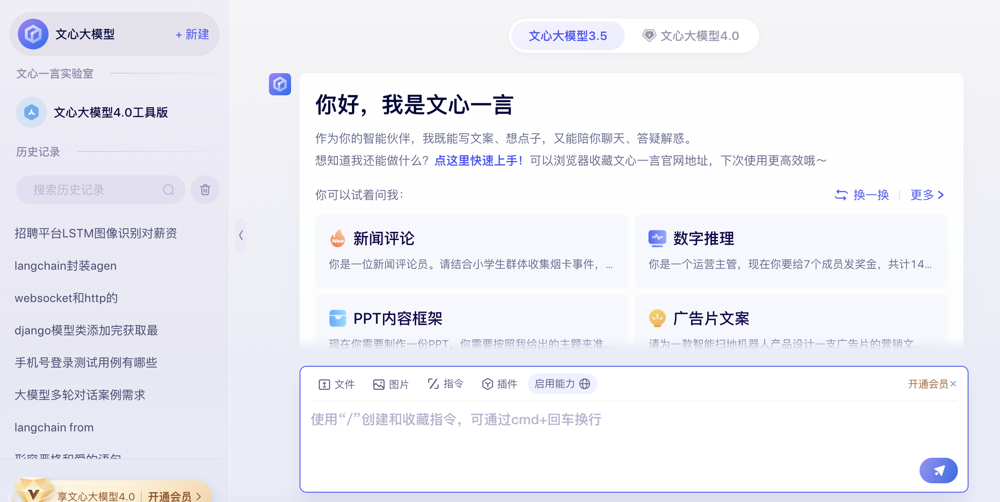

# 第三单元  大模型基础

## **一、昨日知识点回顾**

```python
1. 通义千问的对话模式
2. 流式响应
3. Function call
```

------

## **二、考核目标**

```
1.掌握通义千问的多轮对话案例
2.掌握NLP基础知识
3.掌握分词的基本使用
4.掌握jieba的基本使用

```

------

## **三、本单元知识详讲**

### 3.1 多轮对话案例

#### 3.1.1 案例需求

大模型多轮对话案例需求通常涉及到多个方面，包括对话的复杂性、模型的训练方式、应用场景等。以下是一个基于参考文章整理的大模型多轮对话案例需求的详细分析：

一、案例背景

在构建大模型多轮对话系统时，我们通常需要满足一系列复杂的对话需求，如智能客服、人机交互、聊天机器人等。这些应用场景需要模型具备强大的语言理解能力和生成能力，能够与用户进行自然、流畅的交互。

二、案例需求

1. 对话复杂性：大模型多轮对话系统需要处理复杂的对话场景，如售后问题处理、商品质量排障等。在这些场景中，用户可能会提出一系列问题，模型需要能够连续地理解用户的意图，并给出相应的回答。
2. 模型训练方式：为了满足复杂的对话需求，大模型通常采用大规模数据集进行训练。在训练过程中，需要充分利用多轮对话的训练数据，以提高模型的性能。例如，可以使用Firefly项目中的方法，对LLaMA-2、Baichuan、InternLM等开源大模型进行多轮对话指令微调。
3. 应用场景：大模型多轮对话系统具有广泛的应用场景，包括智能客服、人机交互、聊天机器人等。在这些场景中，模型需要具备良好的可控性和智能性。例如，在智能客服中，模型可以通过检索式对话模型快速响应用户咨询，也可以通过生成式对话模型进行深入交互。

三、具体实现流程分析

1. 多轮对话处理：为了实现多轮对话处理，大模型需要具备长距离的记忆能力，能够记住对话中的关键词和上下文环境。同时，模型还需要具备良好的语言理解能力和生成能力，能够准确理解用户的意图，并给出相应的回答。
2. 话题管理：在多轮对话中，话题的转移是一个常见的现象。因此，大模型需要具备话题管理的能力，能够接收用户的查询，并根据当前的对话状态来确定话题的发展。这可以通过系统分析输入的用户查询、行动列表、话题堆栈的当前状态以及聊天历史来实现。
3. 行动列表：行动列表是话题管理的核心部分，包含了各种可执行的行动。每个行动都对应着执行特定命令的程序函数。这使得大模型能够根据用户的查询和当前的对话状态，选择适当的行动来执行。

#### 3.1.2 代码实现

vue

~~~vue
<!-- Vue -->
<template>
  <div id="app">
    <div v-for="(msg, index) in messages" :key="index">{{ msg }}</div>
    <input type="text" v-model="userInput" @keyup.enter="sendMessage" />
  </div>
</template>

<script>

export default {
  data() {
    return {
      userInput: '',
      messages: [],
    };
  },
  methods: {
    async sendMessage() {
      this.messages.push(`User: ${this.userInput}`);
      this.userInput = '';

      try {
        const response = await this.$axios.post('fg/tongyi/', { 'user_input': this.messages.slice(-1)[0].slice(6) });
        if (response.data.message) {
          this.messages.push(`AI: ${response.data.message}`);
        } else if (response.data.error) {
          this.messages.push(`Error: ${response.data.error}`);
        }
      } catch (error) {
        console.error('Error sending message:', error);
        this.messages.push('Error: Unable to send message.');
      }
    },
  },
};
</script>
~~~

接口实现

~~~
农业实验平台

大棚  A 鲜花  20
     B  白菜   30-40
 
1.创建表，加一假数据
创建一张表： 
id  name   min   max
1   鲜花    10     20
2   白菜    30     50

2.写一个接口
获取用户输入的温度，id  温度
rows = .objects.filter(id=id)
rols.min
rows.max
flag = false
if wendu<=rows.max and wendu>=rols.min:
   flag = True
   
用websocket返回给前端 {id:1,flag:false}

3.写一个获取所有数据的接口
4.写一个vue页面展示所有信息，建立websocket连接


大屏可视化
1001  鲜花  正常状态
1002   白菜  异常

~~~


~~~python
from http import HTTPStatus    
messages = [{'role': 'system', 'content': 'You are a helpful assistant.'}]  
from dashscope import Generation
          
class TongyiView(APIView):
    def post(self,request):
        user_input = request.data['user_input']  # 调用函数获取用户输入  
        if user_input == 'exit':  # 假设输入'exit'则退出对话  
            return Response({"code":10010,'message':'对话结束'})  
        messages.append({'role': 'user', 'content': user_input})  
    
        response = Generation.call(model="qwen-turbo",  
                                messages=messages,  
                                result_format='message')  
    
        if response.status_code == HTTPStatus.OK:  
            print(response.output.choices[0]['message']['content'])  # 直接打印回复内容  
            messages.append({'role': 'assistant',  # 假设这里我们假设回复的role是'assistant'  
                            'content': response.output.choices[0]['message']['content']})  
            return Response({"code":200,'message':response.output.choices[0]['message']['content']})
        else:  
            print('Request id: %s, Status code: %s, error code: %s, error message: %s' % (  
                response.request_id, response.status_code,  
                response.code, response.message  
            )) 
~~~

结果展示


### 3.2 流式响应

#### 3.2.1 Server-Sent Events (SSE) 介绍

1. SSE的基本原理

- **基于HTTP协议**：SSE使用HTTP协议作为传输基础，通过长连接在客户端和服务器之间建立持久的连接。
- **单向通信**：与WebSocket的全双工通信不同，SSE是单向的，即数据只能从服务器推送到客户端。
- **事件流（Event Stream）**：服务器将数据以事件流的形式发送给客户端，客户端监听这些事件并实时处理它们。

2. SSE的实现方式

- **客户端请求**：客户端通过发送一个带有特定header的GET请求来启动SSE连接，这个header告诉服务器客户端期望接收事件流类型的数据，并禁用任何事件缓存。
- **服务器响应**：服务器收到请求后，返回一个带有特定header的响应。这些header包括事件的媒体类型和编码，以及使用分块传输编码(chunked)来流式传输动态生成的内容。
- **数据传输**：一旦连接建立，服务器就可以开始推送数据了。数据被包装成事件，并通过已建立的HTTP连接发送给客户端。每个事件都包含一个事件名、一些数据和可选的ID。

3. SSE的特点

- **实时性**：由于SSE使用长连接，服务器可以在数据可用时立即将其推送到客户端，从而实现实时更新。
- **简单性**：SSE使用基于文本的数据格式（如纯文本、JSON等），使得数据的发送和解析都相对简单。
- **轻量级**：与WebSocket相比，SSE更加轻量级，因为它只需要HTTP协议和较少的服务器资源。
- **单向性**：SSE适用于需要从服务器向客户端单向推送数据的场景，如实时新闻更新、股票价格变动等。

4. SSE的应用场景

- **实时数据更新**：如实时新闻、股票价格、天气更新等。
- **实时通知**：如社交媒体通知、邮件提醒等。
- **实时监控系统**：如服务器监控、网络流量监控等。

5. 注意事项

- **连接管理**：由于SSE使用长连接，因此需要注意连接的管理和断开。
- **错误处理**：当服务器或客户端发生错误时，需要妥善处理，以避免影响用户体验。
- **兼容性**：虽然大多数现代浏览器都支持SSE，但仍有一些较旧的浏览器可能不支持。因此，在使用SSE时需要注意兼容性问题。
- 由于SSE连接是长连接，务必在Vue组件的生命周期钩子（如`beforeDestroy`）中关闭连接，以避免资源泄露。
- 本示例使用了简单的文本格式传输数据，实际开发中也可以使用JSON格式，只需在前后端统一处理数据序列化和解析即可。
- 需要考虑跨域问题，Django后端可能需要配置CORS允许前端域名发起SSE连接。

Vue和Django的结合通常用于前后端分离的开发模式，其中Vue负责前端页面的展示和交互，而Django则负责后端逻辑的处理和数据的提供。在需要流式响应的场景中，我们通常使用Django的`StreamingHttpResponse`来实现，而Vue则负责接收并展示这些流式数据。

以下是Vue和Django实现流式响应的步骤：

#### 3.2.1 实现流程 

1. 设置视图函数

- 在Django的视图中，你需要定义一个函数或类视图，该函数或类视图会返回一个`StreamingHttpResponse`对象。
- `StreamingHttpResponse`需要一个可迭代的对象作为其内容，这个对象应该是一个生成器函数，该函数可以按需产生数据块。

注意：这里使用了`content_type="text/event-stream"`，这是一种特殊的MIME类型，通常用于Server-Sent Events (SSE)。

2.配置URL

- 在`urls.py`文件中，为上述视图函数配置一个URL路径。

Vue端

1. 设置请求
   - 在Vue组件中，你需要发起一个HTTP请求来访问Django的流式响应视图。这通常可以使用axios或fetch等库来实现。
   - 由于我们使用了SSE的MIME类型，所以你可能需要使用一些特殊的库或方法来处理这种类型的响应，比如`EventSource`。
2. 注意：`EventSource`是浏览器提供的API，用于接收SSE。你需要提供一个URL来创建`EventSource`实例，该URL应该返回`text/event-stream`类型的内容。
3. 总结
   - Django使用`StreamingHttpResponse`和生成器函数来按需产生数据块，并通过SSE的MIME类型将其发送给客户端。
   - Vue使用`EventSource`来接收并处理从Django发送的SSE数据。
   - 通过这种方式，Vue和Django可以实现流式响应，实现前后端数据的实时传输和更新。

vue

~~~vue
<!-- StreamEvents.vue -->
<template>
  <div>
    <h2>Server-Sent Events Example</h2>

     <el-form :inline="true"  class="demo-form-inline">
  <el-form-item label="问题">
    <el-input v-model="askmes" placeholder="请输入问题"></el-input>
  </el-form-item>
  
  <el-form-item>
    <el-button type="primary" @click="connectToStream">查询</el-button>
  </el-form-item>
</el-form>

    <ul>
     
      <div id="notifications">{{resmes}}</div>
    </ul>
  </div>
</template>

<script>
export default {
  data() {
    return {
      askmes:'',
      source: null,
      resmes:''
    };
  },
  mounted() {
    // this.connectToStream();
  },
  beforeDestroy() {
    this.disconnectStream();
  },
  methods: {
    connectToStream() {
      
       this.source = new EventSource("http://localhost:8000/fg/notifications/?ask="+this.askmes);

        this.source.onmessage = (event=> {
          this.resmes = this.resmes + event.data
        });

        this.source.onerror = (error=> {
            console.error('EventSource failed:', error);
            this.source.close();
            this.source = null;
        });
    },
    disconnectStream() {
      if (this.source) {
        this.source.close();
        this.source = null;
      }
    },
  },
};
</script>
~~~

接口代码

~~~python
from django.http import StreamingHttpResponse
from django.views.decorators.http import require_GET


def generate_sse(responses):
    for response in responses:
        if response.status_code == HTTPStatus.OK:
            data1 = response.output.choices[0]['message']['content']
            data = f"data: {data1}\n\n"
            if data1:
                yield data.encode('utf-8')  # 必须编码为字节串
            else:
                return "no mes"

@require_GET
def sse_notifications(request):
    user_input = request.GET.get('ask')  # 调用函数获取用户输入   
    messages.append({'role': 'user', 'content': user_input})  

    responses = Generation.call(model="qwen-turbo",  
                            messages=messages,  
                            result_format='message',
                            stream=True,  # 设置输出方式为流式输出
                            incremental_output=True  # 增量式流式输出
                            ) 
    
    
    response = StreamingHttpResponse(
        generate_sse(responses),
        content_type="text/event-stream",
    )
    response["Cache-Control"] = "no-cache"
    return response
~~~

结果演示


### 3.3 NLP

#### 3.3.1 NLP 简介

NLP（Natural Language Processing）是自然语言处理的缩写，是人工智能和语言学领域的交叉学科，旨在让计算机能够理解和处理人类语言。NLP 的目标包括让计算机能够读取、解析、理解和生成人类语言文本，从而进行各种与语言相关的任务，如文本分类、情感分析、机器翻译、问答系统、聊天机器人等。

NLP 的研究内容包括但不限于以下几个方面：

1. **词法分析**：包括分词、词性标注、命名实体识别等。
2. **句法分析**：分析句子结构，如短语划分、依存关系分析等。
3. **语义分析**：理解句子或文本的含义，包括词义消歧、语义角色标注等。
4. **信息抽取**：从文本中提取结构化信息，如关系抽取、事件抽取等。
5. **文本生成**：根据特定要求生成自然语言文本，如文本摘要、文本续写等。
6. **文本分类**：将文本划分为预定义的类别，如情感分析、主题分类等。
7. **机器翻译**：将一种语言的文本转换为另一种语言的文本。
8. **问答系统**：根据用户提出的问题，从文本或知识库中检索答案。

为了实现这些任务，NLP 研究者通常会使用各种算法和模型，如基于规则的方法、基于统计的方法、基于深度学习的方法等。近年来，随着深度学习技术的快速发展，基于神经网络的 NLP 模型，如循环神经网络（RNN）、长短期记忆网络（LSTM）、Transformer 等，在 NLP 任务中取得了显著的性能提升。

自然语言处理（NLP Natural Language Processing）是一种专业分析人类语言的人工智能。就是在机器语⾔和⼈类语言之间沟通的桥梁，以实现人机交流的目的。

\- 2个核⼼心任务：

​    \- 自然语言理解 - NLU （Natural Language Understanding）

​    \- 自然语言生成 - NLG （Natural Language Generation）

#### 3.3.2 NLU介绍

通俗的讲，NLU就是机器需要理解人的意思。比如下面的例子：

\- 标点歧义：下雨天留客天天就我不留

\- 结构歧义：这是许多朋友送来的礼物

\- 语义歧义：我喜欢苹果；来上课的多半是男生；他谁都认识

\- 相同意思：我想听歌；来点音乐；放首歌

\- 还有对音响说：太吵了；降低音量

NLU的难点

\- 难点1:语言的多样性；自然语言有很多不同的表达，组合方式非常灵活，不同的组合可以表达多种含义，总能找到很多例外的情况。

\- 难点2:语言的歧义性；如果不联系上下文，缺少环境的约束，语言有很大的歧义性。

\- 难点3:语言的鲁棒性；自然语言在输入的过程中，尤其是通过语音识别获得的文本，会存在多字、少字、错字、噪音等问题。

\- 难点4:语言的知识依赖；语言是对世界的符号化描述，语言天然连接着世界知识。

\- 难点5:语言的上下文；上下文的概念包括很多种：对话的上下文、设备的上下文、应用的上下文、用户画像。

NLU的应用

\- 机器翻译（有道、百度翻译等）

\- 机器客服（各种app里面的机器客户）

\- 智能音箱（小爱音箱、天猫精灵等）

#### 3.3.3 NLG介绍

通俗的讲，NLG机器根据信息生成文本内容，该信息可以是语音、视频、图片、文字等等。

NLG有2种方式：

\- text - to - text:文本到语言的生成

\- data - to - text :数据到语言的生成

NLG的3个LEVEL

\- 数据合并：自然语言处理的简化形式，这将允许将数据转换为文本（通过类似 Excel的函数）。

\- 模板化的NLG:这种形式的NLG使用模板驱动模式来显示输出。。数据动态地保持更改，并由预定义的业务规则集（如if/else循环语句）生成。

\- 高级NLG:这种形式的自然语言生成就像人类一样。它理解意图，添加智能，考虑上下 文，并将结果呈现在用户可以轻松阅读和理解的富有洞察力的叙述中。

NLG的典型应用

\- 自动写作（自动写新闻，自动写论文等）

\- 聊天机器人 （各种手机开发的内置聊天机器人，智能音响，商场导航机器人等）

\- BI的解读和报告生成 （各行各业解读报告生成比如体检报告）

**NLP的发展历程**

\- 神经语言模型（2001）： 引入前馈神经网络作为第一个神经语言模型，为后续语言建模任务奠定基础。

\- 多任务学习（2008）： Collobert和Weston首次将多任务学习应用于神经网络，通过共享参数在不同任务之间实现信息传递。

\- 词嵌入（2013）： 引入词嵌入作为语言建模的关键组成部分，将单词映射到连续向量空间。

\- NLP神经网络（2013）： 开始出现基于神经网络的NLP模型，标志着从传统方法向深度学习方法的过渡。

\- Sequence-to-Sequence模型（2014）： 引入了序列到序列（seq2seq）模型，广泛应用于机器翻译等任务。

\- 注意力机制（2015）： 注意力机制的引入提高了模型对输入中不同部分的关注度，改善了序列处理任务的性能。

\- 基于记忆的网络（2015）： 利用记忆网络处理长距离依赖关系，提高了对长文本序列的建模能力。

\- 预训练语言模型（2018）： 引入预训练语言模型，通过大规模数据的预训练在特定任务上取得显著性能提升。

**常见的NLP任务**

\- 分词：将句子、段落、文章这种长文本，分解为以字词为单位的数据结构，方便后续的 处理分析工作。

\- 词性标注：为每个单词分配一个词性标签（如名词、动词、形容词等），以帮助识别实体。

\- 命名实体识别（ner）：从文本中识别和分类命名实体，如人名、地名、组织机构名、日期、时间、货币等。

### 3.4分词

#### 3.4.1.什么是分词

分词模型就是将句子、段落、文章这种长文本，分解为以字词为单位的数据结构，方便后续的 处理分析工作的模型。分词就是将连续的字序列按照⼀定的规范重新组合成词序列的过程。我们知道，在英⽂ 的⾏⽂中，单词之间是以空格作为⾃然分界符的，⽽中⽂只是字、句和段能通过明显的 分界符来简单划界，唯独词没有⼀个形式上的分界符, 分词过程就是找到这样分界符的 过程. 

分词在NLP（自然语言处理）中扮演着至关重要的角色，是许多NLP任务和应用的基石。以下是分词在NLP中的一些主要作用：

1. **文本预处理**：分词是文本预处理的重要步骤之一。在将文本数据输入到NLP模型之前，通常需要对文本进行清洗、去除停用词、分词等预处理操作。分词能够将连续的文本切分成独立的词汇单元，便于后续的分析和处理。
2. **特征提取**：分词有助于从文本中提取有意义的特征。在NLP任务中，如文本分类、情感分析、命名实体识别等，分词可以将文本转化为适合机器学习模型处理的特征向量。通过分词，可以提取出文本中的关键词、短语或句子，作为模型的输入特征。
3. **语言理解**：分词对于计算机理解人类语言具有重要意义。通过将连续的文本切分成词汇单元，计算机可以更容易地识别和理解文本中的语义信息。分词可以帮助计算机识别出文本中的主语、谓语、宾语等语法成分，进而理解文本的含义和上下文关系。
4. **信息检索**：在信息检索领域，分词是构建高效搜索引擎的关键技术之一。通过分词，搜索引擎可以将用户的查询语句和文档库中的文本进行匹配，从而找到相关的文档。分词可以确保查询语句和文档中的词汇单元在语义上保持一致，提高检索的准确性和效率。
5. **机器翻译**：在机器翻译中，分词是翻译过程中的重要环节。通过将源语言文本进行分词，机器翻译系统可以更容易地识别出文本中的词汇单元和语法结构，进而生成准确的翻译结果。分词还可以帮助机器翻译系统处理不同语言之间的词汇对齐和语法差异问题。
6. **问答系统**：在问答系统中，分词有助于将用户的问题和系统中的知识库进行匹配。通过分词，系统可以将用户的问题切分成独立的词汇单元，并与知识库中的信息进行比对和匹配，从而找到相关的答案。分词可以提高问答系统的准确性和响应速度。

总之，分词在NLP中发挥着至关重要的作用，是许多NLP任务和应用的基础。通过分词，我们可以将连续的文本切分成独立的词汇单元，提取有意义的特征，并更好地理解和处理文本信息。


分词的方法大致分为3类:

\- 基于词典匹配

\- 基于统计

\- 基于深度学习


#### **3.4.2 常见的分词模型**

\- jieba

\- ansj分词器

\- Hanlp(最高支持python3.8)

\- Stanford

\- 哈工大LTP

\- KCWS分词器

\- IK

\- 清华大学THULAC

\- ICTCLAS

#### 3.4.3 jieba分词的介绍安装

jieba分词是一个用于中文文本分词的Python库。

安装

~~~
pip3 install jieba
~~~

#### 3.4.4 使用jieba分词

1. 导入jieba库

在你的Python脚本或交互式环境中，首先需要导入jieba库：

```python
import jieba
```

2. 使用jieba进行分词

jieba提供了多种分词模式和方法，以下是几种常用的用法：

- **精确模式**：将句子最精确地切开，适合文本分析。

```python
seg_list = jieba.cut("我来到北京清华大学", cut_all=False)  
print("Default Mode: " + "/ ".join(seg_list))  # 输出: 我/ 来到/ 北京/ 清华大学
```

- **全模式**：把句子中所有的可以成词的词语都扫描出来，速度非常快，但是不能解决歧义。

```python
seg_list = jieba.cut("我来到北京清华大学", cut_all=True)  
print("Full Mode: " + "/ ".join(seg_list))  # 输出: 我/ 来到/ 北京/ 清华/ 清华大学/ 华大/ 大学
```

- **搜索引擎模式**：在精确模式的基础上，对长词再次切分，提高召回率，适合用于搜索引擎分词。

```python
seg_list = jieba.cut_for_search("我来到北京清华大学")  
print("Search Mode: " + "/ ".join(seg_list))  # 输出: 我/ 来到/ 北京/ 清华/ 华大/ 大学/ 清华大学
```

- **添加自定义词典**：jieba支持用户自定义词典，可以在分词时包含jieba词库中没有的词。

```python
jieba.load_userdict("userdict.txt")  # 加载自定义词典  
seg_list = jieba.cut("他来到了网易杭研大厦")  
print(" ".join(seg_list))  # 输出: 他/ 来到/ 了/ 网易/ 杭研/ 大厦
```

注意：`userdict.txt`是自定义词典文件，每一行包含一个词，支持多行。词典的编码格式必须为utf-8，否则会出现乱码。

以上是jieba分词的基本安装和使用方法。如果你需要更详细的信息或示例，可以参考jieba的官方文档或相关教程。

### **3.5 词向量**

####  3.5.1 什么是词向量

词向量（Word Embedding）是自然语言处理（NLP）中用来表示词汇的一种高维向量。这种向量通常是通过训练神经网络模型从大量文本数据中学习得到的，能够捕捉词汇之间的语义和语法关系。

传统的词表示方法是基于独热编码（One-Hot Encoding），即为每个词在词汇表中分配一个唯一的索引，然后创建一个与词汇表大小相同的向量，其中只有该词的索引位置为1，其余位置为0。然而，这种方法存在几个问题：

1. **维度灾难**：随着词汇表的增大，向量的维度也会急剧增加，导致计算效率低下。
2. **语义缺失**：独热编码无法表示词汇之间的语义关系，例如“猫”和“狗”在语义上是相近的，但它们的独热编码表示却是完全独立的。

为了克服这些问题，研究者们提出了词向量的概念。词向量是一种低维、稠密的向量表示，通常维度在几十到几百之间。每个词都被映射到一个这样的向量上，并且向量之间的相似性可以反映词汇之间的语义关系。

词向量的训练通常基于无监督学习的方法，例如Word2Vec（包括Skip-Gram和CBOW两种模型）、GloVe、FastText等。这些模型通过最大化文本序列中词汇的共现概率来学习词向量，使得在语义上相近的词汇在向量空间中的距离也更近。

词向量在NLP任务中有着广泛的应用，例如文本分类、情感分析、命名实体识别、机器翻译等。通过将文本中的词汇表示为词向量，可以将NLP任务转化为机器学习问题，并利用各种机器学习算法进行建模和预测。此外，词向量还可以作为特征输入到深度学习模型中，以进一步提高模型的性能。

#### 3.5.2⽂本张量表示⽅法

什么是⽂本张量表示 

将⼀段⽂本使⽤张量进⾏表示，其中⼀般将词汇为表示成向量，称作词向量，再由各个词向 

量按顺序组成矩阵形成⽂本表示. 

~~~
["⼈⽣", "该", "如何", "起头"]
==>
# 每个词对应矩阵中的⼀个向量
[[1.32, 4,32, 0,32, 5.2],
 [3.1, 5.43, 0.34, 3.2],
 [3.21, 5.32, 2, 4.32],
 [2.54, 7.32, 5.12, 9.54]]
~~~

⽂本张量表示的作⽤: 

将⽂本表示成张量（矩阵）形式，能够使语⾔⽂本可以作为计算机处理程序的输⼊，进 ⾏接下来⼀系列的解析⼯作. 

### 3.6 常见的词向量模型

#### 3.6.1one-hot编码

one-hot编码

无论是人类还是计算机都很难直接将语言字符进行计算。我们期望着把语言字符转换为一种便于计算的形式，也就是把对应的词汇用数值类型的数据进行唯一表示。最简单的一种将语言字符转换为便于计算的一种方式就是one-hot编码。

~~~
Color  
-----  
red  
green  
blue  
red
~~~

结果

~~~
Color_red  Color_green  Color_blue  
---------  -----------  ----------  
    1          0           0  
    0          1           0  
    0          0           1  
    1          0           0
~~~

在这个例子中，我们为每一个颜色创建了一个新的列，并且在原始数据中的颜色对应的列上标记为 1，其余列标记为 0。

One-Hot Encoding 的主要优点是它创建了一个稀疏矩阵，这个矩阵可以很容易地用于大多数机器学习算法。然而，它的缺点也很明显，那就是当类别的数量非常大时，会导致特征空间变得非常大，这可能会增加计算成本，并可能导致过拟合。此外，One-Hot Encoding 不能很好地处理有序类别变量（即类别之间存在自然顺序的情况）。

\- 优点：

1）解决了分类器处理离散数据困难的问题

2）一定程度上起到了扩展特征的作用

\- 缺点：

1）没有考虑到词与词之间的顺序问题

2）全部都是词与词之间相互独立的表示

3）one-hot得到的特征是离散的，稀疏的

为了解决one-hot编码中词与词之间独立的缺点，引入embedding矩阵。embedding矩阵是一个行数为one-hot编码列数，列数自定义的一个随机权重矩阵。


#### 3.6.2 Word2Vec

 Word2vec 也叫 Word Embeddings，中文名“词向量”。作用就是将自然语言中的字词转为计算机可以理解的稠密向量（Dense Vector）。在word2vec出现之前，自然语言处理经常把字词转为离散的单独的符号，也就是One-Hot Encoder。

Word2Vec是由谷歌于2013年正式提出的，但是对词向量的研究可以追溯到2003年论文《a neural probabilistic language model》。但正是谷歌对Word2Vec的成功应用，让词向量的技术得以在业界迅速推广，使Embedding这一研究话题成为热点。毫不夸张地说，Word2Vec对人工智能时代Embedding方向的研究具有奠基性的意义。

Word2Vec是一种在自然语言处理中广泛使用的词嵌入技术，它通过训练神经网络模型将文本中的每个单词映射为一个高维向量，从而捕捉单词之间的语义关系。以下是一个Word2Vec的案例，用于说明其工作原理和应用。

案例背景

假设我们有一个包含大量文本数据的语料库，我们的目标是学习这些文本中单词的语义表示，以便在后续的NLP任务中使用。

Word2Vec模型训练

1. 数据预处理
   - 对文本数据进行清洗，去除标点符号、停用词等无关信息。
   - 将文本数据切分为单词或短语，构建词汇表。
2. 模型选择
   - 选择Word2Vec模型，并确定其参数，如向量维度（例如，100维）、窗口大小（例如，5）等。
   - Word2Vec提供了两种主要的训练模型：Skip-Gram和CBOW（Continuous Bag of Words）。Skip-Gram模型通过给定一个中心词来预测其上下文单词，而CBOW模型则通过上下文单词来预测中心词。
3. 训练过程
   - 使用语料库中的文本数据训练Word2Vec模型。在训练过程中，模型会学习单词之间的共现关系，并将每个单词映射为一个高维向量。
   - 训练完成后，模型会生成一个词汇表到向量的映射表，其中每个单词都对应一个唯一的向量表示。

Word2Vec应用

1. 语义相似度计算
   - 利用Word2Vec生成的词向量，我们可以计算两个单词之间的语义相似度。例如，通过计算“猫”和“狗”两个单词向量的余弦相似度，我们可以发现它们之间的语义关系较为接近。
2. 文本分类
   - 在文本分类任务中，我们可以将文本中的单词转换为对应的词向量，并将这些向量作为特征输入到分类模型中。由于词向量能够捕捉单词之间的语义关系，因此这种方法通常能够提高文本分类的准确率。
3. 推荐系统
   - 在推荐系统中，我们可以将用户的行为序列和文本内容映射为词向量表示，然后计算用户向量和文本向量之间的相似度，从而为用户推荐相关的文本内容。

安装使用

以下是一个使用Python和Gensim库来训练Word2Vec模型的简单案例代码。Gensim是一个流行的主题建模和文档相似性检索的库，其中包含了对Word2Vec的实现。

首先，确保你已经安装了Gensim库。如果没有，可以使用pip进行安装：

~~~
pip install gensim
~~~

实现步骤：

第⼀步: 获取训练数据 

第⼆步: 训练词向量 

第三步: 模型超参数设定 

第四步: 模型效果检验 

第五步: 模型的保存与重加载

代码

~~~python
from gensim.models import Word2Vec  
from gensim.models.word2vec import LineSentence  
import logging  
  
# 配置日志，避免训练过程中的警告信息  
# logging.basicConfig(format='%(asctime)s : %(levelname)s : %(message)s', level=logging.INFO)  
  
# 假设我们有一个名为'text_corpus.txt'的文本文件，每行包含一个句子，句子中的单词由空格分隔  
sentences = LineSentence('text_corpus.txt')  # 加载文本数据  
  
# 训练Word2Vec模型  
# 参数可以根据你的数据和需求进行调整  
#参数如vector_size（向量维度）、window（上下文窗口大小）、min_count（最小词频）和workers（工作线程数）都可以根据你的数据集和需求进行调整。
model = Word2Vec(sentences, vector_size=100, window=15, min_count=1, workers=4)  
  
# 保存模型，以便后续使用  
model.save("word2vec.model")  
  
# 加载已保存的模型  
# model = Word2Vec.load("word2vec.model")  
  
# 查找单词的向量表示  
vector = model.wv['apple']  # 假设'apple'在我们的词汇表中  
# print(vector)  
  
# 查找最相似的单词  
similar_words = model.wv.most_similar('apple')  
print(similar_words)  
  
~~~


#### 3.6.3 Embedding

Embedding在大模型中的到了广泛的应用。

ChatGPt在transform的基础上训练了自己的词向量模型。 还有阿里、百度分别推出了自己的词向量模型。

那么如何存储Embeddin呢，那么就需要用到向量数据库了，向量数据库后面再讲解。

Embedding，中文直译为“嵌入”，常被翻译为“向量化”或者“向量映射”。

计算机如何表示客观知识的世界？


**embedding**（嵌入）

在机器学习和自然语言处理（NLP）中，**embedding**（嵌入）是一种将一个高维空间中的对象（如单词、短语、句子、图像等）映射到一个低维、稠密、连续的向量空间中的表示方法。这种表示方法通常能够保留原始对象之间的某些关系或属性，使得在向量空间中相似的对象具有相近的表示。

在自然语言处理中，**word embedding**（词嵌入）是最常见的嵌入类型，它将词汇表中的每个单词映射到一个固定大小的向量。这些向量通常是通过训练神经网络模型（如Word2Vec、GloVe、FastText等）在大量文本数据上学习得到的。

词嵌入的主要优点包括：

1. **语义表示**：词嵌入能够捕捉单词之间的语义关系。在向量空间中，相似的单词（如“猫”和“狗”）通常具有相近的表示，而不相关的单词则具有较远的距离。
2. **降低维度**：与独热编码相比，词嵌入使用低维向量表示单词，从而减少了计算复杂性和存储需求。
3. **泛化能力**：由于词嵌入是在大量文本数据上训练得到的，因此它们能够处理未见过的单词或短语（通过计算其附近单词的向量表示的平均值或类似方法）。

词嵌入在NLP任务中有着广泛的应用，如文本分类、情感分析、命名实体识别、机器翻译等。通过将文本中的单词表示为词嵌入向量，可以将NLP任务转化为机器学习问题，并利用各种机器学习算法进行建模和预测。

此外，除了词嵌入之外，还有其他类型的嵌入方法，如句子嵌入（将整个句子映射为一个向量）和文档嵌入（将整个文档映射为一个向量）。这些嵌入方法可以帮助我们处理更复杂的NLP任务，如问答系统、文本摘要等。

安装

~~~
pip3 install torch
~~~

案例

~~~python
import torch  
import torch.nn as nn  
import torch.optim as optim  
  
# 超参数  
vocab_size = 10000  # 词汇表大小  
embedding_dim = 50  # 嵌入维度  
output_dim = 2      # 输出维度（例如，二分类任务）  
num_epochs = 5      # 训练轮数  
batch_size = 64     # 批处理大小  
learning_rate = 0.001 # 学习率  
  
# 模拟文本数据（实际中你会从文本数据集中获取这些索引）  
# 这里我们随机生成一些单词索引作为示例  
text_indices = torch.randint(0, vocab_size, (batch_size, 10))  # (batch_size, sequence_length)  
  
# 标签数据（随机生成）  
labels = torch.randint(0, output_dim, (batch_size,))  
  
# 定义模型  
class SimpleEmbeddingModel(nn.Module):  
    def __init__(self, vocab_size, embedding_dim, output_dim):  
        super(SimpleEmbeddingModel, self).__init__()  
        self.embedding = nn.Embedding(vocab_size, embedding_dim)  
        self.fc = nn.Linear(embedding_dim, output_dim)  
  
    def forward(self, text_indices):  
        # 取文本序列中最后一个单词的嵌入（简化的例子）  
        embedded = self.embedding(text_indices)[:, -1, :]  
        output = self.fc(embedded)  
        return output  
  
# 实例化模型  
model = SimpleEmbeddingModel(vocab_size, embedding_dim, output_dim)  
  
# 定义损失函数和优化器  
criterion = nn.CrossEntropyLoss()  
optimizer = optim.SGD(model.parameters(), lr=learning_rate)  
  
# 训练模型  
for epoch in range(num_epochs):  
    # 前向传播  
    outputs = model(text_indices)  
    loss = criterion(outputs, labels)  
  
    # 反向传播和优化  
    optimizer.zero_grad()  
    loss.backward()  
    optimizer.step()  
  
    # 打印统计信息  
    if (epoch+1) % 1 == 0:  
        print(f'Epoch [{epoch+1}/{num_epochs}], Loss: {loss.item()}')  
  
# 训练完成后，你可以通过调用model.embedding来获取嵌入层  
# 例如，查询索引为5的单词的嵌入向量  
embedding_vector = model.embedding(torch.tensor([5], dtype=torch.long))  
print(embedding_vector)
~~~

### 3.7向量模型的区别


### 3.8综合案例

#### 3.7.1需求如下：



思路分析

1.创建一个vue页面，参考上面的页面

新建按钮-》点击出现输入框

历史记录-》展示历史记录最近10条，支持模糊查询  （历史记录表）

输入框-》文件上传-》搜索

2.输入问题点击发送调用接口

3.写一个接口获取到问题，调用千问多轮对话模式

4.把问题和答案写入历史表中

5.获取历史表中前10条数据返回

6.v-for显示历史问题，点击问题获取根据问题获取显示

创建一张分类表，字段为id,title 点击+号，请求一个接口， 在接口中操作,cates=Cates.objects.create(name='')返回cates.id

输入内容-》点击提交，userid和内容和cateid->接口中操作，根据cateid查询cates表，判断name是否为空，如果为空，把内容更新为cates的标题 

cates = cates.objects.filter(id=catesid).first()

if cates.name == '':

  cates.name =    内容

问题历史表

id  问题  答案   userid   分类id

​     


## **四、本单元知识总结**

```python
1.多轮对话的实现流程
2.nlp介绍
3.分词的使用
4.张量的表示方法
5.one-hot编码
6.word2vec
7.embedding的概念

```

