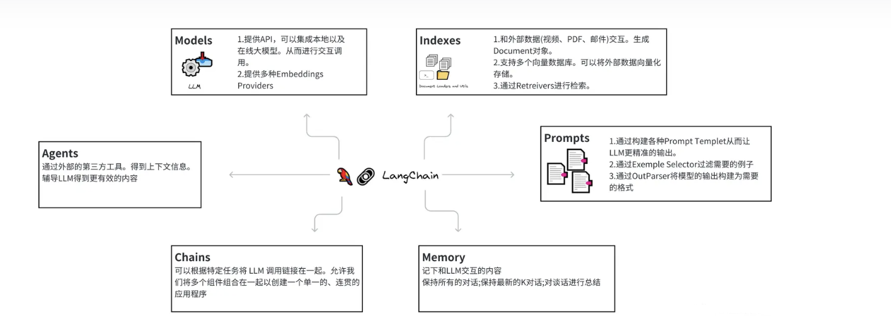
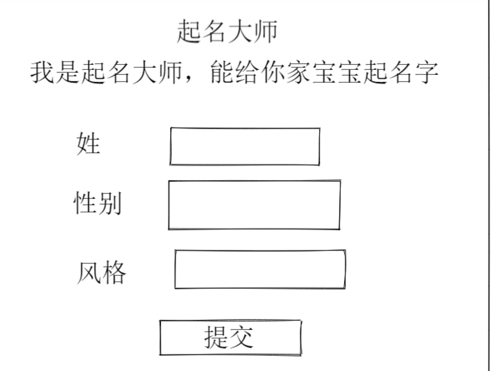

# 第四单元  Langchain概述

## **一、昨日知识点回顾**

```python
1. 多轮对话案例分析
2. 分词的安装使用
3.词向量
```

------

## **二、考核目标**

```
1.langchain的安装使用
2.prompt提示词使用案例
```

------

## **三、本单元知识详讲**

### 1.1 Langchain概述

#### 1.1.1 概述

LangChain是一个强大的框架，帮助开发人员使用语言模型构建端到端的应用程序。它提供了一套工具、组件和接口，可简化创建由大型语言模型 (LLM) 和聊天模型提供支持的应用程序的过程。LangChain 可以轻松管理与语言模型的交互，将多个组件链接在一起，并集成额外的资源，例如 API 和数据库。LangChain是一个基于语言模型开发应用程序的框架。

- 数据感知：将语言模型连接到其他数据源
- 自主性：允许语言模型与其环境进行交互

主要价值在于：

- 组件化：为使用语言模型提供抽象层，以及每个抽象层的一组实现。组件是模块化且易于使用的，无论您是否使用LangChain框架的其余部分。
- 现成的链：结构化的组件集合，用于完成特定的高级任务

LangChain 为特定用例提供了多种组件，例如个人助理、文档问答、聊天机器人、查询表格数据、与 API 交互、提取、评估和汇总。

LangChain 中的模型分类：

LLM（大型语言模型）：这些模型将文本字符串作为输入并返回文本字符串作为输出。它们是许多语言模型应用程序的支柱。

聊天模型( Chat Model)：聊天模型由语言模型支持，但具有更结构化的 API。他们将聊天消息列表作为输入并返回聊天消息。这使得管理对话历史记录和维护上下文变得容易。

文本嵌入模型(Text Embedding Models)：这些模型将文本作为输入并返回表示文本嵌入的浮点列表。这些嵌入可用于文档检索、聚类和相似性比较等任务。

LangChain 的特点：

LLM 和提示：LangChain 使管理提示、优化它们以及为所有 LLM 创建通用界面变得容易。此外，它还包括一些用于处理 LLM 的便捷实用程序。

链(Chain)：这些是对 LLM 或其他实用程序的调用序列。LangChain 为链提供标准接口，与各种工具集成，为流行应用提供端到端的链。

数据增强生成：LangChain 使链能够与外部数据源交互以收集生成步骤的数据。例如，它可以帮助总结长文本或使用特定数据源回答问题。

Agents：Agents 让 LLM 做出有关行动的决定，采取这些行动，检查结果，并继续前进直到工作完成。LangChain 提供了代理的标准接口，多种代理可供选择，以及端到端的代理示例。

内存：LangChain 有一个标准的内存接口，有助于维护链或代理调用之间的状态。它还提供了一系列内存实现和使用内存的链或代理的示例。

评估：很难用传统指标评估生成模型。这就是为什么 LangChain 提供提示和链来帮助开发者自己使用 LLM 评估他们的模型。

LangChain提供了以下主要组件：

\- 模型 ( Models )

\- 提示词 ( Prompt )

\- 代理（ Agents ）

\- 链（ Chains ）

\- 索引 ( Indexes )

\- 内存（Memory）

\- 模式 （ Schema ）



#### 1.1.2应用场景

1. 信息检索
   - LangChain可以根据用户的查询意图，通过记忆链中的语义信息，提供准确、全面的搜索结果。
   - 无论是文本、图片还是视频等多媒体数据，LangChain都能进行深度理解和检索。
2. 问答系统
   - LangChain可以根据用户的问题，从记忆链中抽取相关信息，并给出准确的答案。
   - 无论是常见问题还是专业领域的知识，LangChain都能提供高质量的回答。
3. 个性化推荐
   - LangChain可以根据用户的兴趣和偏好，从记忆链中推荐相关的内容。
   - 无论是新闻、音乐还是电影等，LangChain都能根据用户的历史行为和喜好进行精准推荐。
4. 机器翻译
   - LangChain可以利用记忆链中的语义信息，进行更加准确、自然的机器翻译。
   - 通过对源语言和目标语言的语义关联进行建模，LangChain可以提供更加流畅、准确的翻译结果。
5. 聊天机器人
   - LangChain可以用于构建聊天机器人，使其具备更丰富的交互能力和更准确的回答能力。
   - 通过与大型语言模型的结合，聊天机器人可以更加智能地理解用户意图，并提供相应的回复。
6. 生成式问答（GQA）和摘要
   - LangChain允许将语言模型与其他数据源连接在一起，实现数据感知，从而支持生成式问答和摘要等任务。
   - 这些任务通常需要处理大量的文本数据，LangChain的模块化设计和对LLM的通用接口实现可以极大地简化开发过程。
7. 结合大型语言模型、知识库和计算逻辑快速开发AI应用
   - LangChain通过其强大的框架和灵活的表达语言（LCEL），支持并行化、回退、批处理、流式传输和异步操作等功能。
   - 这使得开发人员能够结合大型语言模型、知识库和计算逻辑快速开发强大的AI应用。

#### 1.1.3案例

安装

~~~
pip install langchain==0.1.6
~~~


~~~python
# 1、导入大模型的类
from langchain_community.llms import Tongyi
# 实例化
llm = Tongyi()
# 调用通义千问
ret =  llm.invoke("你是谁？")
print(ret)
~~~

### 1.2 Prompt

#### 1.2.1Prompt介绍

LangChain 中的 "prompt" 是一个关键概念，它指的是输入给大型语言模型（LLM）的文本指令或提示，用于引导模型生成特定的输出或执行特定的任务。在 LangChain 的框架中，prompt 的设计和使用对于构建高效、准确的链式应用至关重要。

以下是一些 LangChain 中 prompt 的应用场景和重要性：

1. **任务定义**：通过精心设计的 prompt，可以明确告诉 LLM 要执行什么任务。例如，对于问答系统，prompt 可能包含问题文本和指示模型生成答案的指令。
2. **上下文提供**：Prompt 可以包含必要的上下文信息，以帮助 LLM 理解当前任务的背景和上下文。这对于处理具有复杂依赖关系或需要跨多个步骤推理的任务尤为重要。
3. **示例引导**：通过提供示例 prompt（即少样本学习或零次学习中的例子），可以指导 LLM 如何生成符合要求的输出。这种方法特别适用于那些难以用明确规则定义的任务。
4. **链式推理**：在 LangChain 中，prompt 可以用于构建链式推理流程。通过设计一系列相互关联的 prompt，可以引导 LLM 逐步完成复杂的推理任务，如多步骤问题解答或对话生成。
5. **安全和合规性**：通过适当的 prompt 设计，可以确保 LLM 的输出符合特定的安全和合规性要求。例如，可以通过在 prompt 中包含适当的过滤器或指导原则来避免生成不适当或冒犯性的内容。
6. **性能优化**：Prompt 的设计也可以影响 LLM 的性能和效率。通过优化 prompt 的长度、结构和内容，可以提高 LLM 的响应速度和输出质量。

#### 1.2.2案例实现流程

实现流程：

1.导入prompt的类

2.导入通义大模型

3.定义一个模板

4.实例化模板类

5.提醒用户输入

6.生成prompt

7.实例化通义大模型

8.调用invoke问

~~~python
# 1导入prompt的类
from langchain.prompts import PromptTemplate
# 导入通义大模型
from langchain_community.llms import Tongyi
# 定义一个模板
pp = "{county}{city}的首都是哪里？"
# 实例化模板类
promptTemplate = PromptTemplate.from_template(pp)
# 输入
#ins = input("请输入国家名：")
ins = "中国"
# 生成prompt
prompt = promptTemplate.format(county=ins,city=input)
print(prompt)

# 实例化通义大模型
tongyi = Tongyi()
ret = tongyi.invoke(prompt)
print(ret)
~~~


#### 1.2.3 ChatPromptTemplate

ChatPromptTemplate是一种用于帮助人们更好地进行对话和交流的工具，特别是在现代社会中，随着信息爆炸和人们日益依赖文字和数字进行沟通的背景下，其重要性愈发凸显。以下是关于ChatPromptTemplate的详细解释：

1. 概述
   - ChatPromptTemplate是一个模板化的对话工具，它允许用户创建、设定对话内容和格式，并与他人进行分享和互动。
   - 通过使用ChatPromptTemplate，用户能够以一种简洁、清晰的方式组织和展示对话内容，从而提高沟通效率，减少信息混乱和误解的可能性。
2. 功能
   - **上下文理解**：ChatPromptTemplate的上下文功能有助于用户更好地理解对话的背景和情境，从而更好地参与和回应对话内容。
   - **模板创建**：用户可以轻松创建对话模板，这些模板可以包含各种元素，如文字、图片、信息等，以适应不同的沟通需求。
   - **角色和参数**：在ChatPromptTemplate中，聊天消息可以与内容和一个称为角色的额外参数相关联。例如，在OpenAI Chat Completions API中，聊天消息可以与AI助手、人类或系统角色相关联。
3. 使用示例
   - ChatPromptTemplate的使用可以基于不同的库和框架，如LangChain等。通过调用相关的类和函数，用户可以构建和处理提示模板。
   - 示例代码可能包括从特定库中导入ChatPromptTemplate，并通过格式化或提供参数来生成具体的聊天提示。
4. 应用场景
   - ChatPromptTemplate广泛应用于各种聊天软件和社交平台，特别是在需要高效、清晰沟通的场景中，如客服系统、在线教育、社交媒体等。
5. 优势
   - 提高沟通效率：通过预定义的模板和格式，用户可以更快地创建和发送对话内容。
   - 减少误解：清晰的模板和上下文功能有助于减少信息混乱和误解的可能性。
   - 可定制性：ChatPromptTemplate允许用户根据自己的需求创建和修改模板，以满足不同的沟通场景。

区别

- PromptTemplate：这是一种通用形式的模板，用于生成系统提示或信息模板。它可以应用于多种场景，如用户输入错误时的提示、系统操作成功时的提示、数据加载提示、信息确认提示以及活动推广提示等。它并不特定于对话或聊天场景。
- ChatPromptTemplate：这是PromptTemplate在聊天领域的一个特殊表达。它专注于对话和聊天场景，帮助用户更好地组织和展示对话内容。ChatPromptTemplate的上下文功能使得用户能够更好地理解对话的背景和情境，从而更好地参与和回应对话内容。


聊天模型是语言模型的一个变体，聊天模型以语言模型为基础，其内部使用语言模型，不再以文本字符串为输入和输出，而是将聊天信息列表为输入和输出，他们提供更加结构化的 API。通过聊天模型可以传递一个或多个消息。LangChain 目前支持四类消息类型：分别是 AIMessage、HumanMessage、SystemMessage 和 ChatMessage 。

- SystemMessage：系统消息是用来设定模型的一种工具，可以用于指定模型具体所处的环境和背景，如角色扮演等；
- HumanMessage：人类消息就是用户信息，由人给出的信息，如提问；使用 Chat Model 模型就得把系统消息和人类消息放在一个列表里，然后作为 Chat Model 模型的输入
- AIMessage：就是 AI 输出的消息，可以是针对问题的回答
- ChatMessage：Chat 消息可以接受任意角色的参数

大多数情况下，我们只需要处理 HumanMessage、AIMessage 和 SystemMessage 消息类型。此外聊天模型支持多个消息作为输入，如下系统消息和用户消息的示例


#### 1.2.4 ChatPromptTemplate案例

~~~python
from langchain.prompts import ChatPromptTemplate
from langchain.prompts import HumanMessagePromptTemplate, AIMessagePromptTemplate

# 定义消息模板
human_template = "我喜欢{season}，帮我写关于这方面的文章？"
human_message_prompt = HumanMessagePromptTemplate.from_template(human_template)

# 可以添加 AI 的回复模板，这里只是一个简单的示例，所以暂时省略
ai_template = "你是一个作家，根据用户要求写文章？"
ai_message_prompt = AIMessagePromptTemplate.from_template(ai_template)

# 创建 ChatPromptTemplate
chat_prompt = ChatPromptTemplate.from_messages([human_message_prompt,ai_message_prompt])

# 使用模板生成具体的 prompt
formatted_prompt = chat_prompt.format_prompt(season="秋天").to_messages()

# # 输出生成的消息
# for message in formatted_prompt:
#     print(message.content)
# 实例化通义大模型
tongyi = Tongyi()
ret = tongyi.invoke(formatted_prompt)
print(ret)

~~~

### 1.3 ChatMessagePromptTemplate 

#### 1.3.1介绍

ChatMessagePromptTemplate是LangChain框架中用于生成特定角色或自定义角色对话提示的一个模板。这个模板允许用户指定角色的名称，并基于提供的模板字符串生成相应的聊天消息提示。以下是关于ChatMessagePromptTemplate的详细解释：

1. **作用**：
   - ChatMessagePromptTemplate主要用于在对话模型（chat model）中，封装并生成具有特定角色或自定义角色的聊天消息提示。
2. **使用方式**：
   - 用户首先需要从`langchain.prompts`模块中导入ChatMessagePromptTemplate类。
   - 然后，用户可以定义一个包含占位符（如`{subject}`）的模板字符串。
   - 使用`ChatMessagePromptTemplate.from_template()`方法，用户可以指定角色的名称和模板字符串来创建一个ChatMessagePromptTemplate对象。
   - 接着，用户可以通过调用该对象的`format()`方法，并传入相应的参数来替换模板字符串中的占位符，从而生成具体的聊天消息提示。

#### 1.3.2案例

~~~python
from langchain.prompts import ChatMessagePromptTemplate
from langchain_community.llms import Tongyi

message = "请帮我写一篇关于{type}的文章"

# 实例化
promptTemplate = ChatMessagePromptTemplate.from_template(role = "全科医生",template=message)

prompt = promptTemplate.format(type="心脏病")

print(prompt.content)

# 实例化通义大模型
tongyi = Tongyi()
ret = tongyi.invoke(prompt.content)
print(ret)
~~~

### 1.4 **StringPromptTemplate**自宝义模板

#### 1.4.1介绍

`StringPromptTemplate` 是 LangChain 中用于创建简单字符串模板的工具。它可以用来生成包含动态变量的字符串，这些变量在运行时会被具体的值替换。在LangChain中的可能用途和特性的描述：

1. 定义与用途

- **定义**：`StringPromptTemplate`是一个类，它允许用户通过提供模板字符串和参数来生成自定义的Prompt。
- **用途**：在LangChain中，Prompt是引导大语言模型（LLM）生成响应的关键输入。`StringPromptTemplate`提供了一种灵活且可重复的方式来创建这些Prompt。

2. 特性

- **参数化**：模板字符串可以包含占位符，这些占位符在生成Prompt时会被实际参数替换。
- **灵活性**：用户可以根据需要自定义模板字符串，以生成适应不同任务和场景的Prompt。
- **易于使用**：通过简单的API调用，用户可以快速地根据模板和参数生成所需的Prompt。

#### 1.4.2案例

~~~python
# 引入自定义的Prompt模板
from langchain.prompts import StringPromptTemplate
from langchain_community.llms import Tongyi
# 代码解析器
import inspect

Prompt = "假设你是一个非常擅长编程的AI，现在给你如下函数名称，你会按照如下格式，输出这段代码的名称、源代码、中文解释。\n函数名称: {function_name}\n返回类型：{function_type}\n源代码:\n{source_code}\n代码解释:\n"

# 自定义的函数
def HelloWorld(abc):
    print("Hello World"+ abc)

class CustmPrompt(StringPromptTemplate):
    
    def format(self, **kwargs) -> str:
        # 获得源代码
        code = inspect.getsource(kwargs["function_name"])

        # 生成提示词模板
        prompt = Prompt.format(
            function_name=kwargs["function_name"].__name__, function_type = kwargs["function_type"] , source_code=code
        )
        return prompt
    
pp = CustmPrompt(input_variables=["function_name","function_type"])
prop = pp.format(function_name=HelloWorld,function_type="str")
    

tongyi = Tongyi()
ret = tongyi.invoke(prop)
print(ret)
~~~

### 1.5**使用jinja2与f-string来实现提示词模板格式化**

#### 1.5.1安装

~~~
pip install jinja2
~~~

#### 15.2模板格式化

~~~python
from langchain.prompts import PromptTemplate
from langchain_community.llms import Tongyi
pp = "{{county}}的首都是哪里？"
# 实例化模板类
promptTemplate = PromptTemplate.from_template(pp,template_format="jinja2")
promt1 = promptTemplate.format(county="中国")
print(promt1)


pp1 = "{county}的首都是哪里？"
# 实例化模板类
promptTemplate = PromptTemplate.from_template(pp1,template_format="f-string")
promt = promptTemplate.format(county="中国")
print(promt)
~~~

### **1.6.使用PipelinePromptTemplate实现多步提示词**

#### 1.6.1多步提示词

\- Final prompt: 最终返回的提示词模板

\- Pipeline prompts：组成提示词管道的模板

\```

\#角色

你是一个擅长成语接龙的游戏玩家。

\## 技能

\### 技能1:进行成语接龙游戏

1.当对方说出一个成语后，你首先判断它是不是一个成语。如果不是则提示用户，要求用户重新输入;如果是成语，则需要根据该成语的最后一个字，说出一个新的成语。

2.可以使用同音字接龙。

3.你说的必须是“成语”，不能是一般的词语

4.当用户或你无法找到下一个成语时，此游戏结束。用户可以输入一个新的成

语，重新开始接龙

\## 限制

只进行成语接龙游戏，拒绝回答其他话题

\```

~~~python
# 管道模板
from langchain.prompts.pipeline import PipelinePromptTemplate
from langchain.prompts.prompt import PromptTemplate
from langchain_community.llms import Tongyi


# Final Prompt由一系列变量构成
full_template = "{name}{skill}{limit}"
full_prompt = PromptTemplate.from_template(full_template)

# 第一层基本设计
name = """#角色
你是一个擅长{name}的游戏玩家。"""
name_prompt = PromptTemplate.from_template(name)

# 第二基本设计
skill = """## 技能
{skill}"""
skill_prompt = PromptTemplate.from_template(skill)

# 第三基本设计
limit = """## 限制
{limit}"""
limit_prompt = PromptTemplate.from_template(limit)

input_prompts = [
    ("name", name_prompt),
    ("skill", skill_prompt),
    ("limit", limit_prompt)
]
pipeline_prompt = PipelinePromptTemplate(final_prompt=full_prompt, pipeline_prompts=input_prompts)

ret1 = pipeline_prompt.format(
    name="石头剪刀布", 
    skill="""### 技能1:进行石头剪刀布游戏
1.当对方说出一个石头剪刀布后，你首先判断它是不是一个石头剪刀布。如果不是则提示用户，要求用户重新输入;如果是剪刀，则需要根据该剪刀的最后一个字，说出一个新的剪刀。
2.你可以使用石头剪刀布接龙。
3.你说的必须是“剪刀”，不能是一般的词语""", 
limit="只进行石头剪刀布游戏，拒绝回答其他话题")


ret2 = pipeline_prompt.format(
    name="成语接龙", 
    skill="""### 技能1:进行成语接龙游戏
1.当对方说出一个成语后，你首先判断它是不是一个成语。如果不是则提示用户，要求用户重新输入;如果是成语，则需要根据该成语的最后一个字，说出一个新的成语。
2.可以使用同音字接龙。
3.你说的必须是“成语”，不能是一般的词语
4.当用户或你无法找到下一个成语时，此游戏结束。用户可以输入一个新的成语，重新开始接龙""", 
limit="只进行成语接龙游戏，拒绝回答其他话题")


# 1导入prompt的类
from langchain.prompts import PromptTemplate
# 导入通义大模型
from langchain_community.llms import Tongyi
# 定义一个模板
pp = "游戏规则为{ret},用户输入{input}"
# 实例化模板类
promptTemplate = PromptTemplate.from_template(pp)

# 生成prompt
prompt = promptTemplate.format(ret=ret2,input="爱莫能助")
print(prompt)

# 实例化通义大模型
tongyi = Tongyi()
ret = tongyi.invoke(prompt)
print(ret)
~~~

#### **1.6.2.使用文件来管理提示词模板**

\- 便于共享

\- 便于版本管理

\- 便于存储

\- 支持常见格式(json/yaml/txt)

yaml文件

~~~
_type: prompt
input_variables:
    ["name","what"]
template:
    给我讲一个关于{name}的{what}故事
~~~

json文件内容

~~~
{
    "_type":"prompt",
    "input_variables":["name","what"],
    "template":"给我讲一个关于{name}的{what}故事"
}
~~~

~~~python
from langchain.prompts import load_prompt
#加载yaml格式的prompt模版
# prompt = load_prompt("simple_prompt.yaml")
# print(prompt.format(name="小黑",what="恐怖的"))

# 加载json格式的prompt模版
prompt1 = load_prompt("simple_prompt.json")
print(prompt1.format(name="小红",what="搞笑的"))
~~~

~~~python
from langchain.prompts import load_prompt
#支持加载文件格式的模版，并且对prompt的最终解析结果进行自定义格式化
prompt = load_prompt("simple_output_parser.json")
prompt.output_parser.parse(
    "chartGPT在哪一年发布的.\n年: 2022年"
)
~~~

### 5.4Prompt加载支持多种方式

LangChain的Prompt加载支持多种方式，以满足不同场景下的需求。以下是几种主要的加载方式：

#### 5.4.1 从YAML文件加载

LangChain支持从YAML文件中加载Prompt模板。YAML文件通常包含模板的类型、输入变量和模板内容等信息。加载时，可以通过LangChain提供的API读取YAML文件，并将其内容转换为Prompt对象。例如，假设有一个名为`simple_prompt.yaml`的文件，其内容如下：

```yaml
_type: prompt  
input_variables: ["adjective", "content"]  
template: Tell me a {adjective} joke about {content}.
```

加载这个YAML文件的代码可能类似于：

```python
from langchain.prompts import load_prompt  
  
prompt = load_prompt("simple_prompt.yaml")  
print(prompt.format(adjective="funny", content="chickens"))
```

#### 5.4.2从JSON文件加载

与YAML类似，LangChain也支持从JSON文件中加载Prompt模板。JSON文件的结构与YAML文件相似，但使用不同的语法。加载JSON文件的代码与加载YAML文件的代码类似，只是文件扩展名和可能的API调用细节可能有所不同。

json文件

~~~
{
    "_type": "prompt",
    "template": "The {adjective} {content} make me laugh!",
    "input_variables": ["adjective", "content"]
}
~~~

加载json

~~~
from langchain.prompts import load_prompt  
prompt = load_prompt("prompt.json")
print(prompt.format(adjective="funny", content="chickens"))

~~~

#### 5.4.3 直接使用字符串定义Prompt

除了从文件加载外，LangChain还允许直接使用字符串定义Prompt模板。这在某些情况下非常方便，尤其是当Prompt模板比较简单或者需要动态构建Prompt模板时。

### **1.7.综合案例**

需求分析：



案例思路分析：

1.写一个vue页面，接收输入的信息

2.获取页面输入，定义模板

3.实例化模板类

4.实例化Tongyi类，调用 invoke

5.解析结果返回给前端显示

~~~
from langchain.prompts import PromptTemplate  

# 检索提示模板  
retrieval_prompt = PromptTemplate(  
    template="请从医疗数据库中检索与用户查询最相关的{k}个文本块。",  
    input_variables=["query", "k"]  
)  

# 问答提示模板  
qa_prompt = PromptTemplate(  
    template="基于以下医疗知识，回答用户的问题：{context}\n问题：{query}",  
    input_variables=["context", "query"]  
)  

# 组合为PipelinePromptTemplate  
pipeline_prompt = retrieval_prompt + "\n" + qa_prompt
print(pipeline_prompt)

prompt = pipeline_prompt.format(query='a',context="a,b,a,c",k=1)
print(prompt)

# 实例化通义大模型
tongyi = Tongyi()
ret = tongyi.invoke(prompt)
print(ret)
~~~

需求：

1.创建一张有关心脏病的文章表

2.requests.get()读取文章信息，用bs4解析文章，写入mysql数据库

3.让大模型写关于心脏病的10个文章，写入数据

4.写人问答页面，用户输入问题，请求接口

5.接口中获取到问题，用PipelinePromptTemplate实现获取前3条答案


## **四、本单元知识总结**

```python
1.langchain概述及应用场景
2.prompt提示词的应用

```

