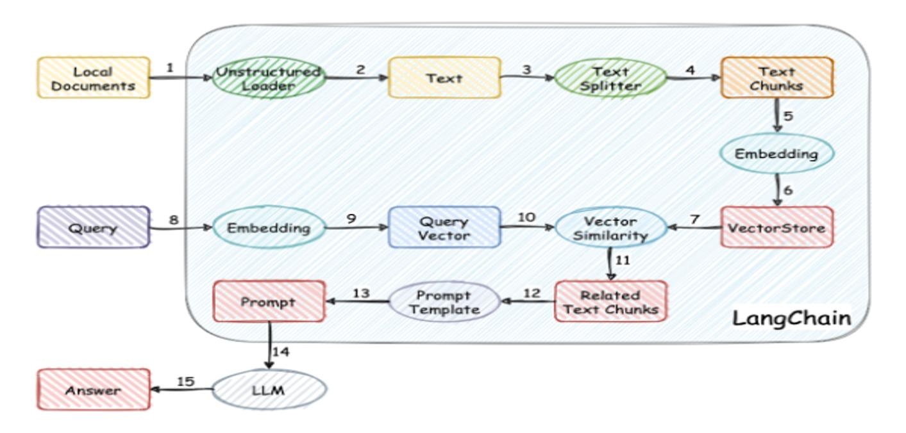

# 第六单元  RAG增强

## **一、昨日知识点回顾**

```python
1.示例选择器的类型
2.prompts和示例选择器综合案例应用
3.输出解析器的各种类型及应用
```

------

## **二、考核目标**

```
1.RGA增强检索的几种方式
2.流式调用案例实现
3.文档分割的方式
4.向量化处理
5.向量数据库的使用
```

------

## **三、本单元知识详讲**

### 5.2流式调用

#### 5.2.1流式调用概念

大模型的流式输出方法主要涉及到在模型生成答案的过程中，以流的形式将结果逐步输出给用户，而不是等待整个答案生成完成后再一次性输出。这种流式输出的方法有助于提高用户体验，尤其是在处理大规模数据和生成长文本时

#### 5.2.2案例实现

~~~python
from langchain_community.llms import Tongyi  

# 初始化 Tongyi 模型  
tongyi = Tongyi()    
  
inputmes = "请写一首关于春天的诗"  
  
stream = tongyi.stream(inputmes)  # 注意，我假设 prompt 是正确的参数名，而不是 promt  
  
for chunk in stream:  
    print(chunk)  # 假设 chunk 对象有一个 text 属性，这取决于 Tongyi 的返回类型


~~~

#### 5.2.4 综合案例

vue代码

~~~
<template>
  <div id="app">
    <h1>Server-Sent Events Example</h1>
    <ul>
      <li v-for="(message, index) in messages" :key="index">{{ message }}</li>
    </ul>
  </div>
</template>

<script>
export default {
  data() {
    return {
      messages: []
    };
  },
  mounted() {
    this.connectToSSE();
  },
  methods: {
    connectToSSE() {
      const eventSource = new EventSource('http://localhost:8000/sse/?ask=小米是谁');

      eventSource.onmessage = (event) => {
        this.messages.push(event.data);
       
      };

      eventSource.onerror = (error) => {
        console.error('EventSource failed:', error);
        eventSource.close();
      };
    }
  }
};
</script>

<style>
#app {
  font-family: Avenir, Helvetica, Arial, sans-serif;
  text-align: center;
  color: #2c3e50;
  margin-top: 60px;
}
</style>
~~~

django代码

~~~python
def generate_sse_lc(chunks):
    print("####")
    for chunk in chunks:
        data = f"data: {chunk}\n\n"
        if chunk:
            yield data.encode('utf-8')
        else:
            print('____________')
            return 'no mes'
        
            
from django.http import StreamingHttpResponse
from django.views.decorators.http import require_GET           

@require_GET
def sse_notifications(request):
        query_text = request.GET.get('ask')  # 调用函数获取用户输入 
    
        # 实例化模板类
        pp = "帮我返回{res}中答案"
       
        promptTemplate = PromptTemplate.from_template(pp)
        prompt = promptTemplate.format(res=query_text)
         
            
        llm=Tongyi()
   
        chuns = llm.stream(prompt)
                   
        response = StreamingHttpResponse(
            generate_sse_lc(chuns),
            content_type="text/event-stream",
        )
        response["Cache-Control"] = "no-cache"
        return response

~~~


### 5.3token跟踪

#### 5.3.1 概述

在LLM（大型语言模型）中，Token追踪的概念并不直接等同于传统的资产追踪或位置追踪。但在LLM的语境下，Token是模型进行语言处理的基本信息单元，它代表了模型可以理解和生成的最小意义单位。关于LLM的Token追踪，我们可以从以下几个方面进行理解：

1. Token的定义
   - Token是大语言模型（LLM）进行语言处理的最小单元，它可以是一个字、一个词，甚至是一个短语或句子的一部分。
   - Token在不同的上下文中可能会有不同的划分粒度，这取决于所使用的特定标记化（Tokenization）方案。
2. Token的追踪意义
   - 在LLM中，Token的追踪并不是指追踪某个具体的Token的物理位置或来源，而是指模型如何处理、理解和生成这些Token。
   - 当用户与LLM进行交互时，输入的文本会被转换为一系列的Token，这些Token随后被模型用于生成预测或回答。
3. Token的数量与关系
   - 一个Token的大致长度可以用字符或单词来估算。例如，在英语中，一个Token大约等于4个字符，而在中文中，一个Token可能对应于¾个单词（这是一个粗略的估算）。
   - 模型的性能通常与其能够处理的Token数量有关。一些模型具有MAX TOKENS的参数，这限制了模型在一次会话中能够基于整个上下文记忆的Token数量。
4. Token与向量
   - Token在LLM中通常与向量相关联，这些向量代表了Token的特征或语义信息。
   - 相同的Token在不同的上下文中可能会有不同的特征向量，这取决于其在整个文本中的角色和含义。
5. Token在LLM中的作用
   - Token作为原始文本数据和LLM可以使用的数字表示之间的桥梁，确保了文本的连贯性和一致性。
   - LLM使用Token来理解和生成文本，有效地处理各种任务，如写作、翻译和回答查询。

综上所述，LLM的Token追踪更多地是指模型如何处理、理解和生成这些基本的语言单元，而不是物理上追踪某个Token的位置或来源。

#### 

### 5.1 RAG增强检索

#### 5.1.1 RAG增强检索概念

RAG（Retrieval-Augmented Generation，检索增强生成）是一种结合了信息检索和自然语言生成的方法，旨在提高自然语言处理任务中的信息检索和生成能力。以下是关于RAG增强检索概念的详细解释：

1. RAG的核心原理

- **信息检索**：从大量的文本数据中检索与查询相关的信息。
- **自然语言生成**：根据检索到的信息生成符合用户需求的自然语言文本。

2. RAG的作用

- **提高信息检索的准确性和效率**：通过结合检索和生成的方法，RAG可以更准确地理解用户的查询，从而更精确地检索相关信息。
- **生成更贴近用户需求的自然语言文本**：利用检索到的信息作为上下文，RAG可以生成更符合用户意图和需求的自然语言文本。
- **提供更全面的文本处理能力**：结合检索和生成的优势，RAG能够处理更复杂的自然语言处理任务。

3. RAG的三个阶段

1. 提取阶段
   - 对输入查询进行理解和解析。
   - 使用索引和检索算法从文本数据中提取相关内容。
   - 目的是准确地捕获与查询相关的信息片段。
2. 检索阶段
   - 使用提取阶段得到的信息进一步检索相关的文本片段或信息。
   - 可能涉及不同的检索策略和参数，以确保检索到的信息与用户查询相关且准确。
3. 生成阶段
   - 利用检索到的信息，结合自然语言生成模型（如大型语言模型），生成符合用户需求的自然语言文本。
   - 生成的文本结果会利用检索到的信息作为上下文。

4. RAG的优势

- **避免针对特定任务再次进行训练**：通过集成外部知识库，RAG可以处理不同的自然语言处理任务，而无需为每个任务重新训练模型。
- **优化模型输出效果**：用户可以额外附加外部知识库，丰富输入，从而优化模型的输出效果。
- **减少模型幻觉**：通过结合外部知识库，RAG能够生成更准确、更符合上下文的答案，减少模型生成的错误或不正确内容。

5. 应用场景

RAG技术在知识密集型NLP任务中表现出色，如问答系统、文本摘要、对话系统等。在这些任务中，RAG能够提供更准确、更全面的文本处理能力，满足用户的不同需求。

RAG的流程如下：

\- 1文档加载

\- 2文档分割

\- 3文档向量化

-4构建知识库

\- 5基于知识库的问答



#### 5.1.2 文档加载的几种方式

\- 加载markdown

~~~python
#使用loader来加载markdown文本
from langchain_community.document_loaders import TextLoader

loader = TextLoader("loader.md")
print(loader.load())
~~~

\- 加载cvs

~~~python
#使用loader来加载cvs文件
from langchain_community.document_loaders.csv_loader import CSVLoader

loader = CSVLoader(file_path="loader.csv",source_column="Location")
data = loader.load()
print(data)
~~~

\- 加载html

安装lxml

~~~
pip3 install lxml
~~~

~~~python
#使用loader来加载cvs文件
from langchain_community.document_loaders import BSHTMLLoader

loader = BSHTMLLoader("loader.html")
data = loader.load()
print(data)
~~~

\- 加载JSON

安装jq

~~~
pip install jq
~~~

~~~python

#使用loader来加载json文件
from langchain_community.document_loaders import JSONLoader

loader = JSONLoader(
    file_path = "simple_prompt.json",jq_schema=".template",text_content=True
)
data = loader.load()
print(data)
~~~

\- 加载PDF

~~~
pip install pypdf
~~~

~~~python
#使用loader来加载pdf文件
from langchain_community.document_loaders import PyPDFLoader
loader = PyPDFLoader("loader.pdf")
pages = loader.load_and_split()
print(pages[0])
~~~

-加载doc/docx/wps

~~~python
pip3 install unstructured 
pip3 install python-doc 
pip3 install python-docx
pip3 install docx2txt
~~~

~~~python
from langchain_community.document_loaders import Docx2txtLoader

loader = Docx2txtLoader("doc/demo.docx")
data = loader.load()
print(data)
~~~

~~~

from langchain_community.document_loaders import UnstructuredExcelLoader

loader = UnstructuredExcelLoader("doc/demo.xlsx",mode="elements")
docs = loader.load()
print(docs)
~~~


### 5.4文档分割

* 原理

\1. 将文档分成小的、有意义的块(句子).

\2. 将小的块组合成为一个更大的块，直到达到一定的大小.

\3. 一旦达到一定的大小，接着开始创建与下一个块重叠的部分.

分类

\- 按字符切割

\- 代码文档切割

\- 按token来切割

#### 5.4.1字符串分割

使用langchain的text_splitter模块，导入CharacterTextSplitter类

\- separator 分隔符

\- chunk_size 每块的最大长度

\- chunk_overlap 重复字符的长度

关于 `chunk_overlap` 参数，它指的是在分割文本时，相邻的两个文本块之间将有多少字符是重叠的。这个参数在某些情况下非常有用，比如当你想要确保某些关键信息（如句子的一部分）不会恰好被分割在两个不同的块中时。通过设置重叠，你可以增加相邻块之间的上下文联系，这有助于后续处理（如文本摘要、情感分析等）时保持更好的连贯性。

~~~
from langchain_community.document_loaders import TextLoader

# 实例化TextLoader对象
loader = TextLoader("doc/NBA新闻.txt",encoding="utf-8")
# 加载文档
docs = loader.load()
print(docs)

# 导入分割类
from langchain.text_splitter import CharacterTextSplitter

# 实例化
text_splitter = CharacterTextSplitter(separator="\n",chunk_size=150, chunk_overlap=0)

text_splitter.split_documents(docs)
~~~

#### 5.4.2 按token来切割文档

pip install tiktoken

? tiktoken怎么计算分块的长度

~~~
from langchain.text_splitter import CharacterTextSplitter


#初始化切分器
text_splitter = CharacterTextSplitter.from_tiktoken_encoder(
    chunk_size=100, #切分的文本块大小，一般通过长度函数计算
    chunk_overlap=0, #切分的文本块重叠大小，一般通过长度函数计算
)


loader = TextLoader("doc/NBA新闻.txt",encoding="utf-8")

# 加载文档
loader.load_and_split(text_splitter=text_splitter)
~~~

#### 5.4.3 代码文档切割

~~~python
from langchain.text_splitter import (
    RecursiveCharacterTextSplitter,
    Language,
)

#支持解析的编程语言
#[e.value for e in Language]

#要切割的代码文档
PYTHON_CODE = """
def hello_world():
    print("Hello, World!")
    
#调用函数
hello_world()
"""
py_spliter = RecursiveCharacterTextSplitter.from_language(
    language=Language.PYTHON,
    chunk_size=170,
    chunk_overlap=0,
)
py_spliter.create_documents([PYTHON_CODE])
~~~

### 5.5文档向量化

#### 5.5.1向量模型

DashScopeEmbeddings

DashScopeEmbeddings 是一种服务，主要用于生成和处理文本嵌入向量。以下是关于 DashScopeEmbeddings 的详细介绍：

1. 服务概述
   - DashScopeEmbeddings 是一种基于阿里云百炼大模型服务平台的文本嵌入服务。
   - 它通过标准的API提供多种模型服务，支持文本Embedding的模型，其中文名为通用文本向量，英文名为text-embedding-v1。
   - 该服务允许用户方便地通过DashScope API调用来获得输入文本的embedding向量。
2. 前提条件
   - 需要开通阿里云百炼大模型服务产品。
   - 需要创建API_KEY以获取API-KEY。
3. 安装环境
   - 需要安装Python，版本要求在3.8到3.12之间。
   - 需要通过pip安装相关的库，如`pip install llama-index-core` 和 `pip install llama-index-embeddings-dashscope`。
4. 使用示例
   - 示例代码展示了如何在Llama-Index中调用DashScopeEmbedding服务。
   - 需要使用API-KEY替换示例中的占位符`YOUR_DASHSCOPE_API_KEY`，以便代码能够正常运行。
   - 代码会创建一个`DashScopeEmbedding`对象，并调用其`get_text_embedding_batch`方法来获取一批文本的embedding向量。
5. 应用场景
   - DashScopeEmbeddings 可用于各种需要文本向量表示的场景，如语义搜索、文本分类、信息检索等。
   - 通过在向量空间中表示文本，可以进行高效的语义相似度计算，从而找到在语义上最相似的文本片段。
6. 注意事项
   - 在使用DashScopeEmbeddings服务时，需要确保遵循相关的服务条款和使用限制。
   - 对于大规模的文本处理任务，可能需要考虑性能优化和资源管理。

总结来说，DashScopeEmbeddings 是一种功能强大的文本嵌入服务，通过它可以轻松地生成和处理文本的embedding向量，为各种自然语言处理任务提供有力的支持。


pip install dashscope

两个方法：(通过父类查看)

\- `embed_documents`: 输入一个文档列表，返回一个二维数组，每个元素是一个文档的向量。

\- `embed_query`: 输入一个查询，返回一个向量。

~~~python
from langchain_community.embeddings.dashscope import DashScopeEmbeddings

embeddings = DashScopeEmbeddings()

embeddings.embed_documents(["你好"])


ret = embeddings.embed_query("你是谁？")
print(ret)
~~~

### 5.6向量数据库

#### 5.6.1 Chroma

Chroma向量数据库（也称为ChromaDB）是一个开源的向量数据库，主要用于AI和机器学习场景。以下是关于Chroma的详细介绍：

1. 主要功能
   - ChromaDB主要用于存储和查询向量数据，这些数据通常是通过嵌入（embedding）算法从文本、图像等数据转换而来的。
   - 它的设计目标是简化大模型应用的构建过程，允许开发者轻松地将知识、事实和技能等文档整合进大型语言模型（LLM）中。
2. 特点
   - **轻量级**：ChromaDB是一个基于向量检索库实现的轻量级向量数据库。
   - **易用性**：提供简单的API，易于集成和使用。
   - **功能丰富**：支持存储嵌入及其元数据、嵌入文档和查询、搜索嵌入等功能。
   - **集成**：可以直接插入LangChain、LlamaIndex、OpenAI等。
   - **多语言支持**：包括Python和JavaScript客户端SDK。
   - **开源**：采用Apache 2.0开源许可。
3. 性能
   - Chroma使用高效的索引结构，如倒排索引、KD-树或基于图的索引，以加快向量搜索速度。
   - 它支持多种向量相似度度量标准，包括欧氏距离、余弦相似度等，使其可以广泛应用于各种场景。
4. 使用方式
   - Chroma提供了多种使用方式，包括内存模式、client模式和Server模式，以及支持数据持久化的功能。
   - 开发者可以通过简单的API调用，创建数据集、写入数据、查询数据等。
5. 限制
   - 目前只支持CPU计算，不支持GPU加速。
   - 功能相对简单，但计划未来推出托管产品，提供无服务器存储和检索功能，支持向上和向下扩展。

总的来说，Chroma向量数据库为研究人员和开发者提供了一个有用的工具，使他们能够利用词向量来处理自然语言数据并改善各种NLP任务的性能。同时，其轻量级、易用性和功能丰富的特点也使得它成为许多项目的首选。

安装

~~~
pip3 install chroma==0.5.0
~~~

~~~python
# 引入向量化的类
from langchain_community.vectorstores import Chroma
from langchain.embeddings.dashscope import DashScopeEmbeddings
from langchain.text_splitter import CharacterTextSplitter
from langchain_community.document_loaders import TextLoader

doc = TextLoader("./doc/NBA新闻.txt",encoding='utf-8').load()

spliter = CharacterTextSplitter("\n",chunk_size=1000, chunk_overlap=0)

chunks = spliter.split_documents(doc)

# 实例化
embeddings = DashScopeEmbeddings()

# 创建向量数据库,向量化文档
db = Chroma.from_documents(chunks,embeddings, persist_directory="./chroma")
db.persist()
# 添加文档
doc = TextLoader("./doc/NBA新闻.txt",encoding='utf-8').load()
spliter = CharacterTextSplitter("\n",chunk_size=200, chunk_overlap=0)
chunks = spliter.split_documents(doc)
# 添加文档的方法
db.add_documents(chunks)
db.__len__()
# 对数据进行加载
db1 = Chroma(persist_directory="./chroma/zhisk1", embedding_function=embeddings)
db1.__len__()
# 召回相似的数据块
rets = db.similarity_search("2024冠军球队是谁",k=2)
# 直接拼接prompt
prompt = ""
for ret in rets:
    prompt+=ret.page_content +  "\n"

prompt += "请根据上面内容回答："+"2024冠军球队是谁"

print(prompt)

from langchain_community.llms import Tongyi

llm = Tongyi()

llm.invoke(prompt)

from langchain_community.llms import Tongyi
# 检索问答
from langchain.chains import RetrievalQA

llm = Tongyi()

# 实例化
qa = RetrievalQA.from_chain_type(llm=llm, chain_type="stuff", retriever=db.as_retriever())
print(qa.invoke("2024年NBA冠军是谁"))
~~~

#### 5.6.2 Faiss

Faiss向量数据库，实际上是Facebook AI Research团队开源的一个高性能的向量相似性搜索库，主要用于处理大规模向量数据集并快速搜索最相似的向量。以下是关于Faiss的详细概述：

1. 基本信息

- **开发单位**：Facebook AI Research
- **主要功能**：在大规模向量数据集中进行快速相似性搜索
- **应用领域**：广泛应用于图像搜索、文本搜索、推荐系统等

2. 主要特性

- **高性能**：Faiss通过优化索引结构和并行计算能力，在大规模数据上实现快速搜索。
- **多平台支持**：支持CPU和GPU两种模式，GPU模式可利用CUDA进行加速。
- **多种索引类型**：支持Flat、IVF、PQ等多种索引类型，以适应不同场景下的需求。
- **灵活性**：可以根据数据集大小和维度选择合适的算法，以及实现代价最高的计算步骤在GPU上解决线性计算问题。

3. 工作原理

- **核心思想**：将向量空间嵌入到更紧致、更容易处理的空间，同时保持原有向量间的相对位置关系。
- **过程**：一般涉及两个步骤：量化和编码。量化是通过聚类或其他技术将向量量化为索引中的桶，编码则是将量化后的向量进行编码以节省存储空间。

4. 索引类型

- **暴力搜索索引（精确）**：在CPU或GPU上使用基于余弦相似度或欧式距离的全量计算，寻找最相近的向量。
- **逼近索引（近似）**：借助聚类或其他技术做相似度近似计算，结果通常不精确但计算上更高效。

5. 安装和使用

- **安装**：可以通过pip或conda进行安装，支持CPU和GPU两种模式。
- **使用**：包括创建索引、添加向量到索引、进行相似性搜索等基本操作。Faiss还支持其他高级功能，如聚类、PQ索引等。

6. 性能分析

- Faiss在相似性搜索方面表现出色，主要得益于其优化的索引结构和并行计算能力。

7. 应用场景

- Faiss广泛应用于推荐系统、信息检索、语义搜索、计算机视觉等现实任务中。

综上所述，Faiss向量数据库是一个功能强大、性能卓越的向量相似性搜索库，适用于处理大规模向量数据集并进行快速相似性搜索。


pip3 install faiss-cpu

~~~python
# 导入所需的模块和类
from langchain.embeddings import CacheBackedEmbeddings
from langchain.storage import LocalFileStore
from langchain_community.document_loaders import TextLoader
from langchain_community.vectorstores import FAISS
from langchain.embeddings.dashscope import DashScopeEmbeddings

from langchain_text_splitters import CharacterTextSplitter
 
# 实例化向量嵌入器
embeddings = DashScopeEmbeddings()
 
# 初始化缓存存储器
store = LocalFileStore("./cache/")
 
# 创建缓存支持的嵌入器
cached_embedder = CacheBackedEmbeddings.from_bytes_store( embeddings, store, namespace=embeddings.model)
 
# 加载文档并将其拆分成片段
doc = TextLoader("./doc/NBA新闻.txt",encoding='utf-8').load()
spliter = CharacterTextSplitter("\n",chunk_size=200, chunk_overlap=0)
chunks = spliter.split_documents(doc)
 # 创建向量存储
db = FAISS.from_documents(chunks, cached_embedder)
res = db.similarity_search("NBA冠军球队是哪个", k=3)
print(res)
~~~

faiss封装

~~~python
# 导入所需的模块和类
from langchain.embeddings import CacheBackedEmbeddings
from langchain.storage import LocalFileStore
from langchain_community.document_loaders import TextLoader
from langchain_community.vectorstores import FAISS
from langchain.embeddings.dashscope import DashScopeEmbeddings

from langchain_text_splitters import CharacterTextSplitter
from langchain_community.embeddings.dashscope import DashScopeEmbeddings


class DB:
    def __init__(self):
        # 实例化向量嵌入器
        self.embeddings = DashScopeEmbeddings()
        
        # 初始化缓存存储器
        self.store = LocalFileStore("./cache/")
        
        # 创建缓存支持的嵌入器
        self.cached_embedder = CacheBackedEmbeddings.from_bytes_store( self.embeddings, self.store, namespace=self.embeddings.model)
        
        print(self.cached_embedder)
       
    def add(self,chunks,key):
            # 创建向量存储
            db = FAISS.from_documents(chunks, self.cached_embedder)
            #以索引的方式保存
            db.save_local(key)
    def search(self,ask,key,count):
        db = FAISS.load_local(key,self.cached_embedder,allow_dangerous_deserialization=True)
        res = db.similarity_search(ask, k=count)
        return res
    
db = DB()
~~~


#### 5.6.3 Milvus

Milvus是一个开源的向量数据库，由Zilliz公司发起并维护。它专为处理非结构化数据而设计，能够存储、检索和分析大量的向量数据。以下是关于Milvus的详细介绍：

一、基本概述

- **名称由来**：Milvus的名字来源于拉丁语，意为“一万”，象征着其处理大规模数据集的能力。
- **创建时间**：Milvus创建于2019年，其唯一目标是存储、索引和管理由深度神经网络和其他机器学习(ML)模型生成的大规模嵌入向量。
- **数据处理能力**：作为一个专门设计用于处理输入向量查询的数据库，Milvus能够处理万亿级别的向量索引。

二、核心特性

1. **高性能**：Milvus提供了高效的向量搜索能力，支持毫秒级的最近邻搜索，即使在亿级向量规模下也能保持高性能。
2. **高可用、高可靠**：Milvus支持在云上扩展，其容灾能力能够保证服务高可用。同时，它采用共享存储架构，存储计算完全分离，计算节点支持横向扩展。
3. **灵活性与兼容性**：Milvus与多种机器学习框架兼容，如TensorFlow、PyTorch和PaddlePaddle，可以轻松集成到现有的机器学习工作流程中。此外，它还提供了简单易用的API，支持多种编程语言，如Python、Java和Go。
4. **多索引类型**：Milvus支持多种索引类型，如FLAT、IVF、HNSW等，以适应不同的搜索性能和存储效率需求。
5. **混合查询**：Milvus支持在向量相似度检索过程中进行标量字段过滤，实现混合查询，进一步提高了召回率和搜索的灵活性。

三、系统架构

Milvus的系统架构分为四个层次：

- **接入层(Access Layer)**：由一组无状态proxy组成，对外提供用户连接的endpoint，负责验证客户端请求并合并返回结果。
- **协调服务(Coordinator Service)**：充当系统的大脑，负责分配任务给执行节点。协调服务共有四种角色，分别为root coord、data coord、query coord和index coord。
- **执行节点(Worker Node)**：负责完成协调服务下发的指令和proxy发起的数据操作语言(DML)命令。执行节点分为三种角色，分别为data node、query node和index node。
- **存储层(Storage)**：负责Milvus数据的持久化，分为元数据存储(meta store)、消息存储(log broker)和对象存储(object storage)三个部分。

四、应用场景

Milvus适用于需要处理大规模向量数据的场景，特别是在以下领域有广泛应用：

- **机器学习**：在机器学习模型训练后，Milvus可以用来存储和搜索模型生成的向量。
- **计算机视觉**：用于图像和视频分析中的向量搜索，如图像匹配、相似图像搜索等。
- **语音识别**：在语音识别系统中，Milvus可以用来检索与查询语音最相似的向量。
- **推荐系统**：在推荐系统中，Milvus可以用来找到用户可能感兴趣的商品或内容。
- **自然语言处理**：Milvus可以用来检索与查询文本最相关的文档或句子。

此外，Milvus还可以应用于音频相似性搜索、分子相似性搜索等多个领域，为这些领域的数据处理和分析提供强大的支持。

综上所述，Milvus作为一款开源的向量数据库，以其高性能、高可用、高可靠和灵活性等特性，在机器学习、计算机视觉、语音识别等多个领域有着广泛的应用前景。

安装使用

docker安装

CentOS 7 安装 Docker 的步骤如下：

1. 卸载旧版本的 Docker（如果有）:

```
sudo yum remove docker \                  docker-client \                  docker-client-latest \                  docker-common \                  docker-latest \                  docker-latest-logrotate \                  docker-logrotate \                  docker-engine
```

1. 安装 Docker 依赖的软件包:

```
sudo yum install -y yum-utils
```

1. 设置 Docker 仓库:

```
sudo yum-config-manager \    --add-repo \    https://download.docker.com/linux/centos/docker-ce.repo
```

1. 安装 Docker Engine-Community:

```
sudo yum install docker-ce docker-ce-cli containerd.io
```

1. 更新镜像

   ~~~
   sudo mkdir -p /etc/docker
   sudo tee /etc/docker/daemon.json <<-'EOF'
   {
     "registry-mirrors": ["https://gt8iqili.mirror.aliyuncs.com"]
   }
   EOF
   sudo systemctl daemon-reload
   sudo systemctl restart docker
   ~~~

   

2. 启动 Docker 服务:

```
sudo systemctl start docker
```

1. 验证 Docker 是否正确安装:

```
sudo docker run hello-world
```

这些命令应以 root 用户或使用 sudo 执行。每一步都需要网络连接以从 Docker 仓库下载所需的包。

docker pull milvusdb/milvus:latest

docker run -d --name milvus_server -p 19530:19530 -p 9091:9091 milvusdb/milvus:latest

docker ps查看正在运行的镜像

测试

pip3 install pymilvus

~~~python
from pymilvus import Collection, connections, DataType  
  
# 连接到Milvus服务器  
connections.connect("default", host="124.71.227.70", port="19530")  
  
# 创建集合  
field_schemas = [  
    {"name": "id", "dtype": DataType.INT64, "is_primary": True, "auto_id": True},  
    {"name": "embedding", "dtype": DataType.FLOAT_VECTOR, "dim": 128}  
]  
collection_schema = CollectionSchema(fields=field_schemas, description="test collection")  
collection = Collection("test_collection", schema=collection_schema)  
  
# 插入向量  
vectors = [[random.random() for _ in range(128)] for _ in range(10)]  
collection.insert(vectors)  
  
# 执行搜索  
query_vector = [random.random() for _ in range(128)]  
search_params = {"metric_type": "L2", "params": {"nprobe": 10}}  
results = collection.search(query_vector, anns_field="embedding", params=search_params, limit=5)  
  
# 打印搜索结果  
print(results)
~~~


## **四、本单元知识总结**

```python
1.RGA增强检索的几种方式
2.流式调用案例实现
3.文档分割的方式
4.向量化处理
5.向量数据库的使用

```

