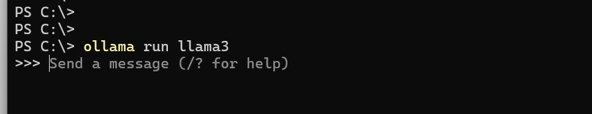
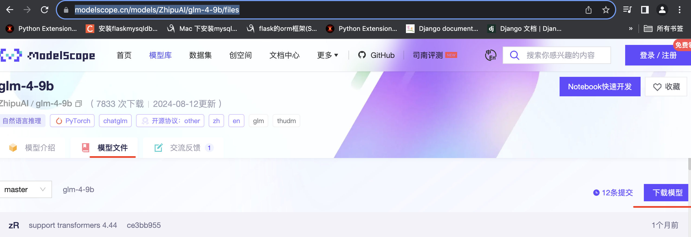

# 第十四单元  模型部署

## **一、昨日知识点回顾**

```python
1. 昨日知识点1
2. 昨日知识点2
```

------

## **二、考核目标**

```
1.当日考核目标1
2.当日考核目标2
```

------

## **三、本单元知识详讲**

### 1.HuggingFace介绍

~~~
# 模型社区

## HuggingFace

官网：https://huggingface.co/

HuggingFace 是一个自然语言处理（NLP）领域的开源社区和平台，它提供了一系列强大的工具、库和预训练模型，帮助开发者快速构建和部署自然语言处理应用。HuggingFace 平台的主要组成部分和特点如下：

1. **Transformers 库**：HuggingFace 的 Transformers 库是其最著名和核心的部分。它提供了广泛的预训练模型（如BERT、GPT、RoBERTa等）的实现，并提供易于使用的API，用于进行文本分类、命名实体识别、文本生成等各种 NLP 任务。Transformers 库支持多种主流深度学习框架，如PyTorch和TensorFlow。
2. **模型架构和优化方法**：HuggingFace 提供了各种用于构建和优化 NLP 模型的架构和方法，包括用于序列分类、序列标注、文本生成等任务的模型架构和损失函数，以及用于模型训练和优化的技术，如学习率调度、权重衰减等。
3. **数据集和指标**：HuggingFace 提供了大量的 NLP 数据集，用于训练和评估模型。这些数据集涵盖了各种不同的任务和语言，包括文本分类、命名实体识别、情感分析等。此外，HuggingFace 还提供了常用的评估指标和评估方法，帮助用户对模型性能进行评估和比较。
4. **模型训练和部署工具**：HuggingFace 提供了用于模型训练和部署的工具和库，使用户能够轻松地进行模型训练、微调和部署。例如，通过使用 HuggingFace 的 Trainer 类，用户可以更便捷地配置和执行模型的训练过程。
5. **模型分享和社区**：HuggingFace 平台鼓励用户分享和交流模型、代码和经验。用户可以在 HuggingFace 的模型仓库中发布和共享自己的模型，并从社区中获取模型、代码和应用案例。
~~~

### 2.魔搭社区ModelScope

~~~
## ModelScope

官网：https://www.modelscope.cn

魔搭社区ModelScope是一个由阿里达摩院推出的开源模型服务平台，其主要功能和目的如下：

1. 模型共享与探索： ModelScope汇集了各领域最先进的机器学习模型，包括但不限于自然语言处理、计算机视觉、语音识别等。用户可以在平台上发现和探索这些模型，了解其特性和性能。
2. 一站式服务： 提供从模型探索、推理、训练到部署和应用的一站式服务。用户不仅可以体验预训练模型的性能，还可以根据自己的需求对模型进行定制和训练，并方便地将训练好的模型部署到实际应用中。
3. 易用性和灵活性： ModelScope旨在为泛AI开发者提供灵活、易用、低成本的模型服务产品。用户无需额外部署复杂的环境，就可以在平台上直接使用各种模型，降低了使用和开发AI模型的门槛。
4. 开源与合作： 作为一款开源平台，ModelScope鼓励社区成员参与模型的开发、改进和分享。通过共同合作，推动AI技术的发展和创新。
5. 智能体开发框架： ModelScope还推出了ModelScope-Agent开发框架，如MSAgent-Qwen-7B，允许用户打造属于自己的智能体。这个框架提供了丰富的环境配置选项，支持单卡运行，并有一定的显存要求。
~~~

### 3.使用ollama3部署本地大模型

Ollama 是一个开源项目，它允许用户在本地机器上运行大型语言模型。这个项目简化了在个人电脑或服务器上部署和运行像LLaMA这样的大型语言模型的过程。如果你想要使用 Ollama 部署本地的大模型

\- 由于学生电脑系统不统一，有的是windows，有的是mac,还有的是Ubautu

\- 这几个系统中，Ubautu遇到的问题比较少，windows可能遇到的问题最多


下载对应系统的版本

\- https://ollama.com/download

Windows

\- 下载完毕后，双击执行安装

\- 安装完成后在cmd中执行以下命令，安装具体某个大模型

\- 如果本地不存在模型，则会先行下载

linux

linux安装

~~~
curl -fsSL https://ollama.com/install.sh | sh
ollama run llama3
~~~

llama3支持的大模型

 https://github.com/ollama/ollama



~~~
ollama list
~~~


NAME                    ID              SIZE    MODIFIED

llama2-chinese:13b      990f930d55c5    7.4 GB  6 weeks ago

gemma:latest            a72c7f4d0a15    5.0 GB  6 weeks ago

qwen2:latest            e0d4e1163c58    4.4 GB  6 weeks ago

llama3:latest           365c0bd3c000    4.7 GB  6 weeks ago

测试服务是否启动

\- http://localhost:11434/api/tags

测试代码

~~~


```
curl http://localhost:11434/api/generate -d '{
    "model": "llama3",
    "prompt":"Why is the sky blue?"
    }'
```
~~~

python代码访问

~~~
import requests  
  
url = 'http://127.0.0.1:11434/v1/chat/completions'    
  
# 发送JSON数据  
json_data = {
    'model': 'llama3:latest',
    'messages': [
        {
            'role': 'system',
            'content': 'You are a helpful assistant.'
        },
        {
            'role': 'user',
            'content': '你是谁？'
        }
    ]
}
  
# 发送POST请求，并指定json参数  
response = requests.post(url, json=json_data)  
  
print(response.status_code)  
print(response.text)  #str
~~~

Qwen部署

~~~
## 4、Qwen

千问提供了模型部署和可以快速体验的demo。

github地址：https://github.com/QwenLM/Qwen

### 4.1 部署

#### 4.1.1 下载Qwen

下载Qwen，也可以下载Qwen2

git clone https://github.com/QwenLM/Qwen.git

#### 4.1.2 下载模型

从魔搭社区下载：https://www.modelscope.cn

```
cd Qwen
# 下载模型
git clone https://www.modelscope.cn/qwen/Qwen-1_8B-Chat.git
# 安装依赖
pip install -r requirements.txt
# 安装web依赖
pip install -r requirements_web_demo.txt

```
~~~

启动模型

~~~


- 交互式Demo
```
cd Qwen
python cli_demo.py -c Qwen-1_8B-Chat
```

- chat界面

```
# 启动服务
python web_demo.py --cpu-only -c=Qwen-1_8B-Chat
# 查看web界面
http://127.0.0.1:8000/
```

- API
```
# 先安装依赖
pip install fastapi sse_starlette uvicorn pydantic
# 启动API服务
python openai_api.py --cpu-only -c=Qwen-1_8B-Chat
```
~~~

访问本地模型

~~~python
pip install openai

# Example: reuse your existing OpenAI setup
from openai import OpenAI

# Point to the local server
client = OpenAI(base_url="http://localhost:8000/v1", api_key="none")

completion = client.chat.completions.create(
  model="qwen:1.8b",
  messages=[
    {"role": "user", "content": "讲一个50字以内的笑话"}
  ],
  temperature=0.7,
  top_p=0.95,
)

print(completion.choices[0].message)
~~~

使用langchain

~~~
from langchain_community.llms.openai import OpenAI
from langchain_community.chat_models.openai import ChatOpenAI
from langchain.callbacks.streaming_stdout import StreamingStdOutCallbackHandler


# 创建一个ChatOpenAI集成对象，用于与OpenAI模型交互
# 注意：API只支持流式输出
llm = ChatOpenAI(base_url="http://localhost:8000/v1", api_key="none",streaming=True,
    callbacks=[StreamingStdOutCallbackHandler()]  )
 
llm.invoke("讲一个50字以内的笑话")
~~~

### vllm

~~~
vLLM 是来自 UC Berkeley 的 LMSYS 在 LLM 推理方面的最新工作（搞出 Vicuna 的那个 group），最大亮点是采用 Paged Attention 技术，结合 Continuous Batching，极大地优化了 realtime 场景下的 LLM serving 的 throughput 与内存使用。
### 安装

pip install vllm

### 部署模型

```
CUDA_VISIBLE_DEVICES=0 python -m vllm.entrypoints.openai.api_server --model /mnt/workspace/chat1 --served-model-name qwen  --trust-remote-code
```

### 调用模型

```
# 查看所有模型
curl http://localhost:8000/v1/models

# 调用模型
curl http://localhost:8000/v1/chat/completions \
    -H "Content-Type: application/json" \
    -d '{
        "model": "qwen",
        "messages": [
            {"role": "user", "content": "你是谁?"}
        ]
    }'
```
~~~


### 4.GLM-4-9B介绍

~~~
GLM-4-9B 是智谱 AI 推出的最新一代预训练模型 GLM-4 系列中的开源版本。 在语义、数学、推理、代码和知识等多方面的数据集测评中， GLM-4-9B 及其人类偏好对齐的版本 GLM-4-9B-Chat 均表现出超越 Llama-3-8B 的卓越性能。除了能进行多轮对话，GLM-4-9B-Chat 还具备网页浏览、代码执行、自定义工具调用（Function Call）和长文本推理（支持最大 128K 上下文）等高级功能。本代模型增加了多语言支持，支持包括日语，韩语，德语在内的 26 种语言。我们还推出了支持 1M 上下文长度（约 200 万中文字符）的 GLM-4-9B-Chat-1M 模型和基于 GLM-4-9B 的多模态模型 GLM-4V-9B。GLM-4V-9B 具备 1120 * 1120 高分辨率下的中英双语多轮对话能力，在中英文综合能力、感知推理、文字识别、图表理解等多方面多模态评测中，GLM-4V-9B 表现出超越 GPT-4-turbo-2024-04-09、Gemini 1.0 Pro、Qwen-VL-Max 和 Claude 3 Opus 的卓越性能。
GLM-4-9B 的基座版本，支持8K上下文长度
~~~

1.打开网址

https://modelscope.cn/models/ZhipuAI/glm-4-9b/files



  2.阿里领取服务器

~~~
# 在线GPU环境

## 阿里云PAI

每天发送500份

搜索中输入 PAI-DSW

~~~

3.点击开始使用

~~~
命令行下载
请先通过如下命令安装ModelScope

pip install modelscope
下载完整模型repo
modelscope download --model ZhipuAI/glm-4-9b

~~~


## **四、本单元知识总结**

```python
1.当日知识点总结1
2.当日知识点总结2

```

