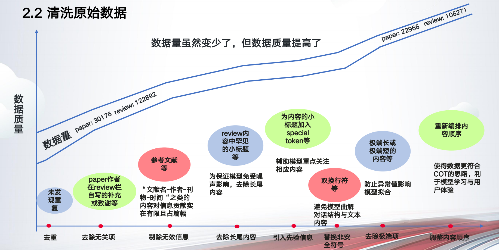

# 第十一单元  大模型基础

## **一、昨日知识点回顾**

```python
1. 昨日知识点1
2. 昨日知识点2
```

------

## **二、考核目标**

```
1.当日考核目标1
2.当日考核目标2
```

------

## **三、本单元知识详讲**

### 线性回归 

#### 学习⽬标

掌握线性回归的实现过程 

知道回归算法的评估标准及其公式 

知道过拟合与⽋拟合的原因以及解决⽅法 

### **1** 线性回归应⽤场景 

房价预测 

销售额度预测 

贷款额度预测

什么是线性回归

### **2.1** 定义与公式 

线性回归(Linear regression)是利⽤回归⽅程**(**函数**)**对⼀个或多个⾃变量**(**特征值**)**和 

因变量**(**⽬标值**)**之间关系进⾏建模的⼀种分析⽅式。

特点：只有⼀个⾃变量的情况称为单变量回归，多于⼀个⾃变量情况的叫做多 

元回归 

通用公式

~~~
h(w) = W1*X1 + W2*X2 + ... + Wn*Xn + b
~~~

首先，让我们从生活中的一个小例子说起。假设你是一位房地产经纪人，每天都需要帮助客户评估房屋的价格。你会发现，房屋的价格往往与它的面积、位置、装修等因素密切相关。那么，如何快速而准确地给出一个合理的估价呢？这时，线性回归就派上了大用场。

### 逐步推导公式

线性回归，简单来说，就是找到一条直线，让它最好地“拟合”或“预测”数据点之间的关系。这条直线的方程，就是我们今天要学习的重点——`h(w) = W1*X1 + W2*X2 + ... + Wn*Xn + b`。

在这个公式里，`h(w)`代表了我们想要预测的目标值，比如房屋的价格；`W1, W2, ..., Wn`是各个自变量的权重，它们告诉我们每个自变量对目标值的影响程度；`X1, X2, ..., Xn`则是自变量本身，比如房屋的面积、卧室数量等；而`b`，则是截距，它代表了当所有自变量都为0时，目标值的基准水平。`b`可能代表了房屋基础设施、地理位置等不可量化的因素对价格的影响，而各个自变量（如面积、卧室数量等）则通过它们的权重来影响价格。即使一个房屋在所有可量化的特征上都为零（这在实际中是不可能的，但可以作为理论上的讨论），它的价格也不会是零，而是由`b`所决定的某个基准价格。


那么，这些权重和截距是怎么来的呢？答案是通过最小化预测值与实际值之间的差异，也就是所谓的“残差平方和”。残差平方和（Residual Sum of Squares, RSS）是线性回归模型中的一个重要概念，用于量化模型预测值与实际观测值之间的差异。在统计学和机器学习中，残差是指观测值与模型预测值之间的差，而残差平方和则是所有残差平方的总和。

### 结合实例分析

现在，让我们回到房屋估价的例子。假设我们收集到了一系列房屋的面积（X1）和对应的售价（h(w)），并希望通过线性回归来预测新房屋的价格。首先，我们会使用某种算法（比如梯度下降法）来找到最佳的权重W1和截距b。然后，当我们知道新房屋的面积时，就可以直接将这个值代入公式，快速得到一个相对准确的估价了。

梯度下降法的基本思想是通过迭代地调整参数来最小化目标函数（通常是损失函数）。在每一步迭代中，算法会计算目标函数关于参数的梯度（即偏导数），然后根据梯度的方向和大小来更新参数。梯度的方向指出了函数值增长最快的方向，因此，为了找到最小值，我们应该沿着梯度的反方向（即负梯度方向）更新参数。

损失函数（Loss Function）或代价函数（Cost Function）是将随机事件或其有关随机变量的取值映射为非负实数以表示该随机事件的“风险”或“损失”的函数。在机器学习和深度学习中，损失函数是衡量模型预测结果与真实值之间差异的关键指标，它指导了模型的训练和优化过程。损失函数是一个非负实值函数，用于量化模型预测值与真实值之间的不一致程度。

案例分析：

期末成绩：0.7×考试成绩+0.3×平时成绩 

房⼦价格 = 0.02×中⼼区域的距离 + 0.04×城市⼀氧化氮浓度 + (-0.12×⾃住房 

平均房价) + 0.254×城镇犯罪率

### **2.2** 线性回归模型介绍实现过程

线性回归当中主要有两种模型，⼀种是线性关系，另⼀种是⾮线性关系。

1. **生成数据**：这里我们生成了一个包含房屋面积和对应价格的简单数据集。面积是随机生成的数值，价格则根据面积加上一定的噪声来生成。
2. **数据分割**：使用`train_test_split`函数将数据集分为训练集和测试集。
3. **创建模型**：使用`LinearRegression`类创建一个线性回归模型。
4. **训练模型**：使用训练数据调用`fit`方法训练模型。
5. **预测**：使用测试数据调用`predict`方法进行预测。
6. **评估模型**：使用均方误差（MSE）和决定系数（�2*R*2）来评估模型的性能。
7. **可视化**：最后，绘制一个散点图来显示实际的价格点和预测的价格趋势线。

参数说明

### `random_state=42`

`random_state`参数是用来控制随机数生成器的种子（seed）。在机器学习中，我们经常需要将数据集分成训练集和测试集，这个过程通常是随机的。设置`random_state`可以确保每次运行程序时，即使使用相同的随机划分方法，也能得到相同的数据分割结果。这对于实验的可重复性和调试是非常有用的。

- 如果没有指定`random_state`，那么每次运行程序可能会得到不同的训练集和测试集划分。

- 如果指定了`random_state`（例如`random_state=42`），那么每次运行程序时，只要其他条件不变（如数据集不变），就会得到相同的训练集和测试集。

  

### `test_size=0.2`

`test_size`参数指定了测试集应该占原始数据集的比例。在这个例子中，`test_size=0.2`意味着测试集将占据整个数据集的20%，而剩余的80%将用于训练模型。

~~~python
import numpy as np
import pandas as pd
from sklearn.model_selection import train_test_split
from sklearn.linear_model import LinearRegression
from sklearn.metrics import mean_squared_error, r2_score
import matplotlib.pyplot as plt

# 生成模拟数据
def generate_data(n_samples=100):
    np.random.seed(0)  # 设置随机种子以确保结果的可重复性
    X = np.random.rand(n_samples, 1) * 100  # 房屋面积
    y = 1.5 * X.ravel() + 50 + np.random.randn(n_samples) * 10  # 房价
    return X, y

# 主函数
def main():
    # 生成数据
    X, y = generate_data(100)

    # 将数据划分为训练集和测试集
    X_train, X_test, y_train, y_test = train_test_split(X, y, test_size=0.2, random_state=42)

    # 创建线性回归模型
    regressor = LinearRegression()

    # 训练模型
    regressor.fit(X_train, y_train)

    # 预测
    y_pred = regressor.predict(X_test)

    # 模型评估
    mse = mean_squared_error(y_test, y_pred)
    r2 = r2_score(y_test, y_pred)
    print(f"Mean Squared Error: {mse:.2f}")
    print(f"R^2 Score: {r2:.2f}")

    # 可视化结果
    plt.scatter(X_test, y_test, color='black')
    plt.plot(X_test, y_pred, color='blue', linewidth=3)
    plt.xticks(())
    plt.yticks(())
    plt.title('House Price Prediction with Linear Regression')
    plt.xlabel('Square Footage')
    plt.ylabel('Price')
    plt.show()

if __name__ == "__main__":
    main()
~~~

### 2.3 过拟合与⽋拟合

### 欠拟合（Underfitting）

欠拟合是指模型在训练数据上的表现不够好，即模型未能捕捉到数据中的模式或规律。这种情况通常发生在模型过于简单，或者训练次数不足时。欠拟合的模型在训练数据上的误差较高，并且很可能在新的、未见过的数据上的表现也会很差。

#### 欠拟合的症状

- 在训练集上的性能不佳。
- 在验证集或测试集上的性能同样差。
- 模型的复杂度较低，可能没有充分利用所有可用的信息。

#### 解决欠拟合的方法

- 增加模型的复杂度，例如增加多项式特征。
- 收集更多特征或更高质量的数据。

### 过拟合（Overfitting）

过拟合是指模型在训练数据上表现得太好了，以至于它不仅学习了数据中的基本模式，还学习了一些噪声或偶然的细节。这样的模型在训练数据上误差很低，但在新的、未见过的数据上表现较差，因为它已经“记住”了训练数据的具体细节而不是泛化的规律。

#### 过拟合的症状

- 在训练集上性能非常好（误差很小）。
- 在验证集或测试集上性能较差。
- 模型的复杂度过高，可能包括过多的特征或隐藏层（如果是神经网络）。

#### 解决过拟合的方法

- 增加训练数据量。

- 减小模型的复杂度，例如减少多项式特征的阶数、减少隐藏层数量（如果是神经网络）等。

- 使用正则化技术（如L1、L2正则化）来惩罚过于复杂的模型。

  

  L1正则化的一个主要特点是它可以产生稀疏解，这意味着它可以使一些参数的值变为零，从而有效地执行特征选择。L1正则化倾向于将不重要的特征的权重压缩到零，从而实现特征选择

  ### 

  L2正则化也被称为岭回归（Ridge Regression）。在这种正则化方法中，惩罚项是所有模型参数平方值之和。L2正则化的一个主要特点是它不会将任何参数压缩到零，而是使它们变得较小。L2正则化不会产生稀疏解，它会保留所有的特征，只是让它们的权重变得更小

  ### 使用场景

  - **L1正则化**适用于特征选择场景，特别是当特征数量很多而样本数量较少时。它可以帮助识别哪些特征对于模型来说是最重要的。
  - **L2正则化**适用于需要保留所有特征的情况，特别是在特征数量较多但不是所有特征都同等重要时。它有助于减少过拟合，同时保持模型的稳定性。

  

### 平衡策略

避免过拟合和欠拟合的关键在于找到合适的模型复杂度，使得模型既能很好地适应训练数据，又具有良好的泛化能力。这通常需要通过交叉验证（Cross-validation）来调整模型的复杂度和其他超参数，并使用验证集来评估模型在未见数据上的表现。

### 实际应用中的考量

在实际应用中，我们通常需要在模型的复杂度和其泛化能力之间做出权衡。过于简单的模型可能导致欠拟合，而过于复杂的模型可能导致过拟合。正确的做法是寻找一个合适的中间地带，使模型既能够捕捉数据中的重要模式，又不会过分拟合训练数据中的噪声或特定细节。

数据处理



使用LangChain的Agent来构建一个具有动态创建工作流、配置访问权限以及审批流程的功能的系统，是一个复杂但可行的任务。以下是一个基于LangChain Agent的工作流系统设计思路：

### 一、系统架构设计

1. **用户层**：
   - 面向有权限的用户，提供工作流创建、任务分配、审批流程配置等功能的界面。
   - 用户通过界面输入指令，系统接收并解析用户输入。
2. **Agent层**：
   - 作为系统的核心组件，负责解析用户指令、制定执行计划、调用工具集执行操作。
   - Agent需要集成语言模型（LLM）以理解用户意图，并根据意图动态创建工作流。
   - Agent还需要具备访问控制和审批流程管理的能力，以确保只有有权限的用户才能创建工作流，并且任务能够按照预设的审批流程进行自动审批。
3. **工具集层**：
   - 提供一系列工具供Agent调用，如数据库查询、API调用、文件操作等。
   - 这些工具需要支持动态加载和配置，以满足不同工作流和任务的需求。
4. **数据存储层**：
   - 存储工作流定义、任务信息、审批流程配置等数据。
   - 需要具备高效的数据检索和更新能力，以确保系统能够实时响应用户请求。

### 二、功能实现

1. **动态创建工作流**：
   - 用户通过界面输入工作流定义，如任务节点、执行顺序、输入输出等。
   - Agent解析用户输入，并调用工具集创建相应的工作流定义。
   - 工作流定义存储在数据存储层中，供后续任务使用。
2. **配置访问权限**：
   - 用户通过界面设置不同用户或用户组的访问权限。
   - Agent根据用户输入更新数据存储层中的权限配置。
   - 在任务执行过程中，Agent会检查用户的权限，确保只有有权限的用户才能执行相应的操作。
3. **审批流程配置与自动审批**：
   - 用户通过界面设置审批流程，包括审批节点、审批人、审批条件等。
   - Agent解析用户输入，并调用工具集创建相应的审批流程配置。
   - 当任务到达审批节点时，Agent会根据审批流程配置自动将任务分配给相应的审批人。
   - 审批人通过界面查看任务详情并做出审批决策。Agent会根据审批决策更新任务状态，并继续执行后续操作。

### 三、系统优化与扩展

1. **性能优化**：
   - 对Agent的决策过程进行优化，提高系统响应速度。
   - 对数据存储层进行索引和缓存优化，提高数据检索效率。
2. **扩展性**：
   - 支持自定义工具集的添加和配置，以满足不同业务场景的需求。
   - 提供API接口，方便与其他系统进行集成和交互。
3. **安全性**：
   - 加强用户身份验证和授权机制，确保系统安全。
   - 对敏感数据进行加密存储和传输，防止数据泄露。

### 实现思路和步骤

1. **环境准备**
   - 安装LangChain和相关依赖。
   - 配置LangChain的Agent和工具集。
2. **定义工作流模型**
   - 使用JSON Schema或类似的技术定义工作流的结构和属性。
   - 定义任务节点、执行顺序、输入输出等。
3. **实现动态创建工作流**
   - 创建一个API或界面，允许用户输入工作流定义。
   - 使用LangChain的Agent解析用户输入，并根据定义创建工作流实例。
   - 将工作流实例存储在数据库中，以便后续使用。
4. **配置访问权限**
   - 创建一个用户权限管理系统，定义用户角色和权限。
   - 在工作流创建时，关联相应的权限配置。
   - 在任务执行过程中，使用LangChain的Agent检查用户的权限，确保只有有权限的用户才能执行操作。
5. **实现审批流程配置与自动审批**
   - 定义一个审批流程模型，包括审批节点、审批人、审批条件等。
   - 创建一个API或界面，允许用户配置审批流程。
   - 在任务到达审批节点时，使用LangChain的Agent自动将任务分配给相应的审批人。
   - 审批人通过界面查看任务详情并做出审批决策。
   - LangChain的Agent根据审批决策更新任务状态，并继续执行后续操作。
6. **集成和测试**
   - 将所有组件集成在一起，进行功能测试和性能测试。
   - 确保系统能够正确解析用户输入，动态创建工作流，配置访问权限，以及按照审批流程进行自动审批。
7. **部署和维护**
   - 将系统部署到生产环境中，并进行监控和维护。
   - 根据用户反馈和需求进行迭代和优化。

### 可能需要使用的LangChain功能和工具

- **LangChain Agent**：用于解析用户输入，制定执行计划，并调用工具集执行操作。
- **LangChain Store**：用于存储工作流定义、任务信息、审批流程配置等数据。
- **LangChain Tools**：提供一系列工具供Agent调用，如数据库查询、API调用等。
- **LangChain Prompts**：用于指导Agent如何理解和处理输入，以及制定执行计划。


## **四、本单元知识总结**

```python
1.当日知识点总结1
2.当日知识点总结2

```

