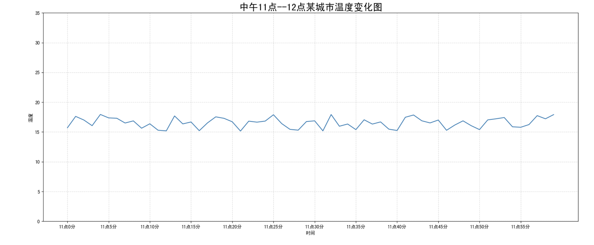
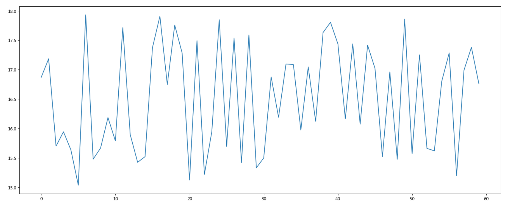
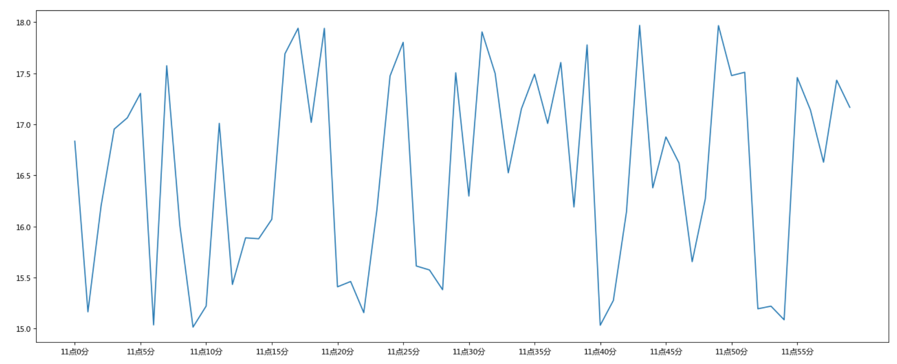
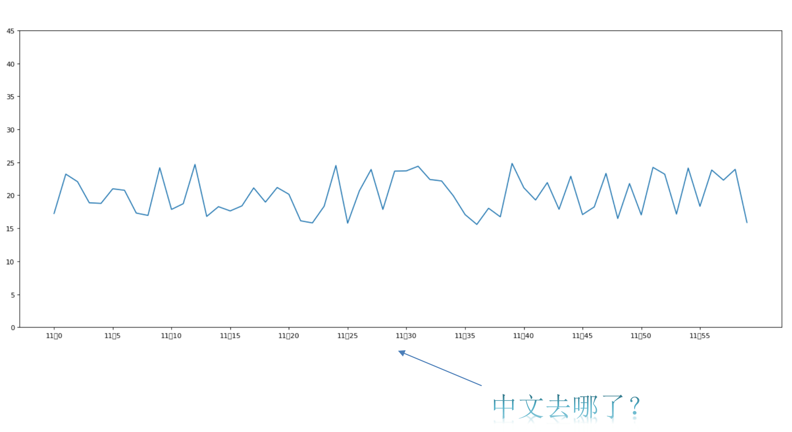
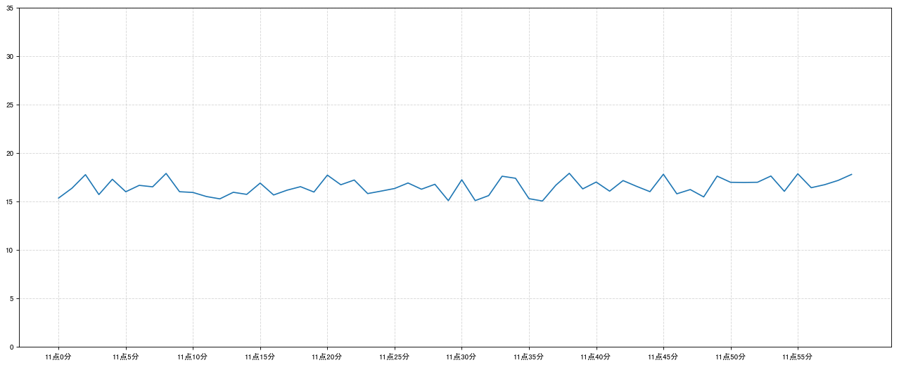
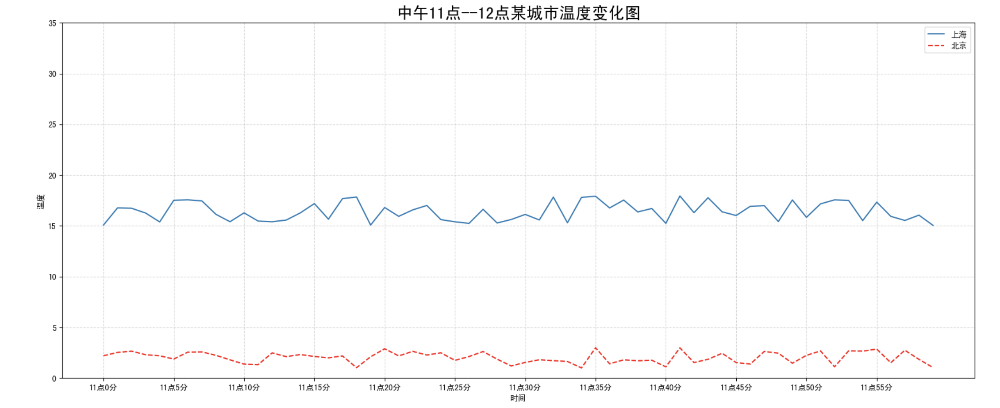
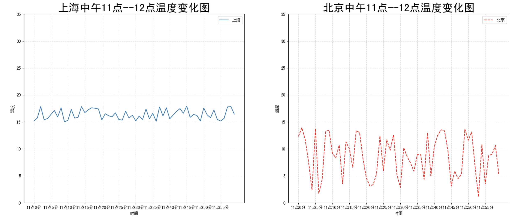
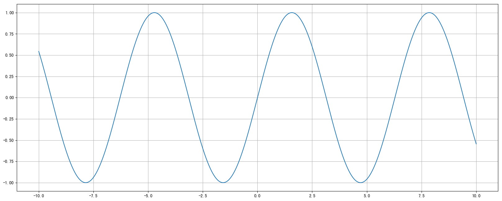

# 第十六单元 Matplotlib

## **一、昨日知识点回顾**

```python
1. 项目部署的流程
2. CICD自动化部署
```

------

## **二、考核目标**

```
1.matplotlib的各种图表展示
2.matplotlib中的各常用方法
```

------

## **三、本单元知识详讲**

### 16.1 虚拟环境

python开发的虚拟环境（Virtual Enviroment），主要是以目录作为单位分别保存不同的python解释器与第三方模块的一种技术。

使用虚拟环境，可以让一台开发机子，同时安装多个不同的python解释器，也可以实现同时安装同一个模块的多个不同版本。

常用的虚拟环境：**Anaconda**、Virtualenvs、pyvenv


### **16.2 Anaconda**

conda是为了解决传统的虚拟环境问题而出现的虚拟环境管理工具，conda在virtualenv基础上，提取了公共代码保存到一个公共目录，独立代码分离开来的模式解决了virtualenv的解释器复制问题，同时conda还可以通过自动管理python解释器的功能，允许我们创建虚拟环境目录时自由的选择不同的python解释器版本。conda一共有2个版本：miniconda与anaconda。

其中，anaconda是conda的完整版本，内置了将近300个关于服务端开发，人工智能，数据分析，爬虫，测试，运维等常用第三方模块。而miniconda则是conda的简单版本，内置了将近30个常用第三方模块。所以学习的时候，建议在本地安装anaconda，在公司开发或项目部署时使用miniconda。

anaconda下载地址：[https://repo.anaconda.com/archive/](https://gitee.com/link?target=https%3A%2F%2Frepo.anaconda.com%2Farchive%2F)

miniconda下载地址：[https://repo.anaconda.com/miniconda/](https://gitee.com/link?target=https%3A%2F%2Frepo.anaconda.com%2Fminiconda%2F)

conda还提供了一个类似pypi的包模块管理库，可以让我们搜索到10年前的包：[https://anaconda.org/](https://gitee.com/link?target=https%3A%2F%2Fanaconda.org%2F)


#### 16.2.1 常用命令

| 命令                                                         | 描述                                                         |
| ------------------------------------------------------------ | ------------------------------------------------------------ |
| conda -V                                                     | 查看conda版本                                                |
| **conda info**                                               | 查看当前Anaconda的系统配置信息                               |
| **conda env list**                                           | 列出当前系统中所有虚拟环境，环境列表左边`*`号表示当前所在环境， 也可以使用`conda info -e`查看，注意：conda安装到本地以后，默认就提供了一个全局版本的虚拟环境，叫`base` |
| **conda create -n <虚拟环境名称> python=<python版本号> <包名1>==<版本号>** | 新建虚拟环境，<br>-n            表示设置当前虚拟环境的名称， <br>python   表示设置当前虚拟环境的python版本，如果本地没有会自动下载安装 <br><包名1>==<版本号>   创建虚拟环境时同时安装一个或多个指定第三方包 |
| conda create -n <新的虚拟环境名称> --clone <旧的虚拟环境名称> | 克隆虚拟环境                                                 |
| **conda activate <虚拟环境名称>**                            | 进入/切换到指定名称的虚拟环境，如果不带任何参数，则默认回到全局虚拟环境`base`中 |
| **conda deactivate**                                         | 退出当前虚拟环境                                             |
| conda install -n <虚拟环境名称> <包名1>==<版本号>            | 在虚拟环境外部，给**指定虚拟环境**安装或更新一个或多个指定包 如果是最新的版本的包，conda install无法安装，则可以使用pip install安装 |
| **conda install <包名1>==<版本号>**                          | 在虚拟环境内部，给**当前虚拟环境**安装或更新一个或多个指定包 |
| conda install <包名1>==<版本号> **-c conda-force**           | 在虚拟环境内部，指定下载服务器源给**当前虚拟环境**安装或更新一个或多个指定包，conda-force有时候会因为网络问题被拦截。 |
| conda remove -n <虚拟环境名称> <包名1>==<版本号>             | 在虚拟环境外部，给**指定虚拟环境**卸载一个或多个指定包       |
| **conda remove <包名1>==<版本号>**                           | 在虚拟环境内部，给**当前虚拟环境**卸载一个或多个指定包       |
| **conda remove -n <虚拟环境名称> --all**                     | 删除指定虚拟环境，并卸载该环境中所有指定包                   |
| **conda env export > environment.yaml**                      | 导出当前虚拟环境的Anaconda包信息到环境配置文件environment.yaml中 |
| **conda env create -f environment.yaml**                     | 根据环境配置文件environment.yaml的包信息来创建新的虚拟环境   |
| conda update --prefix <anaconda安装目录> anaconda            | 更新Anaconda的版本。 先回到base环境，再执行conda update，系统会自动提示完整并正确的命令<br>如果上述方法不行，只能卸载现有的conda，然后下载最新版本安装。 |


#### 16.2.2 新建虚拟环境

```bash
# 基于指定的python版本创建虚拟环境
conda create -n <虚拟环境名称> python=<python版本号>
# 值
conda create -n <虚拟环境名称> python=<python版本号> <包名1>==<版本号> <包名2> ... <包名n>
# -n <虚拟环境名称> 或者 --name <虚拟环境名称>   表示设置当前虚拟环境的名称
# python=<python版本号>   表示设置当前虚拟环境的python版本，如果本地没有会自动下载安装

# <包名>==<版本号>
#     表示创建虚拟环境时同时安装一个或多个指定第三方包
#     可指定版本号，如果不指定版本，则安装当前python环境能支持的最新版本的包
# 注意:
#         指定包的版本时，有可能会因为没有这个版本或当前python环境不支持当前版本而导致虚拟环境创建失败。
#         所以，建议指定包版本时，尽量使用*号表示小版本，例如：numpy==1.*
```

例如：

```bash
# 创建一个python2.7的虚拟环境，环境名为pypy27
conda create -n py27 python=2.7
# 创建一个python3.11的虚拟环境，并且安装pyredis和pymysql模块的最新版本，环境名为py311
conda create -n py311 python=3.11  pyredis pymysql
```

 克隆虚拟环境

```bash
conda create -n <新的虚拟环境名称> --clone <旧的虚拟环境名称>
```

 激活/切换/进入虚拟环境

```bash
# 进货/切换/进入到指定名称的虚拟环境，如果不带任何参数，则默认回到全局环境base中。
conda activate <虚拟环境名称>
```

 退出当前虚拟环境

```bash
conda deactivate
```

 给虚拟环境安装模块

```bash
# 在虚拟环境外部，给指定虚拟环境安装/或者更新一个或多个指定包
conda install -n <虚拟环境名称> <包名1>==<版本号> <包名2> ... <包名n>

# 在虚拟环境内部，给当前虚拟环境通过conda install <包名> 来完成安装模块
conda install <包名1>==<版本号> <包名2> ... <包名n>
```

 给虚拟环境卸载模块

```bash
#  在虚拟环境外部，给指定虚拟环境卸载一个或多个指定包
conda remove -n <虚拟环境名称> <包名1>==<版本号> <包名2> ... <包名n>
# 也可以在进入虚拟环境以后，通过conda remove <包名> 来完成卸载工作
conda remove <包名1>==<版本号> <包名2> ... <包名n>
```

 删除指定虚拟环境

```bash
conda remove -n <虚拟环境名称> --all  # --all 表示卸载该虚拟环境下所有已经安装的模块
```

 导出虚拟环境的已安装模块列表信息【备份】

```bash
# 导出当前虚拟环境的Anaconda包信息到环境配置文件environment.yaml中
conda env export > environment.yaml
# 也可以导出pip安装的包，但是要注意的是，pip 无法正确导出conda安装的包
# pip freeze > requirements.txt
```

 在虚拟环境中批量安装模块【恢复】

```bash
# 根据环境配置文件environment.yaml的包信息来创建新的虚拟环境
conda env create -f environment.yaml
# 也可以批量pip安装的包，但是要注意的是，pip 无法正确导出conda安装的包
# pip freeze > requirements.txt
```

> 注意：
>
> 有了Anaconda以后，要养成一个习惯：新建一个项目，就给这个项目单独分配一个虚拟环境。


### 16.3 Matplotlib之HelloWorld

------

#### 16.3.1 什么是Matplotlib


- 是专门用于开发2D图表(包括3D图表)

- 以渐进、交互式方式实现数据可视化

#### 16.3.2 为什么要学习Matplotlib

可视化是在整个数据挖掘的关键辅助工具，可以清晰的理解数据，从而调整我们的分析方法。

- 能将数据进行可视化,更直观的呈现
- 使数据更加客观、更具说服力

例如下面两个图为数字展示和图形展示：


#### 16.3.3 实现一个简单的Matplotlib画图 — 以折线图为例

1 pyplot模块

matplotlib.pytplot包含了一系列类似于matlab的画图函数。

```python
import matplotlib.pyplot as plt
```

2 图形绘制流程

- 1.创建画布 -- plt.figure()

```python
plt.figure(figsize=(), dpi=)
figsize:指定图的长宽
      dpi:图像的清晰度
      返回fig对象
```

- 2.绘制图像 -- plt.plot(x, y)

```
以折线图为例
```

- 3.显示图像 -- plt.show()

3 折线图绘制与显示

**举例：展现上海一周的天气,比如从星期一到星期日的天气温度如下**

```python
import matplotlib.pyplot as plt

# 1.创建画布
plt.figure(figsize=(10, 10), dpi=100)

# 2.绘制折线图
plt.plot([1, 2, 3, 4, 5, 6 ,7], [17,17,18,15,11,11,13])

# 3.显示图像
plt.show()
```


#### 16.3.4 认识Matplotlib图像结构


#### 16.3.5 小结

- 什么是matplotlib【了解】
  - 是专门用于开发2D(3D)图表的包
- 绘制图像流程【掌握】
  - 1.创建画布 -- plt.figure(figsize=(20,8))
  - 2.绘制图像 -- plt.plot(x, y)
  - 3.显示图像 -- plt.show()


### 16.4 常见图形绘制

------

Matplotlib能够绘制**折线图、散点图、柱状图、直方图、饼图。**

我们需要知道不同的统计图的意义，以此来决定选择哪种统计图来呈现我们的数据。

#### 16.4.1 常见图形种类及意义

------

- **折线图**：以折线的上升或下降来表示统计数量的增减变化的统计图

**特点：能够显示数据的变化趋势，反映事物的变化情况。(变化)**

api：plt.plot(x, y)


------

- **散点图：**用两组数据构成多个坐标点，考察坐标点的分布,判断两变量之间是否存在某种关联或总结坐标点的分布模式。

  **特点：判断变量之间是否存在数量关联趋势,展示离群点(分布规律)**

  api：plt.scatter(x, y)

  

  ------

- **柱状图：**排列在工作表的列或行中的数据可以绘制到柱状图中。

  **特点：绘制连离散的数据,能够一眼看出各个数据的大小,比较数据之间的差别。(统计/对比)**

  api：plt.bar(x, width, align='center', **kwargs)

```
Parameters:    
x : 需要传递的数据

width : 柱状图的宽度

align : 每个柱状图的位置对齐方式
    {‘center’, ‘edge’}, optional, default: ‘center’

**kwargs :
color:选择柱状图的颜色
```


------

- **直方图：**由一系列高度不等的纵向条纹或线段表示数据分布的情况。 一般用横轴表示数据范围，纵轴表示分布情况。

  **特点：绘制连续性的数据展示一组或者多组数据的分布状况(统计)**

  api：matplotlib.pyplot.hist(x, bins=None)

```
Parameters:    
x : 需要传递的数据
bins : 组数
```


------

- **饼图：**用于表示不同分类的占比情况，通过弧度大小来对比各种分类。

  **特点：分类数据的占比情况(占比)**

  api：plt.pie(x, labels=,autopct=,colors)

```
Parameters:  
x:数量，自动算百分比,x即每个扇形的占比的序列或数组
labels:每部分名称
autopct:占比显示指定%1.2f%%,通过设置autopct参数来控制圆环图上显示的数字精度和格式
colors:每部分颜色
wedgeprops:通过设置wedgeprops的width参数来控制圆环的宽度
explode:如果不是None，则是一个len(x)长度的数组，指定每一块的突出程度；突出显示，设置每一块分割出来的间隙大小
```


```
# 数据，总和为100%
x=[1,1,2,2,5]
# 显示文字
label = ['饼图1','饼图2','饼图3','饼图4','饼图5']
# 是否分离
exp = [0,0,0,0,0.1]
#创建画布
plt.figure(figsize=(20,8),dpi=100)
# 绘制饼图，x为数据，labels显示名称，autopct显示精度，wedgeprops 显示宽度，explode是否分离
plt.pie(x,labels=label,autopct="%1.1f%%",wedgeprops=dict(width=1),explode=exp)
# 显示为圆（避免比例压缩为椭圆）
plt.axis("equal")
# 展示图像
plt.show()
```


#### 16.4.2 散点图绘制

需求：探究房屋面积和房屋价格的关系

房屋面积数据：

```python
x = [225.98, 247.07, 253.14, 457.85, 241.58, 301.01,  20.67, 288.64,
       163.56, 120.06, 207.83, 342.75, 147.9 ,  53.06, 224.72,  29.51,
        21.61, 483.21, 245.25, 399.25, 343.35]
```

房屋价格数据：

```python
y = [196.63, 203.88, 210.75, 372.74, 202.41, 247.61,  24.9 , 239.34,
       140.32, 104.15, 176.84, 288.23, 128.79,  49.64, 191.74,  33.1 ,
        30.74, 400.02, 205.35, 330.64, 283.45]
```


代码：

```python
# 0.准备数据
x = [225.98, 247.07, 253.14, 457.85, 241.58, 301.01,  20.67, 288.64,
       163.56, 120.06, 207.83, 342.75, 147.9 ,  53.06, 224.72,  29.51,
        21.61, 483.21, 245.25, 399.25, 343.35]
y = [196.63, 203.88, 210.75, 372.74, 202.41, 247.61,  24.9 , 239.34,
       140.32, 104.15, 176.84, 288.23, 128.79,  49.64, 191.74,  33.1 ,
        30.74, 400.02, 205.35, 330.64, 283.45]

# 1.创建画布
plt.figure(figsize=(20, 8), dpi=100)

# 2.绘制散点图
plt.scatter(x, y)

# 3.显示图像
plt.show()
```

#### 16.4.3 柱状图绘制

**需求-对比每部电影的票房收入**


电影数据如下图所示：


- **准备数据**

```
['雷神3：诸神黄昏','正义联盟','东方快车谋杀案','寻梦环游记','全球风暴', '降魔传','追捕','七十七天','密战','狂兽','其它']
[73853,57767,22354,15969,14839,8725,8716,8318,7916,6764,52222]
```

- **绘制柱状图**

代码：

```python
# 0.准备数据
# 电影名字
movie_name = ['雷神3：诸神黄昏','正义联盟','东方快车谋杀案','寻梦环游记','全球风暴','降魔传','追捕','七十七天','密战','狂兽','其它']
# 横坐标
x = range(len(movie_name))
# 票房数据
y = [73853,57767,22354,15969,14839,8725,8716,8318,7916,6764,52222]

# 1.创建画布
plt.figure(figsize=(20, 8), dpi=100)

# 2.绘制柱状图
plt.bar(x, y, width=0.5, color=['b','r','g','y','c','m','y','k','c','g','b'])

# 2.1b修改x轴的刻度显示
plt.xticks(x, movie_name)

# 2.2 添加网格显示
plt.grid(linestyle="--", alpha=0.5)

# 2.3 添加标题
plt.title("电影票房收入对比")

# 3.显示图像
plt.show()
```

**参考链接：** https://matplotlib.org/index.html

#### 16.4.4 小结

- 折线图【知道】
  - 能够显示数据的变化趋势，反映事物的变化情况。(变化)
  - plt.plot()
- 散点图【知道】
  - 判断变量之间是否存在数量关联趋势,展示离群点(分布规律)
  - plt.scatter()
- 柱状图【知道】
  - 绘制连离散的数据,能够一眼看出各个数据的大小,比较数据之间的差别。(统计/对比)
  - plt.bar(x, width, align="center")
- 直方图【知道】
  - 绘制连续性的数据展示一组或者多组数据的分布状况(统计)
  - plt.hist(x, bins)
- 饼图【知道】
  - 用于表示不同分类的占比情况，通过弧度大小来对比各种分类
  - plt.pie(x, labels, autopct, colors)


### 16.5 基础绘图功能 — 以折线图为例

------

#### 16.5.1 完善原始折线图

为了更好地理解所有基础绘图功能，我们通过天气温度变化的绘图来融合所有的基础API使用

**需求：画出某城市11点到12点1小时内每分钟的温度变化折线图，温度范围在15度~18度**

效果：



1 准备数据并画出初始折线图

```python
#导包
import matplotlib.pyplot as plt
import random
# 画出温度变化图
# 0.准备x, y坐标的数据
x = range(60)
y_shanghai = [random.uniform(15, 18) for i in x]

# 1.创建画布
plt.figure(figsize=(20, 8), dpi=80)

# 2.绘制折线图
plt.plot(x, y_shanghai)

# 3.显示图像
plt.show()
```



***uniform解释：***

这段代码是Python中的一段代码，它使用`random.uniform(15, 18)`来生成一个介于15和18（包括15和18）之间的随机浮点数。然后，它对一个名为`x`的迭代器（可能是列表、元组或其他可迭代对象，此处对应的是咱们x轴的数据）中的每个元素执行这个操作。

详细解释：

- `random.uniform(15, 18)`：这是Python的`random`模块中的一个函数，用于生成一个在给定范围内的随机浮点数。在这里，它会生成一个介于15和18（包括15和18）之间的随机数。
- `for i in x`：这是一个for循环，它会遍历`x`中的每个元素，并将每个元素赋值给变量`i`。

因此，这段代码的整体意思是：对于`x`中的每个元素`i`，生成一个介于15和18之间的随机浮点数。

2 添加自定义x,y刻度

- plt.xticks(x, **kwargs)
  - x:要显示的刻度值
- plt.yticks(y, **kwargs)
  - y:要显示的刻度值

```python
import matplotlib.pyplot as plt
import time
import random
from pylab import mpl
# 设置显示中文字体
mpl.rcParams["font.sans-serif"] = ["SimHei"]
# 生成x轴数据
x = range(60)
# 根生成y周轴数据
y_shanghai = [random.uniform(15,18) for i in x]
# 创建画布
plt.figure(figsize=(16,5),dpi=100)
# 绘制折线图
plt.plot(x,y_shanghai)
# 构造x轴刻度标签
x_ticks_label = ["11点{}分".format(i) for i in x]
#构造y轴刻度
y_ticks = range(30)
# 修改x,y坐标的刻度
plt.xticks(x[::5],x_ticks_label[::5])
plt.yticks(y_ticks[::5])
# 显示图像
plt.show()
```



如果没有解决过中文问题的话，会显示这个样子：



3 中文显示问题解决

**解决方案一：**

下载中文字体（黑体，看准系统版本）

- 步骤一：下载 [SimHei] 字体（或者其他的支持中文显示的字体也行）

- 步骤二：安装字体

  - linux下：拷贝字体到 usr/share/fonts 下：

    ```
    sudo cp ~/SimHei.ttf /usr/share/fonts/SimHei.ttf
    ```

  - windows和mac下：双击安装

- 步骤三：删除~/.matplotlib中的缓存文件

```
cd ~/.matplotlib
rm -r *
```

- 步骤四：修改配置文件matplotlibrc

```
vi ~/.matplotlib/matplotlibrc
```

将文件内容修改为：

```
font.family         : sans-serif
font.sans-serif         : SimHei
axes.unicode_minus  : False
```

**解决方案二：**

在Python脚本中动态设置matplotlibrc,这样也可以避免由于更改配置文件而造成的麻烦，具体代码如下：

```python
from pylab import mpl
# 设置显示中文字体
mpl.rcParams["font.sans-serif"] = ["SimHei"]
```

有时候，字体更改后，会导致坐标轴中的部分字符无法正常显示，此时需要更改axes.unicode_minus参数：

```python
# 设置正常显示符号
mpl.rcParams["axes.unicode_minus"] = False
```

4 添加网格显示

为了更加清楚地观察图形对应的值

```python
plt.grid(True, linestyle='--', alpha=0.5)
True 表示显示  linestyle表示虚线 alpha 表示透明度
在显示图像之前添加
```



5 添加描述信息

添加x轴、y轴描述信息及标题

> 通过fontsize参数可以修改图像中字体的大小

```python
plt.xlabel("时间")
plt.ylabel("温度")
plt.title("中午11点0分到12点之间的温度变化图示", fontsize=20)
```


6 图像保存

```
# 保存图片到指定路径
plt.savefig("test.png")
```

- 注意：plt.show()会释放figure资源，如果在显示图像之后保存图片将只能保存空图片。

完整代码：

```python
import matplotlib.pyplot as plt
import random
from pylab import mpl

# 设置显示中文字体
mpl.rcParams["font.sans-serif"] = ["SimHei"]
# 设置正常显示符号
mpl.rcParams["axes.unicode_minus"] = False

# 0.准备数据
x = range(60)
y_shanghai = [random.uniform(15, 18) for i in x]

# 1.创建画布
plt.figure(figsize=(20, 8), dpi=100)

# 2.绘制图像
plt.plot(x, y_shanghai)

# 2.1 添加x,y轴刻度
# 构造x,y轴刻度标签
x_ticks_label = ["11点{}分".format(i) for i in x]
y_ticks = range(40)

# 刻度显示
plt.xticks(x[::5], x_ticks_label[::5])
plt.yticks(y_ticks[::5])

# 2.2 添加网格显示
plt.grid(True, linestyle="--", alpha=0.5)

# 2.3 添加描述信息
plt.xlabel("时间")
plt.ylabel("温度")
plt.title("中午11点--12点某城市温度变化图", fontsize=20)

# 2.4 图像保存
plt.savefig("./test.png")

# 3.图像显示
plt.show()
```

#### 16.5.2 在一个坐标系中绘制多个图像

1 多次plot

需求：再添加一个城市的温度变化

收集到北京当天温度变化情况，温度在1度到3度。怎么去添加另一个在同一坐标系当中的不同图形，**其实很简单只需要再次plot即可**，但是需要区分线条，如下显示



```python
# 增加北京的温度数据
y_beijing = [random.uniform(1, 3) for i in x]

# 绘制折线图
plt.plot(x, y_shanghai)
# 使用多次plot可以画多个折线
plt.plot(x, y_beijing, color='r', linestyle='--')
```

我们仔细观察，用到了两个新的地方，一个是对于不同的折线展示效果，一个是添加图例。

2 设置图形风格

| 颜色字符 |    风格字符    |
| :------: | :------------: |
|  r 红色  |     - 实线     |
|  g 绿色  |    - - 虚线    |
|  b 蓝色  |   -. 点划线    |
|  w 白色  |    : 点虚线    |
|  c 青色  | ' ' 留空、空格 |
|  m 洋红  |                |
|  y 黄色  |                |
|  k 黑色  |                |

**3 显示图例**

- 注意：如果只在plt.plot()中设置label还不能最终显示出图例，还需要通过plt.legend()将图例显示出来。

```python

# 绘制折线图
plt.plot(x, y_shanghai, label="上海")
# 使用多次plot可以画多个折线
plt.plot(x, y_beijing, color='r', linestyle='--', label="北京")

# 显示图例--添加折线图说明，哪条线对应标题
plt.legend(loc="best")
#可以是Location String类型，也可以是Location Code类型
```

| Location String | Location Code |
| --------------- | ------------- |
| 'best'          | 0             |
| 'upper right'   | 1             |
| 'upper left'    | 2             |
| 'lower left'    | 3             |
| 'lower right'   | 4             |
| 'right'         | 5             |
| 'center left'   | 6             |
| 'center right'  | 7             |
| 'lower center'  | 8             |
| 'upper center'  | 9             |
| 'center'        | 10            |

完整代码：

```python
# 0.准备数据
x = range(60)
y_shanghai = [random.uniform(15, 18) for i in x]
y_beijing = [random.uniform(1,3) for i in x]

# 1.创建画布
plt.figure(figsize=(20, 8), dpi=100)

# 2.绘制图像
plt.plot(x, y_shanghai, label="上海")
plt.plot(x, y_beijing, color="r", linestyle="--", label="北京")

# 2.1 添加x,y轴刻度
# 构造x,y轴刻度标签
x_ticks_label = ["11点{}分".format(i) for i in x]
y_ticks = range(40)

# 刻度显示
plt.xticks(x[::5], x_ticks_label[::5])
plt.yticks(y_ticks[::5])

# 2.2 添加网格显示
plt.grid(True, linestyle="--", alpha=0.5)

# 2.3 添加描述信息
plt.xlabel("时间")
plt.ylabel("温度")
plt.title("中午11点--12点某城市温度变化图", fontsize=20)
# 2.4 图像保存
plt.savefig("./test.png")
# 2.5 添加图例--右上角添加折线图说明
plt.legend(loc=0)
# 3.图像显示
plt.show()
```

4 练一练

练习多次plot流程(从上面复制代码,到自己电脑,确保每人环境可以正常运行),

同时明确每个过程执行实现的具体效果

#### 16.5.3 多个坐标系显示

如果我们想要将上海和北京的天气图显示在同一个图的不同坐标系当中，效果如下：



可以通过subplots函数实现(旧的版本中有subplot，使用起来不方便)，推荐subplots函数

- matplotlib.pyplot.subplots(nrows=1, ncols=1, **fig_kw) 创建一个带有多个axes(坐标系/绘图区)的图

```
Parameters:    

nrows, ncols : 设置有几行几列坐标系
    int, optional, default: 1, Number of rows/columns of the subplot grid.

Returns:    
fig : 图对象
axes : 返回相应数量的坐标系

设置标题等方法不同：
    set_xticks
    set_yticks
    set_xlabel
    set_ylabel
```

关于axes子坐标系的更多方法：参考https://matplotlib.org/api/axes_api.html#matplotlib.axes.Axes

- 注意：**plt.函数名()**相当于面向过程的画图方法，**axes.set_方法名()**相当于面向对象的画图方法。

```python
#1、首先完成第一步看效果：
# 添加数据，和上面一样的数据，导包引用上面案例
#构建x轴数据
x = range(60)
#构建y轴上海数据
y_shanghai = [random.uniform(15, 18) for i in x]
#构建y轴北京数据
y_beijing = [random.uniform(1, 5) for i in x]
# 创建画布，注意返回值 nrows 绘图行，ncols绘图列
fig,axes = plt.subplots(nrows=1,ncols=2,figsize=(20,8),dpi=100)
#绘制第一条折线
axes[0].plot(x,y_shanghai,label="上海")
#绘制第二条折线
axes[1].plot(x,y_beijing,label="北京",linestyle="--",color="r")
#按步骤显示
#图像显示
plt.show()
#看效果然后进行下一步

#2、第二步构造x轴、y轴显示刻度：
x_ticks_label = ["11点{}分".format(i) for i in x]
y_ticks = range(40)

#3、图标中添加刻度显示
#3.1 给上海，添加刻度显示，x轴显示
axes[0].set_xticks(x[::5])
#给上海添加刻度显示 y轴显示内容
axes[0].set_yticks(y_ticks[::5])
#给x轴刻度替换
axes[0].set_xticklabels(x_ticks_label[::5])
#3.2给北京，添加刻度显示
axes[1].set_xticks(x[::5])
axes[1].set_yticks(y_ticks[::5])
axes[1].set_xticklabels(x_ticks_label[::5])

#4、添加网格显示，两个图标分别添加网格
axes[0].grid(True,linestyle="--",alpha=0.9)
axes[1].grid(True,linestyle="--",alpha=0.9)

#5、给x轴和y轴，添加描述信息，给上海图表添加描述信息
axes[0].set_xlabel("时间")
axes[0].set_ylabel("温度")
axes[0].set_title("上海中午11点到12点温度变化",fontsize=20)
#给上海添加描述信息
axes[1].set_xlabel("时间")
axes[1].set_ylabel("温度")
axes[1].set_title("北京中午11点到12点温度变化",fontsize=20)

#6、保存图像-或者添加./
plt.savefig("test.png")

#7、显示图例
axes[0].legend(loc="best")
axes[1].legend(loc="best")

```

#### 16.5.4 折线图的应用场景

- 呈现公司产品(不同区域)每天活跃用户数

- 呈现app每天下载数量

- 呈现产品新功能上线后,用户点击次数随时间的变化

- 拓展：**画各种数学函数图像**

  - 注意：plt.plot()除了可以画折线图，也可以用于画各种数学函数图像

    

代码：

```python
import numpy as np
# 0.准备数据
x = np.linspace(-10, 10, 1000)
y = np.sin(x)

# 1.创建画布
plt.figure(figsize=(20, 8), dpi=100)

# 2.绘制函数图像
plt.plot(x, y)
# 2.1 添加网格显示
plt.grid()

# 3.显示图像
plt.show()
```

#### 16.5.5 小结

- 添加x,y轴刻度【知道】
  - plt.xticks()
  - plt.yticks()
  - **注意:在传递进去的第一个参数必须是数字,不能是字符串,如果是字符串吗,需要进行替换操作**
- 添加网格显示【知道】
  - plt.grid(linestyle="--", alpha=0.5)
- 添加描述信息【知道】
  - plt.xlabel()
  - plt.ylabel()
  - plt.title()
- 图像保存【知道】
  - plt.savefig("路径")
- 多次plot【了解】
  - 直接进行添加就OK
- 显示图例【知道】
  - plt.legend(loc="best")
  - **注意:一定要在plt.plot()里面设置一个label,如果不设置,没法显示**
- 多个坐标系显示【了解】
  - plt.subplots(nrows=, ncols=)
- 折线图的应用【知道】
  - 1.应用于观察数据的变化
  - 2.可是画出一些数学函数图像

订单表

~~~
添加日期                     总金额
2020-10-01  09：09：09       100
2020-10-02  09：09：09       300
~~~

2024年每个月的销售额

~~~
[2024-01,2024-02,2024-03,2024-04]
[100,200,300]
~~~


## **四、本单元知识总结**

```python
1.matplotlib的各种图表展示
2.matplotlib中的各常用方法

```

