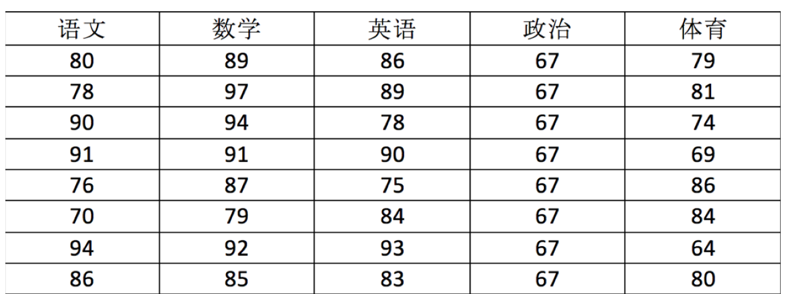
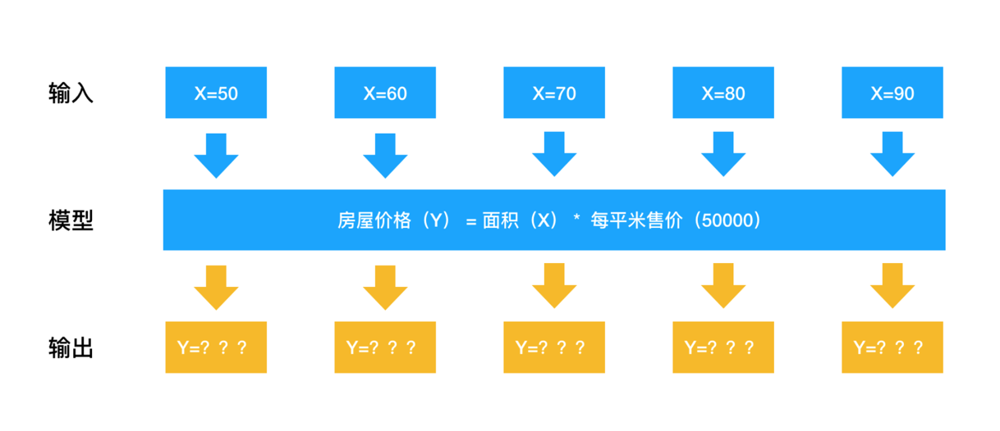
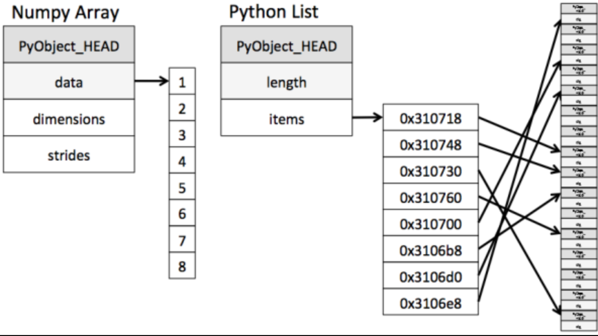

# 第十七单元  Numpy

## **一、昨日知识点回顾**

```python
1.matplotlib的各种图表展示
2.matplotlib中的各常用方法
```

------

## **二、考核目标**

```
1.numpy的高级应用
2.numpy中的各常用方法
```

------

## **三、本单元知识详讲**

### 17.1 Numpy优势

------

#### 17.1.1 Numpy介绍


Numpy（Numerical Python）是一个开源的Python科学计算库，**用于快速处理任意维度的数组**。

Numpy**支持常见的数组和矩阵操作**。对于同样的数值计算任务，使用Numpy比直接使用Python要简洁的多。

Numpy**使用ndarray对象来处理多维数组**，该对象是一个快速而灵活的大数据容器。

#### 17.1.2 ndarray介绍

```python
NumPy provides an N-dimensional array type, the ndarray, 
which describes a collection of “items” of the same type.
```

NumPy提供了一个**N维数组类型ndarray**，它描述了**相同类型**的“items”的集合。



用ndarray进行存储：

```python
import numpy as np

# 创建ndarray
score = np.array(
[[80, 89, 86, 67, 79],
[78, 97, 89, 67, 81],
[90, 94, 78, 67, 74],
[91, 91, 90, 67, 69],
[76, 87, 75, 67, 86],
[70, 79, 84, 67, 84],
[94, 92, 93, 67, 64],
[86, 85, 83, 67, 80]])

score
```

返回结果：

```python
array([[80, 89, 86, 67, 79],
       [78, 97, 89, 67, 81],
       [90, 94, 78, 67, 74],
       [91, 91, 90, 67, 69],
       [76, 87, 75, 67, 86],
       [70, 79, 84, 67, 84],
       [94, 92, 93, 67, 64],
       [86, 85, 83, 67, 80]])
```

**提问:**

**使用Python列表可以存储一维数组，通过列表的嵌套可以实现多维数组，那么为什么还需要使用Numpy的ndarray呢？**

#### 17.1.3 效率对比

在这里我们通过一段代码运行来体会**ndarray与Python原生list运算效率对比**。

```python
import random
import time
import numpy as np
a = []
for i in range(100000000):
    a.append(random.random())

# 通过%time魔法方法, 查看当前行的代码运行一次所花费的时间
%time sum1=sum(a)

b=np.array(a)

%time sum2=np.sum(b)
```

其中第一个时间显示的是使用原生Python计算时间,第二个内容是使用numpy计算时间:

```
CPU times: user 852 ms, sys: 262 ms, total: 1.11 s
Wall time: 1.13 s
CPU times: user 133 ms, sys: 653 µs, total: 133 ms
Wall time: 134 ms
```

从中我们看到ndarray的计算速度要快很多，节约了时间。

**机器学习的最大特点就是大量的数据运算**，那么如果没有一个快速的解决方案，那可能现在python也在机器学习领域达不到好的效果。



Numpy专门针对ndarray的操作和运算进行了设计，所以数组的存储效率和输入输出性能远优于Python中的嵌套列表，数组越大，Numpy的优势就越明显。

**思考：**

**ndarray为什么可以这么快？**

#### 17.1.4 ndarray的优势

1 内存块风格

ndarray到底跟原生python列表有什么不同呢，请看一张图：



从图中我们可以看出ndarray在存储数据的时候，数据与数据的地址都是连续的，这样就给使得批量操作数组元素时速度更快。

这是因为ndarray中的所有元素的类型都是相同的，而Python列表中的元素类型是任意的，所以ndarray在存储元素时内存可以连续，而python原生list就只能通过寻址方式找到下一个元素，这虽然也导致了在通用性能方面Numpy的ndarray不及Python原生list，但在科学计算中，Numpy的ndarray就可以省掉很多循环语句，代码使用方面比Python原生list简单的多。

2 支持并行化运算

numpy内置了并行运算功能，当系统有多个核心时，做某种计算时，numpy会自动做并行计算（向量化运算）。

3 效率远高于纯Python代码

Numpy底层使用C语言编写，内部解除了GIL（全局解释器锁），其对数组的操作速度不受Python解释器的限制，所以，其效率远高于纯Python代码。

#### 17.1.5 小结

- numpy介绍【了解】

  - 一个开源的Python科学计算库
  - 计算起来要比python简洁高效
  - Numpy使用ndarray对象来处理多维数组

- ndarray介绍【了解】

  - NumPy提供了一个N维数组类型ndarray，它描述了相同类型的“items”的集合。
  - 生成numpy对象:np.array()

- ndarray的优势【掌握】

  - 内存块风格

    ```
    - list -- 分离式存储,存储内容多样化
    - ndarray -- 一体式存储,存储类型必须一样
    ```

  - ndarray支持并行化运算（向量化运算）

  - ndarray底层是用C语言写的,效率更高,释放了GIL


### 17.2 N维数组-ndarray

------

#### 17.2.1 ndarray的属性

数组属性反映了数组本身固有的信息。

|     属性名字     |          属性解释          |
| :--------------: | :------------------------: |
|  ndarray.shape   |       数组维度的元组       |
|   ndarray.ndim   |          数组维数          |
|   ndarray.size   |      数组中的元素数量      |
| ndarray.itemsize | 一个数组元素的长度（字节） |
|  ndarray.dtype   |       数组元素的类型       |

#### 17.2.2 ndarray的形状

首先创建一些数组。

```python
# 创建不同形状的数组
>>> a = np.array([[1,2,3],[4,5,6]])
>>> b = np.array([1,2,3,4])
>>> c = np.array([[[1,2,3],[4,5,6]],[[1,2,3],[4,5,6]]])
```

分别打印出形状

```python
>>> a.shape
>>> b.shape
>>> c.shape

(2, 3)  # 二维数组，2行3列
(4,)    # 一维数组
(2, 2, 3) # 三维数组，包含两个2维数组，2维数组包含2个一维数组，每个数组长度是3
```

如何理解数组的形状？

二维数组：


三维数组：


#### 17.2.3 ndarray的类型

```python
>>> type(score.dtype)

<type 'numpy.dtype'>
```

dtype是numpy.dtype类型，先看看对于数组来说都有哪些类型

|     名称      |                       描述                        | 简写  |
| :-----------: | :-----------------------------------------------: | :---: |
|    np.bool    |      用一个字节存储的布尔类型（True或False）      |  'b'  |
|    np.int8    |             一个字节大小，-128 至 127             |  'i'  |
|   np.int16    |               整数，-32768 至 32767               | 'i2'  |
|   np.int32    |              整数，-2^31 至 2^32 -1               | 'i4'  |
|   np.int64    |              整数，-2^63 至 2^63 - 1              | 'i8'  |
|   np.uint8    |               无符号整数，0 至 255                |  'u'  |
|   np.uint16   |              无符号整数，0 至 65535               | 'u2'  |
|   np.uint32   |             无符号整数，0 至 2^32 - 1             | 'u4'  |
|   np.uint64   |             无符号整数，0 至 2^64 - 1             | 'u8'  |
|  np.float16   | 半精度浮点数：16位，正负号1位，指数5位，精度10位  | 'f2'  |
|  np.float32   | 单精度浮点数：32位，正负号1位，指数8位，精度23位  | 'f4'  |
|  np.float64   | 双精度浮点数：64位，正负号1位，指数11位，精度52位 | 'f8'  |
| np.complex64  |     复数，分别用两个32位浮点数表示实部和虚部      | 'c8'  |
| np.complex128 |     复数，分别用两个64位浮点数表示实部和虚部      | 'c16' |
|  np.object_   |                    python对象                     |  'O'  |
|  np.string_   |                      字符串                       |  'S'  |
|  np.unicode_  |                    unicode类型                    |  'U'  |

**创建数组的时候指定类型**

```python
>>> a = np.array([[1, 2, 3],[4, 5, 6]], dtype=np.float32)
>>> a.dtype
dtype('float32')

>>> arr = np.array(['python', 'tensorflow', 'scikit-learn', 'numpy'], dtype = np.string_)
>>> arr
array([b'python', b'tensorflow', b'scikit-learn', b'numpy'], dtype='|S12')
```

- 注意：若不指定，整数默认int64，小数默认float64

#### 17.2.4 总结

数组的基本属性【知道】

|     属性名字      |          属性解释          |
| :---------------: | :------------------------: |
| **ndarray.shape** |       数组维度的元组       |
|   ndarray.ndim    |          数组维数          |
|   ndarray.size    |      数组中的元素数量      |
| ndarray.itemsize  | 一个数组元素的长度（字节） |
| **ndarray.dtype** |       数组元素的类型       |


### 17.3 基本操作

------

#### 17.3.1 生成数组的方法

1 生成0和1的数组

- **np.ones(shape, dtype)**

- np.ones_like(a, dtype)

- **np.zeros(shape, dtype)**

- np.zeros_like(a, dtype)

  

- `np.ones` 需要你明确指定数组的形状和（可选的）数据类型，用于生成一个新的全 1 数组。
- `np.ones_like` 则根据一个已存在的数组的形状和数据类型来生成一个新的全 1 数组，不需要你手动指定这些属性。

```python
ones = np.ones([4,8])
ones

  
ref_arr = np.array([[0, 1], [2, 3]], dtype=int)  
new_arr = np.ones_like(ref_arr)  
print(new_arr)
```

返回结果:

```python
array([[1., 1., 1., 1., 1., 1., 1., 1.],
       [1., 1., 1., 1., 1., 1., 1., 1.],
       [1., 1., 1., 1., 1., 1., 1., 1.],
       [1., 1., 1., 1., 1., 1., 1., 1.]])
np.zeros_like(ones)
```

返回结果:

```python
array([[0., 0., 0., 0., 0., 0., 0., 0.],
       [0., 0., 0., 0., 0., 0., 0., 0.],
       [0., 0., 0., 0., 0., 0., 0., 0.],
       [0., 0., 0., 0., 0., 0., 0., 0.]])
```

2 从现有数组生成

2.1 生成方式

- **np.array(object, dtype)**
- **np.asarray(a, dtype)**

```python
a = np.array([[1,2,3],[4,5,6]])
# 从现有的数组当中创建
a1 = np.array(a)
# 相当于索引的形式，并没有真正的创建一个新的
a2 = np.asarray(a)
```

2.2 array和asarray的对比


3生成固定范围的数组

3.1 np.linspace()

np.linspace (start, stop, num, endpoint)

- 创建等差数组 — 指定数量
- 参数:
  - start:序列的起始值
  - stop:序列的终止值
  - num:要生成的等间隔样例数量，默认为50，生成的数量
  - endpoint:序列中是否包含stop值，默认为ture

```python
# 生成等间隔的数组
np.linspace(0, 100, 11)
```

返回结果：

```python
array([  0.,  10.,  20.,  30.,  40.,  50.,  60.,  70.,  80.,  90., 100.])
```

3.2 np.arange()

np.arange(start,stop, step, dtype)

- 创建等差数组 — 指定步长
- 参数
  - step:步长,默认值为1

```python
np.arange(10, 50, 2)
```

返回结果：

```python
array([10, 12, 14, 16, 18, 20, 22, 24, 26, 28, 30, 32, 34, 36, 38, 40, 42,
       44, 46, 48])
```

3.3 np.logspace()

np.logspace(start,stop, num)

(start=开始值，stop=结束值，num=元素个数，base=指定对数的底, endpoint=是否包含结束值)

- 创建等比数列
- 参数:
  - num:要生成的等比数列数量，默认为50

```python
# 生成10^x
np.logspace(0, 2, 3)
默认底数是10
np.logspace(0,2,3,base=2)
底数修改为2，做乘运算
```

返回结果:

```shell
array([  1.,  10., 100.])
```

4 生成随机数组

4.1 使用模块介绍

- np.random模块

在numpy中同样也有一个random能够用于生成各种随机数据，同时也能够用于数据的随机采样

**np.random.rand()**

生成指定维度的的[0,1)范围之间的随机数，输入参数为维度

```text
np.random.rand(3)  # 一维

array([0.56316478, 0.19472655, 0.77416481])
np.random.rand(3,2)  # 二维

array([[0.53948953, 0.28900922],
       [0.50819889, 0.87661466],
       [0.6275246 , 0.50510408]])
np.random.rand(3,2,2)  # 三维

array([[[0.07652093, 0.08418762],
        [0.26209203, 0.62653792]],

       [[0.35453925, 0.79562255],
        [0.38392161, 0.13594379]],

       [[0.76627042, 0.46727042],
        [0.71653905, 0.36350333]]])
```

**random.randint()**

具体语法为：

```text
random.randint(low, high=None, size=None, dtype=int)

np.random.randint(10)  # 指定low
1

np.random.randint(2, 100)  # 指定low和high
2
np.random.randint(2,100,size=5)  # 指定size

array([45, 45, 17, 78, 72])
np.random.randint(2,100,5)  # 指定size

array([13, 61,  9, 77, 25])
np.random.randint(2,100,size=(5,3))  # 指定多维度size

array([[89,  4, 94],
       [96, 26, 76],
       [71,  2, 78],
       [26, 79, 68],
       [30, 85, 94]])
```

**np.random.randn()**

生成指定维度的服从标准正态分布的随机数，输入参数为维度

```text
np.random.randn(3)  # 一维

array([ 0.86231343, -0.17504608, -1.18435821])
np.random.randn(2, 4)  # 二维

array([[ 0.6815724 , -0.40425239, -0.70292058,  1.50423829],
       [ 1.39392811,  1.21985809, -0.13557424,  0.01812161]])
```

**np.random.random()**

返回0-1之间指定维度下的随机数

```text
np.random.random(size=None)

np.random.random()

0.5446614807473444
np.random.random(size=(2,3))

array([[0.24849247, 0.24794785, 0.12318699],
       [0.38708798, 0.12982558, 0.67378513]])
np.random.random(size=(2,3,4))

array([[[0.34112893, 0.19507699, 0.0998322 , 0.1613075 ],
        [0.14750045, 0.64746506, 0.37992539, 0.96126298],
        [0.4169575 , 0.21279002, 0.84499108, 0.46106979]],

       [[0.35969999, 0.83434346, 0.435845  , 0.22377047],
        [0.49878421, 0.7140939 , 0.19513683, 0.90309624],
        [0.84402436, 0.94049321, 0.44680034, 0.12482742]]])
```

#### 17.3.2 数组的索引、切片

一维、二维、三维的数组如何索引？

- 直接进行索引,切片
- 对象[:, :] -- 先行后列

二维数组索引方式：

- 举例：获取第一个股票的前3个交易日的涨跌幅数据

  正太分布

  

```python
# 创建符合正态分布的4只股票5天的涨跌幅数据
stock_change = np.random.random(size=(2,3))
stock_change
# 二维的数组，两个维度 
stock_change[0, 0:3]
```

返回结果：

```python
array([-0.03862668, -1.46128096, -0.75596237])
```

- 三维数组索引方式：

```python
# 三维
a1 = np.array([ [[1,2,3],[4,5,6]], [[12,3,34],[5,6,7]]])
# 返回结果
array([[[ 1,  2,  3],
        [ 4,  5,  6]],

       [[12,  3, 34],
        [ 5,  6,  7]]])
# 索引、切片
>>> a1[0, 0, 1]   # 输出: 2
```

#### 17.3.3 形状修改

1 ndarray.reshape()

ndarray.reshape(shape, order)

- 返回一个具有相同数据域，但shape不一样的**视图**
- 行、列不进行互换

```python
# 在转换形状的时候，一定要注意数组的元素匹配
stock_change.reshape([5, 4])
stock_change.reshape([-1,10])  # 数组的形状被修改为: (2, 10), -1: 表示通过待计算（必须可以被整除，不然报错）
```

2 ndarray.resize()

ndarray.resize(new_shape)

- 修改数组本身的形状（需要保持元素个数前后相同）
- 行、列不进行互换

```python
stock_change.resize([5, 4])

# 查看修改后结果
stock_change.shape
(5, 4)
```

3 ndarray.T

- 数组的转置
- 将数组的行、列进行互换

```python
stock_change.T.shape
(4, 5)
```

#### 17.3.4 类型修改

ndarray.astype()

- 返回修改了类型之后的数组

```python
stock_change.astype(np.int32)
```

 ndarray.tostring()

- 构造包含数组中原始数据字节的Python字节

```python
arr = np.array([[[1, 2, 3], [4, 5, 6]], [[12, 3, 34], [5, 6, 7]]])
arr.tostring()
```

 jupyter输出太大可能导致崩溃问题【了解】

如果遇到

```
IOPub data rate exceeded.
    The notebook server will temporarily stop sending output
    to the client in order to avoid crashing it.
    To change this limit, set the config variable
    `--NotebookApp.iopub_data_rate_limit`.
```

这个问题是在jupyer当中对输出的字节数有限制，需要去修改配置文件

创建配置文件

```python
jupyter notebook --generate-config
vi ~/.jupyter/jupyter_notebook_config.py
```

取消注释,多增加

```python
## (bytes/sec) Maximum rate at which messages can be sent on iopub before they
#  are limited.
c.NotebookApp.iopub_data_rate_limit = 10000000
```

**但是不建议这样去修改，jupyter输出太大会崩溃**

#### 17.3.5 数组的去重

通过np.unique()可以实现数组去重的目的

```python
temp = np.array([[1, 2, 3, 4],[3, 4, 5, 6]])
>>> np.unique(temp)
array([1, 2, 3, 4, 5, 6])
```

### 17.4 ndarray运算

------

问题

**如果想要操作符合某一条件的数据，应该怎么做？**

#### 17.4.1 逻辑运算

```python
# 生成10名同学，5门功课的数据
>>> score = np.random.randint(40, 100, (10, 5))

# 取出最后4名同学的成绩，用于逻辑判断
>>> test_score = score[6:, 0:5]

# 逻辑判断, 如果成绩大于60就标记为True 否则为False
>>> test_score > 60
array([[ True,  True,  True, False,  True],
       [ True,  True,  True, False,  True],
       [ True,  True, False, False,  True],
       [False,  True,  True,  True,  True]])

# BOOL赋值, 将满足条件的设置为指定的值-布尔索引
>>> test_score[test_score > 60] = 1
>>> test_score
array([[ 1,  1,  1, 52,  1],
       [ 1,  1,  1, 59,  1],
       [ 1,  1, 44, 44,  1],
       [59,  1,  1,  1,  1]])
```

#### 17.4.2 通用判断函数

- np.all()

```python
# 判断前两名同学的成绩[0:2, :]是否全及格
>>> np.all(score[0:2, :] > 60)
False
全部满足为True
```

- np.any()

```python
# 判断前两名同学的成绩[0:2, :]是否有大于90分的
>>> np.any(score[0:2, :] > 80)
True
任意满足为True
```

#### 17.4.3 np.where(三元运算符)

通过使用np.where能够进行更加复杂的运算

- np.where()

```python
# 判断前四名学生,前四门课程中，成绩中大于60的置为1，否则为0
temp = score[:4, :4]
np.where(temp > 60, 1, 0)
```

- 复合逻辑需要结合np.logical_and和np.logical_or使用

```python
# 判断前四名学生,前四门课程中，成绩中大于60且小于90的换为1，否则为0
np.where(np.logical_and(temp > 60, temp < 90), 1, 0)

# 判断前四名学生,前四门课程中，成绩中大于90或小于60的换为1，否则为0
np.where(np.logical_or(temp > 90, temp < 60), 1, 0)
```

#### 17.4.4 统计运算

**如果想要知道学生成绩最大的分数，或者做小分数应该怎么做？**

统计指标

在数据挖掘/机器学习领域，统计指标的值也是我们分析问题的一种方式。常用的指标如下：

- min(a, axis)
  - Return the minimum of an array or minimum along an axis.
- max(a, axis])
  - Return the maximum of an array or maximum along an axis.
- median(a, axis)中位数
  - Compute the median along the specified axis.
- mean(a, axis, dtype)平均值
  - Compute the arithmetic mean along the specified axis.
- std(a, axis, dtype)标准差
  - Compute the standard deviation along the specified axis.
- var(a, axis, dtype)方差
  - Compute the variance along the specified axis.

案例：学生成绩统计运算

进行统计的时候，**axis 轴的取值并不一定，Numpy中不同的API轴的值都不一样，在这里，axis 0代表列, axis 1代表行去进行统计**

```python
# 接下来对于前四名学生,进行一些统计运算
# 指定列 去统计
temp = score[:4, 0:5]
print("前四名学生,各科成绩的最大分：{}".format(np.max(temp, axis=0)))
print("前四名学生,各科成绩的最小分：{}".format(np.min(temp, axis=0)))
print("前四名学生,各科成绩波动情况：{}".format(np.std(temp, axis=0)))
print("前四名学生,各科成绩的平均分：{}".format(np.mean(temp, axis=0)))
```

结果：

```
前四名学生,各科成绩的最大分：[96 97 72 98 89]
前四名学生,各科成绩的最小分：[55 57 45 76 77]
前四名学生,各科成绩波动情况：[16.25576821 14.92271758 10.40432602  8.0311892   4.32290412]
前四名学生,各科成绩的平均分：[78.5  75.75 62.5  85.   82.25]
```

如果需要统计出某科最高分对应的是哪个同学？

- np.argmax(temp, axis=)
- np.argmin(temp, axis=)

```python
print("前四名学生，各科成绩最高分对应的学生下标：{}".format(np.argmax(temp, axis=0)))
```

结果：

```
前四名学生，各科成绩最高分对应的学生下标：[0 2 0 0 1]
```


### 17.5 数组间运算

------

#### 17.5.1 数组与数的运算

```python
arr = np.array([[1, 2, 3, 2, 1, 4], [5, 6, 1, 2, 3, 1]])
arr + 1
arr / 2

# 可以对比python列表的运算，看出区别
a = [1, 2, 3, 4, 5]
a * 3
```

#### 17.5.2 数组与数组的运算

```python
arr1 = np.array([[1, 2, 3, 2, 1, 4], [5, 6, 1, 2, 3, 1]])
arr2 = np.array([[1, 2, 3, 4], [3, 4, 5, 6]])
```

上面这个能进行运算吗，结果是不行的！

2.1 广播机制

数组在进行矢量化运算时，**要求数组的形状是相等的**。当形状不相等的数组执行算术运算的时候，就会出现广播机制，该机制会对数组进行扩展，使数组的shape属性值一样，这样，就可以进行矢量化运算了。下面通过一个例子进行说明：

```python
arr1 = np.array([[0],[1],[2],[3]])
arr1.shape
# (4, 1)

arr2 = np.array([1,2,3])
arr2.shape
# (3,)

arr1+arr2
# 结果是：
array([[1, 2, 3],
       [2, 3, 4],
       [3, 4, 5],
       [4, 5, 6]])
```

上述代码中，数组arr1是4行1列，arr2是1行3列。这两个数组要进行相加，按照广播机制会对数组arr1和arr2都进行扩展，使得数组arr1和arr2都变成4行3列。

下面通过一张图来描述广播机制扩展数组的过程：


这句话乃是理解广播的核心。广播主要发生在两种情况，一种是两个数组的维数不相等，但是它们的后缘维度的轴长相符，另外一种是有一方的长度为1。

广播机制，触发的特征：

**后缘相符**：如果数组在维度上不相符，只要维度尾部对其相等，可以进行广播机制。

**低维度**：两个数组，维度都不同，其中有一个后缘维度为1，低维度的数组进行拉伸，以匹配另一个较大的数组。

广播机制实现了时两个或两个以上数组的运算，即使这些数组的shape不是完全相同的，只需要满足如下任意一个条件即可。

- 如果**两个数组的后缘维度（trailing dimension，即从末尾开始算起的维度）的轴长度相符**，
- 或**其中的一方的长度为1**。

广播会在缺失和（或）长度为1的维度上进行。

广播机制需要**扩展维度小的数组**，使得它与维度最大的数组的shape值相同，以便使用元素级函数或者运算符进行运算。

**思考：下面两个ndarray是否能够进行运算？**

```python
arr1 = np.array([[1, 2, 3, 2, 1, 4], [5, 6, 1, 2, 3, 1]])
arr2 = np.array([[1], [3]])
```

### 17.6 数学：矩阵

------

#### 17.6.1 矩阵和向量

1.1 矩阵

矩阵，英文matrix，**和array的区别矩阵必须是2维的，但是array可以是多维的。**


1.2 向量

向量是一种特殊的矩阵，讲义中的向量一般都是列向量，下面展示的就是三维列 向量(3×1)。


#### 17.6.2 加法和标量乘法

矩阵的加法:行列数相等的可以加。

例:


矩阵的乘法:每个元素都要乘。

例:


组合算法也类似。

#### 17.6.3 矩阵乘法

3.1 矩阵向量乘法

矩阵和向量的乘法如图：m×n 的矩阵乘以 n×1 的向量，得到的是 m×1 的向量

例:


```
1*1+3*5 = 16
4*1+0*5 = 4
2*1+1*5 = 7
```


NumPy（Numerical Python）是一个用于处理数组（特别是多维数组）的Python库，它提供了大量的数学函数和操作来支持高效的数值计算。以下是NumPy的一些常用方法：

一、数组创建

- **`numpy.array()`**：从列表、元组等类似数组的数据结构创建数组。
- **`numpy.arange()`**：创建一维数组，类似于Python内置的`range()`函数，但返回的是数组。
- **`numpy.zeros()`**：创建指定形状和类型的数组，数组元素初始化为0。
- **`numpy.ones()`**：创建指定形状和类型的数组，数组元素初始化为1。

二、数组操作

- **`numpy.reshape()`**：在不改变数据的情况下改变数组的形状。
- **`numpy.ndarray.flatten()`**：将数组展平为一维数组，返回数组的拷贝。
- **`numpy.ravel()`**：将数组展平为一维数组，但与`flatten()`不同，`ravel()`返回的是数组的视图，对其修改会影响原数组。
- **`numpy.transpose()`** 和 **`numpy.ndarray.T`**：数组的转置，即交换数组的维度。
- **`numpy.concatenate()`**：沿指定轴连接相同形状的两个或多个数组。
- **`numpy.hstack()`** 和 **`numpy.vstack()`**：分别是水平堆叠和垂直堆叠数组。
- **`numpy.split()`**、**`numpy.hsplit()`** 和 **`numpy.vsplit()`**：沿特定轴分割数组为子数组。

三、数学运算

- **基本运算**：NumPy支持数组与数组、数组与标量之间的加、减、乘、除等基本运算。
- **`numpy.dot()`**：计算两个数组的点积（一维数组时是对应元素相乘的和，多维数组时类似于矩阵乘法）。
- **`numpy.sum()`**、**`numpy.mean()`**、**`numpy.min()`**、**`numpy.max()`**：分别计算数组的和、平均值、最小值和最大值。
- **`numpy.std()`** 和 **`numpy.var()`**：计算数组的标准差和方差。
- **`numpy.exp()`**、**`numpy.log()`**、**`numpy.sqrt()`**：分别计算数组元素的指数、自然对数和平方根。

四、统计函数

NumPy提供了丰富的统计函数，如：

- **`numpy.percentile()`**：计算数组的第n百分位数。
- **`numpy.median()`**：计算数组的中位数。
- **`numpy.quantile()`**：计算给定分位数或分位数的数组。

五、线性代数

NumPy的`numpy.linalg`模块提供了线性代数相关的函数，如：

- **`numpy.linalg.inv()`**：计算矩阵的逆。
- **`numpy.linalg.det()`**：计算矩阵的行列式。
- **`numpy.linalg.eig()`**：计算矩阵的特征值和特征向量。
- **`numpy.linalg.solve()`**：解线性方程组。

六、随机数生成

NumPy的`numpy.random`模块提供了生成随机数的函数，如：

- **`numpy.random.rand()`**：生成指定形状的数组，数组元素在[0, 1)区间内均匀分布。
- **`numpy.random.randint()`**：生成指定范围内的随机整数。
- **`numpy.random.normal()`**：生成符合正态分布的随机数。

七、其他常用方法

- **`numpy.where()`**：基于条件返回数组中元素的索引或满足条件的元素。
- **`numpy.unique()`**：去除数组中的重复元素，并返回有序的唯一元素数组。
- **`numpy.clip()`**：将数组中的元素限制在指定范围内。

NumPy的这些方法使得它在数值计算、数据分析和机器学习等领域具有广泛的应用。在实际应用中，可以根据需要选择合适的方法来解决问题。

## **四、本单元知识总结**

```python
1.numpy处理数据的流程
2.numpy的常用方法

```

