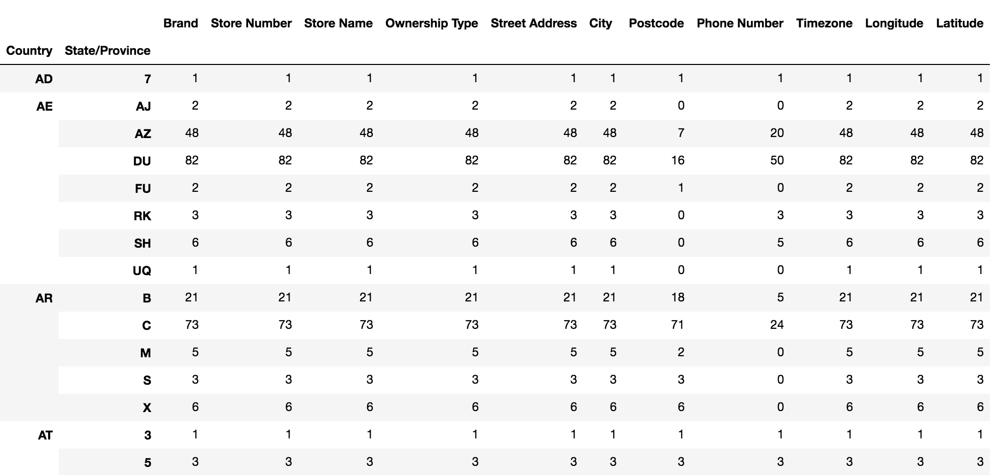
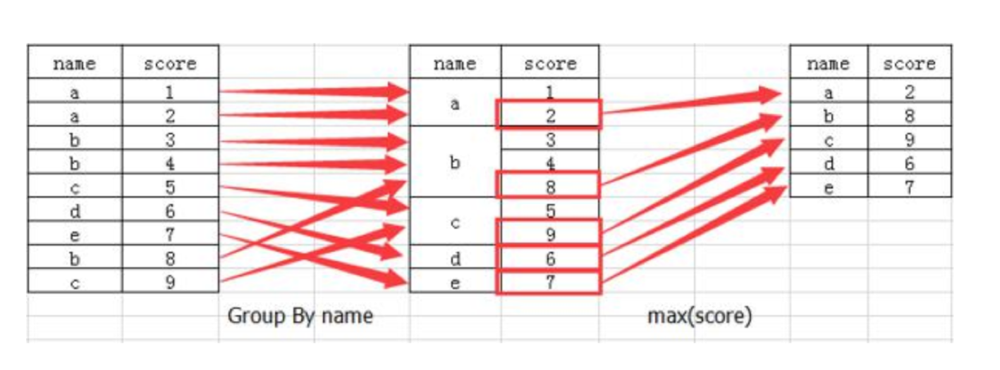
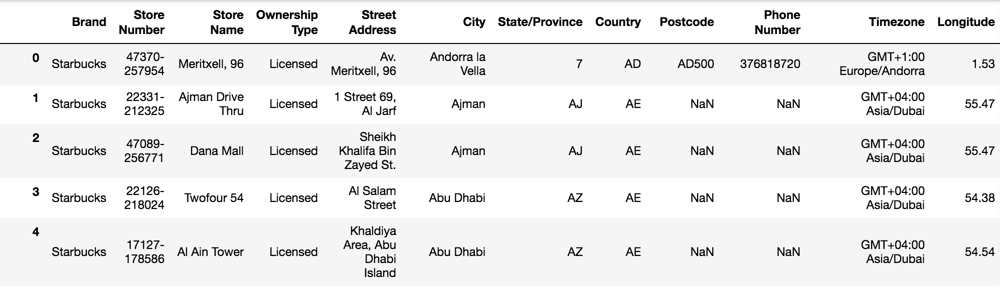

# 第十八单元  Pandas

## **一、昨日知识点回顾**

```python
1.numpy处理数据的流程
2.numpy的常用方法
```

------

## **二、考核目标**

```
1.pandas处理数据的流程
2.pandas的常用方法
```

------

## **三、本单元知识详讲**

### 18.1 Pandas介绍

------

#### 18.1.1 Pandas介绍


- 2008年WesMcKinney开发出的库
- 专门用于数据挖掘的开源python库
- **以Numpy为基础，借力Numpy模块在计算方面性能高的优势**
- **基于matplotlib，能够简便的画图**
- **独特的数据结构**

#### 18.1.2 为什么使用Pandas

Numpy已经能够帮助我们处理数据，能够结合matplotlib解决部分数据展示等问题，那么pandas学习的目的在什么地方呢？

- 增强图表可读性
  - 回忆我们在numpy当中创建学生成绩表样式：
- 返回结果：

```python
  array([[92, 55, 78, 50, 50],
         [71, 76, 50, 48, 96],
         [45, 84, 78, 51, 68],
         [81, 91, 56, 54, 76],
         [86, 66, 77, 67, 95],
         [46, 86, 56, 61, 99],
         [46, 95, 44, 46, 56],
         [80, 50, 45, 65, 57],
         [41, 93, 90, 41, 97],
         [65, 83, 57, 57, 40]])
```

如果数据展示为这样，可读性就会更友好：


- **便捷的数据处理能力**

  

- **读取文件方便**
- **封装了Matplotlib、Numpy的画图和计算**

### 18.2 Pandas数据类型

------

Pandas中一共有三种数据类型，分别为：Series、DataFrame和MultiIndex（老版本中叫Panel ）。

其中Series是一维数据类型，DataFrame是二维的表格型数据类型，MultiIndex是三维的数据类型。

#### 18.2.1.Series

Series是一个类似于一维数组的数据类型，它能够保存任何类型的数据，比如整数、字符串、浮点数等，**主要由一组数据和与之相关的索引两部分构成。**


1 Series的创建

```python
# 导入pandas
import pandas as pd

pd.Series(data=None, index=None, dtype=None)
```

- 参数：
  - data：传入的数据，可以是ndarray、list等
  - index：索引，必须是唯一的，且与数据的长度相等。如果没有传入索引参数，则默认会自动创建一个从0-N的整数索引。
  - dtype：数据的类型

通过已有数据创建

- 指定内容，默认索引

```python
pd.Series(np.arange(10))
# 运行结果
0    0
1    1
2    2
3    3
4    4
5    5
6    6
7    7
8    8
9    9
dtype: int64
```

- 指定索引

```python
pd.Series([6.7,5.6,3,10,2], index=[1,2,3,4,5])
# 运行结果
1     6.7
2     5.6
3     3.0
4    10.0
5     2.0
dtype: float64
```

- 通过字典数据创建

```python
color_count = pd.Series({'red':100, 'blue':200, 'green': 500, 'yellow':1000})
color_count
# 运行结果
blue       200
green      500
red        100
yellow    1000
dtype: int64
```

2 Series的属性

为了更方便地操作Series对象中的索引和数据，**Series中提供了两个属性index和values**

- index

```python
color_count.index

# 结果
Index(['blue', 'green', 'red', 'yellow'], dtype='object')
```

- values

```python
color_count.values

# 结果
array([ 200,  500,  100, 1000])
```

也可以使用索引来获取数据：

```python
color_count[2]

# 结果
100
```

#### 18.2.2 DataFrame

DataFrame是一个类似于二维数组或表格(如excel)的对象，既有行索引，又有列索引

- 行索引，表明不同行，横向索引，叫index，0轴，axis=0
- 列索引，表名不同列，纵向索引，叫columns，1轴，axis=1


1 DataFrame的创建

```python
# 导入pandas
import pandas as pd

pd.DataFrame(data=None, index=None, columns=None)
```

参数

- index：行标签。如果没有传入索引参数，则默认会自动创建一个从0-N的整数索引。
- columns：列标签。如果没有传入索引参数，则默认会自动创建一个从0-N的整数索引。

------

通过已有数据创建

举例一：

```python
pd.DataFrame(np.random.randn(2,3))
```


回忆咱们在前面直接使用np创建的数组显示方式，比较两者的区别。

举例二：创建学生成绩表

```python
# 生成10名同学，5门功课的数据
score = np.random.randint(40, 100, (10, 5))

# 结果
array([[92, 55, 78, 50, 50],
       [71, 76, 50, 48, 96],
       [45, 84, 78, 51, 68],
       [81, 91, 56, 54, 76],
       [86, 66, 77, 67, 95],
       [46, 86, 56, 61, 99],
       [46, 95, 44, 46, 56],
       [80, 50, 45, 65, 57],
       [41, 93, 90, 41, 97],
       [65, 83, 57, 57, 40]])
```

**但是这样的数据形式很难看到存储的是什么的样的数据，可读性比较差！！**

**问题：如何让数据更有意义的显示**？

```python
# 使用Pandas中的数据类型
score_df = pd.DataFrame(score)
```


给分数数据增加行列索引,显示效果更佳

效果：


- 增加行、列索引

```python
# 构造列索引序列
subjects = ["语文", "数学", "英语", "政治", "体育"]

# 构造行索引序列
stu = ['同学' + str(i) for i in range(score_df.shape[0])]

# 添加行、列索引
data = pd.DataFrame(score, columns=subjects, index=stu)
```

 DataFrame的属性

- **shape**

```python
data.shape

# 结果
(10, 5)
```

- **index**

DataFrame的行索引列表

```python
data.index

# 结果
Index(['同学0', '同学1', '同学2', '同学3', '同学4', '同学5', '同学6', '同学7', '同学8', '同学9'], dtype='object')
```

- **columns**

DataFrame的列索引列表

```python
data.columns

# 结果
Index(['语文', '数学', '英语', '政治', '体育'], dtype='object')
```

- **values**

直接获取其中array的值

```python
data.values

array([[92, 55, 78, 50, 50],
       [71, 76, 50, 48, 96],
       [45, 84, 78, 51, 68],
       [81, 91, 56, 54, 76],
       [86, 66, 77, 67, 95],
       [46, 86, 56, 61, 99],
       [46, 95, 44, 46, 56],
       [80, 50, 45, 65, 57],
       [41, 93, 90, 41, 97],
       [65, 83, 57, 57, 40]])
```

- **T**

转置

```
data.T
```

结果


- **head(5)**：显示前5行内容

如果不补充参数，默认5行。填入参数N则显示前N行

```python
data.head(5)
```


- **tail(5)**:显示后5行内容

如果不补充参数，默认5行。填入参数N则显示后N行

```python
data.tail(5)
```

 DatatFrame索引的设置

需求：


1 修改行列索引值

```python
stu = ["学生_" + str(i) for i in range(score_df.shape[0])]

# 必须整体全部修改
data.index = stu
```

注意：以下修改方式是错误的

```python
# 错误修改方式
data.index[3] = '学生_3'
```

 重设索引

reset_index(drop=False)

- 设置新的下标索引
- drop:默认为False，不删除原来索引，如果为True,删除原来的索引值

```python
# 重置索引,drop=False
data.reset_index()
```


```python
# 重置索引,drop=True
data.reset_index(drop=True)
```

 某列值设置为新的索引

set_index(keys, drop=True)

- **keys** : 列索引名成或者列索引名称的列表
- **drop** : boolean, default True.当做新的索引，删除原来的列

设置新索引案例

1、创建

```python
df = pd.DataFrame({'month': [1, 4, 7, 10],
                    'year': [2012, 2014, 2013, 2014],
                    'sale':[55, 40, 84, 31]})

   month  sale  year
0  1      55    2012
1  4      40    2014
2  7      84    2013
3  10     31    2014
```

2、以月份设置新的索引

```python
df.set_index('month')
       sale  year
month
1      55    2012
4      40    2014
7      84    2013
10     31    2014
```

3、设置多个索引，以年和月份

```python
df = df.set_index(['year', 'month'])
df
            sale
year  month
2012  1     55
2014  4     40
2013  7     84
2014  10    31
```

> 注：通过刚才的设置，这样DataFrame就变成了一个具有MultiIndex的DataFrame。

#### 18.2.3 MultiIndex与Panel

 MultiIndex

MultiIndex是三维的数据类型;

多级索引（也称层次化索引）是pandas的重要功能，可以在Series、DataFrame对象上拥有2个以及2个以上的索引。

 multiIndex的特性

打印刚才的df的行索引结果

```python
df.index

MultiIndex(levels=[[2012, 2013, 2014], [1, 4, 7, 10]],
           labels=[[0, 2, 1, 2], [0, 1, 2, 3]],
           names=['year', 'month'])
levels对应索引有哪些

labels[[0, 2, 1, 2], [0, 1, 2, 3]]对应的是两个索引标签在levels中出现的下标位置
```

多级或分层索引对象。

index属性

- names:levels的名称
- levels：每个level的元组值

```python
df.index.names
# FrozenList(['year', 'month'])

df.index.levels
# FrozenList([[1, 2], [1, 4, 7, 10]])
```

multiIndex的创建

```python
# 构造索引
arrays = [[1, 1, 2, 2], ['red', 'blue', 'red', 'blue']]
mi_index = pd.MultiIndex.from_arrays(arrays, names=('number', 'color'))

# 结果
MultiIndex(levels=[[1, 2], ['blue', 'red']],
           codes=[[0, 0, 1, 1], [1, 0, 1, 0]],
           names=['number', 'color'])
mi_df = pd.DataFrame(np.random.normal(size=(4,4)),index=mi_index)
mi_df
```

### 18.3 基本数据操作

为了更好的理解这些基本操作，我们将读取一个真实的股票数据。关于文件操作，后面在介绍，这里只先用一下API

```python
# 读取文件
data = pd.read_csv("./data/stock_day.csv")

# 删除一些列，让数据更简单些，再去做后面的操作
data = data.drop(["ma5","ma10","ma20","v_ma5","v_ma10","v_ma20"], axis=1)
```


#### 18.3.1 索引操作

Numpy当中我们已经讲过使用索引选取序列和切片选择，pandas也支持类似的操作，也可以直接使用列名、行名

称，甚至组合使用。

1 **直接使用行列索引**

获取'2018-02-27'这天的'close'的结果

```python
# 直接使用行列索引名字的方式（先列后行）
data['open']['2018-02-27']
23.53

# 不支持的操作
# 错误
data['2018-02-27']['open']
# 错误
data[:1, :2]
```

2 **结合loc、iloc使用索引**

获取从'2018-02-27':'2018-02-22'，'open'的结果

```python
# 使用loc:只能指定行列索引的名字
data.loc['2018-02-27':'2018-02-22', 'open']

2018-02-27    23.53
2018-02-26    22.80
2018-02-23    22.88
Name: open, dtype: float64

# 使用iloc可以通过索引的下标去获取
# 获取前3天数据,前5列的结果
data.iloc[:3, :5]

            open    high    close    low
2018-02-27    23.53    25.88    24.16    23.53
2018-02-26    22.80    23.78    23.53    22.80
2018-02-23    22.88    23.37    22.82    22.71
```

3 **使用ix组合索引**

不需要关注，了解

> Warning:Starting in 0.20.0, the `.ix` indexer is deprecated, in favor of the more strict `.iloc` and `.loc` indexers.

获取行第1天到第4天，['open', 'close', 'high', 'low']这个四个指标的结果

```python
# 使用ix进行下表和名称组合做引（旧版内容，做自行了解，使用下面方式获取）
data.ix[0:4, ['open', 'close', 'high', 'low']]

# 推荐使用loc和iloc来获取的方式
data.loc[data.index[0:4], ['open', 'close', 'high', 'low']]
data.iloc[0:4, data.columns.get_indexer(['open', 'close', 'high', 'low'])]

            open    close    high    low
2018-02-27    23.53    24.16    25.88    23.53
2018-02-26    22.80    23.53    23.78    22.80
2018-02-23    22.88    22.82    23.37    22.71
2018-02-22    22.25    22.28    22.76    22.02
```

#### 18.3.2 赋值操作

对DataFrame当中的close列进行重新赋值为1

```python
# 直接修改原来的值
data['close'] = 1
# 或者
data.close = 1
```

#### 18.3.3 排序

排序有两种形式，一种对于索引进行排序，一种对于内容进行排序

DataFrame排序

- 使用df.sort_values(by=, ascending=)单个键或者多个键进行排序,

```
参数：
* by：指定排序参考的键
* ascending:默认升序
    * ascending=False:降序
    * ascending=True:升序
# 按照开盘价大小进行排序 , 使用ascending指定按照大小排序
data.sort_values(by="open", ascending=True).head()
```


```python
# 按照多个键进行排序
data.sort_values(by=['open', 'high'])
```


- 使用df.sort_index给索引进行排序

这个股票的日期索引原来是从大到小，现在重新排序，从小到大

```python
# 对索引进行排序
data.sort_index()
```


Series排序

- 使用series.sort_values(ascending=True)进行排序

series排序时，只有一列，不需要参数

```python
data['p_change'].sort_values(ascending=True).head()

2015-09-01     -10.03
2015-09-14     -10.02
2016-01-11     -10.02
2015-07-15     -10.02
2015-08-26     -10.01
Name: p_change, dtype: float64
```

- 使用series.sort_index()进行排序

与df一致

```python
# 对索引进行排序
data['p_change'].sort_index().head()

2015-03-02    2.62
2015-03-03    1.44
2015-03-04    1.57
2015-03-05    2.02
2015-03-06    8.51
Name: p_change, dtype: float64
```


### 18.4 DataFrame运算

------

#### 18.4.1 算术运算

- add(other)

比如进行数学运算加上具体的一个数字

```python
data['open'].add(1)

2018-02-27    24.53
2018-02-26    23.80
2018-02-23    23.88
2018-02-22    23.25
2018-02-14    22.49
```

- sub(other) 减法

#### 18.4.2 逻辑运算

逻辑运算符号

- 例如筛选data["open"] > 23的日期数据

```python
data["open"] > 23

2018-02-27     True
2018-02-26    False
2018-02-23    False
2018-02-22    False
2018-02-14    False
# 逻辑判断的结果可以作为筛选的依据
data[data["open"] > 23].head()
```


- 完成多个逻辑判断，

```python
data[(data["open"] > 23) & (data["open"] < 24)].head()
```


 逻辑运算函数

- query(expr)

```
参数：
expr:查询字符串
```

通过query使得刚才的过程更加方便简单

```python
data.query("open<24 & open>23").head()
```

- isin(values)

例如判断'open'是否为23.53和23.85

```python
# 可以指定值进行一个判断，从而进行筛选操作
data[data["open"].isin([23.53, 23.85])]
```


#### 18.4.3 统计运算

1 describe

综合分析: 能够直接得出很多统计结果,`count`, `mean`, `std`, `min`, `max` 等

```python
# 计算平均值、标准差、最大值、最小值
data.describe()
```


2 统计函数

Numpy当中已经详细介绍，在这里我们演示min(最小值), max(最大值), mean(平均值), median(中位数), var(方差), std(标准差),mode(众数，简单理解整体数据中出现最多的数)结果:

| 函数     | 作用                                           |
| -------- | ---------------------------------------------- |
| `sum`    | **Sum of values**                              |
| `mean`   | **Mean of values**                             |
| `median` | Arithmetic median of values                    |
| `min`    | **Minimum**                                    |
| `max`    | **Maximum**                                    |
| `count`  | Number of non-NA observations                  |
| `abs`    | Absolute Value                                 |
| `prod`   | Product of values                              |
| `std`    | **Bessel-corrected sample standard deviation** |
| `var`    | **Unbiased variance**                          |
| `idxmax` | compute the index labels with the maximum      |
| `idxmin` | compute the index labels with the minimum      |
| `mode`   | Mode                                           |

**对于单个函数去进行统计的时候，坐标轴还是按照默认列“columns” (axis=0, default)，如果要对行“index” 需要指定(axis=1)**

- max()、min()

```python
# 使用统计函数：0 代表列求结果， 1 代表行求统计结果
data.max(0)

open                   34.99
high                   36.35
close                  35.21
low                    34.01
volume             501915.41
price_change            3.03
p_change               10.03
turnover               12.56
my_price_change         3.41
dtype: float64
```

- std()、var()

```python
# 方差
data.var(0)

open               1.545255e+01
high               1.662665e+01
close              1.554572e+01
low                1.437902e+01
volume             5.458124e+09
price_change       8.072595e-01
p_change           1.664394e+01
turnover           4.323800e+00
my_price_change    6.409037e-01
dtype: float64

# 标准差
data.std(0)

open                   3.930973
high                   4.077578
close                  3.942806
low                    3.791968
volume             73879.119354
price_change           0.898476
p_change               4.079698
turnover               2.079375
my_price_change        0.800565
dtype: float64
```

- **median()：中位数**

中位数为将数据从小到大排列，在最中间的那个数为中位数。如果没有中间数，取中间两个数的平均值。

```python
df = pd.DataFrame({'COL1' : [2,3,4,5,4,2],
                   'COL2' : [0,1,2,3,4,2]})

df.median()

COL1    3.5
COL2    2.0
dtype: float64
```

- idxmax()、idxmin()

```python
# 求出最大值的位置
data.idxmax(axis=0)

open               2015-06-15
high               2015-06-10
close              2015-06-12
low                2015-06-12
volume             2017-10-26
price_change       2015-06-09
p_change           2015-08-28
turnover           2017-10-26
my_price_change    2015-07-10
dtype: object


# 求出最小值的位置
data.idxmin(axis=0)

open               2015-03-02
high               2015-03-02
close              2015-09-02
low                2015-03-02
volume             2016-07-06
price_change       2015-06-15
p_change           2015-09-01
turnover           2016-07-06
my_price_change    2015-06-15
dtype: object
```

3 累计统计函数

| 函数      | 作用                        |
| --------- | --------------------------- |
| `cumsum`  | **计算前1/2/3/…/n个数的和** |
| `cummax`  | 计算前1/2/3/…/n个数的最大值 |
| `cummin`  | 计算前1/2/3/…/n个数的最小值 |
| `cumprod` | 计算前1/2/3/…/n个数的积     |

**那么这些累计统计函数怎么用？**


以上这些函数可以对series和dataframe操作

这里我们按照时间的从前往后来进行累计

- 排序

```python
# 排序之后，进行累计求和
data = data.sort_index()
```

- 对p_change进行求和

```python
stock_rise = data['p_change']
# plot方法集成了前面直方图、条形图、饼图、折线图
stock_rise.cumsum()
示例：
a = np.array([1, 2, 3, 4, 5])
result1 = np.cumsum(a, axis=0)
result1是正向累加，得到的结果为[1, 3, 6, 10, 15]

2015-03-02      2.62
2015-03-03      4.06
2015-03-04      5.63
2015-03-05      7.65
2015-03-06     16.16
2015-03-09     16.37
2015-03-10     18.75
2015-03-11     16.36
2015-03-12     15.03
2015-03-13     17.58
2015-03-16     20.34
2015-03-17     22.42
2015-03-18     23.28
2015-03-19     23.74
2015-03-20     23.48
2015-03-23     23.74
```

**那么如何让这个连续求和的结果更好的显示呢？**


如果要使用plot函数，需要导入matplotlib.

```python
import matplotlib.pyplot as plt
# plot显示图形
stock_rise.cumsum().plot()
# 需要调用show，才能显示出结果
plt.show()
```

> 关于plot，稍后会介绍API的选择

#### 18.4.4 自定义运算

- apply(func, axis=0)
  - func:自定义函数
  - axis=0:默认是列，axis=1为行进行运算
- 定义一个对列，最大值-最小值的函数

```python
data[['open', 'close']].apply(lambda x: x.max() - x.min(), axis=0)

open     22.74
close    22.85
dtype: float64
```

#### 18.4.5 小结

- 算术运算【知道】
- 逻辑运算【知道】
  - 1.逻辑运算符号
  - 2.逻辑运算函数
    - 对象.query()
    - 对象.isin()
- 统计运算【知道】
  - 1.对象.describe()
  - 2.统计函数
  - 3.累积统计函数
- 自定义运算【知道】
  - apply(func, axis=0)


### 18.5 Pandas画图

------

#### 18.5.1 pandas.DataFrame.plot

`DataFrame.plot`(*kind='line'*)

kind : str，需要绘制图形的种类

------

- **‘line’ : line plot (default)**
- ‘bar’ : vertical bar plot
- ‘barh’ : horizontal bar plot
  - 关于“barh”的解释：
  - http://pandas.pydata.org/pandas-docs/stable/reference/api/pandas.DataFrame.plot.barh.html
- ‘hist’ : histogram
- ‘pie’ : pie plot
- ‘scatter’ : scatter plot

> 更多细节：https://pandas.pydata.org/pandas-docs/stable/generated/pandas.DataFrame.plot.html?highlight=plot#pandas.DataFrame.plot

#### 18.5.2 pandas.Series.plot

> 更多细节：https://pandas.pydata.org/pandas-docs/stable/generated/pandas.Series.plot.html?highlight=plot#pandas.Series.plot


### 18.6 文件读取与存储

------

我们的数据大部分存在于文件当中，所以pandas会支持复杂的IO操作，pandas的API支持众多的文件格式，如CSV、SQL、XLS、JSON、HDF5。

> 注：最常用的HDF5和CSV文件


#### 18.6.1 CSV

 read_csv

pandas.read_csv(filepath_or_buffer, sep =',', usecols )

------

参数：

- filepath_or_buffer:文件路径
- sep :分隔符，默认用","隔开
- usecols:指定读取的列名，列表形式

------

举例：读取之前的股票的数据

```python
# 读取文件,并且指定只获取'open', 'close'指标
data = pd.read_csv("./data/stock_day.csv", usecols=['open', 'close'])

            open    close
2018-02-27    23.53    24.16
2018-02-26    22.80    23.53
2018-02-23    22.88    22.82
2018-02-22    22.25    22.28
2018-02-14    21.49    21.92

遍历数据
for index, row in data.iterrows():  
    print(row[0],row[1])

  
```

~~~


案例：
自动化测试，测试人员把数据写入csv，根据csv去数据库中加记录，点击测试批量测试

1.前端加一个按钮，文件上传按钮
2.选择文件，文件上传，django写一个文件上传的接口，接收文件上传到static目录下
3.读取静态文件，写入数据库


点击批量测试，测试完把结果写入csv
id  请求url  响应结果  是否通过  测试时间

pandas搜索+分组获取数据，用matplotlib画柱状图 ，每个月case通过的数量

~~~


vue文件上传

~~~
<template>
  <el-upload
    class="avatar-uploader"
    action="https://localhost:8000/readCsv/"
    :show-file-list="false"
    :on-success="handleAvatarSuccess"
    :before-upload="beforeAvatarUpload"
  >
    
    <el-icon v-else class="avatar-uploader-icon"><Plus /></el-icon>
  </el-upload>
</template>

<script lang="ts" setup>
import { ref } from 'vue'
import { ElMessage } from 'element-plus'
import { Plus } from '@element-plus/icons-vue'

import type { UploadProps } from 'element-plus'

const imageUrl = ref('')

const handleAvatarSuccess: UploadProps['onSuccess'] = (
  response,
  uploadFile
) => {
  imageUrl.value = URL.createObjectURL(uploadFile.raw!)
}

const beforeAvatarUpload: UploadProps['beforeUpload'] = (rawFile) => {

  return true
}
</script>

<style scoped>
.avatar-uploader .avatar {
  width: 178px;
  height: 178px;
  display: block;
}
</style>

<style>
.avatar-uploader .el-upload {
  border: 1px dashed var(--el-border-color);
  border-radius: 6px;
  cursor: pointer;
  position: relative;
  overflow: hidden;
  transition: var(--el-transition-duration-fast);
}

.avatar-uploader .el-upload:hover {
  border-color: var(--el-color-primary);
}

.el-icon.avatar-uploader-icon {
  font-size: 28px;
  color: #8c939d;
  width: 178px;
  height: 178px;
  text-align: center;
}
</style>

~~~

 

文件上传配制

1.在项目根目录下创建media文件夹

2.在settings文件中配制

import os

DEFAULT_AUTO_FIELD = "django.db.models.BigAutoField"

MEDIA_ROOT = os.path.join(BASE_DIR, 'media')  # 指向你的媒体文件存储目录  

MEDIA_URL = '/media/'  # 用于URL配置的媒体文件访问前缀

3.文件上传代码

~~~python
import os
from llmproject import settings
class FileUpload(APIView):
    def post(self,request):
        file = request.FILES['file']
         
        # 生成文件路径  
        file_path = os.path.join(settings.MEDIA_ROOT, file.name)  
        with open(file_path, 'wb+') as destination:  
            for chunk in file.chunks():  
                destination.write(chunk) 
                
        return Response({"code":200})   
~~~


写入Mysql

~~~python
class TestView(APIView):
    def get(self,request):
        # CSV文件路径  
        csv_file_path = '/Users/hanxiaobai/Downloads/dxb/2310a/education/courses/1.csv'  
        
        # MySQL数据库连接信息  
        username = 'root'  
        password = 'mysql123'  
        host = 'localhost'  
        database = 'books'  
        
        # 使用SQLAlchemy创建数据库引擎  
        # 注意：这里使用pymysql作为数据库驱动  
        engine = create_engine(f'mysql+pymysql://{username}:{password}@{host}/{database}')  
        
        # 读取CSV文件  
        df = pd.read_csv(csv_file_path)  
        
        # 写入MySQL数据库  
        # 注意：如果表不存在，to_sql将自动创建表，但请注意数据类型可能需要手动调整  
        # if_exists参数用于控制如果表已存在时的行为：'fail', 'replace', 'append'  
        df.to_sql('testtable', con=engine, if_exists='replace', index=False)  
        
        print("数据已写入MySQL数据库")
~~~


to_csv

```python
DataFrame.to_csv(path_or_buf=None, sep=', ’, columns=None, header=True, index=True, mode='w', encoding=None)
```

------

参数：

- path_or_buf :文件路径
- sep :分隔符，默认用","隔开
- columns :选择需要的列索引
- header :boolean or list of string, default True,是否写进列索引值
- index:是否写进行索引
- mode:'w'：重写, 'a' 追加

------

举例：保存读取出来的股票数据

- 保存'open'列的数据，然后读取查看结果

```python
# 选取10行数据保存,便于观察数据
data[:10].to_csv("./data/test.csv", columns=['open'])
# 读取，查看结果
pd.read_csv("./data/test.csv")

     Unnamed: 0    open
0    2018-02-27    23.53
1    2018-02-26    22.80
2    2018-02-23    22.88
3    2018-02-22    22.25
4    2018-02-14    21.49
5    2018-02-13    21.40
6    2018-02-12    20.70
7    2018-02-09    21.20
8    2018-02-08    21.79
9    2018-02-07    22.69
```

会发现将索引存入到文件当中，变成单独的一列数据。如果需要删除，可以指定index参数,删除原来的文件，重新保存一次。

```python
# index:存储不会讲索引值变成一列数据
data[:10].to_csv("./data/test.csv", columns=['open'], index=False)
```

#### 18.6.2 HDF5

read_hdf与to_hdf

**HDF5文件的读取和存储需要指定一个键，值为要存储的DataFrame**

```python
pandas.read_hdf(path_or_buf，key =None，** kwargs)

# 从h5文件当中读取数据
```

------

参数：

- path_or_buffer:文件路径
- key:读取的键
- return:Theselected object

```python
DataFrame.to_hdf(path_or_buf, *key*, **\*kwargs*)
```

 案例

- 读取文件

```python
day_close = pd.read_hdf("./data/day_close.h5")
```

如果读取的时候出现以下错误


需要安装安装tables模块避免不能读取HDF5文件

```python
pip install tables
```


- 存储文件

```python
day_close.to_hdf("./data/test.h5", key="day_close")
```

再次读取的时候, 需要指定键的名字

```python
new_close = pd.read_hdf("./data/test.h5", key="day_close")
```

**注意：优先选择使用HDF5文件存储**

- HDF5在存储的时候支持压缩，**使用的方式是blosc，这个是速度最快**的也是pandas默认支持的
- 使用压缩可以**提磁盘利用率，节省空间**
- HDF5还是跨平台的，可以轻松迁移到hadoop 上面

#### 18.6.3 JSON

JSON是我们常用的一种数据交换格式，前面在前后端的交互经常用到，也会在存储的时候选择这种格式。所以我们需要知道Pandas如何进行读取和存储JSON格式。

 read_json

```python
pandas.read_json(path_or_buf=None, orient=None, typ='frame', lines=False)
# 将JSON格式准换成默认的Pandas DataFrame格式
```

------

参数：

- orient : string,Indication of expected JSON string format.

  - 'split' : dict like {index -> [index], columns -> [columns], data -> [values]}

    - split 将索引总结到索引，列名到列名，数据到数据。将三部分都分开了

  - 'records' : list like [{column -> value}, ... , {column -> value}]

    - records 以`columns：values`的形式输出

  - 'index' : dict like {index -> {column -> value}}

    - index 以`index：{columns：values}...`的形式输出

  - 'columns' : dict like {column -> {index -> value}}

    ,默认该格式

    - colums 以`columns:{index:values}`的形式输出

  - 'values' : just the values array

    - values 直接输出值

- lines : boolean, default False

  - 按照每行读取json对象

- typ : default ‘frame’， 指定转换成的对象类型series或者dataframe

------

read_josn 案例：

- 数据介绍

这里使用一个新闻标题讽刺数据集，格式为json。`is_sarcastic`：1讽刺的，否则为0；`headline`：新闻报道的标题；`article_link`：链接到原始新闻文章。存储格式为：

```json
{"article_link": "https://www.huffingtonpost.com/entry/versace-black-code_us_5861fbefe4b0de3a08f600d5", "headline": "former versace store clerk sues over secret 'black code' for minority shoppers", "is_sarcastic": 0}
{"article_link": "https://www.huffingtonpost.com/entry/roseanne-revival-review_us_5ab3a497e4b054d118e04365", "headline": "the 'roseanne' revival catches up to our thorny political mood, for better and worse", "is_sarcastic": 0}
```

- 读取

orient指定存储的json格式，lines指定按照行去变成一个样本

```python
json_read = pd.read_json("./data/Sarcasm_Headlines_Dataset.json", orient="records", lines=True)
```

结果为：


to_json

```python
DataFrame.to_json(*path_or_buf=None*, *orient=None*, *lines=False*)
```

------

参数：

- 将Pandas 对象存储为json格式
- *path_or_buf=None*：文件地址
- orient:存储的json形式，{‘split’,’records’,’index’,’columns’,’values’}
- lines:一个对象存储为一行

------

案例：

- 存储文件

```python
json_read.to_json("./data/test.json", orient='records')
```

结果

```
[{"article_link":"https:\/\/www.huffingtonpost.com\/entry\/versace-black-code_us_5861fbefe4b0de3a08f600d5","headline":"former versace store clerk sues over secret 'black code' for minority shoppers","is_sarcastic":0},{"article_link":"https:\/\/www.huffingtonpost.com\/entry\/roseanne-revival-review_us_5ab3a497e4b054d118e04365","headline":"the 'roseanne' revival catches up to our thorny political mood, for better and worse","is_sarcastic":0},{"article_link":"https:\/\/local.theonion.com\/mom-starting-to-fear-son-s-web-series-closest-thing-she-1819576697","headline":"mom starting to fear son's web series closest thing she will have to grandchild","is_sarcastic":1},{"article_link":"https:\/\/politics.theonion.com\/boehner-just-wants-wife-to-listen-not-come-up-with-alt-1819574302","headline":"boehner just wants wife to listen, not come up with alternative debt-reduction ideas","is_sarcastic":1},{"article_link":"https:\/\/www.huffingtonpost.com\/entry\/jk-rowling-wishes-snape-happy-birthday_us_569117c4e4b0cad15e64fdcb","headline":"j.k. rowling wishes snape happy birthday in the most magical way","is_sarcastic":0},{"article_link":"https:\/\/www.huffingtonpost.com\/entry\/advancing-the-worlds-women_b_6810038.html","headline":"advancing the world's women","is_sarcastic":0},....]
```

- 修改lines参数为True

```python
json_read.to_json("./data/test.json", orient='records', lines=True)
```

结果

```
{"article_link":"https:\/\/www.huffingtonpost.com\/entry\/versace-black-code_us_5861fbefe4b0de3a08f600d5","headline":"former versace store clerk sues over secret 'black code' for minority shoppers","is_sarcastic":0}
{"article_link":"https:\/\/www.huffingtonpost.com\/entry\/roseanne-revival-review_us_5ab3a497e4b054d118e04365","headline":"the 'roseanne' revival catches up to our thorny political mood, for better and worse","is_sarcastic":0}
{"article_link":"https:\/\/local.theonion.com\/mom-starting-to-fear-son-s-web-series-closest-thing-she-1819576697","headline":"mom starting to fear son's web series closest thing she will have to grandchild","is_sarcastic":1}
{"article_link":"https:\/\/politics.theonion.com\/boehner-just-wants-wife-to-listen-not-come-up-with-alt-1819574302","headline":"boehner just wants wife to listen, not come up with alternative debt-reduction ideas","is_sarcastic":1}
{"article_link":"https:\/\/www.huffingtonpost.com\/entry\/jk-rowling-wishes-snape-happy-birthday_us_569117c4e4b0cad15e64fdcb","headline":"j.k. rowling wishes snape happy birthday in the most magical way","is_sarcastic":0}...
```

------

#### 18.6.4 小结

- pandas的CSV、HDF5、JSON文件的读取【知道】
  - 对象.read_**()
  - 对象.to_**()


### 18.7 高级处理-缺失值处理

------


#### 18.7.1 如何处理nan

- 获取缺失值的标记方式(NaN或者其他标记方式)
- 如果缺失值的标记方式是NaN
  - 判断数据中是否包含NaN：
    - pd.isnull(df),
    - pd.notnull(df)
  - 存在缺失值nan:
    - 1、删除存在缺失值的:dropna(axis='rows')
      - 注：不会修改原数据，需要接受返回值
    - 2、替换缺失值:fillna(value, inplace=True)
      - value:替换成的值
      - inplace:True:会修改原数据，False:不替换修改原数据，生成新的对象
- 如果缺失值没有使用NaN标记，比如使用"？"
  - 先替换‘?’为np.nan，然后继续处理

#### 18.7.2 数据的缺失值处理举例

- 电影数据文件获取

```python
# 读取电影数据
movie = pd.read_csv("./data/IMDB-Movie-Data.csv")
```


1 判断缺失值是否存在

- pd.notnull()

```
#先查看所有情况
pd.notnull(movie)
Rank    Title    Genre    Description    Director    Actors    Year    Runtime (Minutes)    Rating    Votes    Revenue (Millions)    Metascore
0    True    True    True    True    True    True    True    True    True    True    True    True
1    True    True    True    True    True    True    True    True    True    True    True    True
2    True    True    True    True    True    True    True    True    True    True    True    True
3    True    True    True    True    True    True    True    True    True    True    True    True
4    True    True    True    True    True    True    True    True    True    True    True    True
5    True    True    True    True    True    True    True    True    True    True    True    True
6    True    True    True    True    True    True    True    True    True    True    True    True
7    True    True    True    True    True    True    True    True    True    True    False    True

np.all(pd.notnull(movie))#如果有一个缺失值，就返回Flask，说明有缺失值
np.any(pd.isnull(movie)) #如果有缺失值，返回True
```

- pd.isnull()

2 缺失值是nan标记处理方式

- 1、删除

pandas删除缺失值，使用dropna的前提是，缺失值的类型必须是np.nan

```python
# 不修改原数据
movie.dropna()

# 可以定义新的变量接受或者用原来的变量名
data = movie.dropna()

如果数据不多，且不重要可以删除
如果缺失数据较多，或者数据列较为重要，替换
* 2、替换缺失值--重新查看原数据，以Revenue(Millions)举例
# 替换存在缺失值的样本的两列
# 替换填充平均值，中位数
fillna()
inplace 是否替换原有值
# movie['Revenue (Millions)'].fillna(movie['Revenue (Millions)'].mean(), inplace=True)
这样替换，需要一列一列的替换，如果列表中列较多，如何？
```

替换所有缺失值：

```python
for i in movie.columns:
    if np.all(pd.notnull(movie[i])) == False:
        print(i)
        movie[i].fillna(movie[i].mean(), inplace=True)
        
最后查看，是否还有缺失值：
np.all(pd.notnull(movie))#如果有缺失值，就返回Flask，说明有缺失值
```

3 缺失值不是nan标记的处理方式

数据是这样的：


```python
wis = pd.read_csv("https://archive.ics.uci.edu/ml/machine-learning-databases/breast-cancer-wisconsin/breast-cancer-wisconsin.data")
```

以上数据在读取时，可能会报如下错误：

```
URLError: <urlopen error [SSL: CERTIFICATE_VERIFY_FAILED] certificate verify failed (_ssl.c:833)>
```

解决办法：

```python
# 全局取消证书验证
import ssl
ssl._create_default_https_context = ssl._create_unverified_context
```

**处理思路分析：**

1、先替换‘?’为np.nan

- df.replace(to_replace=, value=)
  - to_replace:替换前的值
  - value:替换后的值

```python
# 把一些其它值标记的缺失值，替换成np.nan
wis = wis.replace(to_replace='?', value=np.nan)
```

2、在进行缺失值的处理

```python
# 删除
wis = wis.dropna()
```

#### 18.7.3 小结

- isnull、notnull判断是否存在缺失值【知道】
  - np.any(pd.isnull(movie)) # 里面如果有一个缺失值,就返回True
  - np.all(pd.notnull(movie)) # 里面如果有一个缺失值,就返回False
- dropna删除np.nan标记的缺失值【知道】
  - movie.dropna()
- fillna填充缺失值【知道】
  - movie[i].fillna(value=movie[i].mean(), inplace=True)
- replace替换具体某些值【知道】
  - wis.replace(to_replace="?", value=np.NaN)


### 18.8 高级处理-分组与聚合

------

**分组与聚合通常是分析数据的一种方式，通常与一些统计函数一起使用，查看数据的分组情况**

想一想其实刚才的交叉表与透视表也有分组的功能，所以算是分组的一种形式，只不过他们主要是计算次数或者计算比例！！看其中的效果：



#### 18.8.1 什么分组与聚合



#### 18.8.2 分组API

- DataFrame.groupby(key, as_index=False)
  - key:分组的列数据，可以多个
  - as_index 是否保留索引
- 案例:不同颜色的不同笔的价格数据

```python
col =pd.DataFrame({'color': ['white','red','green','red','green'], 'object': ['pen','pencil','pencil','ashtray','pen'],'price1':[5.56,4.20,1.30,0.56,2.75],'price2':[4.75,4.12,1.60,0.75,3.15]})

color    object    price1    price2
0    white    pen    5.56    4.75
1    red    pencil    4.20    4.12
2    green    pencil    1.30    1.60
3    red    ashtray    0.56    0.75
4    green    pen    2.75    3.15
```

- 进行分组，对颜色分组，price进行聚合

```python
# 分组，求平均值
两种方式:
第一种，以dataframe
col.groupby(['color'])['price1'].mean()
第二种，是以serics分
col['price1'].groupby(col['color']).mean()

color
green    2.025
red      2.380
white    5.560
Name: price1, dtype: float64

# 分组，数据的结构不变
col.groupby(['color'], as_index=False)['price1'].mean()

color    price1
0    green    2.025
1    red    2.380
2    white    5.560
```

#### 18.8.3 星巴克零售店铺数据

现在我们有一组关于全球星巴克店铺的统计数据，如果我想知道美国的星巴克数量和中国的哪个多，或者我想知道中国每个省份星巴克的数量的情况，那么应该怎么办？

> 数据来源：https://www.kaggle.com/starbucks/store-locations/data



 数据获取

从文件中读取星巴克店铺数据

```python
# 导入星巴克店的数据
starbucks = pd.read_csv("./data/starbucks/directory.csv")
```

 进行分组聚合

```python
# 按照国家分组，求出每个国家的星巴克零售店数量
count = starbucks.groupby(['Country']).count()
```

**画图显示结果**

```python
count['Brand'].plot(kind='bar', figsize=(20, 8))
plt.show()
```


假设我们加入省市一起进行分组

```python
# 设置多个索引，set_index()
starbucks.groupby(['Country', 'State/Province']).count()
```


**仔细观察这个结构，与我们前面讲的哪个结构类似？？**

与前面的MultiIndex结构类似

#### 18.8.4 小结

- groupby进行数据的分组【知道】
  - pandas中，抛开聚合谈分组，无意义


### 综合案例

基于电商平台用户行为分析，NumPy和Pandas可以发挥重要作用。以下是对该需求的分析步骤和具体内容：

### 一、数据准备与预处理

1. **数据获取**：
   - 从电商平台获取用户行为数据，通常包括用户ID、商品ID、行为类型（如浏览、收藏、加购物车、下单、评论等）、时间戳等信息。
2. **数据清洗**：
   - 使用Pandas库处理数据，首先检查数据是否有缺失值、异常值或重复数据。
   - 缺失值处理：根据业务逻辑选择填充缺失值、删除含有缺失值的行或列。
   - 异常值处理：识别并处理不符合业务逻辑或超出合理范围的值。
   - 重复数据处理：删除重复的行或列。
3. **数据格式化**：
   - 将时间戳转换为日期格式，方便后续按时间维度进行分析。
   - 根据需要，将数据集中的某些列转换为适合分析的格式，如将分类数据转换为数值型数据（使用独热编码、标签编码等）。

### 二、用户行为分析

1. **行为类型统计**：
   - 使用Pandas的`value_counts()`方法统计各种行为类型的数量和占比。
   - 分析不同行为类型的分布特征，如浏览行为通常数量庞大，但转化率较低；下单行为数量较少，但代表实际交易。
2. **用户访问量分析**：
   - 计算总访问量（PV）和总访客数（UV），了解平台的整体流量情况。
   - 分析日均访问量、人均访问量等指标，了解用户的访问频率和粘性。
3. **消费用户分析**：
   - 识别消费用户（有下单行为的用户），并计算消费用户数量、消费用户总访问量等指标。
   - 分析消费用户的行为特征，如消费用户人均访问量、消费用户人均消费次数等。
4. **复购行为分析**：
   - 计算复购率，即有过多次购买行为的用户占总购买用户数的比例。
   - 分析复购用户的行为特征，如复购周期、复购商品类别等。

### 三、商品分析

1. **商品浏览量分析**：
   - 统计各商品的浏览量，了解哪些商品更受欢迎。
   - 分析商品的浏览量变化趋势，了解商品的热度变化。
2. **商品购买率分析**：
   - 计算各商品的购买率，即购买该商品的用户数占总浏览该商品用户数的比例。
   - 找出购买率最高的商品品类，分析这些品类的特点和优势。

### 四、可视化分析

1. **行为类型分布图**：
   - 使用matplotlib或seaborn库绘制行为类型分布的柱状图或饼图，直观展示不同行为类型的占比。
2. **用户访问量趋势图**：
   - 绘制用户访问量的时间序列图，了解用户访问量的变化趋势和周期性规律。
3. **商品浏览量热力图**：
   - 使用日历热力图展示各商品的浏览量随时间的变化情况，分析商品的热门时段和冷门时段。
4. **复购用户分析图**：
   - 绘制复购用户的分布图或折线图，分析复购用户的特征和变化趋势。

首先，我们需要导入必要的库并创建一个示例数据集：

```python
import numpy as np  
import pandas as pd  
import matplotlib.pyplot as plt  
  
  
# 假设我们有一个CSV文件包含用户行为数据  
# 这里我们直接创建一个DataFrame作为示例  
data = {  
    'user_id': np.random.randint(1, 1001, size=1000),  # 随机生成用户ID  
    'product_id': np.random.randint(1, 501, size=1000),  # 随机生成商品ID  
    'action_type': np.random.choice(['browse', 'favorite', 'cart', 'order', 'review'], size=1000),  # 随机生成行为类型  
    'timestamp': pd.date_range(start='2023-01-01', periods=1000, freq='H')[:1000].astype(str)  # 生成时间戳并转换为字符串格式  
}  
df = pd.DataFrame(data)  
  
# 将时间戳转换为datetime类型  
df['timestamp'] = pd.to_datetime(df['timestamp'])
```

接下来，我们进行一些基本的分析：

1. **行为类型统计**：

```python
action_counts = df['action_type'].value_counts()  
print(action_counts)  
action_counts.plot(kind='bar')  
plt.title('Action Type Counts')  
plt.xlabel('Action Type')  
plt.ylabel('Count')  
plt.show()
```

1. **用户访问量分析**（PV和UV）：

```python
# PV：总访问量  
pv = df.shape[0]  
print(f'Total Page Views (PV): {pv}')  
  
# UV：总访客数（去重后的用户ID数量）  
uv = df['user_id'].nunique()  
print(f'Total Unique Visitors (UV): {uv}')
```

1. **消费用户分析**：

```python
# 识别消费用户（有下单行为的用户）  
order_users = df[df['action_type'] == 'order']['user_id'].unique()  
print(f'Number of Ordering Users: {len(order_users)}')  
  
# 消费用户总访问量  
order_user_visits = df[df['user_id'].isin(order_users)].shape[0]  
print(f'Total Visits by Ordering Users: {order_user_visits}')
```

1. **商品浏览量分析**：

```python
# 商品浏览量统计  
product_views = df[df['action_type'] == 'browse']['product_id'].value_counts()  
print(product_views.head())  # 打印浏览量最多的前几个商品  
  
# 商品浏览量变化趋势（这里按天统计作为示例）  
daily_product_views = df[df['action_type'] == 'browse'].groupby(df['timestamp'].dt.date)['product_id'].count()  
daily_product_views.plot(kind='line')  
plt.title('Daily Product Browse Views')  
plt.xlabel('Date')  
plt.ylabel('Count')  
plt.show()
```

商品推荐用户推荐功能实现

~~~
1.数据收集 用户浏览商品   userid   goodsid  views写入csv
2.读取csv文件， userid=1,根据userid查询goodsid
3.根据 goodsid查询  userid  orderby 排序views 
4.根据userid查询所有的goodsid,和当前用户已经看过的取差集


~~~


## **四、本单元知识总结**

```python
1.pandas处理数据的流程
2.pandas的常用方法

```

