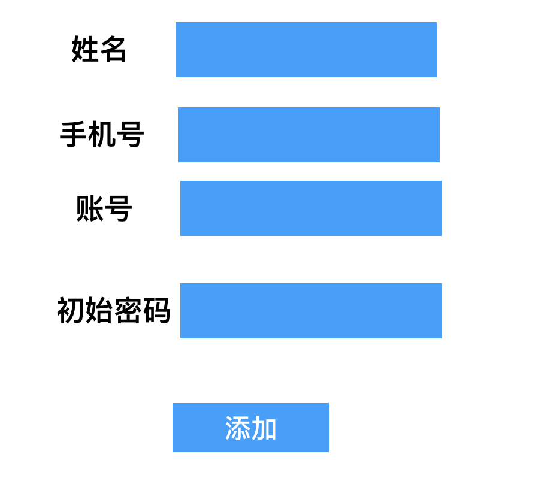

权限管理

~~~
教学管理
    考试管理
    班级管理
    考核管理
学生管理
    查综合积分
    缴费
教务管理
    班级管理
    排课管理
    
~~~

1.acl基于用户的权限管理

~~~
用户表
id  name pasword
1    小明
2    张三
3    张老师

资源表
id  name    pid     url
1   教学管理   0
2   考试管理   1      /exam
3   考核管理   1      /aa
4   学生管理   0
5   查综合积分  4     /score

用户资源表
userid  resid
1         5
3         3

当小明登录后
学生管理 
    查综合积分
    
当张老师登录后
教学管理
  考核管理
  
~~~

显示菜单

~~~
[{"id":1,"label":"教学管理","children":[{"id":2,'label':'考试管理'},{},{}]}]

~~~

2.rbac

  rbac0

~~~
用户表
id  name  roleid
1   ..      3
2           1
...
100

角色表
id  name
1   讲师
2   就业指导
3    学生

资源表
id  name   pid url
    查积分
    缴费
    查看考试成绩
    

角色资源表
roleid  resid
3        3
3        1
3        2

~~~

具体实现

重构表

~~~
1.添加一张角色表 字段  id  name
2.在customer表中添加roleid字段外键关联角色表
3. 角色和资源多对多表 （在角色模型类中添加many_to_many）
4.用户和资源的多不多关系去掉

~~~

修改功能

~~~
1.写一个添加角色的页面，写入角色表
2.展示角色列表，在角色列表后面添加 ‘配制资源’，点击显示所有资源和此角色对应的资源。点击提交写入角色资源表，添加前删除角色缓存，添加操作，添加后再删除缓存
3.添加用户页面选择角色
~~~

显示用户权限菜单

~~~
1.用户登录操作
2.登录成功后获取资源列表，先根据roleid查询redis（字符串类型），如果存在直接返回，如果不存在查询数据。根据roleid获取此角色对应的资源，数据重组，存入redis。返回给前端
~~~

缓存更新怎么办，如何保持mysql和redis的一致性

~~~
数据库修改删除，数据库数据已经发生变化，缓存中旧的数据
延时双删-》更新数据前删除缓存、更新数据、更新数据后再删除缓存
~~~

用户访问的时候在中间件中做权限过滤

~~~
用户登录成功后获取到菜单，点击菜单操作-》
前端beforeEach白名单的过滤

后端验证-》在中间件中验证是否有权限操作，携带token,token没过期。

~~~

用户token被恶意拦截，当前用户已经退出，别人用他的token继续操作怎么办？

~~~

~~~

如何支持多个端登录

~~~

~~~

rbac1

rbac2

Rbac3

3.abac

