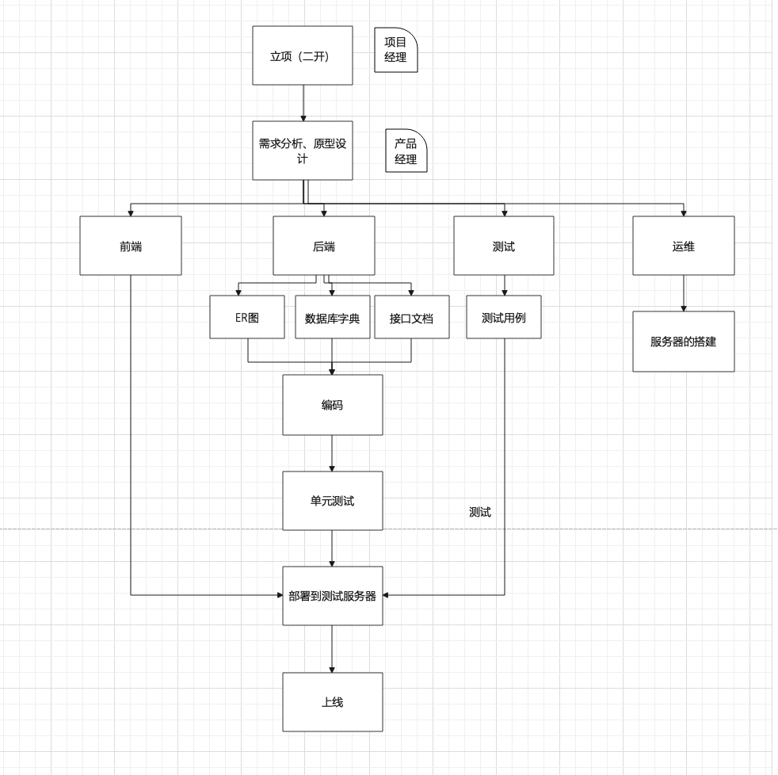

1. 下载项目git

   本地分支：账号创建一个分支，开发分支 

   测试分支

   部署分支

   ~~~
   git clone  
   git branch  
   ~~~

   conda虚拟环境

2.项目开发流程

项目管理软件：禅道 自己公司搭建的内部平台

用户管理

项目管理

​     创建项目

​     项目列表   人员

角色管理

​     开发

​     测试

​     运维。。。

资源管理

​    添加用户

​    订单列表

​    bug管理

### 1.项目中的角色

https://www.axureshop.com/ys/2173349

### 2.功能模块

### 3.数据库字典

用户表（users）

<table>
  <tr><td>字段名</td><td>字段类型</td><td>中文名</td><td>描述</td></tr>
  <tr><td>id</td><td>int</td><td>ID</td><td>主键自增</td></tr>
  <tr><td>mobile</td><td>char(11)</td><td>手机号</td><td>唯一</td></tr>
  <tr><td>types</td><td>char(11)</td><td>手机号</td><td>唯一</td></tr>
</table>

作业：

1.项目需求画er图

2.设计数据库字典

