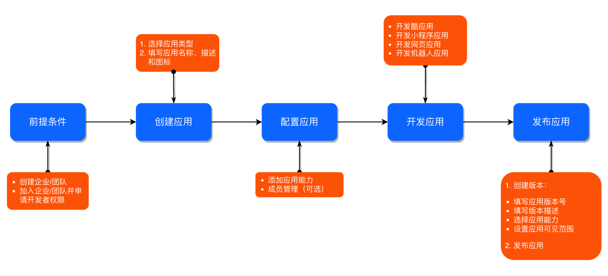
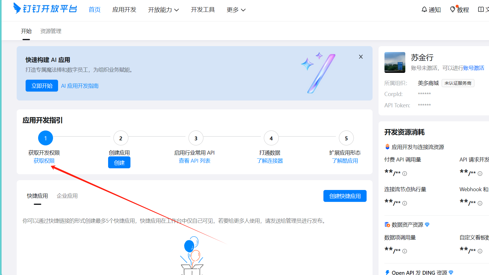
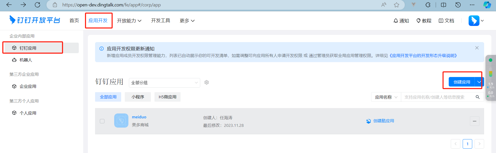
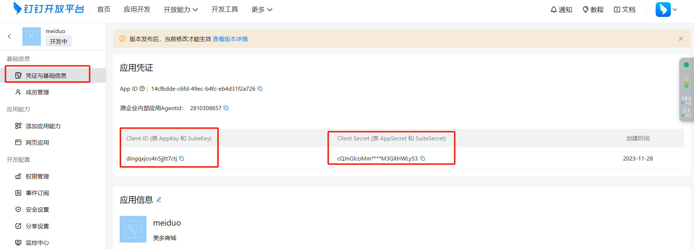
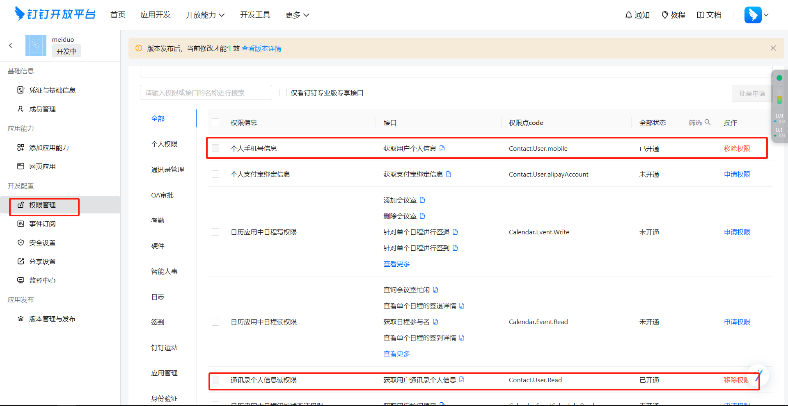
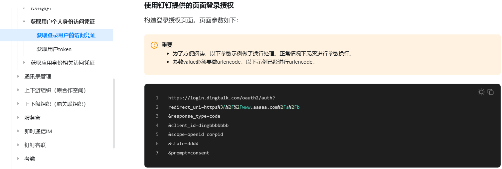
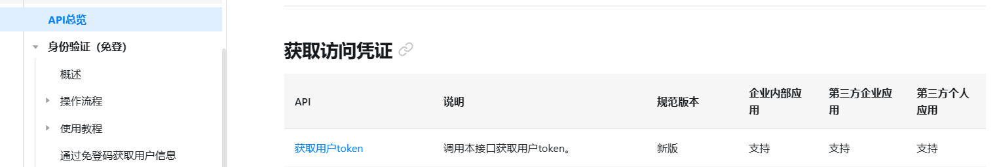
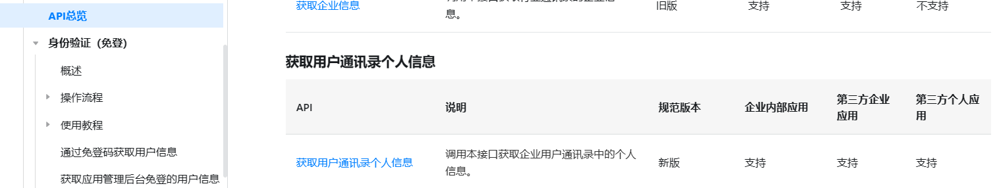

### 1.接口文档

授权常用的两种方式

授权：账号登录授权

开放平台注册账号-》注册应用-》（key secret）、配制回调地址-》获取token的接口-》token下一步操作

请求主url: http://localhost:8000/

（1）授权接口


| 接口地址 | /login/       |
| -------- | ------------- |
| 请求方式 | POST          |
| 参数     | {"mobile":""} |
| 响应     | {"code":200}  |


### 2.钉钉登录流程

```
1.在登录页面加一个图标
2.钉钉开放平台注册应用，配制回调地址
3.写一下返回钉钉的授权地址
4.在onmoutend中获取要跳转的地址
5.点击图标跳转到钉钉页面
6.是否同意授权，同意根据配制的回调地址进行回调
7.返回code，requests.post向钉钉获取token的接口发起请求
8.返回token,用requests模块调用钉钉获取用户信息的接口
9.返回手机号、uid等参数
10.根据uid去三方登录表中查询，如果存在获取到用户信息，生成 token跳转到vue中转页，vue把token保存到localStorage,跳转到首页或者用户中心
11.根据uid去三方登录表中查询，如果不存在，用手机号在用户表中创建一个新用户，用userid，钉钉返回的信息写入三方登录表。生成 token跳转到vue中转页，vue把token保存到localStorage,跳转到首页或者用户中心
```

### 3.钉钉三方登录

创建钉钉应用

开放平台地址：https://open.dingtalk.com/

 [开发流程概述 - 钉钉开放平台 (dingtalk.com)](https://open.dingtalk.com/document/orgapp/overview-of-development-process)




1.创建或加入团队，进入团队开发者后台

2.获取开发者权限（创建者拥有所有权限）



3.创建应用



4.设置回调接口（地址）

进入应用-》安全设置-》重定向URL


4.获取client id和client secret并替换



5.启用应用通讯录权限



6.登录

接口文档地址：https://open.dingtalk.com/document/orgapp/obtain-identity-credentials

登录钉钉应用并授权



获取登录token




获取用户个人信息




```
class DingTalkLogin(APIView):
    def get(self, request):
        from urllib.parse import quote
        params = [
            f"redirect_uri={quote('http://127.0.0.1:8000/user/dingtalkCallback/')}",
            "response_type=code",
            "client_id=dingqxjco4n5jjtt7ctj",
            "scope=openid",
            "prompt=consent"
        ]
        url = "https://login.dingtalk.com/oauth2/auth?" + ("&".join(params))
        return Response({"url": url})


class DingTalkCallback(APIView):
    def get(self, request):
        authCode = request.query_params.get('code')

        # 根据authCode获取用户accessToken
        data = {
            "clientId": "dingqxjco4n5jjtt7ctj",
            "clientSecret": "cQJnGlcoMmz6Nnv-r0aFEpQAHqiwVK0t4yf1J_9Do8jQP1AV81iVT2M3GXHWLy53",
            "code": authCode,
            "grantType": "authorization_code"
        }
        resp = requests.post('https://api.dingtalk.com/v1.0/oauth2/userAccessToken', json=data).json()
        accessToken = resp.get('accessToken')

        # 根据accessToken获取用户信息
        headers = {"x-acs-dingtalk-access-token": accessToken}
        resp = requests.get('https://api.dingtalk.com/v1.0/contact/users/me', headers=headers).json()
     
        name = resp.get('nick')
        uid = resp.get('openId')
        phone = resp.get('mobile')

        # 登录，写入三方登录表和用户表
        sfl = Sflogin.objects.filter(uid=uid, types=1).first()
        if not sfl:
            # 写入用户表
            # 手机号用户存在直接绑定,不存在注册新用户
            user = Susers.objects.filter(phone=phone).first()
            if not user:
                userinfo = {
                    "name": name,
                    "phone": phone,
                    "password": phone,
                    "username": phone
                }
                us = SfUserSerializer(data=userinfo)
                if us.is_valid():
                    user = us.save()
                else:
                    return Response({"code": 10001, "msg": tostr(us.errors)})
            # 写入三方登录表
            sfinfo = {
                "types": 1,
                "token": accessToken,
                "uid": uid,
                "userid": user.id
            }
            sfs = SfLoginSerializer(data=sfinfo)
            if sfs.is_valid():
                sfs.save()
            else:
                return Response({"code": 10001, "msg": tostr(sfs.errors)})
        else:
            user = sfl.userid
            sfl.token = accessToken
            sfl.save()

        # 生成jwt token并返回前端
        payload = {"userid": user.id, "username": user.username, "exp": int(time.time()) + 60 * 60 * 2}
        token = myjwt.jwt_encode(payload)
        payload["exp"] = int(time.time() + 60 * 60 * 24 * 2)
        refreshToken = myjwt.jwt_encode(payload)
        query = [f"userid={payload['userid']}", f"username={payload['username']}", f"token={token}",
                 f"refreshToken={refreshToken}"]
        return HttpResponseRedirect(f'http://localhost:8080/#/updatetoken?{"&".join(query)}')

```

微博三方登录

```python
# Create your views here.
class Wb(APIView):
    def get(self,request):
        client_id="3674019597"
        redirect_uri="http://127.0.0.1:8000/user/weiboCallback/"
        url = "https://api.weibo.com/oauth2/authorize?client_id=%s&response_type=code&redirect_uri=%s"%(client_id,redirect_uri)
        return Response({"code":200,"url":url})

import json,time

class WbCallback(APIView):

    def get(self,request):
        code = request.GET.get("code")
        data = {"client_id":'3674019597',"client_secret":"7ae99bc0d54ead29fc8d1b9fabd78587",
    "grant_type":"authorization_code",
    'redirect_uri':'http://127.0.0.1:8000/user/weiboCallback/','code':code}
        url = "https://api.weibo.com/oauth2/access_token"
        res = requests.post(url,data=data)
        print(res.text)
        resdata = json.loads(res.text)
    #     1.获取code，accress_token接口发起Post请求，uid和token-》
        uid = resdata['uid']
        token = resdata['access_token']
    # 2.通过uid去sf_login表中查询，如果存在，联表查询用户信息，用用户信息生成token跳转到vue
        sflogin = SfLogin.objects.filter(uid=uid,token=token).first()
        if sflogin:
            user = sflogin.userid
            jwt_payload_handler = api_settings.JWT_PAYLOAD_HANDLER
            jwt_encode_handler = api_settings.JWT_ENCODE_HANDLER
            user.exptime = int(time.time())
            payload = jwt_payload_handler(user)
            token = jwt_encode_handler(payload)
            return redirect("http://localhost:8080/#/updateToken?userid="+str(user.id)+"&token="+token)
        else:
            return redirect("http://localhost:8080/#/bindMobile?uid="+str(uid)+"&token="+token)

    def post(self,request):
        #获取参数
        data = json.loads(request.body)
        mobile = data['mobile']
        uid = data['uid']
        token = data['token']
        # 5.提交，根据手机号查询用户表，如果存在写入三方登录表
        user = UserInfo.objects.filter(mobile=mobile).first()
        # 6.如果不存在，写入用户表，写入三方登录表
        if not user:
            user = UserInfo(mobile = mobile)
            user.save()
        #进行查询再写入
        sflogin =SfLogin(userid=user,uid=uid,token=token,webform='wb')
        sflogin.save()
        # 7.用用户信息生成token返回,在vue页面中存入localStorage中，跳转到首页
        jwt_payload_handler = api_settings.JWT_PAYLOAD_HANDLER
        jwt_encode_handler = api_settings.JWT_ENCODE_HANDLER
        user.username=mobile
        payload = jwt_payload_handler(user)
        token = jwt_encode_handler(payload)
        return Response({"code":200,'userid':user.id,'token':token})
获取授权的url->跳到到授权页面-》通过授权根据回调地址回调-》在回调接口中获取code->requests向access_token接口发起Post请求，获取到了uid和access_token->根据uid查询三方登录表-》如果存在获取到关联的用户信息，生成 jwt token重写向在前端-》前端存储用户信息到localStorage中-》下次请求携带token(intercepoters.request.use中统一添加token)->服务端自定义中间件-》继承middewareminxin重写process_request方法-》获取token，解析判断是否被修改，是否过期，是否退出-》如果没有继续操作
```

jwt登录，服务端不存储，你怎么知道他已经退出了，当前用户已经退出了，如果别的用户拿到他的token还能继续操作吗？

```
点击退出按钮-》携带token-》在退出接口中获取到token-》存储在redis中-》r.set(token,123)-》在中间件中获取到token-》根据token从redis中查询，如果存在返回已经退出不能操作，如果不存在继续操作
```

钉钉

```
获取url地址
回调接口

微博
获取url地址
回调接口

qq

class Dingding():
   def geturl():
      pass
      
   def callback():
     pass
     
class Weibo():
   def getwburl():
      pass
      
   def callwbback():
     pass
     
     
 if  type == 'dding':
     ding = Dingding()
     return ding.geturl()

```


qq、钉钉、微博。。。

```
class QQ():
  def __int__(self):
      self.appid = ''
      self.sceret = ''
      
  def getqqurl(self):
     return 'qq ur'
     
  def callback(self,code):
      dict= {"uid":1,'token':'234','mobile':''}
      return dict
      
      
class Dingding():
  def __int__(self):
      self.appid = ''
      self.sceret = ''
      
  def getdingurl(self):
     return 'qq ur'
     
  def dcallback(self,code):
      dict= {"uid":1,'token':'234','mobile':'234'}
      return dict
      
    
    if types == 'qq':
       qq = Qq()
       url = qq.getqqurl()
    elif:
    .....
    
    
    class Weibo():
    
      def _init__(self):
         pass
       
      def wburl(self):
         return "weibo url"
         
         
      def wbcallback(self):
         pass
         
         
    class Dingding():
    
      def _init__(self):
         pass
       
      def geturl(self):
         return "weibo url"
         
         
      def callback(self):
         pass
  
```

### 工厂模式

```
工厂模式（Factory Pattern）是一种常见的设计模式，属于创建型模式的一种。该模式主要用于创建对象，但与直接在代码中使用new关键字创建对象不同，工厂模式通过一个共同的接口来创建对象，从而将对象的创建过程与具体的使用客户端代码分离开来。

工厂模式通常涉及以下几个角色：

抽象工厂（Abstract Factory）：定义一个创建对象的接口，但不负责具体的对象创建过程。它通常是一个接口或者抽象类，其中定义了一个或多个创建对象的方法。
具体工厂（Concrete Factory）：实现抽象工厂接口，负责实际创建具体的对象。每个具体工厂都对应着一种具体的对象类型。
产品（Product）：工厂所创建的对象类型。它可以是一个接口、抽象类或者具体类。
具体产品（Concrete Product）：实现产品接口的具体对象。

工厂模式的优点包括：

降低了客户端与具体产品之间的耦合度。客户端只需要知道产品的抽象接口，而不需要知道具体实现。
提高了系统的扩展性。如果需要增加新的产品类型，只需要增加相应的具体工厂类和具体产品类，而不需要修改已有的客户端代码。
隐藏了对象的创建细节。客户端只需要调用工厂方法即可获取所需的对象，而不需要关心对象的创建过程。
然而，工厂模式也存在一些缺点：

当产品类型较多时，需要创建大量的具体工厂类和具体产品类，这可能会增加系统的复杂度。
对于简单对象来说，使用工厂模式可能会增加不必要的复杂度。
工厂模式的适用场景包括：

对象的创建逻辑复杂或多变，例如需要进行复杂的逻辑判断或处理多个步骤时。
一个对象拥有很多子类，客户端需要动态地创建这些子类的实例时。
系统需要经常扩展，并且希望将对象的创建与使用分离以提高代码的可维护性和可扩展性时。
总的来说，工厂模式是一种非常有用的设计模式，它可以帮助我们更好地组织代码、降低耦合度、提高系统的扩展性和可维护性。然而，在使用时也需要注意其适用场景和可能带来的缺点。
```

实现步骤

1.定义一个抽象工厂，定义两个抽象方法，抽象方法的特别是只有方法没有方法体，抽象类只能被继承不能被实例化。

2.定义具体的实现类，继承抽象工厂，重写抽象类的抽象方法

3.建立一个工厂类，实例化实现类的对象

4.调用

python代码实现

```
from abc import ABC,abstractmethod

#抽像工厂
class Product(ABC):
    @abstractmethod
    def geturl(self):
        pass
    @abstractmethod
    def callback(self):
        pass


class Dingding(Product):
    def __init__(self) -> None:
        self.api_key = '234234'
        
    
    def geturl(self):
        url = "dingding.com/"
        return url
    
    def callback(self):
        #钉钉操作
        uid='23'
        token='22'
        retoken='222'
        return uid,token,retoken
    


class Weibo(Product):
    def __init__(self) -> None:
        self.api_key = '234234'
        
    
    def geturl(self):
        url = "weibo.com/"
        return url
    
    def callback(self):
        #weibo操作
        uid='23'
        token='22'
        retoken='222'
        return uid,token,retoken
    
    
class Factory():
    def create_factory(self,params):
        if params == 'dingding':
            return Dingding()
        
        elif params == 'weibo':
            return Weibo()
        
        
        
factory = Factory()


在view中调用 
class SFloginView(APIView):
    def get(self,request):
        params = request.GET.get('params')
        class1 = factory.create_factory(params)
        return Response({"code":200,'url':class1.geturl()})
```

工厂模式对三方登录的封装

```
三方登录的价值的意义
常用的三方登录的方式
三方登录的流程-》钉钉
工厂模式
对三方登录的重构


我之前做的是一个医疗平台，我们的平台是03年上线的，我是21年加入公司的，之前支持手机号用户名以及三方登录多种登录方式，我去之前已经有QQ,微信，。。。有四五种已经写好了，让我加钉钉登录，加的时候我看了以前的代码，每一种都一个单独的类，方法也不统一，导致调用的时候得去看不同的类。基于当前的问题我做工厂模式对他进行了重构。工厂模式是一种大型的设计模式，主要以工厂批量生产的方式实现，优点生产者和消费者解偶，符合高内聚低偶合的设计理念，一般用于比较复杂的系统。具体的实现流程是先定义一个抽象类，定义抽象方法主要是建立规范。在python中可以通过继承abc类来实现，抽象的特点是只能被继承不能被实例化，抽象类中定义两个抽象方法，用absctractmethod装饰器的方法实现，抽象方法的特性是只有方法名没有方法体。第二步定义具体的实现类，比如QQ，微博类等。第三步定义一个工厂类，工厂类中定义一个方法，主要用于实例化操作类。通过实例化工厂类达到方法的统一调用。以钉钉为例，所有的三方登录流程都一样，都是获取授权地址，跳转授权通过回调地址进行回调，在回调接口中获取到code进行uid的获取，通过uid查询三方登录表，判断是否存在，如果存在用用户信息调用jwt生成token返回。客户端存储在localStorage中,在vue的Interceptors.request.use中统一添加token，服务端用中间件进行验证判断是否有权限操作。
```

单例模式

```
import threading
class A():
   instance = {}
   if cls not in instance:
      with threading.lock():
      	instance[cls] = super.__new__()
      
      
    return instance
   
   
a = A()
b = A()
c = A()

单例模式（Singleton Pattern）是一种创建型设计模式，它确保一个类只有一个实例，并提供一个全局访问点来访问这个唯一实例。在Python中，可以通过多种方式实现单例模式。
```

### 1. 使用模块导入

在Python中，模块天然就是单例的。当你导入一个模块时，Python只会执行该模块一次，因此模块中定义的所有变量和函数都会作为模块的属性被缓存起来。

```
# singleton_module.py  
class Singleton:  
    def __init__(self):  
        pass  
  
    # 其他方法...  
  
# 访问单例  
singleton_instance = Singleton_module.Singleton()
```

### 2. 使用装饰器

```
装饰器在原有功能不变的基础上加上新的功能。底层采用闭包理念实现。内外函数嵌套，外层函数返回内层函数，内层函数引用外部函数的变量。装饰器分为有参装饰器和无参装饰器。当func有多个装饰器时，装饰器会按照从下到上的顺序对func进行装饰，也就是最靠近函数的装饰器最先应用装饰，执行的时候从上往下执行。两个以上func被两个及以上装饰器装饰的时候会报错。导入functools包用wraps方法装饰一下。应用场景权限验证，接口执行时间统计，接口过滤


@promition
@app.router(methods=["POST","GET"],"/login")
def login():

@promition
@app.router(methods=["POST","GET"],"/reg")
def reg():


```

可以通过装饰器来简化单例模式的实现。

```
import threading
def singleton(cls):  
    instances = {} 
  
    def get_instance(*args, **kwargs):  
        if cls not in instances:
            with threading.lock:
               instances[cls] = cls(*args, **kwargs) 
        return instances[cls]  
    return get_instance  
  
@singleton  
class MyClass:  
    pass  
  
# 访问单例  
instance1 = MyClass()  
instance2 = MyClass()  
assert instance1 is instance2  # 两者是同一个实例
```

线程安全的单例模式

```
import threading

def singleton(cls):  
    instances = {} 
    def get_instance(*args, **kwargs): 
        if cls not in instances:
        	with threading.Lock(): 
        		instances[cls] = cls(*args, **kwargs)  
        return instances[cls]  
    return get_instance  
  
@singleton  
class MyClass:  
    pass  
  
# 访问单例  
instance1 = MyClass()  
instance2 = MyClass()  
# assert instance1 is instance2  # 两者是同一个实例
print(id(instance1))
print(id(instance2))
```


### 3. 使用`__new__`方法

重写类的`__new__`方法，该方法负责创建实例。

```
class Singleton:  
    _instance = None  
    def __new__(cls, *args, **kwargs):  
        if cls._instance is None:  
            cls._instance = super().__new__(cls)  
        return cls._instance  
  
    # 如果需要初始化方法，可以单独定义__init__  
    def __init__(self):  
        if hasattr(self, '_initialized'):  
            return  
        self._initialized = True  
        # 初始化代码...  
  
# 访问单例  
instance1 = Singleton()  
instance2 = Singleton()  
assert instance1 is instance2  # 两者是同一个实例
```

### 4. 使用元类（Metaclass）

元类是用于创建类的类。通过元类，我们可以在类被创建时控制其行为，从而确保单例。

```
class SingletonType(type):  
    _instances = {}  
    def __call__(cls, *args, **kwargs):  
        if cls not in cls._instances:  
            cls._instances[cls] = super(SingletonType, cls).__call__(*args, **kwargs)  
        return cls._instances[cls]  
  
class MyClass(metaclass=SingletonType):  
    pass  
  
# 访问单例  
instance1 = MyClass()  
instance2 = MyClass()  
assert instance1 is instance2  # 两者是同一个实例
1.实现工厂模式，集成在项目中
2.写一个两个函数被两个装饰器装饰的案例，functools解决
3.用装饰器实现单例模式
4.用_new__实现单例模式
5.总结类中的常用的魔法方法及作用
```

工厂模式对三方登录封装1.三方登录

1.三方登录流程

钉钉、qq、微博

~~~
1.写一个登录页面，手机号登录，钉钉图标
2.点击图标跳转到钉钉授权
3.根据钉钉配制的回调接口进行回调，在回调接口处理
4.跳转到首页
~~~

技术

~~~
1.获取授权的接口
2.回调接口（获取token、调用钉钉获取用户信息的接口拿到手机号、根据uid查询三方登录表，写入两张表，生成token返回）
3.vue localStorate中存储
4. interceptors拦截器中在头部添加token
5.在django中自宝义中间件验证 （是否被修改，是否过期，是否退出）
~~~


