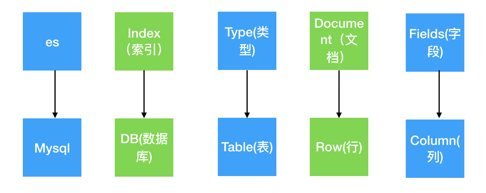
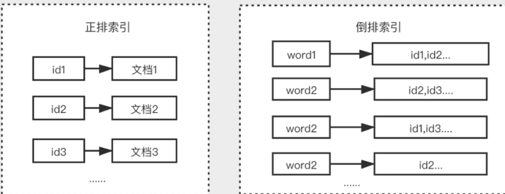
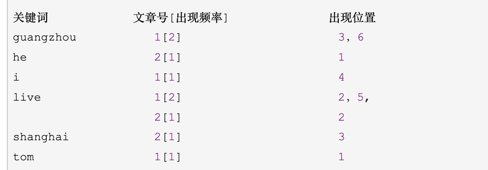

### 1.倒排索引




~~~
goods
id  title
title like '% %'
goods
title

select * from table where name like '%蛋糕%'

倒排索引
id  name  content    url
1   新闻    苦柑新闻   
2   建国    苦柑建国新闻  

select * from goods where name like '%asfd%'


新闻
select id,title,url from publish0 where title like '%新闻%' or content like '%新闻%'

洗衣机降价，299快来抢购洗衣机
Jieba分词或者ik分词将一段文字分隔成词组
洗衣机 -》[{文档id 位置 次数   1001  0，8   2},{}]
降价
299
快来
抢购


倒排索引
我是中国人   我喜欢呆在中国，茜顶戴茜顶起顶起权志龙顶我起村村   文档1，3次，【0，0，10】
我叫小红   asdf顶起
通过ik或者jebia分词将一段话变成多个分词，将分词做为key,文档id,出现的位置，出现的次数作为value存储在hashmap中
我   是   中国 人  我  喜欢   呆在   中国
我  叫   小红

我
{‘我’:[{文档1，3}，[文档2，2，]]}


什么是倒排索引
搜索的核心需求是全文检索，全文检索简单来说就是要在大量文档中找到包含某个单词出现的位置，在传统关系型数据库中，数据检索只能通过 like 来实现。

例如需要在酒店数据中查询名称包含公寓的酒店，需要通过如下 sql 实现：

select * from hotel_table where hotel_name like '%公寓%';
这种实现方式实际会存在很多问题：

无法使用数据库索引，需要全表扫描，性能差
搜索效果差，只能首尾位模糊匹配，无法实现复杂的搜索需求
无法得到文档与搜索条件的相关性
搜索的核心目标实际上是保证搜索的效果和性能，为了高效的实现全文检索，我们可以通过倒排索引来解决。

倒排索引是区别于正排索引的概念：

正排索引：是以文档对象的唯一 ID 作为索引，以文档内容作为记录。
倒排索引：Inverted index，指的是将文档内容中的单词作为索引，将包含该词的文档 ID 作为记录。


倒排索引
title   001华为手机    002小米手机
ik  jieba
华为  手机
手机 =》{001（出现次数，出现位置），002}

分词  ik  jieba

1   我喜欢小猫

2   小猫非常可爱


1  我   喜欢   小猫   我喜欢   小猫
2  小猫   非常   可爱  小猫   听话

小猫-》{1:{2,1},2:[0,3],2}


~~~



倒排索引的结构
根据倒排索引的概念，我们可以用一个 Map来简单描述这个结构。这个 Map 的 Key 的即是分词后的单词，这里的单词称为 Term，这一系列的 Term 组成了倒排索引的第一个部分 —— Term Dictionary (索引表，可简称为 Dictionary)。

倒排索引的另一部分为 Postings List（记录表），也对应上述 Map 结构的 Value 部分集合。

记录表由所有的 Term 对应的数据（Postings） 组成，它不仅仅为文档 id 信息，可能包含以下信息：

文档 id（DocId, Document Id），包含单词的所有文档唯一 id，用于去正排索引中查询原始数据。
词频（TF，Term Frequency），记录 Term 在每篇文档中出现的次数，用于后续相关性算分。
位置（Position），记录 Term 在每篇文档中的分词位置（多个），用于做词语搜索（Phrase Query）。
偏移（Offset），记录 Term 在每篇文档的开始和结束位置，用于高亮显示等。


elasticsearch中支持的常见字段数据类型：

| 类型        | 描述                                                         |
| ----------- | ------------------------------------------------------------ |
| **text**    | 字符串类型，可以模糊查询, 可以分词查询，不能聚合、排序       |
| **keyword** | 字符串类型，只能精准查询, 不能分词查询，可以聚合、排序       |
| **long**    | 有符号的64位整数, 范围:[−2<sup>63</sup> ~ 2<sup>63</sup>-1]  |
| **Integer** | 有符号的32位整数, 范围: [−2<sup>31</sup> ~ 2<sup>31</sup>-1] |
| short       | 有符号的16位整数, 范围: [-32768 ~ 32767]                     |
| byte        | 有符号的8位整数, 范围: [-128 ~ 127]                          |
| **float**   | 32位单精度浮点数                                             |
| double      | 64位双精度浮点数                                             |
| **boolean** | 布尔类型，支持使用字符串，数字等零值表示true/false           |
| **date**    | 日期类型，                                                   |
| date_nanos  | 日期纳秒类型，                                               |
| binary      | 二进制类型，Base64编码字符串的二进制值                       |
| **Range**   | 范围类型，有integer_range`, `float_range`, `long_range`, `double_range`, `date_range等 |
| **array**   | 数组类型，ES中没有专门的数组类型, 直接使用[ ]定义即可，所有的成员的值必须是同一种数据类型 |
| **object**  | 对象类型，以json对象为结构                                   |


使用默认类型_doc代替映射的创建，es会内部自动推断字段类型。

```json
PUT /indexes2/_doc/文档ID
{
    "name": "商品的标题",
    "price": 18,
    "created_time": "2022-01-10 22:00:31"
}
```

`_doc` 就是默认类型（default type），type在8.x版本会被彻底删除，以后使用默认类型`_doc`替代即可。

查看索引

```bash
GET /_cat/indices      # 查看所有的索引信息
GET /索引名称           # 查看指定名称的索引信息
```

删除索引

```json
DELETE /索引名称
```


#### 10.4.5 文档操作

| 请求方法/method  | uri地址                         | 描述                                                      |
| ---------------- | ------------------------------- | --------------------------------------------------------- |
| PUT（创建,修改） | `/索引名称/_doc/文档id`         | 创建文档（指定文档id）                                    |
| POST（创建）     | `/索引名称/_doc/文档id`         | 创建文档，如果uri地址只是以_doc结尾，文档id是随机生成的） |
| POST（修改）     | `/索引名称/_doc/文档id/_update` | 修改文档                                                  |
| DELETE（删除）   | `/索引名称/_doc/文档id`         | 删除文档                                                  |
| GET（查询）      | `/索引名称/_doc/文档id`         | 查询文档通过文档ID                                        |
| POST（查询）     | `/索引名称/_doc/文档id/_search` | 查询所有数据                                              |


### 2.docker

~~~
linux两个版本,centos7  ubuto
虚拟机： windows centos7，

仓库、镜像、容器
从中央仓库拉取镜像，通过镜像可以创建容器
~~~

### 3.docker安装

~~~
#升级所有包同时也升级软件和系统内核；
yum -y update 
#只升级所有包，不升级软件和系统内核
yum -y upgrade

#删除自带的docker
yum remove docker  docker-common docker-selinux docker-engine

1.安装需要的软件包， yum-util 提供yum-config-manager功能，另两个是devicemapper驱动依赖
yum install -y yum-utils device-mapper-persistent-data lvm2

设置一个yum源，下面两个都可用,选择一个
yum-config-manager --add-repo http://download.docker.com/linux/centos/docker-ce.repo（中央仓库）
 
yum-config-manager --add-repo http://mirrors.aliyun.com/docker-ce/linux/centos/docker-ce.repo（阿里仓库）

#查看可用版本
yum list docker-ce --showduplicates | sort -r
#安装docker
yum -y install docker-ce-18.03.1.ce

#设置开机启动
systemctl start docker
systemctl enable docker

xshell
~~~

### 4.docker搭建es

docker常用命令

~~~
三部分：仓库、镜像、容器
docker images 查看镜像 
docker pull 下载镜像
docker search 查找
docker exec  -it 
docker start
       stop
       restart
       rm 

~~~


~~~
docker pull elasticsearch:7.7.0
docker run --name elasticsearch -p 9200:9200 -p 9300:9300  elasticsearch:7.7.0

docker network create elastic
docker pull docker.elastic.co/elasticsearch/elasticsearch:7.7.0
docker run --name elasticsearch --net elastic -p 9200:9200 -p 9300:9300 -e "discovery.type=single-node" -t elasticsearch:7.7.0

~~~

~~~
docker run --name elasticsearch -d -e ES_JAVA_OPTS="-Xms512m -Xmx512m" -e "discovery.type=single-node" -p 9200:9200 -p 9300:9300 docker.elastic.co/elasticsearch/elasticsearch:7.7.0
~~~

### 3.es基础语法

http://182.92.237.172:9200/shopping

创建索引  地址加索引名

~~~
发送put请求：http://124.71.227.70/:9200/shopping
~~~

查看索引

~~~
发送get请求： http://localhost:9200/shopping

查看所有索引
http://localhost:9200/_cat/indices?v
~~~

删除索引

~~~
发送delete请求  http://localhost:9200/shopping
~~~

添加数据

~~~
发送post请求 http://localhost:9200/shopping/_doc

{
	"name":"张三",
	"age":10,
	"category":1,
	"status":1,
	"online":2
}

幂等性操作  
添加时添加id  http://localhost:9200/shopping/_doc/1001
~~~

查询数据

~~~
发送get请求  http://localhost:9200/shopping/_doc/1002
查询全部  http://localhost:9200/shopping/_search
~~~

修改

~~~
完全覆盖 
发送put请求 http://localhost:9200/shopping/_doc/1001

修改某个属性
发送post请求 http://localhost:9200/shopping/_update/1001
{
	"name":"张三22"
}

~~~

删除

~~~
完全覆盖 
发送delete请求 http://localhost:9200/shopping/_doc/1001
~~~

条件查询

~~~json
get http://localhost:9200/shopping/_search

{
	"query":{
		"match":{"category":1}
	}
}

查询所有数据
{
	"query":{
		"match_all":{}
	}
}
~~~

分页查询

~~~
{
	"query":{
		"match_all":{}
	},
	"from":0,
	"size":2
}


指定字段
{
	"query":{
		"match_all":{}
	},
	"from":0,
	"size":2,
	"_source":["name","age"]
}
~~~

排序

~~~
{
	"query":{
		"match_all":{}
	},
	"from":0,
	"size":2,
	"_source":["name","age"],
	"sort":{
		"add_time":{
			"order":"desc"
		}
	}
}
~~~


多条件查询

And

~~~
{
	"query":{
		"bool":{
			"must":[
				{"match":{"age":10}},
				{"match":{"name":"张三"}}
				]
		}
	},
	"from":0,
	"size":2,
	"_source":["name","age"],
	"sort":{
		"age":{
			"order":"desc"
		}
	}
}

select * from users where age=10 and name="张三"
~~~

or

~~~
{
	"query":{
		"bool":{
			"should":[
				{"match":{"age":10}},
				{"match":{"name":"张三"}}
				]
		}
	},
	"from":0,
	"size":2,
	"_source":["name","age"],
	"sort":{
		"age":{
			"order":"desc"
		}
	}
}

select * from users where age=10 or name="张三"
~~~

范围查询

~~~
{
	"query":{
		"bool":{
			"should":[
				{"match":{"age":10}},
				{"match":{"name":"张三"}}
			],
			"filter":{
				"range":{
					"age":{"gt":3}
				}
			}
		}
	},
	"from":0,
	"size":2,
	"_source":["name","age"],
	"sort":{
		"age":{
			"order":"desc"
		}
	}
}


es支持常用的语法，通过from size进行分页查询，match条件查询，_source指定返回字段，sort排序，range进行区间查询,must并且查询，should进行或查询
~~~

```
# 获取数据量
es.count(index``=``"my_index"``,doc_type``=``"test_type"``)

```

首页使用es实现功能

1.数据的导入，把mysql数据导入es

~~~
from elasticsearch import Elasticsearch
es = Elasticsearch("http://localhost:9200/")

class DataView(APIView):

  def get(self,request):
      #查询数据
      dockers = Doctor.objects.all()
      askTa = AskTable.objects.all()
      for i in dockers:
         es.index(index='doctor', body={
                  'id': i.id,
                  'table_name': 'doctor',
                  'name': i.name,
                  'type':'doctors'
              })
              
       for i in askTa:
         es.index(index='doctor', body={
                  'id': i.code,
                  'table_name': 'doctor',
                  'name': i.title,
                  'type':'asktable'
              })
              
~~~

2.搜索

vue页面，用户输入信息，点击搜索

~~~
 class Search(APIView):
    def get(self,request):
        #获取当前页
        page = request.GET.get("page")
        #每页显示多少条
        page_size=2
        #搜索内容
        mes = request.GET.get('mes')
        #计算开始位置
        start = (page-1)*page_size
 
       dsl={
              "query":{
                  "match":{"name":mes}
              },
              "from":start,
              "size":page_size,
              "_source":["name","age"],
              "sort":{
                "age":{
                  "order":"desc"
                }
              }

          }
          res = es.search(index="doctor", body=dsl)
          print(res['hits']['hits'])
          return 'ok'


~~~

复杂查询

~~~python
from elasticsearch import Elasticsearch, helpers  
import datetime  
  
# 连接到 Elasticsearch 客户端  
es = Elasticsearch(["http://localhost:9200"])  
  
# 定义索引名称  
index_name = "your_index_name"  
  
# 定义查询函数  
def multi_condition_query(stime=None,endtime=None,name=None, gender=None):  
    list=[]
      
    # 添加时间条件（假设时间字段为 'timestamp' 且格式为 ISO 8601）  
    if stime and endtime:  
        time_range_query = {  
            "range": {  
                "timestamp": {  
                    "gte": stime,  # 开始时间  
                    "lte": endtime
                }  
            }  
        }  
       list.append(time_range_query)  
      
    # 添加姓名条件  
    if name:  
        name_query = {  
            "match": {  
                "name": name  
            }  
        }  
        list.append(name_query)  
      
    # 添加性别条件  
    if gender:  
        gender_query = {  
            "match": {  
                "gender": gender  
            }  
        }  
       list.append(gender_query)  
      
    # 如果没有 must 条件，则查询所有（可选）  
   
      
    return list  

class SearchView(APIView):
  def get(self,request):
      # 示例查询  
      stime =   request.GET.get('stime')
      endtime =   request.GET.get('endtime')
      name_condition = request.GET.get('name')  # 可选，设置姓名条件  
      gender_condition = request.GET.get('gender')  # 可选，设置性别条件  
      page = request.GET.get('page')  # 可选，设置性别条件 

      query = multi_condition_query(time_condition, name_condition, gender_condition)  

       query1 = {  
          "query": {  
            "bool": {  
              "must": [],  
              "should": []  
            }  
          },
          "from":start,
          "size":
        } 

        if len(query)>0:
          for i in list:
             query1["query"]["bool"]["must"].append(i) 
        else:
           query1["query"]["match_all"] = {}  
           del query["query"]["bool"]  


      # 打印查询语句  
      print(query)  

      # 执行查询  
      response = es.search(index=index_name, body=query)  

      # 打印查询结果  
      print(response)
~~~


3.数据同步（异步导入数据，celery定时同步，监听mysql的binlog）

~~~python
全量式：将mysql中课程表中的所有数据同步到es,最大id存入redis中，定时任务每天晚上12进行同步，查询redis中的最后一次同步的id,查询mysql从最大id之后的数据

课程需要审核，审核通过后更新课程状态，把课程加到es中

监听binlog日志，分析日志，提取加入课程语句，放到es
~~~


~~~python
from elasticsearch import Elasticsearch, helpers  
import datetime  
  
# 连接到 Elasticsearch 客户端  
es = Elasticsearch(["http://localhost:9200"])  
  
# 定义索引名称  
index_name = "your_index_name"  
  
# 定义查询函数  
def multi_condition_query(time=None, name=None, gender=None):  
    query = {  
        "query": {  
            "bool": {  
                "must": [],  
                "should": []  
            }  
        }  
    }  
      
    # 添加时间条件（假设时间字段为 'timestamp' 且格式为 ISO 8601）  
    if time:  
        time_range_query = {  
            "range": {  
                "timestamp": {  
                    "gte": time.strftime('%Y-%m-%dT%H:%M:%S'),  # 开始时间  
                    "lte": (time + datetime.timedelta(days=1)).strftime('%Y-%m-%dT%H:%M:%S')  # 结束时间（到下一天的同一时间）  
                }  
            }  
        }  
        query["query"]["bool"]["must"].append(time_range_query)  
      
    # 添加姓名条件  
    if name:  
        name_query = {  
            "match": {  
                "name": name  
            }  
        }  
        query["query"]["bool"]["must"].append(name_query)  
      
    # 添加性别条件  
    if gender:  
        gender_query = {  
            "match": {  
                "gender": gender  
            }  
        }  
        query["query"]["bool"]["must"].append(gender_query)  
      
    # 如果没有 must 条件，则查询所有（可选）  
    if not query["query"]["bool"]["must"]:  
        query["query"]["match_all"] = {}  
        del query["query"]["bool"]  
      
    return query  
  
# 示例查询  
time_condition = datetime.datetime(2023, 10, 1)  # 可选，设置时间条件  
name_condition = "John Doe"  # 可选，设置姓名条件  
gender_condition = "male"  # 可选，设置性别条件  
  
query = multi_condition_query(time_condition, name_condition, gender_condition)  
  
# 打印查询语句  
print(query)  
  
# 执行查询  
response = es.search(index=index_name, body=query)  
  
# 打印查询结果  
print(response)
~~~

~~~python
from elasticsearch import Elasticsearch
import traceback
@u_blue.route("/estest") 
def estest():
    es = Elasticsearch("http://localhost:9200/")
    # 清空数据
    es.indices.delete(index='courses')
    try:
        sql = "select c.*,cl.labelid from courses as c left join courses_label as cl on c.id=cl.coursesid"
        i = -1
        res = db.findAll(sql)
        for row in res:
            i += 1
            # index就是对应的一张表 eg.对应的就是course表
            es.index(index='courses', body={
                'id': i,
                'table_name': 'courses',
                'name': row['name'],
                'pid': row['classify'],
                'type': row['type'],
                'img': row['img'],
                'labelid': row['labelid'],
                'addtime': row['add_time'],
                "online":row['online']
            })
        print("###")
    except:
        print("&&&")
        error = traceback.format_exc()
        print("Error: unable to fecth data", error)
        pass
    return 'ok'
~~~

