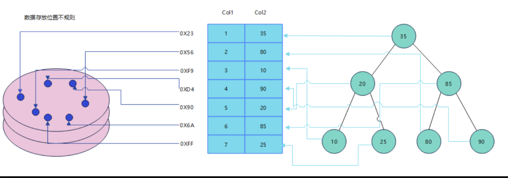
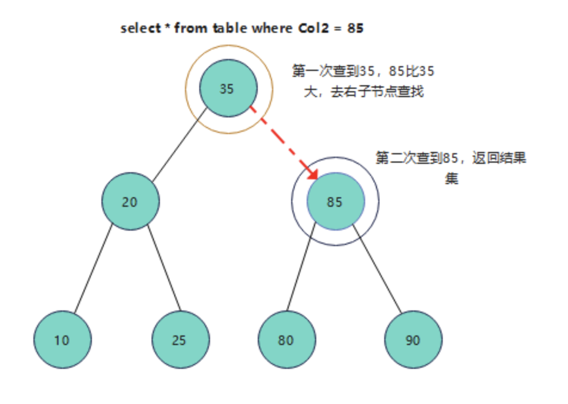
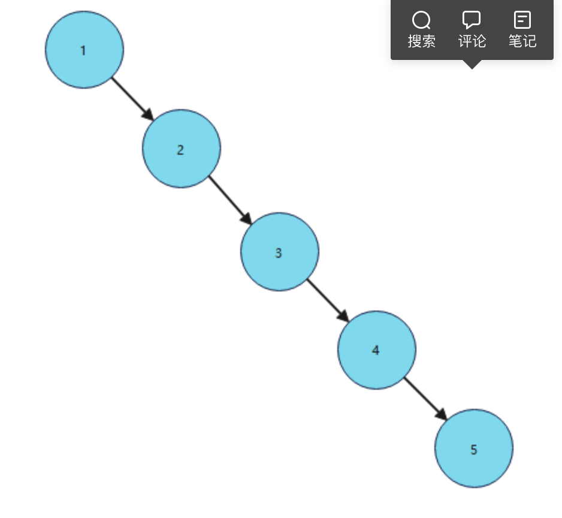
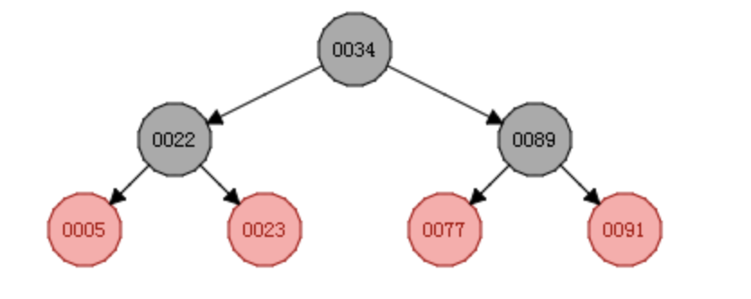
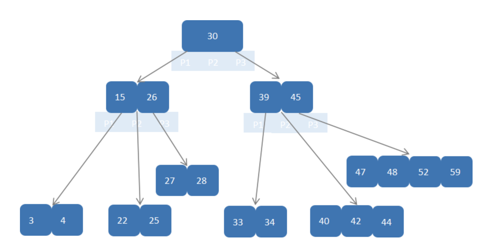
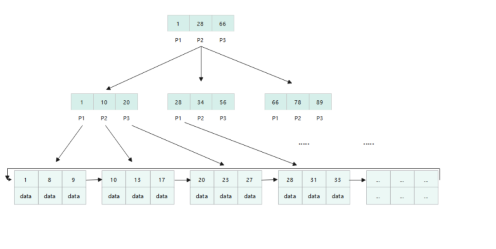

~~~
1.分片上传
2.分表雪花算法
3.根据文章标题获取分类
调用获取token的接口 client_id,client_secret，token
调用requests.post('url',data={"message":message},'headers':{"token":'34234'})
写入标签表、写入标签发布表


fastapi启动服务-》手机号注册接口（jwt）
                 登录接口
                 注册应用（应用名、勾选服务）（acl，client_id,client_secret）
                根据文字描述获取分类接口
                根据文字描述获取标签接口
                
                
~~~


### 1.充值模块


~~~
充值订单表：
id  orderno  userid  paytype(1支付  2微信   3网银)  status(1支付中  2成功 3失败)  transaction_no（支付宝流水号）   add_time  pay_time  money

1.点击提交加入充值订单表
2.生成订单直接调用支付
3.回调回来验签，订单号第一位加一个类型，1购买订单  2充值订单
4.判断为2的时候更新充值订单表，更新用户总金额（事务处理）

接口幂等性
实现思路：
1.在充值页面mouted中调用接口，在接口中生成一个唯一的token（uuid.hex）存入redis返回,
2.点击提交的时候携带token,服务查询token是否存在，如果存在操作生成充值订单，清除token，如果不存在提示已经操作过不能重复操作。


1.创建一张表
2.写一个vue页面
3.点击提交写入充值记录表   orderno  userid  paytype(1)  status(1)    add_time  money
4.获取支付宝链接
    1.支付宝开放平台-》进入沙箱-》


选择类型、输入金额-》生成一个充值订单、写入充值记录表-》跳转到支付宝链接，点击支付-》根据回调地址进行回调-》在回调接口验签、更新充值订单表、用户表中的总金额（事务处理）

~~~


~~~


~~~

~~~
 from django.db import transaction
# 创建保存点
save_id = transaction.savepoint()  
# 回滚到保存点
transaction.savepoint_rollback(save_id)
# 提交从保存点到当前状态的所有数据库事务操作
transaction.savepoint_commit(save_id)
 
 with transaction.atomic():
   # 创建事务保存点
   save_id = transaction.savepoint()  # 记录了当前数据库的状态
   try:
     #更新充值订单表
     #更新用户
     transaction.savepoint_commit(save_id)
   except:
     transaction.savepoint_rollback(save_id)
     
~~~

*ALTER* *TABLEtable*_name*ADD* *INDEX* *index*_name (column1,column2,col

~~~
海量数据分页优化？
100 
select * from table limit 0,10
select * from table limit 10,10
select * from table limit 20,10
....
select * from table limit 9900,100

利用索引的优势，加where和order by
select * from table  where code>=9900 limit 0,100 order by id asc

1.点击获取第5页   1001   1002  1005  1008   10  12  18
判断是否为1，如果1直接获取，page1  9 获取上一页的最大值
获取第10页  page-1 从redis获取9对应的值 code>=18
select * from 表名 where  limit start,100

if page  == 1:
   sql = select * from  order by id asc  limit 0,10
   redis.set('page1',1008)
else:
    key = "page"+str(page-1)
    value = redis.get(key)
    if value:
    	select * from  where id>=value order by id asc limit 0,10
    else:
       start = (page-1)*page_size
       select * from  order by id asc limit  start,10

~~~


#### 2. mysql索引存储方式有哪些？

什么是索引？

```
在mysql中,索引是一种特殊的数据库结构,由数据表中的一列或多列组合而成,可以用来快速查询数据表中有某一特定值的记录。通过索引,查询数据时不用读完记录的所有信息,而只是查询索引列即可，索引是帮助Mysql高效获取数据且以排好序的数据结构，直观的说，索引就类似书的目录页，没有目录（即索引）我们就要一页一页的找，有了目录（索引）我们就可以按照目录中标记的页数去相应的页数去查找
```

为什么要使用索引





索引的数据结构

1.每个节点最多有两个子树，所以二叉树不存在度大于2的节点（结点的度：结点拥有的 子树的数目。），可以没有子树或者一个子树。
2.左子树和右子树有顺序，次序不能任意颠倒。
3、二叉树支持动态的插⼊和查找，保证操作在O(height)时间



**红黑树**

红黑树：当单边的节点大于3时候，就会自动调整，这样可以解决二叉树的弊端；红黑树也叫平衡二叉树；



**B-Tree 存储的**

B-Tree 的存储，数字为key，data为对应的数据。若data中的数据过大，则一个节点能放的数据量越小，这样就会造成树的高度比较大了（比红黑树高度小点）



B+tree存储

非叶子节点不存储data，只存储索引（冗余），可以放更多索引；
叶子节点包含所有索引字段，即所有的data元素存储在叶子节点上；
叶子节点使用指针连接，提高区间访问的性能；
从左到右一次递增;




#### 3.为什么MYSQL要用B+ 树而不用B树

```
优化点1：  B-Tree的所有节点都存储了 data 元素， B+Tree的非叶子节点不存储 data元素，则 B+Tree 的一个非叶子节点可以存储更多的索引；

 优化点2： B+Tree在叶子节点之间增加了指针连接；对 select * from t where col2 > 20 的范围查找有很好的支持；

MySQL 对 B+Tree 做了优化，叶子节点使用的是双向指针；
```

#### 4.mysql索引类型有哪些？

```
联合全索引最左原则

(1) 普通索引
普通索引是 MySQL 中最基本的索引类型，它没有任何限制，唯一任务就是加快系统对数据的访问速度。
普通索引允许在定义索引的列中插入重复值和空值。

创建普通索引时，通常使用的关键字是 INDEX 或 KEY。
例 1
下面在 tb_student 表中的 id 字段上建立名为 index_id 的索引。
CREATE INDEX index_id ON tb_student(id);

(2) 唯一索引
唯一索引与普通索引类似，不同的是创建唯一性索引的目的不是为了提高访问速度，而是为了避免数据出现重复。
唯一索引列的值必须唯一，允许有空值。如果是组合索引，则列值的组合必须唯一。

创建唯一索引通常使用 UNIQUE 关键字。
例 2
下面在 tb_student 表中的 id 字段上建立名为 index_id 的索引，SQL 语句如下：
CREATE UNIQUE INDEX index_id ON tb_student(id);

(3) 主键索引
顾名思义，主键索引就是专门为主键字段创建的索引，也属于索引的一种。
主键索引是一种特殊的唯一索引，不允许值重复或者值为空。
创建主键索引通常使用 PRIMARY KEY 关键字。不能使用 CREATE INDEX 语句创建主键索引。

(4) 全文索引
全文索引主要用来查找文本中的关键字，只能在 CHAR、VARCHAR 或 TEXT 类型的列上创建。在 MySQL 中只有 MyISAM 存储引擎支持全文索引。
全文索引允许在索引列中插入重复值和空值。
不过对于大容量的数据表，生成全文索引非常消耗时间和硬盘空间。

创建全文索引使用 FULLTEXT 关键字。
例 4
在 tb_student 表中的 info 字段上建立名为 index_info 的全文索引，SQL 语句如下：
CREATE FULLTEXT INDEX index_info ON tb_student(info);

其中，index_info 的存储引擎必须是 MyISAM，info 字段必须是 CHAR、VARCHAR 和 TEXT 等类型。

联合索引,最左原则
对两个及以上字段添加联合索引
id  name  age   sex  

create index  name_age(name,age)

select * from 表名  where name=''

select * from 表名  where age= ""


```

#### 创建索引

~~~
create table testmes(
	id int primary key auto_increment,
	name varchar(30) not null default '',
	age  int,
	password varchar(50) not null default '',
	index index_name(name)
);
1）、直接创建索引

CREATE INDEX index_name ON table(column(length))
2）、修改表结构的方式添加索引

ALTER TABLE table_name ADD INDEX index_name ON (column(length))
3）、删除索引

DROP INDEX index_name ON table

组合索引指在多个字段上创建的索引，只有在查询条件中使用了创建索引时的第一个字段，索引才会被使用。使用组合索引时遵循最左前缀集合。

可以说：组合索引是多列值组成的一个索引，专门用于组合搜索，其效率大于索引合并。

ALTER TABLE `table` ADD INDEX name_city_age (name,city,age);

~~~

#### 5.explain

```
sql性能查询的工具
explain select * from user where namae='zs' and sex=1;

expain出来的信息有10列，分别是id、select_type、table、type、possible_keys、key、key_len、ref、rows、Extra

id:选择标识符
select_type:表示查询的类型。
table:输出结果集的表
partitions:匹配的分区
type:表示表的连接类型
possible_keys:表示查询时，可能使用的索引
key:表示实际使用的索引
key_len:索引字段的长度
ref:列与索引的比较
rows:扫描出的行数(估算的行数)
filtered:按表条件过滤的行百分比
Extra:执行情况的描述和说明

type:对表访问方式，表示MySQL在表中找到所需行的方式，又称“访问类型”。
ALL、index、range、 ref、eq_ref、const、system、NULL（从左到右，性能从差到好）

ALL：Full Table Scan， MySQL将遍历全表以找到匹配的行

index: Full Index Scan，index与ALL区别为index类型只遍历索引树

range:只检索给定范围的行，使用一个索引来选择行

ref: 表示上述表的连接匹配条件，即哪些列或常量被用于查找索引列上的值

const、system: 当MySQL对查询某部分进行优化，并转换为一个常量时，使用这些类型访问。如将主键置于where列表中，MySQL就能将该查询转换为一个常量，system是const类型的特例，当查询的表只有一行的情况下，使用system

NULL: MySQL在优化过程中分解语句，执行时甚至不用访问表或索引，例如从一个索引列里选取最小值可以通过单独索引查找完成。
```

#### 6. 什么情况下索引失效

```
1.有or必全有索引;
2.复合索引未用左列字段;
alter table   add index name_index(name,age)
3.like以%开头;  
4.需要类型转换;
5.where中索引列有运算;
6.where中索引列使用了函数;
7.如果mysql觉得全表扫描更快时（数据少）;
```

#### 7. 什么情况下没必要用索引

```
1.唯一性差;
2.频繁更新的字段不用（更新索引消耗）;
3.where中不用的字段;
4.索引使用<>时，效果一般;
```

#### 9.mysq慢日志查询

~~~
开启慢查询日志，查询超过阀值的语句。在mysql安装目录打开my.ini文件在mysqld 下添加

slow_query_log="ON"   是否开启

slow_query_log_file="文件路径（绝对路径）"   log保存位置

log_queries_not_using_indexes="ON"   查找没有设置索引的sql语句

long_query_time=1   阀值每几秒查询一下
~~~


### 海量数据分页优化

充值-》生成充值订单-》更新订单状态-》我的充值订单

~~~
  订单号  金额   充值日期  充值状态
   1001   100    5.8        成功
   1001   100    5.8        末支付
   1001   100    5.8        失败
   1  2  3  。。。。 100
   
start = (page-1)*page_size
select * from orders where userid=1 order by add_time desc limit 0,3
select * from orders limit 3,3
select * from orders limit 6,3

Orders.objects.filter(userid=1).limit(3).offset(start).orderby("-add_time")


~~~

优化

~~~
海量数据-》越往后越慢
select * from orders limit 0,100
                           900,100
                           9900,100
                           
redis缓存+where条件
select * from orders where orderno>上一页最大的记录 limit 0,100

点击第一页
查询redis缓存是否存在，如果存在直接返回，如果不存在，查询数据库，存入缓存
page
从page去redis中取当前页信息
threading.lock()
 
p = page-1
res = redis.get('myorder'+p)


if res:
     preorder = res[0]['orderno']
    
     select * from orders where orderno>preorder limit 0,100
    
 else:
    start = (page-1)*page_size
    select * from orders limit start,100
    
     
~~~

问题：先读取缓存，如果缓存不存在查询数据库，并发访问如果解决同时访问数据库的问题？

~~~
并发访问，两种解决方案
1.锁  本地锁 threading.lock、分布式锁(setnx)
2.队列
~~~

