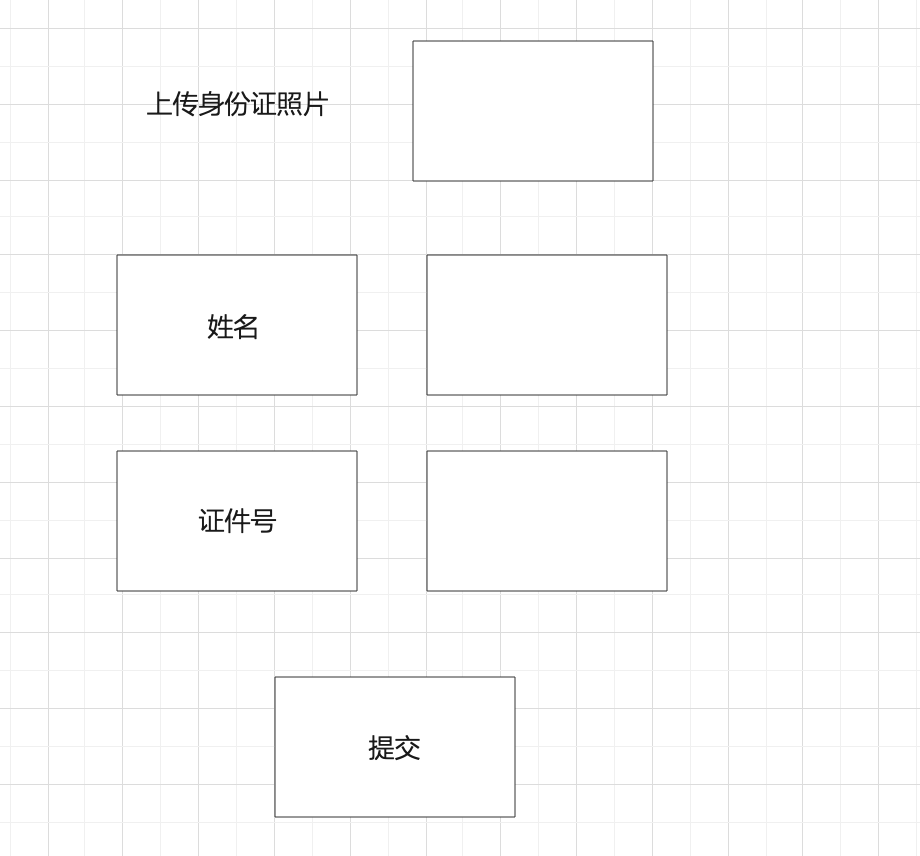

1.身份（实名）认证

~~~
身份证认证-》上传身份证照片到七牛云服务器-》返回一个图片地址-》百度开放平台注册应用-》利用应用信息获取token授权-》调用文字识别接口-》返回姓名和身份证号

百度qps个人 2qps  企业10qps   30qps
上传图片成功-》将图片存入redis list中

定时任务每秒执行一次-》从队列中取出2条数据，向百度接口发起请求-》将结果存入redis-》setInteval向接口发起请求-》在接口中根据图片地址查询姓名和身份证号

实名认证
id  userid  url             name  code          status
1    1      http://asf     张三     1001312       2
~~~

4.我的-》没登录     注册登录、三方登录

​                上传头像

​                实名认证  --》调用百度身份识别接口（企业账号，公安系统） 文字识别接口  qps限制

​                我的订单

​                我的发布

​                 充值

### 2.qps限制

~~~
qps每秒处理的请求数，个人2qps,企业10qps
队列-》先进先出  异步、削峰、解偶

图片识别   
生产者：图片    
消费者：百度把图片转为文字
~~~

### 3.身份识别qps限制处理流程

~~~
点击提交-》获取图片地址-》把地址存入redis中的list-》
celery定时任务-》每秒执行一次-》定时任务从队列中取出图片调用百度接口识别，将返回的结果存入redis字符串，key:图片url，value:姓名和身份证号。
vue页面 setInterval每秒请求一次接口-》在接口中根据图片url查询，如果存在返回，清除redis,写入页面，清除定时器
~~~

### 4.celery

~~~
异步任务框架，本身没有队列，redis,rabbitmq

task

~~~

