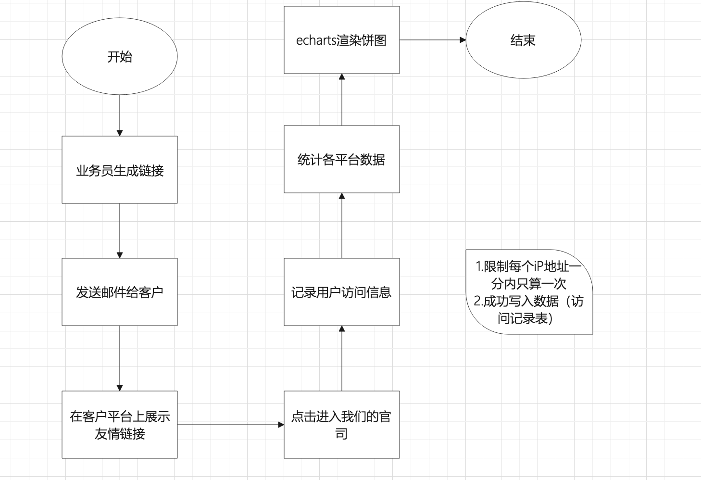

### 熟练使用Python的 Web 框架,如 Django,Flask ,有相关的项目经验,具备扎实的编程基础

~~~

~~~

### 1.websocket

~~~
setInterval(()=>{
 axios
},1000)

全双工通讯协议，持久化链接，相当于建立一个通道。应该场景，时时业务，聊天系统，消息推送。http单工协议，一次一次响应。
客户端和服务端建立链接，客户端向服务端发送消息。服务端产生消息也可以通过连接发送给客户端。

onopen建立连接
onclose关闭连接
onmessage接受消息
send发送消息
~~~

### 2.项目中的使用

~~~
身份证识别业务需求
客户端->服务端(创建websocket)
客户端向服务端发起连接请求-》携带userid》服务端接收id，获取connection，存入字典中。dict={'url':conn}

定时任务中拿到数据，根据key获取conn，调用conn send方法发送请求。vue onmessage接收消息，解析消息
~~~

### 3.充值模块

~~~
支付宝配制-》页面-》选择支付方式（单选、默认选中支付宝）、输入金额-》提交-》写入充值记录表（订单号、userid、create_time、money,pay_type,status,transaction_no）->获取支付宝链接（加入队列订单号）-》返回给页面-》点击跳转到支付宝平台-》登录、输入密码、支付-》支付成功后回调-》验签通过更新充值记录表中的状态、更新用户表中的总金额（事务处理）

支付成功回调失败：
celery定时任务，延时队列。
定时任务：从队列中取出半小时前的数据，调用支付宝查询接口，进行查询，更新充值记录表中的状态、更新用户表中的总金额（事务处理）

~~~

~~~
 from django.db import transaction
# 创建保存点
save_id = transaction.savepoint()  
# 回滚到保存点
transaction.savepoint_rollback(save_id)
# 提交从保存点到当前状态的所有数据库事务操作
transaction.savepoint_commit(save_id)
 
 with transaction.atomic():
   # 创建事务保存点
   save_id = transaction.savepoint()  # 记录了当前数据库的状态
   try:
     #更新充值订单表
     #更新用户
     transaction.savepoint_commit(save_id)
   except:
     transaction.savepoint_rollback(save_id)
     
~~~

### 1.xlrd对excel的处理

~~~
导入
模板-》下载模板-》写入excel->xlrd读取excel->定位sheet,计算共有多少行，多少列-》读取数据，写入数据库
~~~

2.使用

~~~
安装
pip install  xlrd

@userblue.route('/importfile')
def importfile():
    name = './static/excelfile/1.xls'
    bk = open_workbook(name,encoding_override='utf-8')
    sh = bk.sheets()[0]
    nrows = sh.nrows
    ncols = sh.ncols
    for i in range(1,nrows):
        row_date = sh.row_values(i)
        # print(row_date[0])
        # print(row_date[1])
        sql = "insert into users(name,password,age) values()"%(row_date[0])
        db1.update(sql)
        db1.commit()
    return 'ok'
    
~~~

 导出

~~~

    

from io import BytesIO
from xlrd import open_workbook
from urllib.parse import quote
import xlsxwriter
import datetime
import mimetypes

@userblue.route('/download',methods=["GET","POST"])
def download():
     # 实例化二进制数据
    out = BytesIO()
    # 创建一个Excel实例
    workbook = xlsxwriter.Workbook(out)
    # 添加一个sheet，add_worksheet()，默认"Sheet1"，可自定义命名，add_worksheet("资产列表")
    table = workbook.add_worksheet()
    # table.write(行, 列, 字段名)
    # 行、列从 0 开始计数
    # 字段命名根据每个人使用情况而定，插入数据部分也是
    table.write(0, 0, "角色id")
    table.write(0, 1, "角色名称")
    table.write(0, 2, "角色父类")
    table.write(0, 3, "角色类型")
    
    #查询数据库获取数据
    sql = "select r.id,r.name,r.type,pr.name as prname from roles as r left join roles as pr on r.pid=pr.id"
    res = db1.findAll(sql)

    order_dict={1:'只能被继承',2:"业务中需要的"}
  

    for index,i in enumerate(res):
        number=index+1
        table.write(number, 0, i['id'])
        table.write(number, 1, i['name'])
        table.write(number, 2, i['prname'])
        type = int(i['type'])
        table.write(number, 3, order_dict[type])
      
    workbook.close()
    filename = quote("资产列表_{}.xlsx".format(datetime.datetime.now().strftime("%Y%m%d%H%M%S")))
    file = make_response(out.getvalue())
    out.close()
    mime_type = mimetypes.guess_type('%s.xlsx' % filename)[0]
    file.headers['Content-Type'] = mime_type
    file.headers["Cache-Control"] = "no-cache"
    file.headers['Content-Disposition'] = "attachment; filename*=utf-8''{}".format(filename)
    return file

~~~

2.pandas excel操作

~~~
 import pandas as pd
 df = pd.read_excel('./static/excelfile/1.xls')
 dict =df.to_dict()
 for (k,v) in dict.items():
 	print(v)
~~~

### 3.echarts js的图形可视化库

#### 安装

~~~
npm install echarts --save
~~~

#### app外链设置模块

~~~
外链设置表link_set
id  编码     标题            公司  分成比例  图片地址                  url地址   
1   jd     积云直接平台      京东    0.1                             http://localhost:8080/#/?code=jd
2   bd      百度                    0.2     http://zh22.com/1.jpg   http://localhost:8080/#/?code=bd

外链记录表
id  code   添加时间
1    jd     2022-10-10 02:10:10
1    jd     2022-10-10 03:10:10
1    jd     2022-10-11 02:10:10
1    tb     2022-10-11 02:10:10
1    tb     2022-10-12 02:10:10

select code,count(id) from where addtime  group by code

问题：
redis限制每个ip地址1分钟只计算一次

~~~

~~~
insert into linkset values('2023-10-10 10:10:10','2023-10-10 10:10:10',0,'1003',1,'直接后台','http://asdfsdf.com/324234','阿里',1,'http://localhost:8080/#/?code=1003','lishi','763005825@qq.com');
~~~

~~~
<a href="http://localhost:8080/#/?code=1001">直播后台</a>
首页
code:this.$router.query.code

mouted(){
	addrecord(){
		this.axios.get("?code"+this.code).then(res=>{
		
		
		})
	
	}
	

}

select count(linkrecord.code),linkset.company from linkrecord inner join linkset on linkrecord.code=linkset.code group by linkset.company;
~~~

案例2

~~~
1.写一下接口，用接口生成5个2位的随机数  24，90，84，23，45
2.定义一个名字列表 ["A","B","c","d",'E']
3.组装数据返回 [{"value":24,'name':'a'}]

setInteval()每隔一分钟访问一次接口

~~~

