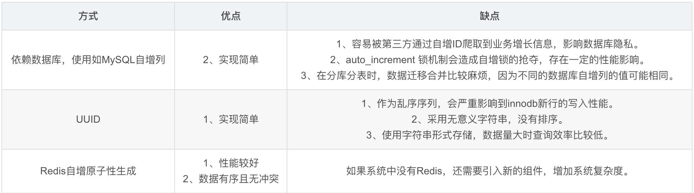
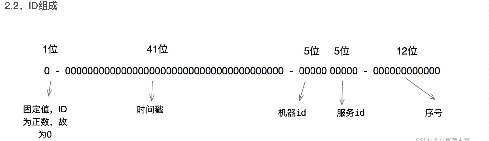
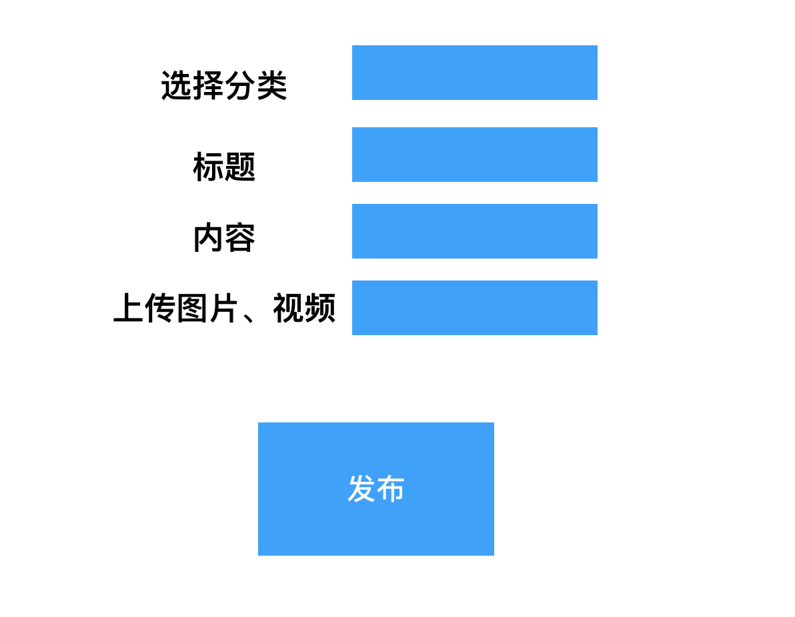
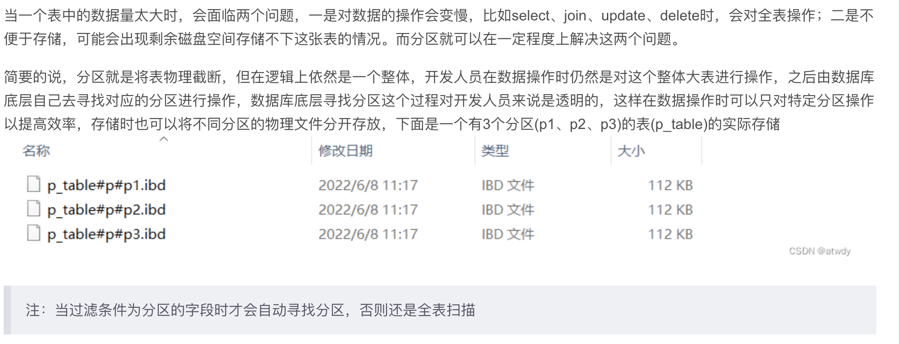
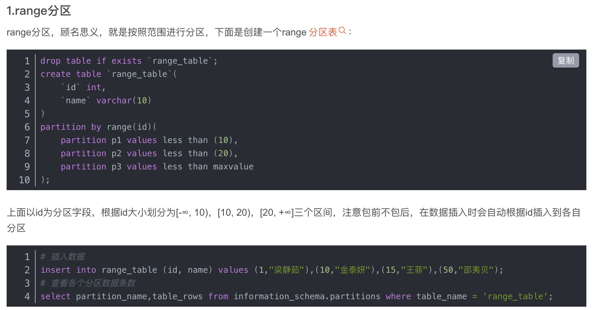
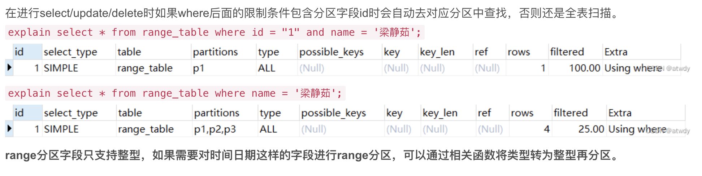
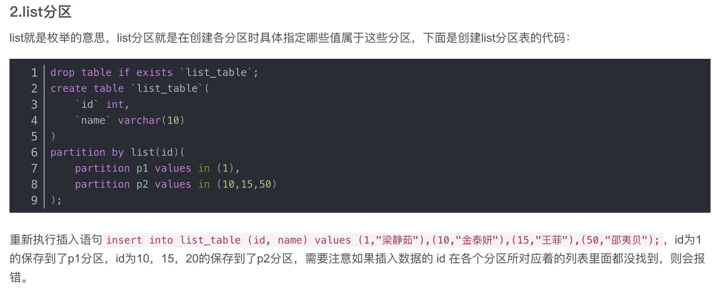
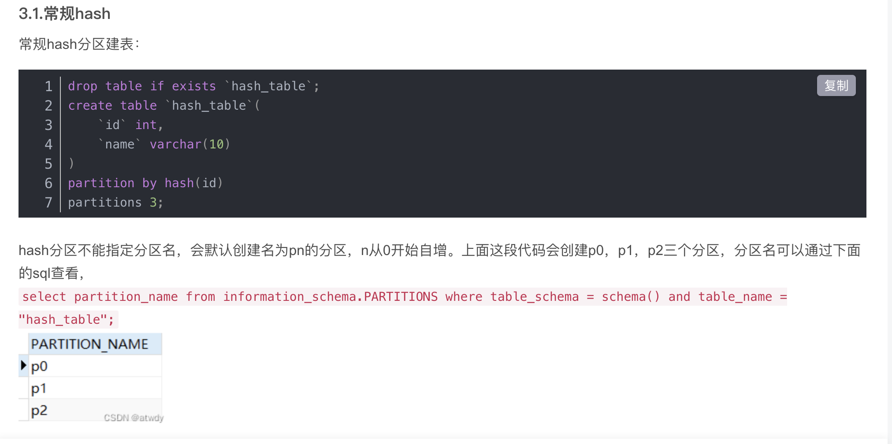

### 1.视频发布

~~~
创作者平台
发布-》图文
   -》视频
   -》标题提取
   -》分表
   
100万用户
20-30左右
5万条-》

总用户量
日活
并发访问qps

分表有两种：
水平：根据行去分，两张表的结构完全一样，数据分离
   按月分，冷热数据，按用户，平均分配
垂直：单表字段太多，用户30多个字段，高频使用的放到user中，userinfo，一对一

SELECT * from publish1  UNION  select * from publish2;
union去重  
union all不去重
~~~

### 2.分表

~~~
publish1
1
2
3
publish2
1
2
3

唯一id
mysql表的方式 ：id 
uuid
redis 

将一张表分成多张表

垂直分表 ：单表多于20个字段
用户名  密码   积分  签名  头像  。。。。

用户表  用户名 密码 积分   
用户信息表  userid 签名  头像  。。。。

水平分表:表字段一样，记录拆分，冷热数据分离，将不同的记录放入不同的表
publish0
1
publish1
2
publish2
3

class Publish0

~~~

### 3.水平分表唯一id问题

~~~
uuid:asf2342342-235234-45sd
mysql创建一张表  id value

~~~

### 2.场景

~~~
100万用户，50万日活，20万条数据，和qps 10分之一  qps1000以内
20万-》
mysql单表如果超过1000万数据，性能下降。分表解决问题，业界的标准500-600万要一张表

~~~

### 3.分表分库**mycat**

水平分表

~~~
表名不一样，表中的字段完全一样，表中记录不一样
publish1  publish2  
~~~

垂直分表

~~~
表名不一样，字段也不一样
用户表 一对一拆分。一张表字段超过15个的时候
~~~

### 4.水平分表

按月分，数据不均匀

~~~
月份
publishs1

publishs2

publishs3
~~~

hash取模

~~~
publishs1
publishs2
publishs0

hash(142423)%3

number = hash(1)%3
对id  hash操作与表的总数取模
tablename = 'publishs'+str(number)
insert into tablename values()

~~~

分表涉及id到唯一id的问题

~~~
uuid  无序的永不重复的串,字符串存储性能差，无规则无意义
2525245-asfa-234242adf-asf

create table idcreate(
	id int primary key auto_increment
);

自增id
创建一张表,id,name
insert into  values ''
last_row_id  1

redis
~~~

雪花算法

~~~
64位二进制的串，转化成19位int类型，每秒生成百万个不重复的id

第一位  0
时间戳  41位（精确到毫秒级）
5位+5位  10 
  随机码  12
~~~

### 1.水平分表唯一id

在[分布式](https://so.csdn.net/so/search?q=分布式&spm=1001.2101.3001.7020)系统中生成唯一ID的方案有很多，常见的方式有以下几种

### 2.雪花算法原理

雪花算法生成的ID是纯数字且有序的，最早是 Twitter 公司在其内部用于分布式环境下生成唯一 ID

~~~
由首位无效符、时间戳差值，机器编码（由机器id和服务id组成），序号四部分组成。

首位无效位：第一个bit作为符号位，因为我们生成的都是正数，所以第一个bit统一都是0。
时间戳：占用41bit，精确到毫秒。41位最好可以表示2^41-1毫秒，转化成单位年为69年。
机器编码：占用10bit，其中高位5bit是数据中心ID，低位5bit是工作节点ID，最多可以容纳1024个节点。
序列号：占用12bit，每个节点每毫秒0开始不断累加，最多可以累加到4095，一共可以产生4096个ID。
注意，默认的雪花算法是 64 bit，具体的长度可以自行配置。

如果希望运行更久，增加时间戳的位数；如果需要支持更多节点部署，增加标识位长度；如果并发很高，增加序列号位数。

~~~

优缺点

~~~shell
优点：

高性能高可用：生成时不依赖数据库，完全在内存中生成。
容量大：每秒钟能生成数百万自增ID。
ID自增：存入数据库中，索引效率高。

缺点：
雪花算法在单机系统上ID是递增的，但是在分布式系统多节点的情况下，所有节点的时钟并不能保证不完全同步，所以有可能会出现不是全局递增的情况。

会导致时钟回拨的问题
1.设置同步时间脚本
（1）vim autoSyncTime.sh
（2）脚本内容
#hwclock -w 系统时间同步到硬件时间,防止系统重启后时间还原
#crontab -l 查看当前用户的定时任务

ln -s /usr/share/zoneinfo/Asia/Shanghai /etc/localtime #修改时区为亚洲上海时区
if ! crontab -l |grep ntpdate &>/dev/null ; then
    (echo "* 1 * * * ntpdate ntp1.aliyun.com >/dev/null 2>&1";hwclock -w;crontab -l) |crontab 
fi

（3）保存运行脚本
chmod u+x autoSyncTime.sh
./AutoSyncTime.sh
或者
bash autoSyncTime.sh
~~~

安装和使用

~~~python
#首先安装库
pip3 install pysnowflake
#安装完成后，就可以在本地命令行启动snowflake服务
snowflake_start_server --worker=1

#生成唯一id
import snowflake.client
print(snowflake.client.get_guid())
#4589032814791368705
#解析成二进制
print(bin(4589032814791368705))
#0b11111110101111100001010000100000000100010000000010000000000001
#可以看到上文所述的第一位是标识符，此后是41位的时间戳，紧接着10位的节点标识码，最后12位的递增序列，从后面数12位是：000000000001，再数5位是：00010  这5位就是某个节点的存储标识，但是它目前是二进制，我们再将它转换为十进制
print(int('00010',2))
#2
~~~

~~~
发布-》图文
发布接口：
1.获取数据 title ,picurl
2.用雪花算法生成唯一id
#生成发布表的唯一id 

def getsnowcode():
    ncode = snowflake.client.get_guid()
    #从redis中查询，如果存在转成int和code对比
    code  = r.get('snowcode')
    if code:
        if int(ncode)<=int(code):
            return getsnowcode()
    #如果正确返回，如果发生回拨调用自己重新生成
    r.set('snowcode',ncode)
    return ncode
 
 
3.加入表（publish0  publish1）
   获取userid   number = hash(userid)%2
   if number == 0:
       Publish0(code=)
       
       
 用雪花算法生成唯一id,64中有41位时间戳，基于服务器时间，在分步式应用下导致时钟回拨问题
 利用redis字符串，把后一次生成的放入redis中，新生成的时候和redis中对比，如果小于等于说明发生时钟回拨，重新生成，否则直接使用

~~~

发布 模块具体实现

~~~
1.在vant中用户中心加一个按钮，我要发布
2.点击我要发布，进入发布页面
3.根据小红书app发布写页面
4.点击提交请求接口
5.在接口中
第一步把调用百度敏感词过滤接口，如果返回失败直接返回提示有违法信息不能发布
第二步如果没有敏感词添加，用雪花算法生成code
第三步 用userid hash取模判断写哪张表
第四步 写入发布表
~~~

