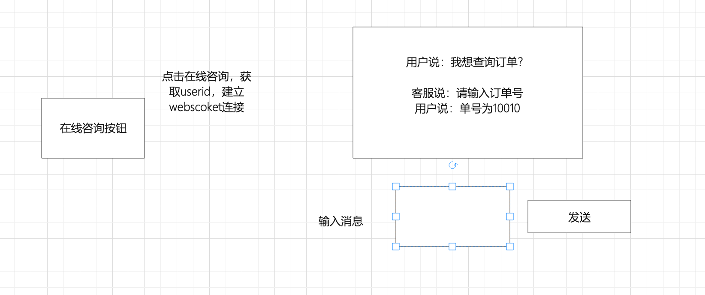
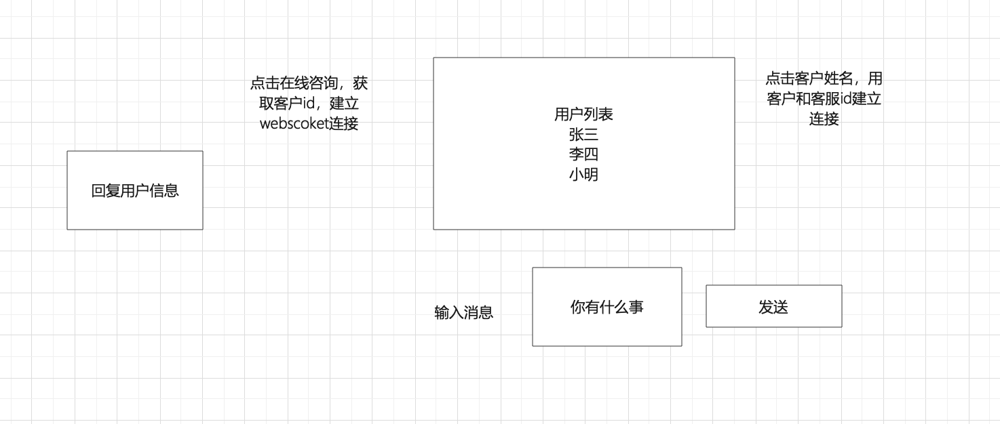

1.消息推送、基金、股票、监控、聊天系统

### 1.websocket介绍

~~~
时时任务
聊天、股票界面、监控服务、农业监控温度和湿度

界面
A   18
B   20
基于http,setInterval(function(),1)
~~~


~~~
全双工通讯协议,ws或者wss协议
原来的web中：

http协议： 无状态 & 短连接

客户端主动连接服务端。

客户端向服务端发送消息，服务端接收后，返回数据

客户端接收到数据

断开连接

https协议 = http协议 + 对数据进行加密

我们在开发过程中，想要保留一些状态信息，基于Cookie来做

现在支持：

http协议：一次请求一次响应

websocket协议： 创建持有的连接不断开，基于这个连接可以进行收发数据。【服务端向客户端主动推送消息】

web聊天室

实时图标，柱状图、饼图（echarts）

~~~

### 2.WebSocket原理

~~~
客户端 服务端
客户端  onopen建立连接
       onmessage接收消息
       onsend发送消息
       onclose关闭调用
       
 聊天系统
 客户端向服务端发送一个请求，携带参数userid
 服务端获取参数建立一个房间，{“userid”,connection}
 服务端有新数据的时候，发送给客户端，通过userid拿到connection，调用send发送
 客户端调用onmessage接收消息
 
~~~


http协议-》连接-》数据传输-》断开连接

websocket 协议 → 建立在 http 协议之上

连接， 客户端发出请求握手（验证）， 客户端发送一段消息，后端接收到消息后，做一些特殊处理并返回。服务端支持 websocket 协议

WebSocket协议是基于TCP的一种新的协议。WebSocket最初在HTML5规范中被引用为TCP连接，作为基于TCP的套接字API的占位符。它实现了浏览器与服务器全双工(full-duplex)通信。其本质是保持TCP连接，在浏览器和服务端通过Socket进行通信。

客户端向服务端发送握手信息

~~~
GET /chatsocket HTTP/1.1
Host: 127.0.0.1:8002
Connection: Upgrade
Pragma: no-cache
Cache-Control: no-cache
Upgrade: websocket
Origin: http://localhost:63342
Sec-WebSocket-Version: 13
Sec-WebSocket-Key: mnwFxiOlctXFN/DeMt1Amg==
Sec-WebSocket-Extensions: permessage-deflate; client_max_window_bits
~~~

服务端接收
接收后的加密过程

~~~
// Sec-WebSocket-Key 与 magic String 进行拼接
Sec-WebSocket-Key: mnwFxiOlctXFN/DeMt1Amg==  
magic_string = '258EAFA5-E914-47DA-95CA-C5AB0DC85B11'
v1 = "mnwFxiOlctXFN/DeMt1Amg==" +  '258EAFA5-E914-47DA-95CA-C5AB0DC85B11'

v2 = hmac1(v1)  // 通过 hmac1 进行加密
v3 = base64(v2) // 通过 base64 加密

~~~

返回数据

~~~
HTTP/1.1 101 Switching Protocols
Upgrade:websocket
Connection: Upgrade
Sec-WebSocket-Accept: 密文
~~~


收发数据（加密）

先获取第 2 个字节，对应 8 位

在获取第二个字节的后 7 位

断开连接ncey

websocket

~~~
websocket是一种全双工通讯协议，持久化链接，适当处理时时业务，比如聊天系统，大屏可视化，消息推送，基于tcp实现,对socket进行的封装,客户端和服务端
onopen建立链接
onmessage接收消息
send发送消息
onclose关闭
~~~

应用场景

农业系统

~~~

A  草莓
B  苹果
创建一张表  
编号  种植名称  最低温度  最高温度
1001  草莓       10        30

温度、湿度 传感器
时时获取到温度，通过温度去数据中对比，如果有异常，发送推送消息给Vue

~~~

基金时时显示

~~~
基金公司合作，开放一个接口
requests读取接口信息
A基金    100
B基金     200
C基金     50

Vue用echarts显示每支基金的时时价格

写一个接口，requests读取三方接口携带token，返回数据处理，websocket推送到Vue，vue用echarts展示
~~~

聊天业务 ，用户和客服聊天

~~~
vue页面 开始咨询
用户点击开始咨询建立一个websocket连接，Vue new websocket，携带当前用户的id，服务端接收建立连接。以用户id创建一个组，{"user1001":"conn"}
客户端向服务端发送消息，服务端根据userid找到链接进行操作
~~~

### 3.使用

由于channels 4.0.0 将daphne组件视为可选项（https://stackoverflow.com/a/76080493/11442415），所以如果要使用最新版，应该额外安装该组件。操作如下：

1. 先升级django、channels、channels-redis至最新版：

   ```shell
   pip install django -U
   
   pip install channels -U
   
   pip install channels-redis -U
   ```

2. 安装daphne组件并升级至最新版：

   ```shell
   pip install daphne -U
   ```

3. 配置settings.py的已安装应用：

   ```python
   INSTALLED_APPS = [
       'daphne',
       'channels',
       'django.contrib.admin',
       ...
   ]
   ```

4. 启动django服务器。

   如果显示：
   **Starting ASGI/Daphne version 4.0.0 development server** at http://127.0.0.1:8000/
   Quit the server with CTRL-BREAK.

   则可以正常使用。

   

   如果显示：
   **Starting development server** at http://127.0.0.1:8000/
   Quit the server with CTRL-BREAK.

   则表示没有安装成功。

1.安装

~~~
django==4.0.5
channels==3.0.5
channels-redis==2.4.2
~~~

2.注册channels

~~~
INSTALLED_APPS = [
	    'django.contrib.admin',
	    'django.contrib.auth',
	    'django.contrib.contenttypes',
	    'django.contrib.sessions',
	    'django.contrib.messages',
	    'django.contrib.staticfiles',
	    'channels',
	    'app01.apps.App01Config'
	]

~~~

3.在 settings.py 中添加 asgi_application，ws_demo项目名

```python
	ASGI_APPLICATION = 'ws_demo.asgi.application'
  CHANNEL_LAYERS = {
    "default": {
        "BACKEND": "channels_redis.core.RedisChannelLayer",
        "CONFIG": {
            "hosts": [("127.0.0.1", 6379)],
        },
    },
}  
```

4.修改asgi.py文件

ASGI 由 Django 团队提出，为了解决在一个网络框架里（如 Django）同时处理 HTTP、HTTP2、WebSocket 协议。为此，Django 团队开发了 Django Channels 插件，为 Django 带来了 ASGI 能力。
 在 ASGI 中，将一个网络请求划分成三个处理层面，最前面的一层，interface server（协议处理服务器），负责对请求协议进行解析，并将不同的协议分发到不同的 Channel（频道）；频道属于第二层，通常可以是一个队列系统。频道绑定了第三层的 Consumer（消费者）。 

~~~
	import os
	
	from django.core.asgi import get_asgi_application
	from channels.routing import ProtocolTypeRouter, URLRouter
	from ws_demo import routings
	
	os.environ.setdefault('DJANGO_SETTINGS_MODULE', 'ws_demo.settings')
	
	# application = get_asgi_application()
	
	# 支持 http 和 WebSocket 请求
	application = ProtocolTypeRouter({
	    "http": get_asgi_application(),  # 自动找 urls.py ， 找视图函数  --》 http
	    "websocket": URLRouter(routings.websocket_urlpatterns),  # routing(urls)、 consumers(views)
	})

~~~

5.在settings.py同级目录下创建routings.py

~~~
from django.urls import re_path

from app01 import consumers

websocket_urlpatterns = [
    # 示例 url ： xxxxx/room/x1/
    re_path(r"room/(?P<group>\w+)/$", consumers.ChatConsumer.as_asgi())
]

~~~

6.在子应用下创建consumers.py文件

~~~python
from channels.generic.websocket import WebsocketConsumer
from channels.exceptions import StopConsumer

from asgiref.sync import async_to_sync

import json

class ChatConsumer(WebsocketConsumer):  # 继承WebsocketConsumer
   room_name = 'chat_all_data'
   def websocket_connect(self, message):
        print("有人进行连接了。。。。")
        # cls = ChatConsumer
        # self.room_group_name = cls.room_name
        # print(self.scope['url_route']['kwargs'])
        #self.group_name = self.scope['url_route']['kwargs']['group']
        self.group_name ='2'
        # self.channel_layer.group_add(self.group_name,self.channel_name)
       
        async_to_sync(self.channel_layer.group_add)(self.group_name, self.channel_name)
        #判断是用户还是客服，如果是用户，给客服发送用户信息，房间号是客服id
        channel_layer = get_channel_layer()
        async_to_sync(channel_layer.group_send)(
            'home',#房间组名
            {
                'type':'send_to_chrome', #消费者中处理的函数
                'data':{"id":1,"name":'zs'}
            }
        )
       
      
       # 有客户端向后端发送 WebSocket 连接的请求时，自动触发(握手)
        self.accept()
       

   def websocket_receive(self, message):
       # 浏览器基于 WebSocket 向后端发送数据，自动触发接收消息
       print(message)
       #self.send("不要回复不要回复！！！")
       channel_layer = get_channel_layer()
       async_to_sync(channel_layer.group_send)(
            'home',#房间组名
            {
                'type':'send_to_chrome', #消费者中处理的函数
                'data':nlist
            }
        )
        
       
    

   def websocket_disconnect(self, message):
       # 客户端向服务端断开连接时，自动触发
        print("连接断开！！")
        self.group_name = self.scope['url_route']['kwargs']['group']
        
        
        async_to_sync(self.channel_layer.group_discard)(
            self.group_name,
            self.channel_name
        )
        raise StopConsumer()
    #自定义的处理房间组内的数据
   def send_to_chrome(self, event):
        try:
            data = event.get('data')
            #接收房间组广播数据，将数据发送给websocket
            self.send(json.dumps(data,ensure_ascii=False))
        except Exception as e:
            pass


~~~

django项目启动

~~~
pip install daphne
daphne education.asgi:application
~~~

7.vue调用

~~~vue
<template>
<div>

 <el-row>
    <el-col :span="10"><div class="grid-content ep-bg-purple-dark" />
    <ul>
    <li v-for="i in mlist" >
    {{i}}
    
    </li>
   
    </ul>
    </el-col>
  
 </el-row>

  
  
</div>
</template>

<script lang="ts" setup>
import {ref,onMounted}  from 'vue'

//搜索用的
const socket = ref(null)
const mlist=ref([{"id":1,"name":"张三"},{"id":2,"name":"李四"}])


const initwesockt=()=>{
    socket.value = new WebSocket("ws://localhost:8000/room/1");

    // 当客户端和服务端刚创建好连接(self.accept)之后，自动触发.
    socket.value.onopen =  (event)=>{
        console.log("连接成功")
    }

    // 回调函数，客户端接收服务端消息
    socket.value.onmessage =  (event)=>{
    
        var data  = JSON.parse(event.data)
        //data {"name":'zs',"id":1}
        mlist.value.push(data)
    }

    // // 当断开连接时，触发该函数
    // this.socket.onclose =function (event){
    // let tag = document.createElement("div");
    // tag.innerText = "[连接断开]";
    // document.getElementById("message").appendChild(tag);
    // }


}

onMounted(()=>{
    initwesockt()
})
</script>

~~~


### 推送视图

~~~python
from channels.layers import get_channel_layer
from asgiref.sync import async_to_sync

class Test(APIView):
    def get(self,request): 
        
        # update = AllDataConsumersUpdate()
        # update.all_active_visit_data()
        channel_layer = get_channel_layer()
        send_data = {"name":rand.randint(1,100)}
        async_to_sync(channel_layer.group_send)(
            '2',#房间组名
            {
                'type':'send_to_chrome', #消费者中处理的函数
                'data':send_data
            }
        )
        return JsonResponse({"code":200,"msg":"更新数据成功"})
~~~

聊天案例

~~~

单聊
群聊
~~~

客服系统-》在线咨询

~~~
3个客服

客服建议连接
kefu1 顶起奇才       kefu1  连接
kefu2 2222才       kefu2  连接

kefulist=[4,15,8]

500个用户

userid  1  张三        1 连接
userid  2  小明        2  连接 

分配客服 
kefu4   1，4，7
15  2，5，8
8   3，6，9

{"type":1,“from”:'1','to':'1','message':["你在吗，多少钱",'我的电话是苛要要']

~~~

~~~
websocket
消息推送
上传图片到云服务器-》获取url->向接口发起请求，传递url-》接口将url加入队列，返回-》建立websocket/图片url

celery开启定时任务
获取数据 lrange('',0,2)

在线客服
多个客服
kefulist = [1,2,8]
多个用户
10,11,12

hash()%5


~~~

### 协程使用

~~~python
# from __future__ import absolute_import, unicode_literals
import json

import logging

logging.basicConfig(level=logging.DEBUG)

from asgiref.sync import async_to_sync
from celery import Celery, shared_task
from channels.layers import get_channel_layer
from rusers.consumers import ImageConsumer
import time
from celery import Celery
from aiohttp import ClientSession
import asyncio

from utils import redis

from utils.common import get_bdaccess_token

app = Celery('xhsapi')
app.config_from_object('django.conf:settings', namespace='CELERY')

@shared_task
def process_urls():
    # loop = asyncio.get_event_loop()
    print("定时任务1————————————————————————————————")
    loop = asyncio.new_event_loop()
    asyncio.set_event_loop(loop)
    loop.run_until_complete(process_urls_coroutine())

async def process_urls_coroutine():
    # 从Redis列表中获取两个URL
    urls = redis.lgetall('idcardimg', 0, 1)

    # 使用协程并发请求
    async with ClientSession() as session:
        tasks = [process_url(session, url) for url in urls]
        await asyncio.gather(*tasks)

async def process_url(session, url):
    # 发送请求到百度身份证识别接口
    print('++++++++++++++执行定时任务+++++++++')
    try:
        url1 = url.decode().split('userid:')[0]
        userid = url.decode().split('userid:')[1]

        # 身份证识别
        # bdurl = "https://aip.baidubce.com/rest/2.0/ocr/v1/idcard?access_token=" + get_bdaccess_token()
        # payload = 'id_card_side=front&url=' + url1 + '&detect_risk=false&detect_quality=false&detect_photo=false&detect_card=false&detect_direction=false'
        # headers = {
        #     'Content-Type': 'application/x-www-form-urlencoded',
        #     'Accept': 'application/json'
        # }

        # 普通文字识别接口
        bdurl = "https://aip.baidubce.com/rest/2.0/ocr/v1/general_basic?access_token=" + get_bdaccess_token()
        payload = 'url=' + url1 + '&detect_direction=false&detect_language=false&paragraph=false&probability=false'
        headers = {
            'Content-Type': 'application/x-www-form-urlencoded',
            'Accept': 'application/json'
        }

        async with session.post(bdurl, headers=headers, data=payload) as response:
            if response.status == 200:
                data = await response.json()
                print(data)
                channel_layer = get_channel_layer()
                await channel_layer.group_send(
                    f"user_{userid}",
                    {
                        'type': 'send_result',
                        'result': data,
                    }
                )

                redis.lrem('idcardimg', 0, url)
    except Exception as e:
        # 处理请求失败的情况
        print(f"Error processing URL {url}: {e}")
    print('++++++++++++++结束定时任务+++++++++')
~~~

echarts时时显示

接口

~~~python
class TestWebsocketAPI(APIView):
    def get(self,request):
        n1 = request.GET.get("n1")
        n2 = request.GET.get("n2")
        n3 = request.GET.get("n3")
        nlist = [n1,n2,n3]
        
        channel_layer = get_channel_layer()
        async_to_sync(channel_layer.group_send)(
            'home',#房间组名
            {
                'type':'send_to_chrome', #消费者中处理的函数
                'data':nlist
            }
        )
        return JsonResponse({"code":200,"msg":"更新数据成功"})
~~~

vue

~~~vue
<template>
  <div>
  <div id="main" style="width:500px;height:300px;"></div>
   请输入问题<el-input v-model="mes"></el-input>
  <el-button @click="submit">提交</el-button>
  {{answer}} 

  </div>
</template>

<script lang="ts" setup>  
import { ref,onMounted } from 'vue'  
import http from "../http";  
import * as echarts from 'echarts';


const orderlist = ref([1001,1002,1003])
const countlist = ref([100,200,50])
const websocket =ref()

const initwebsocket=()=>{
    websocket.value = new WebSocket("ws://localhost:8000/room/home/");
    websocket.value.onopen =  (event)=>{
        alert('连接成功')
    }
    websocket.value.onmessage =  (event)=>{
        console.log(JSON.parse(event.data))
        countlist.value = JSON.parse(event.data) 
        initecharts()
    }
                
}
const submit=()=>{
   websocket.value.onsend({"userid":1,'mes':mes.value})
}
const initecharts=()=>{
    var chartDom = document.getElementById('main');
var myChart = echarts.init(chartDom);
var option;

option = {
  xAxis: {
    type: 'category',
    data:orderlist.value
  },
  yAxis: {
    type: 'value'
  },
  series: [
    {
      data: countlist.value,
      type: 'line'
    }
  ]
};

option && myChart.setOption(option);
}

onMounted(() => { 
    initwebsocket()
    initecharts() 
}) 
</script>

<style>

</style>
~~~

聊天系统

用户界面





