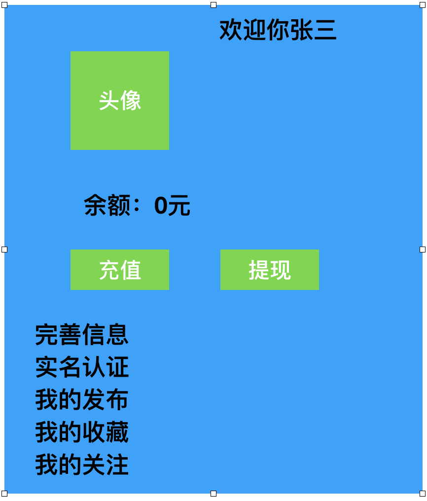

### 1.个人中心页面

### 我的发布

~~~
vant滑动加载
分页优化-》where order by   缓存redis,如果setnx
~~~

~~~python
分页优化
page=1
page_size=5
tcount = 100

start = (page-1)*page_size
select * from 表名 limit start,page_size

Publish.objects.offset().limit()

publish0 publish1  publish2

sql:union 和union all

select * from (select id,title  from publish0 where userid=1 union all select id,title from publish1 where userid=1) as publish where code< order by code desc limit ;

10
从redis中找第9页的最大值 
select * from where id>=90  limit 90,10

create table test1(
	id int primary key auto_increment,
	title varchar(30),
	sort int
);
~~~

