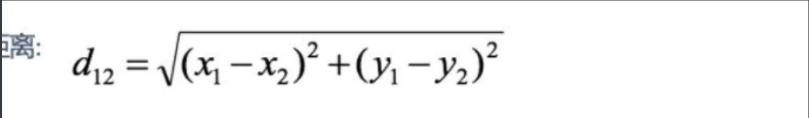

A简历

短视频、健身、医美、社交平台、大屏可视化、金融、在线教育平台（腾讯课堂，51talk）、电信、银行、CRM、ERP

~~~
个人信息：
姓名    工作年限
邮箱    手机号
求职意向    学历

学历
2013-2018   北京大学    计算机科学与技术

技能列表（至少8条）
1.熟练使用python中的django、flask、tornado框架
2.对异步编程有深入的理解,asyncio、celery

工作经历

2021-8——————2023-9  上海科技公司    python工程师
1.部门间的沟通协调
2.核心功能模块的开发
3.从0参与项目，需求分析、数据库设计
4.技术分享会
5.客户现场安装部署项目
7.项目的培训
8.参与“”专例项目的研发

2019-8——————2021-7  上海科技公司（外包）    python工程师

2019-8——————2021-7  上海科技公司    python工程师

项目经验（4-5个项目）
小红书（至少8条）
小红书是年轻信人的生活方式。。。。。。。。核心模块有用户管理、发布管理、充值管理

技术栈： django+vant+redis+mongdb+分治算法+celery+分表+雪花算法+支付宝+mysql
责任描述：
     1.jwt用户认证模块，实现接口安全认证
     2.工厂模块对三方登录的封装
     。。。
     
业绩：
   用户量从10半年时间内增加到100万
   部署100家企业
   
   
小红书后台管理（至少8条）
核心模块。。。。
责任描述：
  1.rbac权限管理
  2.推广模块 echarts+mysql分组
  
  
  
小红书推荐系统

     
  

~~~

个性签名

~~~

~~~

~~~
首页
推荐-》分类表中加一个字段（是否首页推荐）

~~~

### 协同过滤算法1.协同过滤算法

~~~
1.基于用户的
   （1）统计用户群体，相当于给用户分类
   （2）当A购买一个物品时，通过这个物品查询和他一类的这些人是否买过，如果没有就推荐
   
2.基于物品的
    经常看哪类，关注哪类，推荐哪类
    
    a  用户看10
    b  用户看9   2
    c  视频8     3
1.收集数据浏览记录表
userid  cateid（根据当前视频id查询分类id）  count，写入excel
      2.数据分析
      （1）把用户分层，哪一类用户
      （2）推荐分类
      算法：读取excel，分析推荐，封装成一个接口
3.推荐
调用算法接口，获取到当前用户用户推荐的分类，根据分类查询分类下热度最高的视频,封装成接口
userid  list['1','2']
~~~

### 2.实现流程

~~~
1.当用户点击视频，vue调用接口传递参数userid,vid
2.接口接收到参数根据vid查询cateid,写入浏览记录表  userid  cateid  count
3.获取此用户经常看哪类视频，
ulist = select * from v where userid=1
users = ulist['cateid']

tusers = select * from v where cateid in  users

首页展示视频
1.发布表中添加is_show_index字段，默认为0不在首页展示
2.管理员在后台更新展示状态为展示（后台管理系统中分页展示所有视频-》管理员点击首页展示-》更新数据库中首页展示字段）-》把首页展示的写入首页展示表

1.用户登录成功后-》首页展示视频-》点击查看写入浏览记录表（id,用户id,视频id,总次数）

新建一张浏览记录表
id userid  videoid  number  score
1   1       1         10     2
2   1       5          5     1
5   4       5         7
3   2       1         7
4   3       8         2

获取推荐视频
1.查询当前用户观看过的视频
select * from views where userid=1
list=[1,5,8]
2.查询视频列表被谁看过
users = select * rom views where videoid in (1,5,8)
userlist={"4":7,'2':7}
3.计算和我相似度最高的人
4,2
4.查询这几人看的视频列表 list1=[1,2,4,5]  查询我看到过的 list2=[1,2,3]

~~~

~~~python
def recommend_movies(request):
    # 获取当前用户的所有购买的商品
    user_ratings = list(UserViews.objects.filter(userid=1).values('videoid'))
    strs = ""
    for i in user_ratings:
       strs=strs+str(i)+","
     strs = strs.split(0,-2)
     #这视频被哪些人看过
     userlist = UserViews.objects.filter(videoid__in(strs)).values("userid",'count')
     dict = {}
     for i in userlist:
        dict={i[0]:i[1]}
        
     #相似度最高的用户列表
     similar_users = sorted(dict, key=lambda x: x[1])[:10]
     videolist =list(UserViews.objects.filter(userid__in(similar_users)).values('videoid'))
     diff = set(videolist).difference(set(user_ratings))
      
      
      
      
    # 计算当前用户与其他用户的相似度
    similarity_scores = {'2':{'score':1,'count':9}}
    #遍历此用户订单
    for rating in user_ratings:
        #查询和此用户购买商品相同的人
        for r in OrdersDetils.objects.filter(vedioid=rating.vedioid).exclude(userid=1):
            if r.userid not in similarity_scores:
                similarity_scores[r.userid] = {'score': 0, 'count': 0}
            similarity_scores[r.userid]['score'] += abs(r.number - rating.number)
            similarity_scores[r.userid]['count'] += 1
    for user, score_count in similarity_scores.items():
        similarity_scores[user]['score'] = score_count['score'] / score_count['count'] if score_count['count'] > 0 else 0

    # 按相似度排序，选出与当前用户相似度最高的前 n 个用户
    similar_users = sorted(similarity_scores.items(), key=lambda x: x[1]['score'])[:10]

    # 找出这些用户买过但是我没买过的商品进行推荐
    recommended_movies = []
    for user, score_count in similar_users:
        for rating in OrderDetails.objects.filter(userid=user):
            if not OrderDetails.objects.filter(vedioid=rating.vedioid, userid=1).exists():
                vedios = Publish0.objects.filter(id=rating.vedioid).first()
                recommended_movies.append({"vedioid":rating.vedioid,'tcount':rating.tcount,'name':vedios.title})
                

    # 按平均评分排序，选出前 n 个商品作为推荐结果
    recommended_movies = sorted(recommended_movies, key=lambda x: x['tcount'], reverse=True)[:10]

    return JsonResponse({"code":200,'list':recommended_movies})
~~~

~~~python
def recommend_movies(request):
    # 获取当前用户的所有购买的商品
    user_ratings = OrdersDetils.objects.filter(userid=1)

    # 计算当前用户与其他用户的相似度
    similarity_scores = {'2':{'score':1,'count':9}}
    #遍历此用户订单
    for rating in user_ratings:
        #查询和此用户购买商品相同的人
        for r in OrdersDetils.objects.filter(vedioid=rating.vedioid).exclude(userid=1):
            if r.userid not in similarity_scores:
                similarity_scores[r.userid] = {'score': 0, 'count': 0}
            similarity_scores[r.userid]['score'] += abs(r.number - rating.number)
            similarity_scores[r.userid]['count'] += 1
    for user, score_count in similarity_scores.items():
        similarity_scores[user]['score'] = score_count['score'] / score_count['count'] if score_count['count'] > 0 else 0

    # 按相似度排序，选出与当前用户相似度最高的前 n 个用户
    similar_users = sorted(similarity_scores.items(), key=lambda x: x[1]['score'])[:10]

    # 找出这些用户买过但是我没买过的商品进行推荐
    recommended_movies = []
    for user, score_count in similar_users:
        for rating in OrderDetails.objects.filter(userid=user):
            if not OrderDetails.objects.filter(vedioid=rating.vedioid, userid=1).exists():
                vedios = Publish0.objects.filter(id=rating.vedioid).first()
                recommended_movies.append({"vedioid":rating.vedioid,'tcount':rating.tcount,'name':vedios.title})
                

    # 按平均评分排序，选出前 n 个商品作为推荐结果
    recommended_movies = sorted(recommended_movies, key=lambda x: x['tcount'], reverse=True)[:10]

    return JsonResponse({"code":200,'list':recommended_movies})
~~~

实现

~~~
1.查询浏览记录表，大于3条，采用协同过滤算法中的基于用户的推荐获取视频列表
2.如果不存在
select * from publish0 limit 0,2 order by add_time desc union all select * from publish1 limit 0,2 order by add_time desc union select * from publish2 limit 0,2 order by add_time desc;

视频1
视频2
视频3

3.点击视频1，dialog弹出框，播放视频。写入到浏览记录表

create table video_views();
~~~

1、欧式距离
   欧式距离是使用较多的相似性的度量方法，在kMeans中就使用到欧式距离作为相似项的发现。

是一个通常采用的距离定义，指在m维空间中两个点之间的真实距离，或者向量的自然长度（即该点到原点的距离）。在二维和三维空间中的欧氏距离就是两点之间的实际距离

2、皮尔逊相关系数(Pearson Correlation)
   在欧氏距离的计算中，不同特征之间的量级对欧氏距离的影响比较大。**皮尔逊相关系数**广泛用于度量两个变量之间的相关程度，其值介于-1与1之间。它是由[卡尔·皮尔逊](https://baike.baidu.com/item/卡尔·皮尔逊/0?fromModule=lemma_inlink)从[弗朗西斯·高尔顿](https://baike.baidu.com/item/弗朗西斯·高尔顿/0?fromModule=lemma_inlink)在19世纪80年代提出的一个相似却又稍有不同的想法演变而来的。这个相关系数也称作“皮尔逊积矩相关系数”。皮尔逊相关系数的变化范围为-1到1。 系数的值为1意味着*X*和*Y*可以很好的由直线方程来描述，所有的数据点都很好的落在一条[直线](https://baike.baidu.com/item/直线/4876?fromModule=lemma_inlink)上，且Y随着X的增加而增加。系数的值为−1意味着所有的数据点都落在直线上，且y随着x 的增加而减少。系数的值为0意味着两个变量之间没有线性关系。

3、余弦相似度(Cosine Similarity)
   余弦相似度有着与皮尔逊相似度同样的性质，对量级不敏感，是计算两个向量的夹角。在吴军老师的《数学之美》上，在计算文本相似性的过程中，大量使用了余弦相似性的度量方法。

代码：

~~~python
# -*- coding: utf-8 -*-
"""
Created on Thu Apr  4 17:32:21 2019
@author: 2018061801
"""
import numpy as np
import pandas as pd
userid =-1
exportdata = []
goodsidlist = []
 
def load_data(file_path):
    global userid
    global goodsidlist
    '''导入用户商品数据
    input:  file_path(string):用户商品数据存放的文件
    output: data(mat):用户商品矩阵
    '''
    filedata = pd.read_csv(file_path)
    
    #获取行数
    rows = filedata.shape[0]
    cols = filedata.shape[1]
    for i in range(rows):
        for j in range(cols):
            if(filedata.values[i][j]) == 1009:
                # print(i,j)
                userid=i
        
    # print(filedata.values[0][0])
    data1 = filedata.drop(['userid'],axis=1)
    data = pd.DataFrame(data1)
    goodsidlist = data.columns.values.tolist()
    return np.mat(data)
 
def cos_sim(x, y):
    '''余弦相似性
    input:  x(mat):以行向量的形式存储，可以是用户或者商品
            y(mat):以行向量的形式存储，可以是用户或者商品
    output: x和y之间的余弦相似度
    '''
    numerator = x * y.T  # x和y之间的额内积
    denominator = np.sqrt(x * x.T) * np.sqrt(y * y.T) 
    return (numerator / denominator)[0, 0]
 
 
def similarity(data):
    '''计算矩阵中任意两行之间的相似度
    input:  data(mat):任意矩阵
    output: w(mat):任意两行之间的相似度
    '''
    m = np.shape(data)[0]  # 用户的数量
    # 初始化相似度矩阵
    w = np.mat(np.zeros((m, m)))
    
    for i in range(m):
        for j in range(i, m):
            if j != i:
                # 计算任意两行之间的相似度
                w[i, j] = cos_sim(data[i, ], data[j, ])
                w[j, i] = w[i, j]
            else:
                w[i, j] = 0
    return w
 
def user_based_recommend(data, w, user):
    '''基于用户相似性为用户user推荐商品
    input:  data(mat):用户商品矩阵
            w(mat):用户之间的相似度
            user(int):用户的编号
    output: predict(list):推荐列表
    '''
    m, n = np.shape(data)
    interaction = data[user, ]  # 用户user与商品信息
    
    # print(interaction)
    # 1、找到用户user没有互动过的商品
    not_inter = []
    for i in range(n):
        if interaction[0, i] == 0:  # 没有互动的商品
            not_inter.append(i)
    
    # 2、对没有互动过的商品进行预测
    predict = {}
 
    for x in not_inter:
        item = np.copy(data[:, x])  # 找到所有用户对商品x的互动信息
        for i in range(m):  # 对每一个用户
            if item[i, 0] != 0:  # 若该用户对商品x有过互动
                if x not in predict:
                    predict[x] = w[user, i] * item[i, 0]
                else:
                    predict[x] = predict[x] + w[user, i] * item[i, 0]
    # 3、按照预测的大小从大到小排序
    return sorted(predict.items(), key=lambda d:d[1], reverse=True)
 
def top_k(predict, k):
    '''为用户推荐前k个商品
    input:  predict(list):排好序的商品列表
            k(int):推荐的商品个数
    output: top_recom(list):top_k个商品
    '''
    top_recom = []
    len_result = len(predict)
    if k >= len_result:
        top_recom = predict
    else:
        for i in range(k):
            top_recom.append(predict[i])
    return top_recom   
          
if __name__ == "__main__":
    # 1、导入用户商品数据
    # print ("------------ 1. load data ------------")
    data = load_data("orders.csv")
    # 2、计算用户之间的相似性
    # print ("------------ 2. calculate similarity between users -------------")   
    w = similarity(data)
    # 3、利用用户之间的相似性进行推荐
    # print ("------------ 3. predict ------------userid:::"+str(userid))   
    predict = user_based_recommend(data, w, userid)
    # 4、进行Top-K推荐
    # print ("------------ 4. top_k recommendation ------------")
    top_recom = top_k(predict, 5)
    relist=[]
    for i in top_recom:
        key = i[0]
        relist.append(goodsidlist[key])
    print(relist)
~~~

