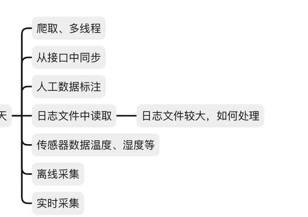

### 1.数据收集的几种方式



####   1.1 常见的反爬机制？

##### 一、基于请求头的反爬

1. **User-Agent（用户代理）检测**：
   - 原理：User-Agent是请求浏览器的身份标志，很多网站使用它来作为识别爬虫的标志。
   - 破解方法：伪装header，即修改请求的User-Agent字段，使其看起来像是来自正常浏览器的请求。
2. **Cookies检测**：
   - 原理：一些网站会检查请求中是否包含有效的Cookies，以验证用户身份或会话状态。
   - 破解方法：进行模拟登录以获取有效的Cookies，然后在请求中携带这些Cookies。

##### 二、基于访问行为的反爬

1. **访问频率限制**：
   - 原理：网站会检测某个IP地址在单位时间内的请求次数，如果超出设定的阈值，则认为是爬虫行为。
   - 破解方法：使用代理IP来模拟真实用户从不同IP地址访问目标网站，或者降低访问频率以避免触发限制。
2. **验证码验证**：
   - 原理：当检测到异常访问行为时，网站会要求用户输入验证码以验证身份。
   - 破解方法：对于简单的验证码，可以使用打码平台或OCR技术进行识别；对于复杂的验证码，可能需要尝试模拟用户行为绕过验证，但这通常比较困难。

##### 三、基于页面内容的反爬

1. **内容混淆**：
   - 原理：通过CSS偏移、自定义字体、SVG图形映射等方式将页面上的敏感信息进行混淆，使爬虫难以直接获取。
   - 破解方法：需要找到混淆的规律，例如CSS偏移的规律、自定义字体与Unicode的映射关系等，然后进行相应的处理以还原真实内容。
2. **动态生成页面内容**：
   - 原理：使用JavaScript渲染页面、Ajax异步加载数据等技术手段使爬虫难以获取完整的数据。
   - 破解方法：使用Selenium等自动化测试工具模拟人的操作来抓取动态页面内容。这些工具可以执行JavaScript并等待页面加载完成后再抓取数据。

##### 四、其他反爬手段

1. **IP封禁**：
   - 原理：对于频繁发送恶意请求的IP地址进行封禁处理。
   - 破解方法：使用代理IP池来不断更换IP地址以绕过封禁。
2. **网站结构更新**：
   - 原理：定期更新网站结构以打乱爬虫的规律。
   - 破解方法：需要持续关注网站结构的变化并更新爬虫策略以适应新的结构。
3. **与搜索引擎合作**：
   - 原理：通过robots.txt文件或其他方式指定哪些页面可以被爬取，哪些页面不可被爬取。
   - 破解方法：尊重网站的robots.txt文件规定，不爬取被禁止的页面内容。

#### 1.2 多线程爬取

多线程爬取的工作原理基于传统的网络爬虫，但通过多线程技术，能够同时发起多个HTTP请求，从而提高爬取效率。具体步骤如下：

1. **初始化**：定义起始URL和爬取规则。
2. **任务队列**：将待爬取的URL存放在队列中。
3. **多线程处理**：创建多个线程从队列中取出URL并发起HTTP请求。
4. **内容解析**：对获取的网页内容进行解析，提取有用信息和新的URL。
5. **结果存储**：将解析结果存储到数据库或文件中。
6. **重复过程**：继续从队列中获取URL，直到队列为空。

多线程爬取的优势

1. **提高效率**：多线程可以充分利用计算机的多核心优势，同时处理多个任务，从而显著提高数据抓取的效率。
2. **资源利用**：在多线程环境下，即使某个线程在等待服务器响应时，其他线程仍然可以继续执行，从而提高了资源的利用率。
3. **降低延迟**：通过并发请求，可以减少单个请求的等待时间，从而降低整体延迟。

安装库

~~~
pip install requests beautifulsoup4
~~~

代码实现

~~~python
import requests  
from bs4 import BeautifulSoup  
from threading import Thread, Lock  
import time  
  
# 豆瓣电影TOP250的基础URL  
BASE_URL = 'https://movie.douban.com/top250'  
HEADERS = {  
    'User-Agent': 'Mozilla/5.0 (Windows NT 10.0; Win64; x64) AppleWebKit/537.36 (KHTML, like Gecko) Chrome/58.0.3029.110 Safari/537.3'}  
  
# 创建一个锁对象，用于线程间同步  
lock = Lock()  
  
# 存储电影信息的列表  
movies = []  
  
def fetch_page(url, page_num):  
    """  
    获取指定页面的内容  
    """  
    try:  
        response = requests.get(url, headers=HEADERS, timeout=10)  
        response.raise_for_status()  
        return response.text  
    except requests.RequestException as e:  
        print(f"Error fetching page {page_num}: {e}")  
        return None  
  
def parse_movie_info(html_content, start_index):  
    """  
    解析HTML内容，提取电影信息  
    """  
    soup = BeautifulSoup(html_content, 'html.parser')  
      
    # 提取电影信息  
    movie_list = soup.find_all('div', class_='item')  
    for movie in movie_list[start_index:start_index + 10]:  
        rank = movie.find('em').text  
        title = movie.find('span', class_='title').text  
        rating = movie.find('span', class_='rating_num').text  
        link = movie.find('a')['href']  
          
        with lock:  
            movies.append({  
                'rank': rank,  
                'title': title,  
                'rating': rating,  
                'link': link  
            })  
  
def crawl_douban_top250():  
    """  
    多线程爬取豆瓣电影TOP250  
    """  
    threads = []  
    for i in range(10):  # 豆瓣TOP250分为10页，每页25条记录  
        url = f'{BASE_URL}?start={i * 25}&filter='  
        html_content = fetch_page(url, i + 1)  
        if html_content:  
            # 为每个页面创建一个线程解析电影信息  
            thread = Thread(target=parse_movie_info, args=(html_content, i * 25))  
            threads.append(thread)  
            thread.start()  
      
    # 等待所有线程完成  
    for thread in threads:  
        thread.join()  
  
if __name__ == '__main__':  
    start_time = time.time()  
    crawl_douban_top250()  
    end_time = time.time()  
      
    # 打印爬取到的电影信息  
    for movie in movies:  
        print(movie)  
      
    print(f"爬取完成，共耗时: {end_time - start_time:.2f} 秒")
~~~

#### 1.3 大日志文件读取解析

在处理大型日志文件时，Python 提供了一些有效的方法和工具来确保高效地读取和解析数据。由于日志文件可能非常大，直接一次性加载到内存中可能会导致性能问题或内存溢出。因此，通常推荐使用逐行读取或分块读取的方法。

以下是一些处理大型日志文件的最佳实践和示例代码：

##### 1.逐行读取

逐行读取文件是最简单且最常用的方法。这种方法允许你处理文件中的每一行，而不需要一次性将整个文件加载到内存中。

```python
def read_large_file_line_by_line(file_path):  
    with open(file_path, 'r', encoding='utf-8') as file:  
        for line in file:  
            # 在这里处理每一行  
            print(line.strip())  # 示例：打印每一行（去除换行符）  
  
# 使用示例  
file_path = 'path/to/your/large/logfile.log'  
read_large_file_line_by_line(file_path)
```

##### 2. 分块读取

对于非常大的文件，逐行读取可能仍然不是最优选择，因为即使是一行也可能包含大量数据。在这种情况下，你可以考虑将文件分成较小的块来读取。

```python
def read_large_file_in_chunks(file_path, chunk_size=1024):  
    with open(file_path, 'r', encoding='utf-8') as file:  
        while True:  
            chunk = file.read(chunk_size)  
            if not chunk:  
                break  
            # 在这里处理每一个块  
            # 注意：块可能包含多行的部分内容，因此可能需要进行额外的处理  
            print(chunk, end='')  # 示例：打印块（不添加额外的换行符）  
            # 实际上，你可能需要解析块中的行，例如：  
            # lines = chunk.splitlines()  
            # for line in lines:  
            #     process_line(line)  
  
# 使用示例  
file_path = 'path/to/your/large/logfile.log'  
read_large_file_in_chunks(file_path)
```

##### 3. 使用 `linecache` 模块（针对特定行读取）

如果你只需要读取文件中的特定行或行范围，`linecache` 模块可能是一个好选择。然而，请注意，这个模块通常用于较小的文件，因为它会将文件的每一行存储在内存中。

```python
import linecache  
  
def read_specific_lines(file_path, line_numbers):  
    for line_num in line_numbers:  
        line = linecache.getline(file_path, line_num)  
        if line:  
            # 在这里处理特定行  
            print(line.strip())  # 示例：打印特定行（去除换行符）  
  
# 使用示例  
file_path = 'path/to/your/large/logfile.log'  
line_numbers = [10, 20, 30]  # 示例：读取第10、20和30行  
read_specific_lines(file_path, line_numbers)
```

**注意**：对于非常大的文件，`linecache` 可能不是最佳选择，因为它会将文件的每一行都缓存到内存中。

##### 4. 并行处理（使用多线程或多进程）

对于非常大的文件，如果处理每行数据的计算量很大，你可以考虑使用多线程或多进程来加速处理。然而，由于Python的全局解释器锁（GIL）的存在，多线程在处理CPU密集型任务时可能并不会带来显著的性能提升。在这种情况下，多进程可能是一个更好的选择。

**注意**：并行处理大型文件时需要小心处理文件指针和同步问题，以确保数据的正确性和一致性。

日志的格式为

~~~
127.0.0.1 - - [10/Oct/2023:13:55:36 +0000] "GET /some/path HTTP/1.1" 200 1234
127.0.0.1 - - [10/Oct/2023:13:55:36 +0000] "GET /some/path HTTP/1.1" 200 1234
127.0.0.1 - - [10/Oct/2023:13:55:36 +0000] "GET /some/path HTTP/1.1" 200 1234
127.0.0.1 - - [10/Oct/2023:13:55:36 +0000] "GET /some/path HTTP/1.1" 200 1234

~~~

进程读取代码

~~~python
import multiprocessing  
import os  
  
# 日志文件的正则表达式模式，用于匹配IP地址和请求地址  
LOG_LINE_PATTERN = re.compile(  
    r'(\d+\.\d+\.\d+\.\d+) - - \[.*\] "(GET|POST|PUT|DELETE|OPTIONS|HEAD|PATCH|TRACE) (.*?) HTTP/1.*" \d+ \d+'  
)  
  
def parse_log_line(line):  
    """  
    解析日志文件中的一行，提取IP地址和请求地址。  
    """  
    match = LOG_LINE_PATTERN.match(line)  
    if match:  
        ip_address = match.group(1)  
        request_path = match.group(3)  
        return ip_address, request_path  
    return None, None  
  
def process_log_part(file_path, start_line, num_lines, result_queue):  
    """  
    读取日志文件的指定部分，并解析每一行。  
    """  
    with open(file_path, 'r', encoding='utf-8') as file:  
        # 移动到起始行  
        for _ in range(start_line):  
            next(file, None)  # 使用next函数跳过前面的行  
          
        # 读取并解析指定数量的行  
        for _ in range(num_lines):  
            line = next(file, None)  # 使用next函数读取下一行，如果到文件末尾则返回None  
            if line is None:  
                break  # 如果已经到达文件末尾，则停止读取  
            ip_address, request_path = parse_log_line(line)  
            if ip_address and request_path:  
                result_queue.put((ip_address, request_path))  
  
def calculate_chunks(file_path, num_processes):  
    """  
    计算每个进程应该处理的文件部分（按行分割）。  
    """  
    with open(file_path, 'r', encoding='utf-8') as file:  
        total_lines = sum(1 for _ in file)  # 计算文件总行数  
      
    chunk_size = total_lines // num_processes  # 每个进程处理的行数（尽量均匀分割）  
    chunks = []  
    for i in range(num_processes):  
        start_line = i * chunk_size  
        num_lines = chunk_size if i < num_processes - 1 else (total_lines - start_line)  # 最后一个进程可能处理更多或更少的行  
        chunks.append((file_path, start_line, num_lines))  
      
    return chunks  
  
def main(file_path, num_processes):  
    """  
    主函数，设置多进程并处理日志文件。  
    """  
    # 创建一个队列来存储解析结果  
    result_queue = multiprocessing.Queue()  
  
    # 计算每个进程应该处理的文件部分  
    chunks = calculate_chunks(file_path, num_processes)  
  
    # 创建进程池  
    processes = []  
    for chunk in chunks:  
        p = multiprocessing.Process(target=process_log_part, args=chunk + (result_queue,))  
        processes.append(p)  
        p.start()  
  
    # 等待所有进程完成  
    for p in processes:  
        p.join()  
  
    # 收集并打印结果  
    results = []  
    while not result_queue.empty():  
        results.append(result_queue.get())  
  
    for ip, path in results:  
        print(f"IP Address: {ip}, Request Path: {path}")  
  
# 使用示例  
if __name__ == "__main__":  
    log_file_path = 'path/to/your/logfile.log'  
    num_processes = 4  # 设置要使用的进程数  
    main(log_file_path, num_processes)
~~~

#### 1.4离线爬取

1. 数据收集

   ：

   - 首先，你需要从互联网上下载网页数据，并将其保存在本地。这可以通过在线爬虫实现，该爬虫访问网站并下载其HTML内容。
   - 一旦数据被下载，你就可以断开网络连接，并在离线模式下处理这些数据。

2. 本地存储

   ：

   - 下载的网页数据可以保存在本地文件系统上，每个网页可以作为一个单独的文件存储，或者使用某种数据库系统来组织和管理这些数据。

3. 数据解析

   ：

   - 使用Python的库（如BeautifulSoup、lxml等）来解析存储在本地的文件中的HTML内容。
   - 提取你感兴趣的信息，如文本内容、链接、图像URL等。

4. 数据处理

   ：

   - 对提取的数据进行进一步的处理，如清洗、格式化、去重等。
   - 可以使用Python的pandas库来处理结构化数据，或者使用NLTK等库来进行自然语言处理。

下载html到本地

~~~python
from bs4 import BeautifulSoup  
  
# 打开本地HTML文件  
with open('example.html', 'r', encoding='utf-8') as file:  
    html_content = file.read()  
  
# 使用BeautifulSoup解析HTML内容  
soup = BeautifulSoup(html_content, 'lxml')  
  
# 提取标题  
title = soup.title.string  
print(f'Title: {title}')  
  
# 提取所有段落文本  
paragraphs = soup.find_all('p')  
for i, p in enumerate(paragraphs, start=1):  
    print(f'Paragraph {i}: {p.get_text()}')  
  
    # 提取段落中的链接  
    links = p.find_all('a')  
    for link in links:  
        print(f'  Link text: {link.get_text()}')  
        print(f'  Link href: {link.get("href")}')  
  
# 提取所有列表项文本  
list_items = soup.find_all('li')  
for i, li in enumerate(list_items, start=1):  
    print(f'List Item {i}: {li.get_text()}')
~~~

#### 1.5时时爬取

安装包

~~~
pip install requests schedule
~~~

定时爬取

~~~python
import requests  
import schedule  
import time  
  
# 定义爬取函数  
def fetch_webpage(url):  
    try:  
        response = requests.get(url)  
        response.raise_for_status()  # 如果响应状态码不是200，将引发HTTPError异常  
        return response.text  
    except requests.RequestException as e:  
        print(f"Error fetching webpage: {e}")  
        return None  
  
# 定义处理爬取数据的函数（这里只是简单地打印出来）  
def process_data(data):  
    if data:  
        print("Fetched data:")  
        print(data[:1000])  # 打印前1000个字符以避免输出过长  
    else:  
        print("No data fetched.")  
  
# 设置定时任务（例如，每5分钟爬取一次）  
schedule.every(5).minutes.do(lambda: process_data(fetch_webpage('http://example.com')))  
  
# 保持脚本运行并检查调度任务  
print("Starting scheduled webpage fetching...")  
while True:  
    schedule.run_pending()  
    time.sleep(1)  # 可以根据需要调整睡眠时间
~~~


