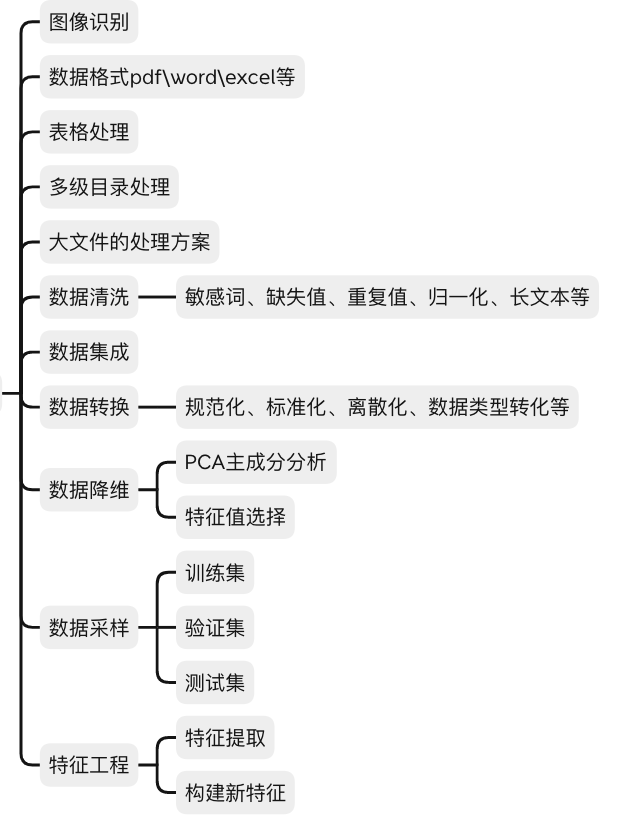

### 1.读取pdf文件中图像，并识别内容

### 所需库

1. **PyMuPDF（又名fitz）**：用于从PDF中提取图像。
2. **Pillow**：用于处理图像文件。
3. **Tesseract-OCR**：用于识别图像中的文本。
4. **pytesseract**：Python的Tesseract-OCR封装。

你可以使用以下命令安装这些库：

```bash
bash复制代码

pip install pymupdf pillow pytesseract
```

### 安装Tesseract-OCR

Tesseract-OCR是一个开源的OCR引擎，需要单独安装。安装步骤取决于你的操作系统：

- **Windows**：从[Tesseract的GitHub页面](https://github.com/tesseract-ocr/tesseract)下载并安装。
- **macOS**：使用Homebrew安装：`brew install tesseract`
- **Linux**：使用包管理器安装，例如在Ubuntu上：`sudo apt-get install tesseract-ocr`

安装完成后，确保Tesseract-OCR可执行文件的路径已添加到系统的PATH中。

### 代码示例

```python
import fitz  # PyMuPDF  
from PIL import Image  
import pytesseract  
import io  
  
# 读取PDF文件  
pdf_path = 'your_pdf_file.pdf'  
doc = fitz.open(pdf_path)  
  
# 获取PDF中所有页面的图像  
images = []  
for page_num in range(len(doc)):  
    page = doc.loadPage(page_num)  
    images += page.getImageList()  
  
# 提取并保存图像  
image_counter = 1  
for img_index, img in enumerate(images):  
    xref = img[0]  
    base_image = doc.extractImage(xref)  
    image_bytes = base_image["image"]  
    image_ext = base_image["ext"]  
  
    # 使用Pillow打开图像  
    image = Image.open(io.BytesIO(image_bytes))  
  
    # 保存图像到本地文件（可选）  
    image_path = f'page_{page_num + 1}_image_{image_counter}.{image_ext}'  
    image.save(image_path)  
    print(f"Saved: {image_path}")  
  
    # 使用Tesseract进行OCR识别  
    text = pytesseract.image_to_string(image, lang='eng')  # lang参数可以根据需要调整  
    print(f"Text from {image_path}:\n{text}\n")  
  
    image_counter += 1  
  
# 关闭PDF文件  
doc.close()
```

### 2.提取pdf文件中的表格内容

PDFPlumber
PDFPlumber是一个Python库，专门用于从PDF中提取文本和表格数据。它提供了强大的工具来解析PDF的结构，并尝试识别其中的表格。

安装PDFPlumber：

```bash
pip install pdfplumber
```

使用PDFPlumber提取表格的示例代码：

```python
import pdfplumber  
 
pdf_path = 'your_pdf_file.pdf'  
 
with pdfplumber.open(pdf_path) as pdf:  
    # 遍历PDF中的每一页  
    for page in pdf.pages:  
        # 尝试提取表格  
        tables = page.extract_tables()  
        # 假设我们只对第一个表格感兴趣（如果有多个表格）  
        if tables:  
            table = tables[0]  
            for row in table:  
                print(row)
```

### 3.多级目录处理

#### **PyMuPDF（fitz）**：

PyMuPDF（也称为PyMuPDF或fitz）是一个功能强大的Python库，可以处理PDF文件，包括读取和修改书签。

```python
import fitz  # PyMuPDF  
 
# 打开PDF文件  
pdf_path = 'your_pdf_file.pdf'  
doc = fitz.open(pdf_path)  
 
# 获取书签（大纲）  
bookmarks = doc.getToC()  # ToC代表"Table of Contents"（目录）  
 
# 遍历书签  
def print_bookmarks(bookmarks, level=0):  
    for bm in bookmarks:  
        if bm[1]:  # bm[1]是书签标题，如果它存在  
            print(' ' * level * 4 + bm[1])  # 打印书签标题，前面加上缩进以表示层级  
            # 递归调用以处理子书签  
            print_bookmarks(bm[2], level + 1)  
 
# 调用函数打印所有书签  
print_bookmarks(bookmarks)  
 
# 关闭PDF文件  
doc.close()
```

#### word中多级目录处理

以下是一个示例代码，展示了如何使用`python-docx`从Word文件中提取多级目录：

```python
from docx import Document  
  
def get_headings(doc):  
    """  
    从文档中提取所有标题，并构建一个多级目录结构。  
      
    :param doc: Document对象，表示打开的Word文档。  
    :return: 一个列表，包含多级目录的标题和级别。  
    """  
    headings = []  
    for para in doc.paragraphs:  
        if para.style.name.startswith('Heading'):  
            # 根据样式名称确定标题级别（这里假设样式名称为'Heading 1', 'Heading 2'等）  
            level = int(para.style.name.split()[-1])  
            text = para.text.strip()  
            headings.append((level, text))  
    return headings  
  
def print_headings(headings):  
    """  
    打印多级目录结构。  
      
    :param headings: 一个包含多级目录标题和级别的列表。  
    """  
    indent = 0  
    for level, text in headings:  
        # 根据级别调整缩进  
        print(' ' * indent + text)  
        # 如果当前级别小于下一个级别，增加缩进  
        # 如果当前级别大于下一个级别，减少缩进（回到上一级）  
        if headings and headings[headings.index((level, text)) + 1][0] > level:  
            indent += 2  
        elif headings and headings[headings.index((level, text)) + 1][0] < level:  
            indent = max(0, indent - 2)  
  
# 打开Word文档  
doc_path = 'your_word_file.docx'  
doc = Document(doc_path)  
  
# 获取文档的标题结构  
headings = get_headings(doc)  
  
# 打印多级目录  
print_headings(headings)
```

在这个示例中，`get_headings`函数遍历文档的每个段落，检查其样式名称是否以"Heading"开头，然后根据样式名称中的数字确定标题的级别。`print_headings`函数则根据标题的级别打印多级目录结构，通过调整缩进来表示不同的层级。

#### Markdown

从Markdown文件中获取多级目录（通常称为大纲或标题结构）相对简单，因为Markdown使用明确的语法来标记不同级别的标题。例如，Markdown使用`#`字符来表示标题，`#`的数量决定了标题的级别（`#`表示一级标题，`##`表示二级标题，依此类推）。

以下是一个Python脚本，它读取Markdown文件并提取多级目录结构：

```python
import re  
  
def get_markdown_headings(file_path):  
    """  
    从Markdown文件中提取所有标题，并构建一个多级目录结构。  
      
    :param file_path: Markdown文件的路径。  
    :return: 一个列表，包含多级目录的标题和级别。  
    """  
    headings = []  
    level_pattern = re.compile(r'^(#+)(.*)')  # 匹配Markdown标题的正则表达式  
      
    with open(file_path, 'r', encoding='utf-8') as file:  
        for line_num, line in enumerate(file):  
            match = level_pattern.match(line.strip())  
            if match:  
                level = len(match.group(1))  # 标题级别由#的数量决定  
                text = match.group(2).strip()  # 标题文本  
                headings.append((level, text, line_num + 1))  # 还可以记录标题所在的行号（可选）  
      
    return headings  
  
def print_markdown_headings(headings):  
    """  
    打印多级目录结构。  
      
    :param headings: 一个包含多级目录标题、级别和行号的列表。  
    """  
    indent = 0  
    previous_level = 0  
      
    for level, text, line_num in headings:  
        # 根据级别调整缩进  
        if level > previous_level:  
            indent += 2  
        elif level < previous_level:  
            indent = max(0, indent - 2 * (previous_level - level))  
          
        # 打印标题，前面加上缩进和行号（可选）  
        print(f'{" " * indent}- {text} (Line {line_num})')  
          
        # 更新前一个级别  
        previous_level = level  
  
# Markdown文件路径  
markdown_file_path = 'your_markdown_file.md'  
  
# 获取Markdown文件的标题结构  
headings = get_markdown_headings(markdown_file_path)  
  
# 打印多级目录  
print_markdown_headings(headings)
```

在这个脚本中，`get_markdown_headings`函数读取Markdown文件的每一行，并使用正则表达式来匹配标题。对于每个匹配的标题，它记录标题的级别、文本和行号（可选）。然后，`print_markdown_headings`函数根据标题的级别打印多级目录结构，通过调整缩进来表示不同的层级。

### 4.数据清洗

#### 敏感词处理

正则表达式

敏感词处理通常涉及对文本进行过滤，以移除或替换可能被认为是不适当、冒犯性或不希望出现的词汇。这可以通过多种方法实现，包括使用预定义的敏感词列表、正则表达式、或者更复杂的自然语言处理技术。

以下是一个简单的Python代码示例，展示了如何使用预定义的敏感词列表来过滤文本中的敏感词。这个示例将敏感词替换为星号（`*`）或者你可以根据需要替换为其他字符或字符串。

```python
# 定义敏感词列表  
sensitive_words = [  
    "敏感词1", "敏感词2", "敏感词3",  
    # ... 添加更多敏感词  
]  
  
# 定义一个函数来替换敏感词  
def replace_sensitive_words(text, sensitive_words, replacement="*"):  
    """  
    替换文本中的敏感词。  
  
    :param text: 要处理的文本  
    :param sensitive_words: 敏感词列表  
    :param replacement: 用于替换敏感词的字符串，默认为'*'  
    :return: 处理后的文本  
    """  
    for word in sensitive_words:  
        # 使用正则表达式来确保只匹配完整的单词（避免部分匹配）  
        # \b 表示单词边界  
        text = re.sub(r'\b' + re.escape(word) + r'\b', replacement * len(word), text)  
    return text  
  
# 示例文本  
text = "这是一个包含敏感词1和敏感词2的示例文本。"  
  
# 替换敏感词  
filtered_text = replace_sensitive_words(text, sensitive_words)  
  
# 打印处理后的文本  
print(filtered_text)
```

自然语言处理（NLP）在实现敏感词过滤方面提供了多种方法和工具，可以处理更复杂的场景，比如上下文感知、同义词替换以及更精细的文本分析。以下是一个基于NLP的敏感词过滤的Python实现框架，使用了`spaCy`这个强大的NLP库

首先，你需要安装`spaCy`和它的语言模型。在终端或命令提示符中运行以下命令：

```bash
pip install spacy  
python -m spacy download en_core_web_sm  # 下载英文小模型，或根据需要选择其他语言模型
```

然后，你可以使用以下代码来实现敏感词过滤：

```python
import spacy  
import re  
  
# 加载spaCy的语言模型  
nlp = spacy.load("en_core_web_sm")  
  
# 定义敏感词列表  
sensitive_words = [  
    "badword1", "badword2", "badword3",  
    # ... 添加更多敏感词  
]  
  
# 将敏感词转换为正则表达式模式，以便进行高效的匹配  
sensitive_patterns = [re.compile(r'\b' + re.escape(word) + r'\b', re.IGNORECASE) for word in sensitive_words]  
  
# 定义一个函数来替换敏感词  
def replace_sensitive_words_nlp(text):  
    """  
    使用NLP和正则表达式替换文本中的敏感词。  
  
    :param text: 要处理的文本  
    :return: 处理后的文本  
    """  
    doc = nlp(text)  
    new_text = []  
    for token in doc:  
        # 检查每个token的文本是否是敏感词  
        for pattern in sensitive_patterns:  
            if pattern.match(token.text):  
                # 替换为星号或其他字符串  
                new_text.append('*' * len(token.text))  
                break  
        else:  
            # 如果不是敏感词，则保留原样  
            new_text.append(token.text)  
    # 重新组合成字符串  
    return ' '.join(new_text)  
  
# 示例文本  
text = "This is a sample text with badword1 and another badword2 inside."  
  
# 替换敏感词  
filtered_text = replace_sensitive_words_nlp(text)  
  
# 打印处理后的文本  
print(filtered_text)
```

在这个例子中，我们使用了`spaCy`来对文本进行分词，并检查每个分词是否是敏感词。如果是敏感词，则替换为星号；如果不是，则保留原样。注意，这里我们使用了正则表达式来确保只匹配完整的单词，并且忽略了大小写（`re.IGNORECASE`）。

#### 重复值处理

在Pandas中处理重复值是一个相对简单且直接的过程。Pandas提供了多种方法来识别、删除、标记或合并数据集中的重复值。以下是一些使用Pandas处理重复值的常见方法：

##### 1. 识别重复值

要识别数据集中的重复值，你可以使用`duplicated()`方法。这个方法会返回一个布尔序列，其中`True`表示该行是重复的，`False`表示该行是唯一的。

```python
import pandas as pd  
  
# 创建一个示例DataFrame  
df = pd.DataFrame({  
    'A': ['foo', 'bar', 'foo', 'bar', 'foo', 'bar', 'baz'],  
    'B': ['one', 'one', 'two', 'three', 'two', 'two', 'one'],  
    'C': [1, 2, 3, 4, 5, 6, 7]  
})  
  
# 识别重复值  
print(df.duplicated())
```

##### 2. 删除重复值

使用`drop_duplicates()`方法可以直接删除重复的行。默认情况下，它会考虑所有列来确定哪些行是重复的。你也可以通过`subset`参数来指定要考虑哪些列。

```python
# 删除所有重复的行  
df_unique = df.drop_duplicates()  
print(df_unique)  
  
# 只考虑'A'和'B'列来删除重复的行  
df_unique_subset = df.drop_duplicates(subset=['A', 'B'])  
print(df_unique_subset)
```

##### 3. 保留唯一值（带索引重置）

删除重复值后，索引可能会变得不连续。如果你希望重置索引，可以使用`reset_index(drop=True)`。

```python
df_unique_reset = df.drop_duplicates().reset_index(drop=True)  
print(df_unique_reset)
```

##### 4. 标记重复值

如果你想标记而不是删除重复值，可以添加一个新列来指示每行是否是重复的。

```python
df['is_duplicate'] = df.duplicated()  
print(df)
```

##### 5. 合并重复值（高级用法）

在某些情况下，你可能希望合并重复值而不是简单地删除它们。这通常涉及到对数据进行分组，并对每组应用某种聚合函数。

```python
# 假设你想对'A'列进行分组，并对'C'列求和  
df_grouped = df.groupby('A', as_index=False)['C'].sum()  
print(df_grouped)
```

请注意，上面的例子是对分组后的数据进行求和。根据你的需求，你也可以使用其他聚合函数，如`mean()`、`max()`、`min()`等。

#### 归一化处理

归一化处理是一种常见的数据预处理技术，用于将不同范围或量纲的数据转换到相同的尺度上。这样做可以使得算法在处理数据时更加高效和准确。归一化通常包括将数据缩放到一个特定的范围（如0到1）或使其具有单位方差（标准化）。

以下是一些使用Python和Pandas库进行归一化处理的示例代码：

##### Min-Max 归一化

Min-Max归一化将数据缩放到一个指定的最小值和最大值之间（通常是0和1）。

```python
import pandas as pd  
import numpy as np  
  
# 创建一个示例DataFrame  
df = pd.DataFrame({  
    'A': [1, 2, 3, 4, 5],  
    'B': [10, 20, 30, 40, 50]  
})  
  
# 定义归一化函数  
def min_max_normalize(series):  
    return (series - series.min()) / (series.max() - series.min())  
  
# 对DataFrame的每一列应用归一化函数  
df_normalized = df.apply(min_max_normalize)  
  
print(df_normalized)
```

##### Z-Score 标准化

Z-Score标准化将数据转换为具有零均值和单位方差的形式。

```python
from sklearn.preprocessing import StandardScaler  
  
# 创建一个示例DataFrame  
df = pd.DataFrame({  
    'A': [1, 2, 3, 4, 5],  
    'B': [10, 20, 30, 40, 50]  
})  
  
# 初始化StandardScaler  
scaler = StandardScaler()  
  
# 对DataFrame的每一列进行标准化  
df_scaled = scaler.fit_transform(df)  
  
# 将结果转换回DataFrame  
df_scaled = pd.DataFrame(df_scaled, columns=df.columns)  
  
print(df_scaled)
```

##### MaxAbsScaler 归一化

MaxAbsScaler将数据缩放到[-1, 1]范围，通过除以每个特征的最大绝对值来实现。

```python
from sklearn.preprocessing import MaxAbsScaler  
  
# 创建一个示例DataFrame  
df = pd.DataFrame({  
    'A': [-1, 2, -3, 4, -5],  
    'B': [10, -20, 30, -40, 50]  
})  
  
# 初始化MaxAbsScaler  
scaler = MaxAbsScaler()  
  
# 对DataFrame的每一列进行MaxAbsScaler归一化  
df_maxabs_scaled = scaler.fit_transform(df)  
  
# 将结果转换回DataFrame  
df_maxabs_scaled = pd.DataFrame(df_maxabs_scaled, columns=df.columns)  
  
print(df_maxabs_scaled)
```

##### RobustScaler 归一化

RobustScaler使用中位数和四分位数范围（IQR）来进行缩放，对异常值（outliers）具有鲁棒性。

```python
from sklearn.preprocessing import RobustScaler  
  
# 创建一个示例DataFrame  
df = pd.DataFrame({  
    'A': [1, 2, 3, 4, 100],  # 包含一个异常值  
    'B': [10, 20, 30, 40, 500]  # 包含一个异常值  
})  
  
# 初始化RobustScaler  
scaler = RobustScaler()  
  
# 对DataFrame的每一列进行RobustScaler归一化  
df_robust_scaled = scaler.fit_transform(df)  
  
# 将结果转换回DataFrame  
df_robust_scaled = pd.DataFrame(df_robust_scaled, columns=df.columns)  
  
print(df_robust_scaled)
```

选择哪种归一化方法取决于你的数据和你的具体需求。Min-Max归一化适用于数据具有明确的最大值和最小值，并且你希望将数据缩放到一个特定的范围。Z-Score标准化适用于数据具有高斯分布（正态分布），并且你希望消除量纲的影响。MaxAbsScaler和RobustScaler则对异常值更加鲁棒。鲁棒性强调系统在各种干扰、噪声、故障等不利因素的影响下，仍然能够正常运行，并且保持较好的性能表现。

#### 缺失值处理

##### 1. 识别缺失值

首先，你需要识别数据集中哪些位置包含缺失值。Pandas使用`NaN`（Not a Number）来表示缺失值。你可以使用`isnull()`或`isna()`方法来检查数据中的缺失值。

```python
import pandas as pd  
  
# 创建一个包含缺失值的DataFrame  
df = pd.DataFrame({  
    'A': [1, 2, None, 4, 5],  
    'B': [None, 2, 3, 4, None],  
    'C': [1, None, 3, None, 5]  
})  
  
# 检查缺失值  
print(df.isnull())
```

##### 2. 删除缺失值

如果缺失值不多，或者它们对分析没有重要影响，你可以选择删除包含缺失值的行或列。

```python
# 删除包含缺失值的行  
df_dropna_rows = df.dropna()  
  
# 删除包含缺失值的列  
df_dropna_cols = df.dropna(axis=1)  
  
# 删除包含至少一个缺失值的行  
df_dropna_threshold = df.dropna(thresh=2)  # 保留至少有两个非缺失值的行
```

##### 3. 填充缺失值

有时，删除缺失值会导致信息丢失。在这种情况下，你可以选择填充缺失值。Pandas提供了多种填充方法，如使用常数、列的均值、中位数或众数等。

```python
# 使用常数填充缺失值  
df_fillna_const = df.fillna(0)  
  
# 使用列的均值填充缺失值  
df_fillna_mean = df.fillna(df.mean())  
  
# 使用列的中位数填充缺失值  
df_fillna_median = df.fillna(df.median())  
  
# 使用列的前一个有效值填充缺失值（向前填充）  
df_fillna_ffill = df.fillna(method='ffill')  
  
# 使用列的下一个有效值填充缺失值（向后填充）  
df_fillna_bfill = df.fillna(method='bfill')
```

##### 4. 插值处理

对于时间序列数据或其他具有某种趋势的数据，插值（interpolation）是一种有效的缺失值处理方法。Pandas提供了`interpolate()`方法来进行插值。

```python
# 使用线性插值填充缺失值  
df_interpolate = df.interpolate()
```

##### 5. 标记和编码缺失值

有时，你可能不希望删除或填充缺失值，而是想将它们编码为特定的值或类别，以便在后续分析中使用。

```python
# 创建一个新列来标记缺失值  
df['A_missing'] = df['A'].isnull()  
  
# 使用分类编码将缺失值表示为特定类别（例如，在机器学习中的独热编码）  
# 这通常在使用scikit-learn等机器学习库时完成，而不是直接在Pandas中
```

#### 长文本处理

##### 1. 数据清洗

- **去除无关字符**：如HTML标签、特殊符号、多余空格等。
- **统一文本格式**：如将文本转换为小写、去除标点符号等。
- **处理缺失值**：根据上下文选择删除或填充缺失文本段落。

##### 2. 文本分割

- **段落分割**：将长文本分割成较小的段落或句子，以便于处理。
- **主题分割**：如果文本包含多个主题，可以尝试将其分割成不同的主题部分。

##### 3. 特征提取

- **关键词提取**：使用TF-IDF、TextRank等方法提取文本中的关键词。
- **主题建模**：如LDA（潜在狄利克雷分配）用于发现文本中的潜在主题。
- **情感分析**：分析文本中的情感倾向，如正面、负面或中立。

##### 4. 文本向量化

- **词袋模型**：将文本转换为词频向量。
- **TF-IDF向量化**：考虑词频和逆文档频率。
- **词嵌入**：如Word2Vec、GloVe或BERT，将词转换为高维向量表示。

##### 5. 文本分类与聚类

- **文本分类**：将文本分配到预定义的类别中，如垃圾邮件检测、情感分类等。
- **文本聚类**：将相似的文本聚集在一起，形成不同的簇。

##### 6. 文本摘要

- **提取式摘要**：从文本中提取关键句子或短语形成摘要。
- **抽象式摘要**：生成新的句子来概括文本内容，这通常需要更复杂的NLP技术。

