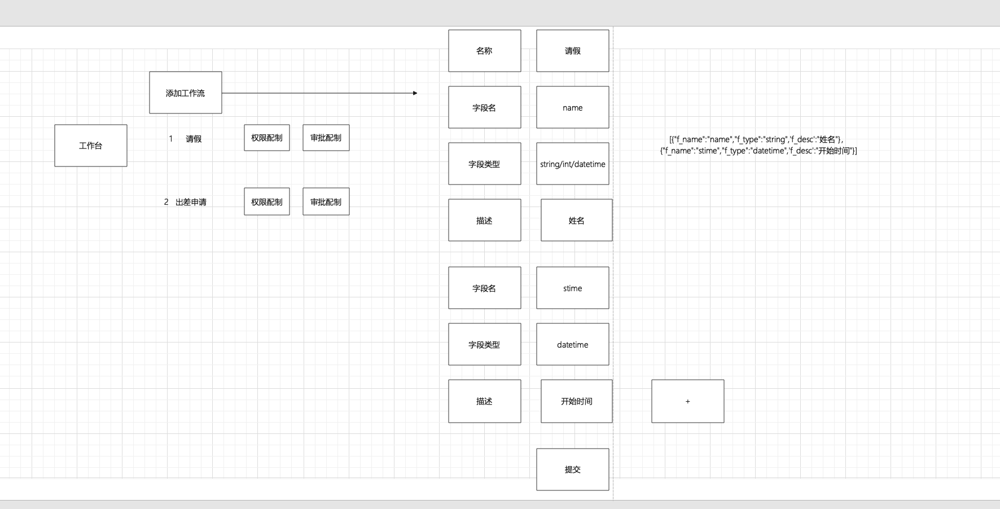
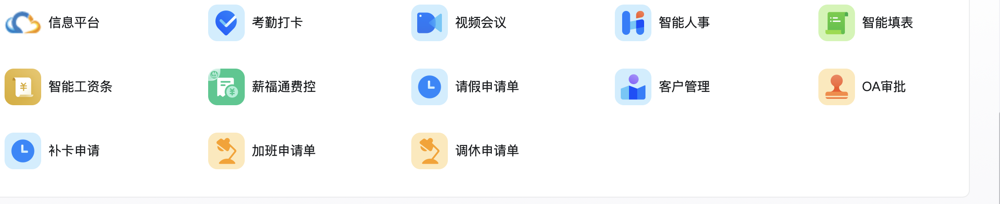
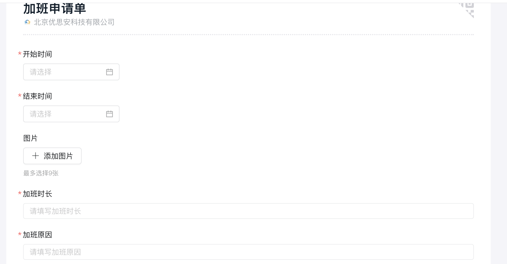
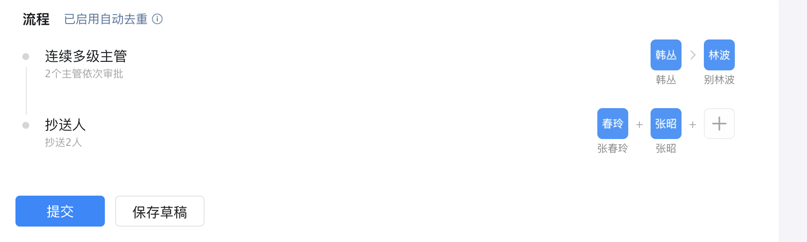

发送邮件功能

1.settings中的配制

~~~
EMAIL_BACKEND = 'django.core.mail.backends.smtp.EmailBackend'
EMAIL_HOST = 'smtp.163.com'
EMAIL_PORT = 25
#发送邮件的邮箱
EMAIL_HOST_USER = '18210208326@163.com'
#在邮箱中设置的客户端授权密码
EMAIL_HOST_PASSWORD = 'JZiJ6JbUgzfgt7s3'
#收件人看到的发件人
EMAIL_FROM = 'A公司<18210208326@163.com>'
~~~

2.发送代码

~~~python
from django.core.mail import send_mail  
from llmpro import settings
def send_email_view(mail):  
    subject = '测试邮件主题'  
    message = '这是测试邮件的内容。'  
    from_email = settings.EMAIL_HOST_USER  # 可以是 settings.py 中的 EMAIL_FROM  
    to_email = [mail]  # 收件人邮箱地址列表  
  
    # 发送邮件  
    send_status = send_mail(subject, message, from_email, to_email, fail_silently=False)  
    print(send_status)
    return send_status
    
class CrmManager(APIView):
    def get(self,request):
        # 按客户分组并计算每个客户的总订单金额  
        # now = datetime.now()
        # pre = now - timedelta(days=9)
        # print(pre)
        # cates = Cates.objects.filter(add_time__lt=now,add_time__gt=pre).values('userid').annotate(total_amount=Sum('numbers')).order_by('total_amount')
        # for i in cates:
        #     print(i)
        send_email_view("763005825@qq.com")
        return Response({"code":200}) 

~~~

~~~python
from langchain_community.llms.tongyi import Tongyi
from langchain.agents import initialize_agent, Tool
from langchain.agents import AgentType
from langchain.chains import LLMChain
from langchain.prompts import PromptTemplate
import json,re

# # 初始化语言模型
llm = Tongyi()

# # 工具函数
def top_users(input: str) -> str:
    # 查询高价值客户
    list1 = [{"id": 3, "name": "王五"}, {"id": 4, "name": "赵六"}]
    return json.dumps(list1)

def active_users(input: str) -> str:
    # 查询近期活跃客户
    return json.dumps([{"id": 3, "name": "王五"}, {"id": 4, "name": "赵六"}])

def send_survey(users: list) -> str:
    # 发送问卷给指定客户
    userlist =json.loads(users)
    for i in userlist:
        print("***")
        print(i['id'])
  
    return "问卷已发送成功"

def collect_responses(input: str) -> str:
    # 收集客户的问卷反馈
    # responses = [{'id': 1, 'name': '张三', 'satisfaction': 4, 'feedback': '服务很好，但价格偏高'}]
    return json.dumps([{'id': 1, 'name': '张三', 'satisfaction': 4, 'feedback': '服务很好，但价格偏高'}])

def analyze_feedback(responses: list) -> str:
    # 使用 RAG 技术分析反馈
    responses_list = json.loads(responses)
   
    feedback_texts = [response["feedback"] for response in responses_list]
    feedback_summary = "\n".join(feedback_texts)
    
    prompt = PromptTemplate(
        input_variables=["feedback_summary"],
        template="请分析以下客户反馈，提取关键信息，包括满意度评分和改进建议:\n{feedback_summary}"
    )
    
    chain = LLMChain(llm=llm, prompt=prompt)
    analysis = chain.run({"feedback_summary": feedback_summary})
    return analysis

# 定义工具
tools = [
    Tool(name="top users", func=top_users, description="查询高价值客户。根据工具的结果返回json"),
    Tool(name="active users", func=active_users, description="查询近期活跃客户"),
    Tool(name="send survey", func=send_survey, description="发送问卷给指定客户"),
    Tool(name="collect responses", func=collect_responses, description="收集客户的问卷反馈"),
    Tool(name="analyze feedback", func=analyze_feedback, description="分析客户反馈")
]

# 初始化代理
agent = initialize_agent(tools, llm, agent=AgentType.ZERO_SHOT_REACT_DESCRIPTION)

# # 查询高价值客户
# res = agent.invoke("查询近期活跃客户")
# print(res)

# # 发送问卷
top_users_data = agent.invoke("查询高价值客户")
print(top_users_data)

# 使用正则表达式匹配JSON对象（这里假设JSON对象之间只有一个逗号分隔，且没有空格）  
json_pattern = r'\{.*?\}'  
matches = re.findall(json_pattern, top_users_data['output'])  
  
# 由于匹配到的JSON对象字符串是独立的，我们需要将它们放入一个数组中（用方括号包围）来形成一个有效的JSON字符串  
# 但在这个例子中，我们直接解析每个JSON对象字符串为Python字典  
customer_list = []  
for match in matches:  
    try:  
        # 解析JSON对象字符串为Python字典  
        customer_dict = json.loads(match)  
        # 将字典添加到列表中  
        customer_list.append(customer_dict)  
    except json.JSONDecodeError:  
        # 如果解析失败，可以打印错误信息或进行其他处理  
        print(f"Failed to decode JSON: {match}")  
  
# 输出结果  
print(customer_list)

# send_survey_result = agent.invoke(f"发送问卷给 {top_users_data}")
# # print(send_survey_result)

# # 收集反馈
# responses = agent.invoke("收集客户的问卷反馈")
# print(responses)

# # 分析反馈
# analysis_result = agent.invoke(f"分析客户反馈 {responses}")
# print(analysis_result)
~~~

### 1.需求分析

管理员-》后台管理系统-》添加工作流-》配制审批权限-》用户权限

权限配制

添加角色、添加用户（选择角色）-》点击权限配制

用户-》展示工作流-》点击我要请假-》产生任务-》任务审批

工作流平台，平台可动态创建工作流。工作流配制权限，用户添加任务，进行任务的审批。

### 项目中的表分析

部门表

<table>
  <tr><td>字段名</td><td>字段类型</td><td>中文名</td><td>描述</td></tr>
  <tr><td>id</td><td>int</td><td>id</td><td>主键自增</td></tr>
  <tr><td>name</td><td>varchar(50)</td><td>部门名</td><td>唯一</td></tr>
</table>

职位表

<table>
  <tr><td>字段名</td><td>字段类型</td><td>中文名</td><td>描述</td></tr>
  <tr><td>id</td><td>int</td><td>id</td><td>主键自增</td></tr>
  <tr><td>name</td><td>varchar(50)</td><td>职位名</td><td>唯一</td></tr>
</table>
角色表

<table>
  <tr><td>字段名</td><td>字段类型</td><td>中文名</td><td>描述</td></tr>
  <tr><td>id</td><td>int</td><td>id</td><td>主键自增</td></tr>
  <tr><td>name</td><td>varchar(50)</td><td>角色名</td><td>唯一</td></tr>
</table>

用户表

<table>
  <tr><td>字段名</td><td>字段类型</td><td>中文名</td><td>描述</td></tr>
  <tr><td>id</td><td>int</td><td>id</td><td>主键自增</td></tr>
  <tr><td>name</td><td>varchar(50)</td><td>部门名</td><td>唯一</td></tr>
  <tr><td>dept_id</td><td>int</td><td>部门id</td><td>外键关联部门</td></tr>
  <tr><td>role_id</td><td>int</td><td>角色id</td><td>外键关联角色表</td></tr>
  <tr><td>position_id</td><td>int</td><td>职位id</td><td>外键关联职位</td></tr>
</table>

工作流表

<table>
  <tr><td>字段名</td><td>字段类型</td><td>中文名</td><td>描述</td></tr>
  <tr><td>id</td><td>int</td><td>id</td><td>主键自增</td></tr>
  <tr><td>name</td><td>varchar(50)</td><td>名称</td><td>唯一</td></tr>
  <tr><td>params</td><td>text</td><td>参数字段</td><td>json序列化存储[{"f_name":"","f_type":"int","f_desc":""},{"f_name":"","f_type":"int","f_desc":""},{"f_name":"","f_type":"int","f_desc":""},{"f_name":"","f_type":"int","f_desc":""}]</td></tr>
  <tr><td>status</td><td>int</td><td>状态</td><td>1可用  2停用</td></tr>
</table>

工作流权限表

<table>
  <tr><td>字段名</td><td>字段类型</td><td>中文名</td><td>描述</td></tr>
  <tr><td>id</td><td>int</td><td>id</td><td>主键自增</td></tr>
  <tr><td>role_id</td><td>int</td><td>角色id</td><td>外键关联角色表</td></tr>
  <tr><td>workflow_id</td><td>int</td><td>工作流id</td><td>外键关联工作流表</td></tr>
</table>

工作流审批节点配制点

<table>
  <tr><td>字段名</td><td>字段类型</td><td>中文名</td><td>描述</td></tr>
  <tr><td>id</td><td>int</td><td>id</td><td>主键自增</td></tr>
  <tr><td>workflow_id</td><td>int</td><td>工作流id</td><td>外键关联工作流表</td></tr>
  <tr><td>role_id</td><td>int</td><td>角色id</td><td>外键关联角色表</td></tr>
  <tr><td>level</td><td>int</td><td>步骤</td><td></td></tr>
</table>

任务表

<table>
  <tr><td>字段名</td><td>字段类型</td><td>中文名</td><td>描述</td></tr>
  <tr><td>id</td><td>int</td><td>id</td><td>主键自增</td></tr>
  <tr><td>name</td><td>varchar(30)</td><td>任务名称</td><td></td></tr>
  <tr><td>params</td><td>text</td><td>参数字段</td><td>json序列化存储</td></tr>
  <tr><td>workflow_id</td><td>int</td><td>工作流id</td><td>外键关联工作流表</td></tr>
  <tr><td>userid</td><td>int</td><td>用户id</td><td>外键关联用户表</td></tr>
  <tr><td>next_audit</td><td>int</td><td>下一操作人id</td><td></td></tr>
  <tr><td>task_status</td><td>int</td><td>任务状态</td><td>1新建 2审批中 3完成</td></tr>
</table>

审批记录表

<table>
  <tr><td>字段名</td><td>字段类型</td><td>中文名</td><td>描述</td></tr>
  <tr><td>id</td><td>int</td><td>id</td><td>主键自增</td></tr>
  <tr><td>task_id</td><td>int</td><td>任务id</td><td>外键关联任务表</td></tr>
  <tr><td>audit_user</td><td>int</td><td>操作人id</td><td></td></tr>
  <tr><td>audit_time</td><td>datetime</td><td>操作时间</td><td></td></tr>
  <tr><td>audit_status</td><td>int</td><td>审核状态</td><td></td></tr>
</table>

### 创建模型类

~~~python
from django.db import models  
  
# 部门模型  
class Department(models.Model):  
    id = models.AutoField(primary_key=True)  # 主键自增，Django默认会为主键字段添加AutoField，所以这一行可以省略  
    name = models.CharField(max_length=50, unique=True)  # 部门名，唯一  
  
    def __str__(self):  
        return self.name  
  
# 职位模型  
class Position(models.Model):  
    id = models.AutoField(primary_key=True)  # 主键自增，可以省略  
    name = models.CharField(max_length=50, unique=True)  # 职位名，唯一  
  
    def __str__(self):  
        return self.name  
  
# 用户模型（注意：通常Django会使用内置的User模型，这里为了匹配您的表结构，我们自定义一个）  
class CustomUser(models.Model):  
    id = models.AutoField(primary_key=True)  # 主键自增，可以省略  
    name = models.CharField(max_length=50, unique=True)  # 注意：这里应该是用户名而不是部门名，为了匹配您的表结构，我们暂时保留  
    dept_id = models.ForeignKey(Department, on_delete=models.CASCADE)  # 部门id，外键关联部门  
    position_id = models.ForeignKey(Position, on_delete=models.CASCADE)  # 职位id，外键关联职位  
  
    def __str__(self):  
        return self.name  
  
# 注意：在实际应用中，建议使用Django的内置User模型，并通过OneToOneField关联自定义信息，而不是完全自定义User模型。  
# 如果您选择使用Django的内置User模型，那么您应该创建一个Profile模型来存储额外的信息，并通过OneToOneField与User模型关联。  
  
# 工作流模型  
class Workflow(models.Model):  
    id = models.AutoField(primary_key=True)  # 主键自增，可以省略  
    name = models.CharField(max_length=50, unique=True)  # 名称，唯一  
    params = models.TextField()  # 参数字段，json序列化存储（注意：Django 3.1及更高版本使用JSONField，否则您可能需要使用TextField并手动处理JSON）  
    status = models.IntegerField(choices=((1, '可用'), (2, '停用')))  # 状态，1可用 2停用  
  
    def __str__(self):  
        return self.name  
  
# 工作流权限模型  
class WorkflowPermission(models.Model):  
    id = models.AutoField(primary_key=True)  # 主键自增，可以省略  
    role_id = models.ForeignKey('Role', on_delete=models.CASCADE)  # 角色id，外键关联角色表（注意：这里假设您有一个Role模型）  
    workflow_id = models.ForeignKey(Workflow, on_delete=models.CASCADE)  # 工作流id，外键关联工作流表  
  
    def __str__(self):  
        return f"{self.role_id.name} - {self.workflow_id.name}"  # 假设Role模型有一个name字段  
  
# 注意：这里缺少Role模型的定义，您需要根据您的需求定义它。  
  
# 工作流审批节点配置模型  
class WorkflowApprovalNode(models.Model):  
    id = models.AutoField(primary_key=True)  # 主键自增，可以省略  
    workflow_id = models.ForeignKey(Workflow, on_delete=models.CASCADE)  # 工作流id，外键关联工作流表  
    role_id = models.ForeignKey('Role', on_delete=models.CASCADE)  # 角色id，外键关联角色表（注意：这里同样假设您有一个Role模型）  
    level = models.IntegerField()  # 步骤  
  
    def __str__(self):  
        return f"{self.workflow_id.name} - Level {self.level}"  # 假设有一个友好的显示格式  
  
# 任务模型  
class Task(models.Model):  
    id = models.AutoField(primary_key=True)  # 主键自增，可以省略  
    name = models.CharField(max_length=30)  # 任务名称  
    params = models.TextField()  # 参数字段，json序列化存储（注意JSONField的使用条件）  
    workflow_id = models.ForeignKey(Workflow, on_delete=models.CASCADE)  # 工作流id，外键关联工作流表  
    userid = models.ForeignKey(CustomUser, on_delete=models.CASCADE)  # 用户id，外键关联用户表（注意：这里使用了自定义的用户模型）  
    next_audit = models.ForeignKey(CustomUser, on_delete=models.SET_NULL, null=True, related_name='next_audit_user')  # 下一操作人id，可以为空  
    task_status = models.IntegerField(choices=((1, '新建'), (2, '审批中'), (3, '完成')))  # 任务状态  
  
    def __str__(self):  
        return self.name  
  
# 审批记录模型  
class AuditRecord(models.Model):  
    id = models.AutoField(primary_key=True)  # 主键自增，可以省略  
    task_id = models.ForeignKey(Task, on_delete=models.CASCADE)  # 任务id，外键关联任务表  
    audit_user = models.ForeignKey(CustomUser, on_delete=models.CASCADE)  # 操作人id  
    audit_time = models.DateTimeField(auto_now_add=True)  # 操作时间，自动添加当前时间  
    audit_status = models.IntegerField()  # 审核状态（这里可能需要定义更多的状态选项）  
  
    def __str__(self):  
        return f"{self.task_id.name} - {self.audit_user.name} - {self.audit_time}"  # 假设有一个友好的显示格式
~~~

### 具体实现

#### 1.添加部门

#### 2.添加职位

#### 3.添加角色

#### 4.添加员工（选择部门、职位、角色）

#### 4.添加工作流

#### 5.给工作流配制角色权限

​         写入工作流程角色表

​         用户登录，登录成功后查询角色id，根据角色id查询工作流配制角色权限表，显示用户工作流列表

#### 6.给工作流配制审批流程

#### 7.用户创建任务

#### 8.任务审批流程

##### 详细步骤

定义审批流程

假设你的审批流程如下：

- 提交请求：用户提交一个审批请求。
- 分配审批者：根据某些规则（如部门、职位等）分配审批者。
- 审批者决策：审批者查看请求并做出决策（批准或拒绝）。
- 更新状态：更新审批请求的状态。

1. 定义审批流程模板
   - 创建一个模板来描述审批流程的各个阶段，包括提交请求、分配审批者、审批者决策和更新状态。
   - 在模板中指定每个阶段需要执行的操作和决策制定的规则。
2. 创建 LangChain Agent
   - 使用 LangChain 提供的工具来创建一个 Agent，该 Agent 将使用你定义的模板来执行审批流程。
   - 配置 Agent 以访问任何必要的外部系统或数据库，以便能够检索审批请求、分配审批者、记录决策和更新状态。
3. 提交审批请求
   - 用户通过某种界面（如 Web 应用程序、API 等）提交审批请求。
   - 该请求被发送到 LangChain Agent 或与之集成的系统。
4. 分配审批者
   - LangChain Agent 根据模板中定义的规则（如部门、职位等）来确定审批者。
   - Agent 可以将审批任务分配给指定的审批者，并通过电子邮件、消息通知或其他方式通知他们。
5. 审批者决策
   - 审批者查看审批请求并做出决策（批准或拒绝）。
   - 他们的决策被发送回 LangChain Agent 或与之集成的系统。
6. 更新状态
   - LangChain Agent 根据审批者的决策来更新审批请求的状态。
   - Agent 可以将状态更新通知给相关的用户或系统。

代码实现

~~~python
from langchain_community.llms.tongyi import Tongyi
from langchain.agents import initialize_agent, Tool
from langchain.agents import AgentType
import json

# # 初始化语言模型
llm = Tongyi()

# # 工具函数
def submit_request(input: str) -> str:
    # 用户提交一个任务，把任务存在任务列表
    task = json.loads(input)
    #读取出任务的信息生成任务写入任务表，返回任务id
    print("用户提交一个任务，把任务存在任务列表")
    return "1001"
    
def assign_approver(input: str) -> str:
    # 分配审批者
    print("分配审批者任务编号为###:::"+input)
    return "user001"
   

def make_decision(input: str) -> str:
    # 审批者决策
    print("获取到订单号"+input+"给审批者发邮件")
    return "1"

def update_status(input: str) -> str:
    # 更新状态
    print("更新工作流的状态为已经完成"+input)
    return "更新成功"

# 定义工具
tools = [
    Tool(name="submit_request", func=submit_request, description="提交请求,返回任务编号"),
    Tool(name="assign_approver", func=assign_approver, description="分配审批者,返回审批者id"),
    Tool(name="make_decision", func=make_decision, description="审批者决策"),
    Tool(name="update_status", func=update_status, description="更新状态")
]

# 初始化代理
agent = initialize_agent(tools, llm, agent=AgentType.ZERO_SHOT_REACT_DESCRIPTION)

# # 查询高价值客户
data = {"id":1001,"title":"张三请假"}
res = agent.invoke("提交请求，请求信息为"+json.dumps(data))
r1 = agent.invoke(res['output']+"分配审批者")
agent.invoke(r1['output']+'审批者决策')
res1 = agent.invoke('任务id为:'+res['output']+",状态为1。更新状态")
~~~

