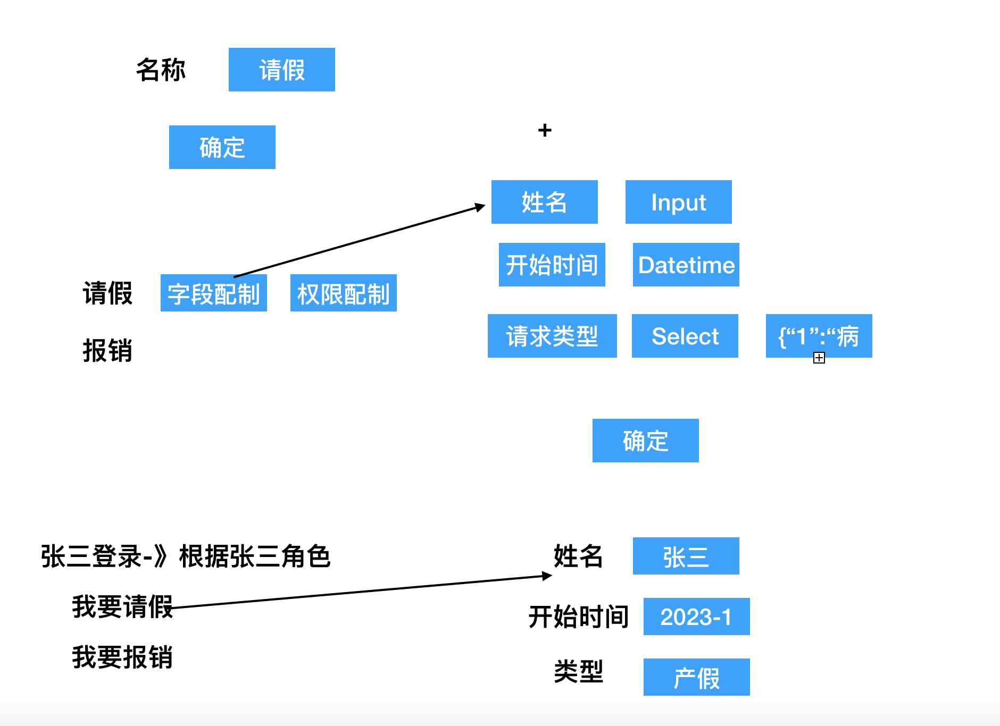

### 1.动态表单

~~~vue
<template>
  

    

    

       <el-input v-model="values[index]" v-if="j['name'] == 'title'"/>
    <el-input v-model="vvalues[index]" v-if="j['name'] == 'value'"/>
    

    
    

    <el-button @click="add">+</el-button>
    <el-button @click="submit">提交</el-button>
  

</template>

~~~

### 2.动态工作流

~~~
OA系统中
我要请假-》姓名，开始时间，结束时间，事由，类型（1.产假 2事假）
财务报销-》姓名，出差地点，天数，费用，发票上传

管理员登录
创建工作流-》名称 字段

~~~

#### 数据库字典

workflow(工作流表)

<table>
  <tr><td>字段名</td><td>类型</td><td>中文名</td><td>描述</td></tr>
  <tr><td>name</td><td>varchar(30)</td><td>名称</td><td>唯一约束</td></tr>
  <tr><td>params</td><td>text</td><td>字段属性</td><td>序列化</td></tr>
  <tr><td>status</td><td>int</td><td>状态</td><td>1启用 2关闭</td></tr>
</table>

work_roles(工作流角色表)

<table>
  <tr><td>字段名</td><td>类型</td><td>中文名</td><td>描述</td></tr>
  <tr><td>workid</td><td>int</td><td>工作流id</td><td></td></tr>
  <tr><td>roles_id</td><td>int</td><td>角色id</td><td></td></tr>
</table>

user_work（用户工作流）

<table>
  <tr><td>字段名</td><td>类型</td><td>中文名</td><td>描述</td></tr>
  <tr><td>userid</td><td>int</td><td>提交人</td><td></td></tr>
  <tr><td>workid</td><td>int</td><td>工作流id</td><td></td></tr>
  <tr><td>title</td><td>varchar(255)</td><td>标题</td><td></td></tr>
  <tr><td>params</td><td>text</td><td>字段属性</td><td>序列化</td></tr>
  <tr><td>status</td><td>int</td><td>状态</td><td>1新建 2审批中 3结束</td></tr>
  <tr><td>nextuserid</td><td>int</td><td>下一审批人</td><td></td></tr>
</table>

代码

~~~vue
<template>
  

<el-tabs v-model="activeName" @tab-click="handleClick">
    <el-tab-pane label="基本信息" name="first">
    <el-input  v-model="form.proname"/>
    <el-input  v-model="form.username"/>
    <el-input  v-model="form.url"/>

    <el-button @click="save">保存</el-button>
    </el-tab-pane>
    <el-tab-pane label="全局参数" name="second">
    

  <el-button @click="add">+</el-button>
  

  

  <el-row>
  <el-col :span="6">

  <el-input v-model="v1[index]" />
  
</el-col>
  <el-col :span="6">

   <el-input v-model="v2[index]" />
  
</el-col>
  <el-col :span="6">

   <el-input v-model="v3[index]" />
  
</el-col>
  <el-col :span="6">

   <el-button @click="del(index)">删除</el-button>
  
</el-col>
</el-row>
  

  

   <el-button @click="submit">提交</el-button>
  

展示信息

{{i.key}} <el-input v-model="valueform[i.key]"></el-input>

{{i.key}} 
<select v-model="valueform[i.key]">
<option v-for="k,v in i.descip" :value="v" :key="k">{{k}}</option>

</select>

<el-button @click='getvalue'>提交</el-button>

  
    </el-tab-pane>
    <el-tab-pane label="头部" name="third">角色管理</el-tab-pane>
   
  </el-tabs>

  
  

</template>

~~~

