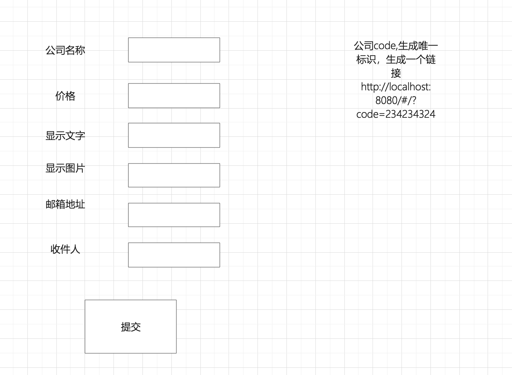

### 1.推广模块

~~~
系统-》三方合作-》在三方平台展示系统Logo->点击进入我们系统首页-》统计每个平台应该支付的金额，echarts展示
角色：推广员
资源列表：添加企业合作
        统计推广平台占比
        
        
1.添加一个角色、添加2个资源
2.添加企业合作页面（企业合作表）
表中的字段 ：公司code码、公司名称、价格（每条/钱）、链接地址、、文字、邮箱地址、收件人，异步发邮件
3.合作公司在自己平台上显示我们公司的logo,点击跳转到我们首页
vue页面
<a :href="i.url">{{i.companyname}</a>

4.在首页mouted中获取code码，向接口发起请求
5.写一个接口，获取code码，向合作记录表添加一条信息 ，合作记录表 id  code  add_time  

6.用echarts饼图显示每个平台的总价格
~~~

~~~
select count(clr.id) as total,company.price,company.name from company_link_record as clr inner join company_link as company on clr.code=company.code  group by company.code;
~~~

