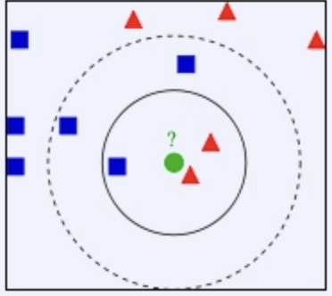
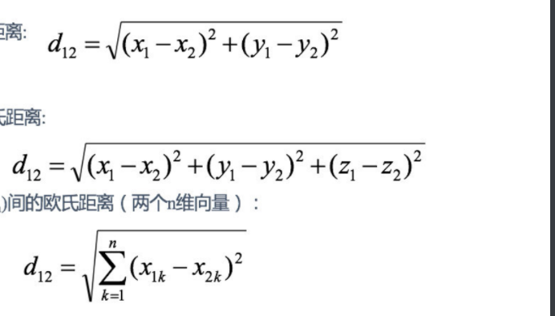
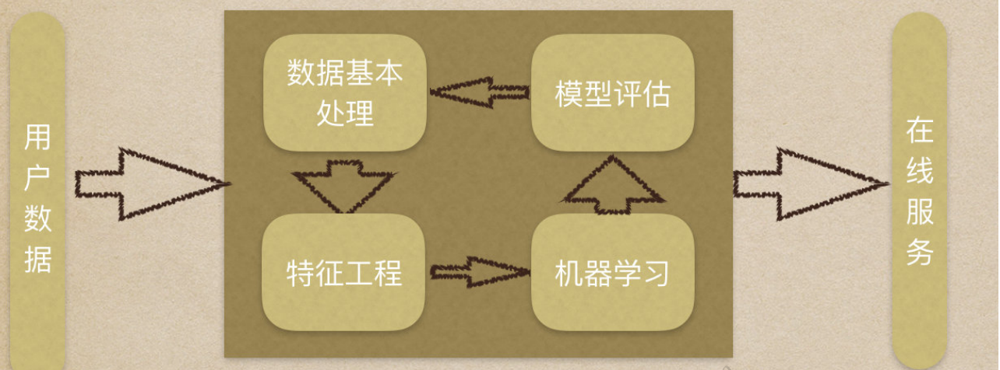

### 1.什么是K近邻算法

如果⼀个样本在特征空间中的**k**个最相似**(**即特征空间中最邻近**)**的样本中的⼤多数属 于某⼀个类别，则该样本也属于这个类别。最早是一种分类算法。

我们常说，[物以类聚，人以群分](https://baike.baidu.com/item/物以类聚，人以群分/7505982?fromModule=lemma_inlink)，判别一个人是一个什么样品质特征的人，常常可以从他/她身边的朋友入手，所谓观其友，而识其人。我们不是要判别图1中那个绿色的圆是属于哪一类数据么，好说，从它的邻居下手。但一次性看多少个邻居呢？[从图](https://baike.baidu.com/item/从图/53665946?fromModule=lemma_inlink)1中，你还能看到：

- 如果K=3，绿色圆点的最近的3个邻居是2个红色小三角形和1个蓝色小正方形，少数从属于多数，基于统计的方法，判定绿色的这个待分类点属于红色的三角形一类。
- 如果K=5，绿色圆点的最近的5个邻居是2个红色三角形和3个蓝色的正方形，还是少数从属于多数，基于统计的方法，判定绿色的这个待分类点属于蓝色的正方形一类。
- 于此我们看到，当无法判定当前待分类点是从属于已知分类中的哪一类时，我们可以依据统计学的理论看它所处的位置特征，衡量它周围邻居的权重，而把它归为(或分配)到权重更大的那一类。这就是K近邻算法的核心思想。

### 2.距离公式

两个样本的距离可以通过公式计算，又叫欧式距离。(二维、三维、N维)

### **3. KNN**算法流程总结 

1）计算已知类别数据集中的点与当前点之间的距离 

2）按距离递增次序排序 

3）选取与当前点距离最⼩的k个点 

4）统计前k个点所在的类别出现的频率 

5）返回前k个点出现频率最⾼的类别作为当前点的预测分类

### 4.**k**近邻算法**api**初步使⽤ 

#### 4.1机器学习的流程

1.获取数据集

2.数据基本处理

3.特征⼯程

4.机器学习

5.模型评估

#### 4.2**Scikit-learn**⼯具介绍

#####   1.安装

~~~
pip3 install scikit-learn==0.19.1
~~~

Scikit-learn中包含

分类、聚类、回归 

特征⼯程 

模型选择、调优 

##### **2 K-**近邻算法**API**

sklearn.neighbors.KNeighborsClassifier(n_neighbors=5) 

参数介绍：

n_neighbors：int,可选（默认= 5），k_neighbors查询默认使⽤的邻居数 

##### 3.案例

实现步骤：

1.获取数据源

2.数据基本处理

3.特征工程（特征工程（Feature Engineering）是将原始数据转化成更好的表达问题本质的特征的过程，使得将这些特征运用到预测模型中能提高对不可见数据的模型预测精度）

4.机器学习

5.模型评估