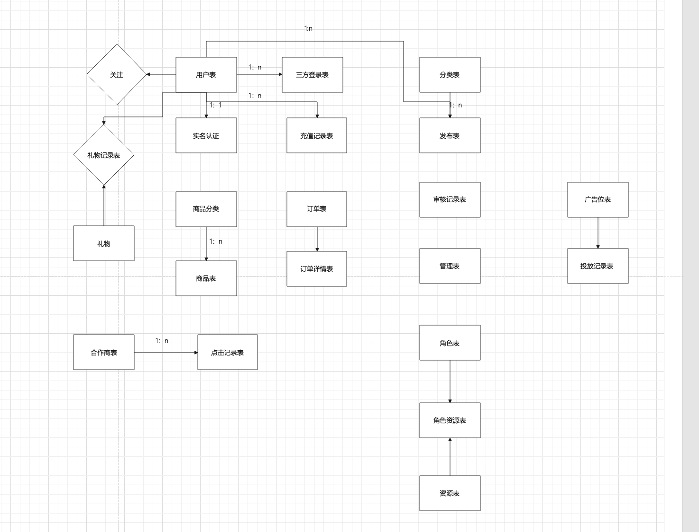
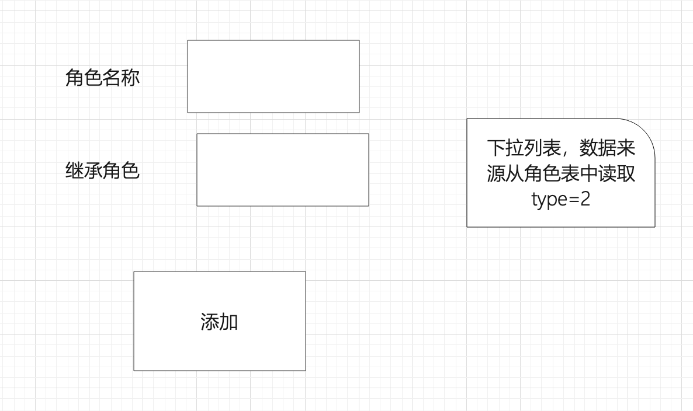
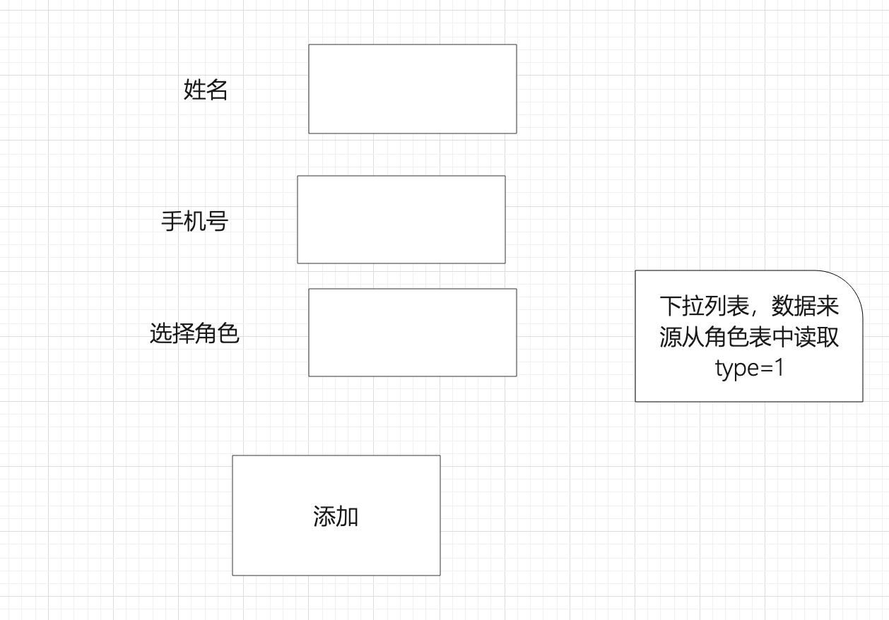
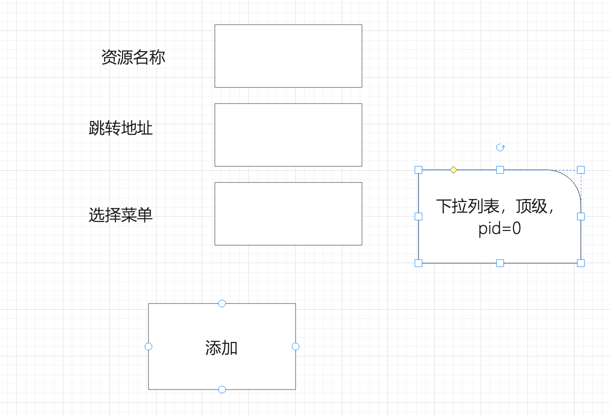
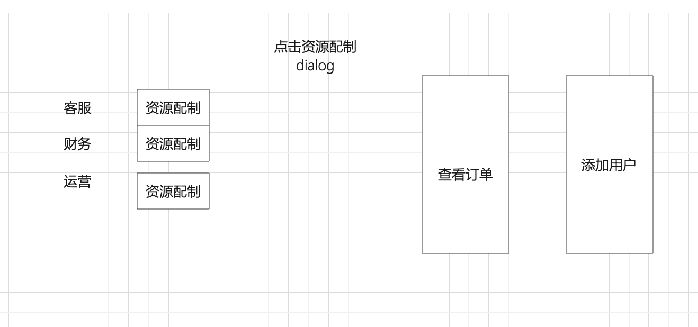
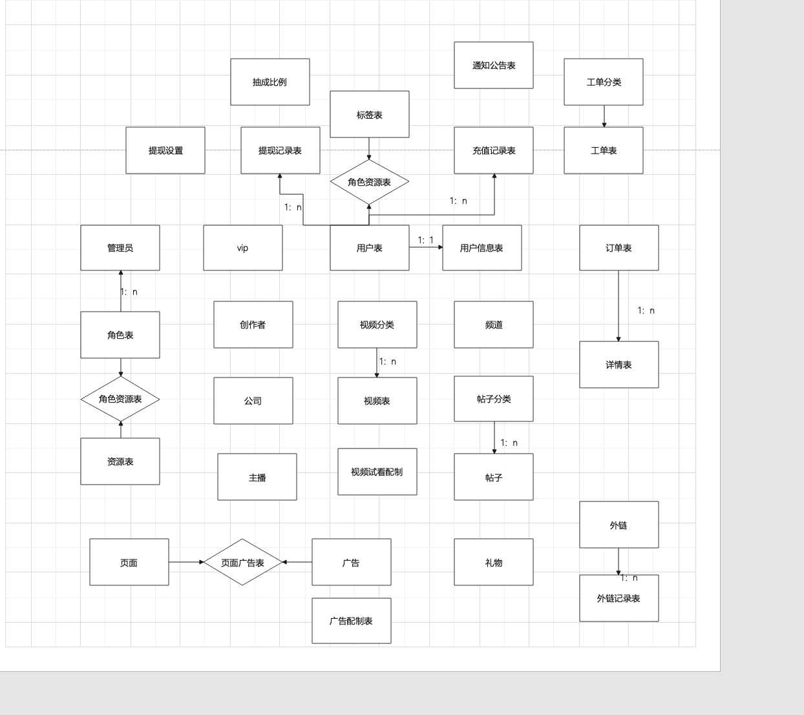

### 1.权限系统

~~~
jwt token
企业级开发中
token
vue页面，登录成功后访问页面-》页面访问接口
张三-》经理
小李-》业务员
http://localhost:8080/#/audit
小李登录系统-》报销-》经理
http://localhost:8080/#/audit

用户管理-》人才hr
订单管理->财务、订单发货
商品管理-》编辑
推广管理-》运营人员

acl->基于用户的权限管理  用户表  资源表  用户资源表

用户表(admin_user)
id  name  password
1   张三
2   小明

资源表（resource）
id  name
1   订单管理
2   用户管理
3   。。。。

用户资源表
userid resid
1       1
1       2
2       3
2       1

rbac->基于用户的权限管理  用户表 角色表 资源表  角色资源表

角色表（roles）
id  name  
1   人力hr
2   财务
3   编辑
4   推广人员

用户表(admin_user)
id  name  password  roleid
1   张三               1
2   小明               4

资源表(resource)
id  name       pid   types   url
1   权限管理      0     1
2   用户管理      1     1     /user
3   角色管理      1     1
4   添加用户接口         2     addmanage    
。。。

角色资源表(role_res)
roleid resid
1       1
1       2
2       3
2       1
~~~

~~~
登录页面
axios.post().then(res=>{
 localStorge.setItem("token",'asdf')
 localStorge.setItem("menulist",JSON.stringfy(res.data.menulist))
})

登录接口中
判断用户名密码，生成 token返回
根据userid获取roleid，根据roleid获取所有的资源列表
页面权限menulist
接口权限interfacelist序列化存入redis

axios.interceptors.request.use()

django
中间件
获取token,解析，判断过期时间，判断是否退出
判断是否在权限列表中，如果存在继续访问，如果不存在返回没有权限

#用户输入url
beforeEach(to,from,next){
	#判断to.path是否在menulist中
	menulist = JSON.parse(localStorge.setItem("menulist"))
}
~~~

~~~
项目介绍及功能模块介绍
ER图
能运行的项目

~~~

### 1.rbac基于角色的权限

~~~
acl

1名老师 张老师   1          管理用户表   角色表     资源表
5名学生    2
小李      3

请假，上课，判分，检查作业

考试，听课，

if  type == 2:
	请假，
	上课，
	判分，
	
else:
   ....

 管理用户表   
 id  name  roleid
  1    张三    2
 
 角色表 
 id   name
 1    老师
 2    学生
 
 
 资源表
 id   name
 1    请假
 2    查看综合积分
 3     考试
 4     导入成绩
 
 
 角色资源表
 roleid  resid
 1        1
 1        4
 2        2
 
 
 
 
~~~

### 2.项目中需要的表

### 开发框架

~~~
业务：vant+django
管理：element ui +django

在管理端创建rbac中的表，用户表、角色表、资源表、角色资源表、互斥表
~~~

~~~
管理员用户表
id  name  mobile   roleid
1   张三             1
2   李四             1
3   小明             4
角色表
id   name         pid   type(1角色 2基本角色，只能被继承)
1    内容审核员
2    营销人员
3    财务
4    客服

资源表
id  name            pid(0代表菜单 )   url
1   用户管理          0
2   普通用户管理      1
3   创作者管理         1
4   机构创建          1
5   内容管理          0
6    长视频           5

角色资源表
roleid  resid
1        2
1        3
2        2
2        6

互斥表
resid  resid1

vip表
id  name   条件
1   金牌    10
2   银牌     5
3   铜牌     1

用户表
id  用户名  头像  vip等级  vipid  

用户信息表
id userid 个性签名  身高 体重  

标签表
id  name

用户标签表
userid  tagid

创建者表
id   money

机构表
 单位名称   创作级别
 
主播表
id  总收益

视频分类表
id  name pid

频道表
id  名称

长视频表
id  发布人id  类型

帖子分类表

帖子表
id    分类id

订单表

订单详情表

充值记录表

提现记录表（充值50+收益50）

抽成比例表
min  max   比例
10   20    0.1
30   50    0.5

提现设置
1  10
2   5

工单分类表

工单表

通知公告表

页面表
 id   name    播放频率
 1    首页       1
 2    短视频页    3
 3    社区帖子    5

广告设置
id  名称   排序  admin_userid
1
2
3
4
5

广告页面表
页面id  广告id
2        1
2        5

       
配制表
1  3分钟
2  2

礼物表

外链表
id  名称  图片  地址  金额
京东   http://localhost:8080/index?code = 001
taobao   http://localhost:8080/index?code =002

外链记录表
id  来源 
1    001
     001
     002
     003
     

~~~

### 创建项目中的表

~~~
from django.db import models
# Create your models here.

class BaseModel(models.Model):
    create_time = models.DateTimeField(auto_now_add=True)
    update_time = models.DateTimeField(auto_now=True)
    is_delete = models.IntegerField(default=0)
    
    class Meta:
          abstract = True
          
          
#角色表
class Roles(BaseModel):
    name = models.CharField(max_length=50,default='',unique=True)
    pid = models.IntegerField(default=0)
    types = models.IntegerField(default=1) #1角色 2被继承的
    class Meta:
        db_table="roles"
#用户表
class AdminUser(BaseModel):
    name = models.CharField(max_length=50,default='')
    mobile = models.CharField(max_length=11)
    roleid = models.ForeignKey(Roles,on_delete=models.CASCADE)
    class Meta:
        db_table="admin_user"
        
#资源表
class Resource(BaseModel):
    name = models.CharField(max_length=50,default='',unique=True)
    pid = models.IntegerField(default=0)
    roles = models.ManyToManyField("roles",related_name='resources')#与类别表进行多对多关联
    class Meta:
        db_table="resources"
          
          
#资源互斥表
class ResMutual(BaseModel):
    resid = models.IntegerField()
    mutualid = models.IntegerField()
    class Meta:
        db_table="res_mutual"
~~~

### 页面

~~~
添加角色
三种类型：普通角色、被继承的角色、可继承别的角色
~~~

### 2.ER图

~~~

~~~

