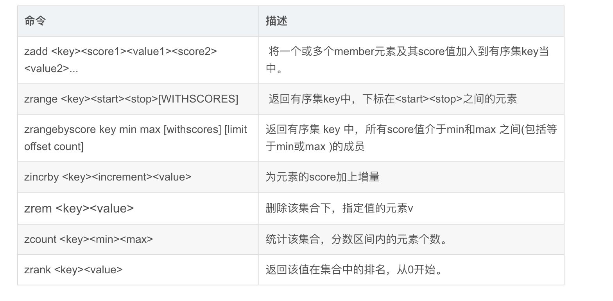
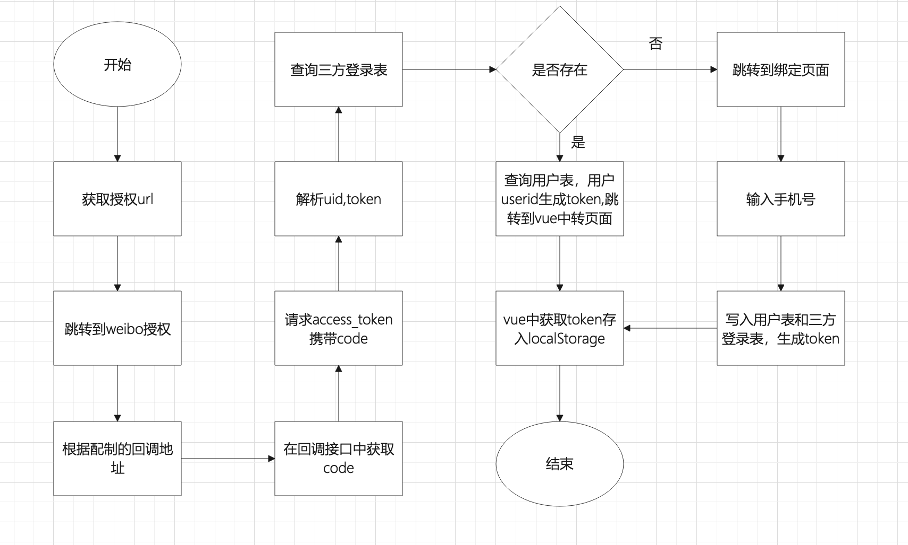
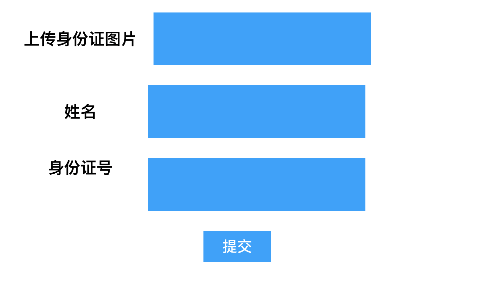

### 1.登录

~~~
用户管理-》添加-》姓名、性别、电话、角色

手机号、验证码-》验证码有效性验证-》去用户表中查询（admin_user）->id、roleid->通过roleid获取此用户对应的资源列表-》localStorage存，token,userid,权限列表
~~~

### 2.位运算优化rabc

~~~
用户表
角色表
资源表
角色资源

位运算
用户表
角色表
id  name  pomition(int类型)
1.   客服   9

资源表
id  name     pid pomition
1   权限管理   0    
2   用户管理   1      1
3   资源管理   1      2
4   角色管理   1      4
5   订单管理   0       
6   添加订单   5      8

十进制
二进制

位|设置权限
对比& 
删除权限^

~~~

### 重构

~~~
1.添加资源接口
  #判断是菜单还是资源
  data = 
  if data['pid']>0:
  		maxres = Resource.objects.order_by("-pomition").limit(1)
  		number = maxres['pomition']*2
      Resource(name=name,pid=pid,pomition=number)
      
      
      
2.角色配制资源
  roleid=1
  reslist=[2,4]
  
  Roles.objects.filter(id=roleid).update({"pomition":0})
  
  
  pmes=0
  for  i in reslist:
      pmes = pmes | i
      
  Roles.objects.filter(id=roleid).update({"pomition":pmes})
  
  
  
 3.获取角色对应的资源
resall = Roles.objects.filter(id=roleid).first()
res = Resource.objects.filter(pid__get=0).all()
list =[]
for i in res:
   if resall & i:
      list.append(i)
    
     
~~~

vant网址

https://vant-contrib.gitee.io/vant/v2/#/zh-CN/submit-bar

#### Vue 2 项目，安装 Vant 2

~~~
cnpm i vant@latest-v2 -S
~~~

### 在main.js中导入

~~~
import Vue from 'vue';
import Vant from 'vant';
import 'vant/lib/index.css';

Vue.use(Vant);
~~~

### jwt

~~~
jwt  json web token
接口安全认证

session认证

client->server发送一个请求，server生成jsession同时生成一个文件，文件放在server,jsessionid返回给client,client存储在cookie，以后每次请求携带cookie，server根据jsession去服务器查询文件，如果存在从文件读取用户信息，如果不存在没登录

auth2.0
client->server发送一个请求，server生成不重复的串token,并且token存储(mysql)，下次访问client携带token串，去数据库中查询，如果存在查询到用户信息，如果不存在没登录

jwt
client->server发送一个请求，server生成token返回client。client存储。下次请求携带token,server解析token对比，如果没被串改也没过期进行下一步操作。

jwt 
头部 ，载和，签名

生成token
base64(头部).base64(载和).hash256(base64(头部).base64(载和),'sdfdsfsd')

解析token
hash256(base64(头部).base64(载和),"asdf") 生成签名

用户退出登录，token被别人拦截，还可以继续操作吗？
不可以。
退出调用退出接口，在接口中获取到token，将token加入延时队列中。中间件中获取到token从队列中查找，如果存在直接返回已经退出没权限操作。celery或aps起一个定时任务，每隔30分钟执行一次。查询队列中前半小时记录删除

队列：先进先出特性
异步、削峰、解偶
string hash  list   set  zset  
zset

 
~~~

### vue 拦截器

~~~js
axios.interceptors.request.use(config => {
        var token = localStorage.getItem("token")
        if (token) {
            config.headers.Authorization = token
        }
        return config;
    })
~~~

中间件

~~~python
from django.utils.deprecation import MiddlewareMixin
from django.http import JsonResponse
import jwt
from videopro import settings

class PomitionMiddeware(MiddlewareMixin):
    def process_request(self,request):
        whitearr = ['/users/login/']
        print(request.path_info)
        if request.path_info not in whitearr:
            token = request.META['HTTP_AUTHORIZATION']
        
    
            try:
                print("###"+token)
                if not token:
                    return JsonResponse({"code":401})
                payload = jwt.decode(token,key=settings.SECRET_KEY,algorithms='HS256')
                print(payload)
            except:
                print("@@@")
                return JsonResponse({"code":402})
~~~

### redis zset

~~~
Redis有序集合zset 与普通集合set非常相似。

Zset是一个没有重复元素的字符串集合。不同之处是有序集合的每个成员都关联了一个评分( score) ,这个评分( score)被用来按照从最低分到最高分的方式排序集合中的成员。集合的成员是唯一的，但是评分可以是重复了。

因为元素是有序的,所以你也可以很快的根据评分( score )或者次序( position )来获取一个范围的元素。

访问有序集合的中间元素也是非常快的,因此你能够使用有序集合作为一个没有重复成员的智能列表。

~~~

底层实现

~~~
SortedSet(zset)是Redis提供的一个非常特别的数据结构，

一方面它等价于Java的数据结构Map<String，Double>，可以给每一个元素value赋予一个权重score，另一方面它又类似于TreeSet，内部的元素会按照权重score进行排序，可以得到每个元素的名次，还可以通过score的范围来获取元素的列表。

zset底层使用了两个数据结构。

(1) hash , hash 的作用就是关联元素value和权重score，保障元素value的唯一性，可以通过元素value找到相应的score值。

(2)跳跃表，跳跃表的目的在于给元素value排序，根据score的范围获取元素列表。

~~~

redis封装

~~~python
import redis
class RedisConn:

    def __init__(self) -> None:
        self.r = redis.Redis()

    #字符串添加
    def str_add(self,key,value,time=0):
        if time == 0:
            self.r.set(key,value)
        else:
            self.r.setex(key,time,value)

    #字符串获取
    def str_get(self,key):
        value = self.r.get(key)
        if value:
            value = value.decode()
        else:
            value = None
        return value

    def str_setnx(self,key,value):
        return self.r.setnx(key,value)

    #删除
    def del_str(self,key):
        return self.r.delete(key)

 
    #hash类型封装
    #添加
    def hash_add(self,key,params,value):
        self.r.hset(key,params,value)
    #获取所有
    def getall_hash(self,key):
        return self.r.hgetall(key)
    #获取单个
    def getone_hash(self,key,params):
        return self.r.hget(key,params)
    #判断Key是否存在
    def findkey_hash(self,key):
        return self.r.exists(key)

    #购物车加减
    def jiajian_hash(self,key,params,count,type):
        #1为加2为减
        if int(type) == 1:
            return self.r.hincrby(key,params,count)
        else:
            #获取数量，如果数量大于1执行，如果小于等于1，提醒不能再减了
            number = self.getone_hash(key,'number')
            if number:
                number = number.decode()
                if int(number)>1:
                    return self.r.hincrby(key,params,-count)
            return False  

    #模糊查询
    def getvalues(self,key):
        list=[]
        values = self.r.keys(key)
        if values:
            for i in values:
                list.append(i.decode())
        return list
    #删除
    def del_hash(self,key,params):
        return self.r.hdel(key,params)

    #list封装 1 2 3 4
    def list_push(self,key,value):
        return self.r.lpush(key,value)

    #list封装
    def list_pop(self,key):
        value = self.r.rpop(key)
        if value:
            value = value.decode()
        return value

    def list_poppush(self,key,newkey):
        if self.r.exists(key):
            return self.r.rpoplpush(key,newkey)
        return None

    def list_getall(self,key):
        return self.r.lrange(key,0,-1)
    
    def list_getbymin(self,key,min,max):
        return self.r.lrange(key,min,max)
    #sorted set 添加
    def sorted_add(self,key,params,score):
        mapping={params:score}
        return self.r.zadd(key,mapping)
    #区间查询
    def sorted_times(self,key,min,max):
        return self.r.zrangebyscore(key,min,max)
    
    def sorted_getall(self,key):
        return self.r.zrange(key,0,-1)
    #删除
    def sorted_del(self,key,params):
        self.r.zrem(key,params)
r = RedisConn()
# import time
# r.sorted_add("orderlist",'1001',int(time.time()))
# r.sorted_add("orderlist",'1002',int(time.time()))

# list = r.sorted_times("orderlist",0,int(time.time()))
# print(list)
# r.sorted_del("orderlist",'1001')
# list1 = r.sorted_times("orderlist",0,int(time.time()))
# print(list1)

# r.list_push("idlist",'http://1.jpg')
# r.list_push("idlist",'http://2.jpg')
# r.list_push("idlist",'http://3.jpg')
# print(r.list_pop('idlist'))
# userid=1
# goods=3
# key = "col"+str(userid)+'pro'+str(goods)
# r.hash_add(key,'id',goods)
# r.hash_add(key,'name','商品'+str(goods))

# findkey = "col"+str(userid)+"*"
# gidlist = r.getvalues(findkey)
# reslist=[]
# for i in gidlist:
#     goods = r.getall_hash(i)
#     dict={}
#     for k,v in goods.items():
#         kk = k.decode()
#         vv = v.decode()
#         dict[kk]= vv
#     reslist.append(dict)
# print(reslist)

退出后还能访问吗？
1.点击退出时调用退出接口，在接口中将token和当前时间加入到zset中  key:exittokenlist
2.在中间件中判断，如果没过期。判断是否在zset中
list = zset_getall('exittokenlist',0,-1)
for i in list:
    if i.decode()  == token:
       return JsonResponse({"code":401,'mes':'已经退出不能操作'})
      
3.写一个定时任务，celery每半小时执行一次删除操作
list = zset_byscore("exittokenlist",0,int(time.time())-1800)
for i in list:
  zset_delete("exittokenlist",i.decode())

~~~

### 三方登录

~~~
weibo
qq
weixin

表设计
用户表
三方登录表

~~~

工厂模式

~~~
工厂模式提供了一种将对象的实例化过程封装在工厂类中的方式。通过使用工厂模式，可以将对象的创建与使用代码分离，提供一种统一的接口来创建不同类型的对象。

在工厂模式中，我们在创建对象时不会对客户端暴露创建逻辑，并且是通过使用一个共同的接口来指向新创建的对象。

意图：定义一个创建对象的接口，让其子类自己决定实例化哪一个工厂类，工厂模式使其创建过程延迟到子类进行。

主要解决：主要解决接口选择的问题。

何时使用：我们明确地计划不同条件下创建不同实例时。

如何解决：让其子类实现工厂接口，返回的也是一个抽象的产品。

它的优点：
松耦合，对象的创建独立于类的实现
客户端无需了解创建对象的类，只需知道需要传递的接口，方法和参数就能够创建所需要的对象
很容易扩展工厂添加其他类型对象的创建，而使用者只需要改变参数就可以了

def getwburl:
def weibocall:

def getwxurl:
def weixincallback:

class Sflogin():
    @abstractmethod
    def geturl():
      pass
     @abstractmethod
     def callback():
      pass
      
      
      
      
      class Weixin(Sflogin):
      		def geturl():
      		
      		def callback():
      		
      		
      class DingDing(Sflogin):
      		def geturl():
      		
      		def callback():
      		
      		
      class Factory():
         def create_factory(classname):
             return eveal(classname)()
              
           
factory = Factory()
fac = factory.create_factory('Weixin')
fac.geturl()

~~~

python实现工厂模式

~~~
from abc import ABCMeta, abstractmethod

"""
ABCMeta是python的一个元类，用于在Python程序中创建抽象基类，抽象基类中声明的抽象方法，使用abstractmethod装饰器装饰。
"""
class SfLogin(metaclass=ABCMeta):

    @abstractmethod
    def geturl(self):
        pass
    @abstractmethod
    def callback(self):
        pass

class Weibo(SfLogin):
    def geturl(self):
        client_id = "3674019597"
        uri="http://127.0.0.1:8000/user/weiboCallback/"
        url="https://api.weibo.com/oauth2/authorize?client_id=%s&response_type=code&redirect_uri=%s"%(client_id,uri)
        return url
    
    def callback(self):
        pass

class QQ(SfLogin):
    def geturl(self):
        pass
    
    def callback(self):
        pass

class Sffactory:
    def make_factory(self, name):
        # eval（类名）返回的是一个class类型的对象
        return eval(name)()

factory = Sffactory()

~~~

### 实名认证

~~~
登录成功后-》
头像  名称
可用余额 100
充值
提现
实名认证
~~~

~~~
调用百度文字识别
个人:2qps
企业：10qps

set
setex
setnx
区别
incr
应用场景，能做什么，常用方法和区别
~~~

