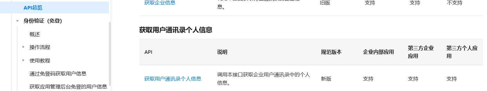

1.获取钉钉登录接口

```python
class DingTalkLogin(APIView):
    def get(self, request):
        from urllib.parse import quote
        params = [
            f"redirect_uri={quote('http://127.0.0.1:8000/user/dingtalkCallback/')}",
            "response_type=code",
            "client_id=dingqxjco4n5jjtt7ctj",
            "scope=openid",
            "prompt=consent"
        ]
        url = "https://login.dingtalk.com/oauth2/auth?" + ("&".join(params))
        return Response({"url": url})

```

# 2.调用钉钉接口并登录

# 3.登录成功回调处理

```python
class DingTalkCallback(APIView):
    def get(self, request):
        authCode = request.query_params.get('code')

        # 根据authCode获取用户accessToken
        data = {
            "clientId": "dingqxjco4n5jjtt7ctj",
            "clientSecret": "cQJnGlcoMmz6Nnv-r0aFEpQAHqiwVK0t4yf1J_9Do8jQP1AV81iVT2M3GXHWLy53",
            "code": authCode,
            "grantType": "authorization_code"
        }
        resp = requests.post('https://api.dingtalk.com/v1.0/oauth2/userAccessToken', json=data).json()
        accessToken = resp.get('accessToken')

        # 根据accessToken获取用户信息
        headers = {"x-acs-dingtalk-access-token": accessToken}
        resp = requests.get('https://api.dingtalk.com/v1.0/contact/users/me', headers=headers).json()
        name = resp.get('nick')
        uid = resp.get('openId')
        phone = resp.get('mobile')

        # 登录，写入三方登录表和用户表
        sfl = Sflogin.objects.filter(uid=uid, types=1).first()
        if not sfl:
            # 写入用户表
            # 手机号用户存在直接绑定,不存在注册新用户
            user = Susers.objects.filter(phone=phone).first()
            if not user:
                userinfo = {
                    "name": name,
                    "phone": phone,
                    "password": phone,
                    "username": phone
                }
                us = SfUserSerializer(data=userinfo)
                if us.is_valid():
                    user = us.save()
                else:
                    return Response({"code": 10001, "msg": tostr(us.errors)})
            # 写入三方登录表
            sfinfo = {
                "types": 1,
                "token": accessToken,
                "uid": uid,
                "userid": user.id
            }
            sfs = SfLoginSerializer(data=sfinfo)
            if sfs.is_valid():
                sfs.save()
            else:
                return Response({"code": 10001, "msg": tostr(sfs.errors)})
        else:
            user = sfl.userid
            sfl.token = accessToken
            sfl.save()

        # 生成jwt token并返回前端
        payload = {"userid": user.id, "username": user.username, "exp": int(time.time()) + 60 * 60 * 2}
        token = myjwt.jwt_encode(payload)
        payload["exp"] = int(time.time() + 60 * 60 * 24 * 2)
        refreshToken = myjwt.jwt_encode(payload)
        query = [f"userid={payload['userid']}", f"username={payload['username']}", f"token={token}",
                 f"refreshToken={refreshToken}"]
        return HttpResponseRedirect(f'http://localhost:8080/#/login?{"&".join(query)}')
```

三方登录的流程

~~~
客户端向服务端发起一个请求-》携带用户名、密码-》查询数据库，如果存在用jwt生成token返回-》vue把token存入LocalStorage中-》以后每次请求携带token,vue拦截器interceptors.request处理统一在头部加上token->服务端自宝义中间件，继承middwareMinxin重写process_request方法。1.获取token 2解析 判断是否被篡改是否过期是否退出是否有权限操作。-》验证通过通过路由找到views处理


点击钉钉图标-》跳转到钉钉授权页面-》点击同意-》根据钉钉配制的回调地址进行回调-》在回调接口中获取code->根据code向发送授权接口requests.post请求，获取token->用token去查询用户接口，获取到手机号和uid->根据uid查询三方登录表，如果存在，通过三方登录表查询用户表，如果用户存在-》获取到用户信息生成jwt token返回
~~~

表设计

~~~
用户表
id  mobile  
1    234253465

三方登录表
id  userid  uid    token  style(方式)
1     1      1001   234saf      dd
1     1      23434   as2342     weibo
1     1      aasfsd   tadfsd      wx

~~~


# 创建钉钉应用

 [开发流程概述 - 钉钉开放平台 (dingtalk.com)](https://open.dingtalk.com/document/orgapp/overview-of-development-process)


1.创建或加入团队，进入团队开发者后台

2.获取开发者权限（创建者拥有所有权限）


3.创建应用


4.设置回调接口（地址）

进入应用-》安全设置-》重定向URL


4.获取client id和client secret并替换


5.启用应用通讯录权限


6.登录

~~~
cid dingiovq0d3pjsfj8222
appid 10ab4cdc-b040-4f88-bd5e-b62925c19950

gFVW1sn3Os1w4McptVJ0B1QxSFArEUAx58GiiVAU-wCQhXIll03pzAiM6Ept_24Q
~~~


登录钉钉应用并授权


获取登录token


获取用户个人信息

